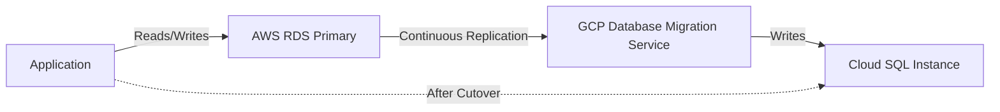
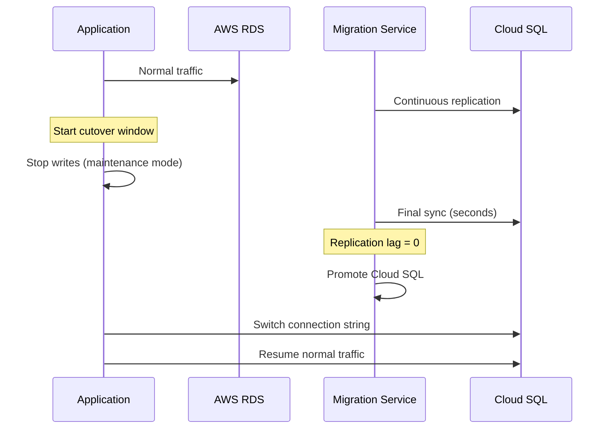

# How to Plan a Zero-Downtime Migration from AWS RDS to Cloud SQL

Author: [nawazdhandala](https://www.github.com/nawazdhandala)

Tags: GCP, Cloud SQL, AWS RDS, Database Migration, Zero Downtime

Description: Step-by-step guide to planning and executing a zero-downtime database migration from AWS RDS to Google Cloud SQL using continuous replication and cutover strategies.

---

Migrating a production database from AWS RDS to Google Cloud SQL without downtime is one of the more nerve-wracking tasks you will face as a cloud engineer. The stakes are high - any gap in availability means lost transactions, angry users, and potentially corrupted data. But with the right approach, you can pull it off cleanly.

I have done this migration for PostgreSQL and MySQL workloads, and the key is continuous replication. You set up a pipeline that keeps both databases in sync, validate everything, and then cut over in seconds rather than hours.

## Prerequisites

Before you start, make sure you have these pieces in place:

- A Cloud SQL instance provisioned in GCP with the same engine version as your RDS instance (or a compatible newer version)
- Network connectivity between AWS and GCP (Cloud VPN or Interconnect)
- Google Cloud Database Migration Service (DMS) enabled in your project
- Sufficient storage and compute allocated on the Cloud SQL side

The network piece is critical. Your AWS RDS instance needs to be reachable from GCP, either through a VPN tunnel or via public IP with proper security group rules.

## Architecture Overview

Here is how the zero-downtime migration works at a high level:



The idea is simple: DMS reads the binary log (MySQL) or WAL (PostgreSQL) from your RDS instance and applies changes to Cloud SQL in near-real-time. Your application keeps talking to RDS until you are ready to switch.

## Step 1: Prepare Your RDS Instance

First, make sure your RDS instance is configured for logical replication. For MySQL, you need binlog enabled in ROW format. For PostgreSQL, you need logical replication enabled.

This shows how to check and enable the required settings for MySQL on RDS:

```bash
# Check current binlog settings on your RDS instance
# Connect to your RDS MySQL instance and verify
mysql -h your-rds-endpoint.amazonaws.com -u admin -p -e "
  SHOW VARIABLES LIKE 'log_bin';
  SHOW VARIABLES LIKE 'binlog_format';
  SHOW VARIABLES LIKE 'binlog_row_image';
"

# If binlog_format is not ROW, update the RDS parameter group
aws rds modify-db-parameter-group \
    --db-parameter-group-name your-param-group \
    --parameters "ParameterName=binlog_format,ParameterValue=ROW,ApplyMethod=pending-reboot"
```

For PostgreSQL, update the RDS parameter group:

```bash
# Enable logical replication for PostgreSQL RDS
# This requires a reboot of the RDS instance
aws rds modify-db-parameter-group \
    --db-parameter-group-name your-pg-param-group \
    --parameters "ParameterName=rds.logical_replication,ParameterValue=1,ApplyMethod=pending-reboot"

# Reboot the instance to apply changes
aws rds reboot-db-instance --db-instance-identifier your-rds-instance
```

Note that the reboot is required, but it is a brief operation - typically under a minute for most RDS instances.

## Step 2: Set Up Cloud SQL

Create your destination Cloud SQL instance with the right specs. Match or exceed the compute and storage of your RDS instance.

```bash
# Create a Cloud SQL instance for PostgreSQL
# Match the version and spec to your RDS source
gcloud sql instances create my-cloud-sql \
    --database-version=POSTGRES_15 \
    --tier=db-custom-4-16384 \
    --region=us-central1 \
    --storage-size=100GB \
    --storage-type=SSD \
    --availability-type=REGIONAL \
    --backup-start-time=04:00

# Create the target database
gcloud sql databases create myapp_production \
    --instance=my-cloud-sql
```

## Step 3: Configure Database Migration Service

DMS is the glue that makes this work. Create a connection profile for both the source and destination.

```bash
# Create a connection profile for the source (AWS RDS)
gcloud database-migration connection-profiles create source-rds \
    --region=us-central1 \
    --display-name="AWS RDS Source" \
    --provider=RDS \
    --host=your-rds-endpoint.amazonaws.com \
    --port=5432 \
    --username=migration_user \
    --password=your-password

# Create a connection profile for the destination (Cloud SQL)
gcloud database-migration connection-profiles create dest-cloudsql \
    --region=us-central1 \
    --display-name="Cloud SQL Destination" \
    --provider=CLOUDSQL \
    --cloudsql-instance=my-cloud-sql
```

Now create the migration job:

```bash
# Create a continuous migration job
# This will handle initial data load and ongoing replication
gcloud database-migration migration-jobs create rds-to-cloudsql \
    --region=us-central1 \
    --display-name="RDS to Cloud SQL Migration" \
    --source=source-rds \
    --destination=dest-cloudsql \
    --type=CONTINUOUS
```

## Step 4: Run the Initial Data Load

Start the migration job. DMS will first do a full dump of your RDS database, then switch to continuous replication.

```bash
# Start the migration job
gcloud database-migration migration-jobs start rds-to-cloudsql \
    --region=us-central1

# Check the status of the migration
gcloud database-migration migration-jobs describe rds-to-cloudsql \
    --region=us-central1 \
    --format="table(name,state,phase,error)"
```

The initial load time depends on your database size. For a 100GB database, expect anywhere from 30 minutes to a few hours. During this time, your application continues to work normally against RDS.

## Step 5: Monitor Replication Lag

Once the initial load completes, DMS switches to continuous replication mode. Monitor the replication lag to make sure it stays close to zero.

```bash
# Monitor replication lag in seconds
# Run this periodically to confirm the replica is caught up
gcloud database-migration migration-jobs describe rds-to-cloudsql \
    --region=us-central1 \
    --format="value(state,phase)"
```

You want to see the lag consistently under 1 second before you attempt cutover. If it is spiking, investigate whether your Cloud SQL instance has enough resources or if there are particularly heavy write patterns on the source.

## Step 6: Validate Data Integrity

Before cutting over, validate that the data in Cloud SQL matches what is in RDS. You can do this with row counts and checksums on critical tables.

```bash
# Compare row counts between source and destination
# Run these queries against both databases and compare
psql -h your-rds-endpoint.amazonaws.com -U admin -d myapp_production -c "
  SELECT 'users' as tbl, count(*) FROM users
  UNION ALL
  SELECT 'orders' as tbl, count(*) FROM orders
  UNION ALL
  SELECT 'transactions' as tbl, count(*) FROM transactions;
"

# Run the same against Cloud SQL
gcloud sql connect my-cloud-sql --user=postgres --database=myapp_production << 'EOF'
  SELECT 'users' as tbl, count(*) FROM users
  UNION ALL
  SELECT 'orders' as tbl, count(*) FROM orders
  UNION ALL
  SELECT 'transactions' as tbl, count(*) FROM transactions;
EOF
```

## Step 7: The Cutover

This is the moment of truth. The cutover process looks like this:



In practice, the cutover steps are:

1. Put your application in maintenance mode (stop writes, or queue them)
2. Wait for replication lag to hit zero
3. Promote the Cloud SQL instance using DMS
4. Update your application connection strings to point to Cloud SQL
5. Take the application out of maintenance mode

The actual downtime window is typically 30-60 seconds if you have your connection string changes automated through environment variables or a configuration service.

```bash
# Promote the Cloud SQL instance (finalize the migration)
gcloud database-migration migration-jobs promote rds-to-cloudsql \
    --region=us-central1
```

## Step 8: Post-Migration Verification

After cutover, monitor your application closely for the first few hours:

- Check query performance in Cloud SQL using the Query Insights dashboard
- Monitor error rates in your application logs
- Verify that all application features that interact with the database work correctly
- Keep the RDS instance running for at least 48 hours as a rollback option

## Rollback Plan

Always have a rollback plan. If something goes wrong after cutover, you need a way to switch back to RDS. The simplest approach is to keep the RDS instance running and have a reverse replication path ready. You can set up a Cloud SQL read replica that streams changes to an external destination, but honestly, the simpler approach is to keep the RDS instance in read-only mode for a few days and be prepared to switch the connection string back if needed.

Zero-downtime database migration is achievable with careful planning. The tools are there - DMS handles the heavy lifting of continuous replication. Your job is to plan the cutover choreography and test it in a staging environment before doing it in production.
