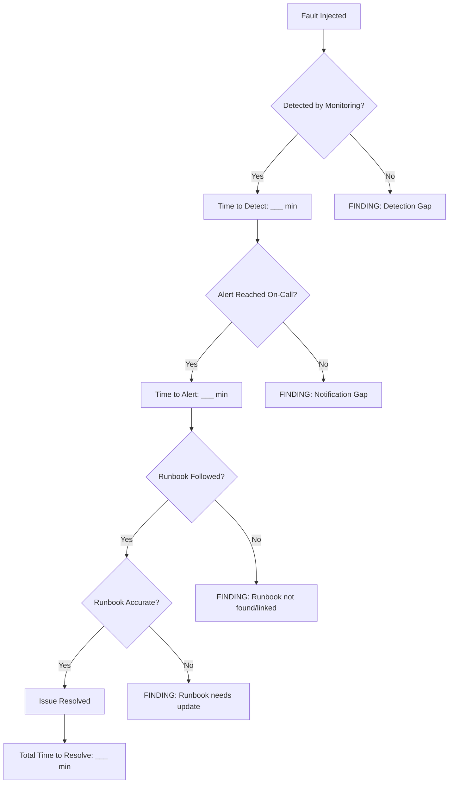

# How to Plan and Execute Game Day Exercises for GCP Infrastructure Resilience

Author: [nawazdhandala](https://www.github.com/nawazdhandala)

Tags: GCP, Game Day, Chaos Engineering, Resilience, SRE, Disaster Recovery

Description: A practical guide to planning and executing game day exercises on Google Cloud Platform to test infrastructure resilience and improve incident response.

---

You can have the best monitoring, the most detailed runbooks, and a well-practiced on-call rotation, but you will not know if any of it actually works until something breaks. Game days are controlled exercises where you deliberately break things in your infrastructure to test your resilience. They expose gaps in monitoring, reveal flaws in your runbooks, and give your team practice handling real incidents.

Running game days on GCP requires some planning. You need to pick the right scenarios, set up safety boundaries, coordinate with stakeholders, and capture the lessons learned. This post walks through the entire process.

## What Is a Game Day

A game day is a planned event where you inject faults into your production or staging environment and observe how your systems and teams respond. It is different from chaos engineering in that it is typically a scheduled, coordinated event rather than continuous automated experimentation. Think of it as a fire drill for your infrastructure.

The goals of a game day are to verify that your monitoring detects failures correctly, test that your alerting reaches the right people, validate that your runbooks lead to resolution, identify single points of failure, and build confidence in your incident response process.

## Planning Phase

### Choose Your Scenarios

Start by listing the failure modes that worry you most. Common scenarios for GCP infrastructure include:

- A Compute Engine instance becomes unreachable
- A Cloud SQL database failover
- A regional outage (simulated by taking down resources in one region)
- A Pub/Sub consumer falling behind
- Network partition between services
- A Cloud Run service hitting its max concurrency limit
- DNS resolution failures
- An expired or misconfigured SSL certificate

Prioritize scenarios based on likelihood and impact. For your first game day, pick two or three scenarios that are realistic and testable.

### Define Success Criteria

For each scenario, define what "success" looks like. For example:

```
Scenario: Cloud SQL primary instance becomes unavailable
Success criteria:
- Monitoring detects the outage within 2 minutes
- On-call receives alert within 3 minutes
- Automatic failover to replica completes within 5 minutes
- Application reconnects automatically within 1 minute after failover
- No data loss
- Total user-facing impact under 10 minutes
```

### Set Safety Boundaries

Game days should test resilience, not cause actual outages. Define boundaries before you start:

- Run on staging first, production only after staging succeeds
- Have a rollback plan for every scenario
- Define a "stop" signal that halts the exercise immediately
- Set a time window (for example, Tuesday 10 AM to 2 PM) and communicate it
- Have the team member who injected the fault ready to reverse it instantly

### Prepare Your Observation Tools

Set up everything you need to observe the exercise in advance:

```bash
# Create a temporary monitoring dashboard for the game day
gcloud monitoring dashboards create --config-from-file=game-day-dashboard.json

# Make sure Cloud Logging is capturing all relevant logs
gcloud logging sinks list --project=my-project

# Verify alerting policies are active
gcloud alpha monitoring policies list \
  --project=my-project \
  --format="table(displayName, enabled)"
```

## Execution Phase

### Scenario 1: Compute Engine Instance Failure

Simulate an instance failure by stopping an instance in a managed instance group:

```bash
# List instances in the group to pick a target
gcloud compute instance-groups managed list-instances web-servers \
  --zone=us-central1-a \
  --project=my-project

# Stop an instance to simulate failure
gcloud compute instances stop web-server-abc123 \
  --zone=us-central1-a \
  --project=my-project

# Monitor the response:
# 1. Does the health check detect the failure?
# 2. Does the managed instance group recreate the instance?
# 3. Does the load balancer route traffic away from the failed instance?
# 4. Does monitoring alert fire?
```

Record timestamps for everything:

```
10:00:00 - Instance stopped
10:00:45 - Health check marks instance unhealthy
10:01:15 - Load balancer removes instance from pool
10:01:30 - Alert fires in Cloud Monitoring
10:02:00 - New instance created by MIG
10:03:30 - New instance passes health check
10:03:45 - Load balancer adds new instance
```

### Scenario 2: Cloud SQL Failover

Test your database failover by triggering a manual failover:

```bash
# Trigger a manual failover of the Cloud SQL instance
gcloud sql instances failover my-database-instance \
  --project=my-project

# Watch the application logs during failover
gcloud logging read 'resource.type="cloud_run_revision" AND severity>=WARNING' \
  --project=my-project \
  --freshness=5m \
  --format="table(timestamp, severity, textPayload)"
```

Things to observe during a database failover:
- How long is the database unavailable?
- Does the application handle the connection reset gracefully?
- Are there any failed transactions that need retry?
- Does the application reconnect automatically?

### Scenario 3: Region Failure Simulation

To simulate a regional failure, redirect traffic away from one region and observe:

```bash
# Update the load balancer to remove one region's backend
gcloud compute backend-services remove-backend my-backend-service \
  --instance-group=web-servers-us-east1 \
  --instance-group-zone=us-east1-b \
  --global \
  --project=my-project

# Monitor: Does traffic shift to the other region?
# Monitor: Is there any user-visible impact during the shift?
```

## Observation and Documentation

During the game day, designate one person as the scribe. They record everything that happens with timestamps. Use a shared document or a dedicated Slack channel.

Here is a template for recording observations:



## Post-Game Day Review

After the exercise, hold a retrospective within 48 hours while the details are fresh. Cover these questions:

1. What worked well? What did our systems handle automatically?
2. What surprised us? What did we not expect?
3. Where did we have gaps in monitoring or alerting?
4. Were the runbooks accurate and helpful?
5. How did the team perform under simulated pressure?
6. What action items come out of this?

Document everything and create tickets for the action items. Typical outcomes include updating runbooks, adding missing alerts, improving health check configurations, fixing retry logic in applications, and adding redundancy where single points of failure were found.

## Game Day Frequency

Start with quarterly game days. As your team gets more comfortable, increase the frequency. Mature SRE teams run game days monthly or even run continuous chaos experiments. The key is consistency - game days only build resilience if you actually do them regularly and follow up on the findings.

## Summary

Game days are one of the most effective ways to improve your infrastructure resilience and your team's incident response capabilities. On GCP, you have all the tools you need to inject faults safely - managed instance groups for instance failure, Cloud SQL failover for database resilience, and load balancer configuration for regional failure simulation. Plan carefully, set safety boundaries, observe closely, and most importantly, follow up on what you learn. The point is not to prove that your infrastructure is resilient - it is to find the places where it is not, and fix them before a real incident does it for you.
