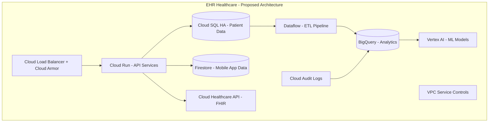

# How to Prepare for Case Study Questions in the Google Cloud Professional Cloud Architect Exam

Author: [nawazdhandala](https://www.github.com/nawazdhandala)

Tags: GCP, Certification, Cloud Architect, Exam Preparation, Google Cloud

Description: Practical strategies and tips for preparing for the case study questions in the Google Cloud Professional Cloud Architect certification exam.

---

The case study questions in the Google Cloud Professional Cloud Architect exam are what separate candidates who memorize services from those who can actually design solutions. These questions present a fictional company scenario and ask you to make architectural decisions based on their specific requirements, constraints, and business goals.

Having gone through the exam and helped others prepare, I want to share what actually works when studying for these case studies. No shortcuts - just practical strategies that build real understanding.

## How Case Studies Work in the Exam

The exam includes several case studies (Google publishes sample ones on their website). During the exam, you can review the full case study text while answering questions about it. Each case study includes:

- Company overview and background
- Current technical environment
- Business requirements
- Technical requirements

You might get 5 to 10 questions per case study, and each question asks you to choose the best solution for a specific aspect of their architecture. The tricky part is that multiple answers might be technically correct, but only one aligns with both the technical and business requirements stated in the case study.

## The Published Case Studies

Google publishes sample case studies on their certification page. As of now, the main ones are:

- **EHR Healthcare** - a healthcare company migrating to GCP with HIPAA compliance requirements
- **Helicopter Racing League** - a media company with real-time streaming and global content delivery needs
- **Mountkirk Games** - a game company building a backend platform that needs to scale globally
- **TerramEarth** - an IoT company with heavy data ingestion from connected vehicles

Read each of these thoroughly. Even if the actual exam uses different scenarios, these published case studies represent the types of problems you will encounter.

## Strategy 1: Extract the Decision Drivers

When you read a case study, do not just absorb the information passively. Actively extract the key decision drivers. I use a simple framework to organize my notes.

For each case study, identify:

**Business Drivers** - These determine the overall direction. If the case study says "minimize operational overhead," that pushes you toward managed services. If it says "reduce costs," that points toward committed use discounts and right-sizing.

**Technical Constraints** - These eliminate options. If the case study requires HIPAA compliance, certain services and configurations are mandatory. If it requires specific latency requirements, that affects region selection and architecture.

**Existing Infrastructure** - This tells you what migration path makes sense. A company running on-premises VMware workloads has different migration options than one running containers.

**Growth Plans** - This affects scalability decisions. A company expecting 10x growth needs different architecture than one with steady-state workloads.

Here is an example of how I break down a case study.

```
Case Study: EHR Healthcare

Business Drivers:
- HIPAA compliance is mandatory
- Must reduce operational overhead
- Need to support mobile and web applications
- Want to use AI/ML for patient data analysis

Technical Constraints:
- Data must be encrypted at rest and in transit
- Need audit logging for all data access
- Must support HL7/FHIR standards
- Require high availability (99.99%)

Existing Infrastructure:
- On-premises data centers
- MySQL and PostgreSQL databases
- Custom Java applications

Growth Plans:
- Expanding to new regions
- Adding new healthcare providers as customers
- Increasing data analysis capabilities
```

## Strategy 2: Map Requirements to GCP Services

For each requirement you identify, map it to the GCP services that address it. This is where your knowledge of GCP services becomes critical.

Here is a mapping exercise for common case study requirements:

| Requirement | GCP Service Options |
|---|---|
| HIPAA compliance | Cloud Healthcare API, BAA-covered services, VPC Service Controls |
| Minimize operational overhead | Cloud Run, GKE Autopilot, Cloud SQL, managed services |
| Global low latency | Cloud CDN, Cloud Armor, multi-region deployments |
| Real-time data processing | Dataflow, Pub/Sub, BigQuery streaming |
| IoT data ingestion | IoT Core, Pub/Sub, Dataflow |
| Machine learning | Vertex AI, BigQuery ML, AutoML |
| Disaster recovery | Multi-region, cross-region replication, Cloud SQL HA |
| Cost optimization | Committed use discounts, preemptible VMs, autoscaling |

## Strategy 3: Practice the Elimination Method

Exam questions typically have four answer choices. In case study questions, your job is not to find the perfect answer but to eliminate the wrong ones. Here is my systematic approach:

1. **Eliminate answers that violate stated requirements.** If the case study says "minimize operational overhead" and an answer suggests managing your own Kubernetes cluster (instead of GKE Autopilot), that is likely wrong.

2. **Eliminate answers that ignore business context.** If the company is a startup concerned about costs and an answer suggests a multi-region Cloud Spanner deployment, that is probably overkill.

3. **Eliminate answers that use the wrong service for the job.** If the question is about real-time event processing and an answer suggests Cloud Storage with batch processing, that does not fit.

4. **Between remaining answers, choose the one that best fits ALL requirements.** Sometimes two answers are technically valid, but one addresses more of the stated requirements.

## Strategy 4: Understand Service Trade-offs

Case study questions often test whether you understand the trade-offs between similar services. Here are the comparisons you need to know cold:

**Cloud SQL vs Cloud Spanner vs Bigtable vs Firestore**
- Cloud SQL: traditional relational, vertical scaling, good for moderate workloads
- Cloud Spanner: relational with horizontal scaling, globally consistent, expensive
- Bigtable: wide-column NoSQL, high throughput, no SQL support
- Firestore: document database, real-time sync, good for mobile backends

**GKE Standard vs GKE Autopilot vs Cloud Run vs App Engine**
- GKE Standard: full control, manage node pools, good for complex workloads
- GKE Autopilot: managed nodes, per-pod billing, less operational overhead
- Cloud Run: fully managed containers, scale to zero, good for HTTP workloads
- App Engine: fully managed platform, limited runtime options, simplest to operate

**Dataflow vs Dataproc vs BigQuery**
- Dataflow: managed Apache Beam, streaming and batch, auto-scaling
- Dataproc: managed Spark/Hadoop, good for existing Spark workloads
- BigQuery: serverless analytics, SQL-based, not for real-time processing

## Strategy 5: Time-Box Your Case Study Review

During the actual exam, you will be tempted to re-read the case study for every question. This burns through your time. Instead:

- Spend 5 minutes reading the case study thoroughly the first time
- Take mental notes of the key decision drivers
- For each question, quickly scan the relevant section of the case study
- Do not spend more than 2 minutes per question

## Strategy 6: Practice with Real Scenarios

The best preparation is designing real architectures. Take each published case study and actually draw out the architecture you would build. Use diagrams and explain your reasoning for each choice.



For each service in your diagram, be ready to explain:
- Why you chose it over alternatives
- How it meets the stated requirements
- What trade-offs you are making

## Common Mistakes to Avoid

- Do not over-engineer. The exam rewards solutions that are simple and fit the requirements.
- Do not ignore the business requirements. A technically perfect solution that ignores the budget constraint is wrong.
- Do not assume every problem needs Kubernetes. Sometimes Cloud Run or App Engine is the right answer.
- Do not forget about networking. Many case studies require hybrid connectivity, VPN, or Interconnect.
- Do not confuse managed services. Know exactly what each managed service does and does not do.

## Wrapping Up

Preparing for the case study questions in the Professional Cloud Architect exam requires a different kind of studying than memorizing service features. You need to practice mapping business requirements to technical solutions, understanding trade-offs between services, and making architectural decisions under constraints. Read the published case studies, practice breaking them down, and design solutions for each one. That hands-on thinking is what will get you through the exam.
