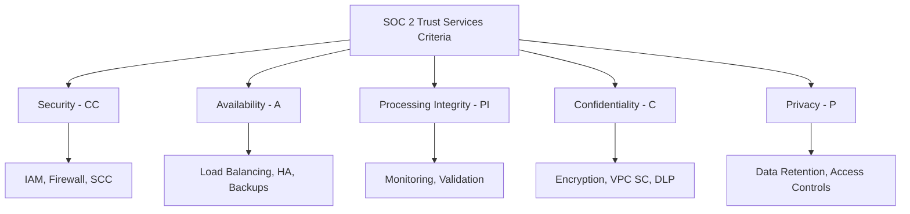

# How to Prepare for SOC 2 Type II Audit with Google Cloud Infrastructure

Author: [nawazdhandala](https://www.github.com/nawazdhandala)

Tags: GCP, SOC 2, Compliance, Audit, Cloud Security, Trust Services Criteria

Description: A practical guide to preparing for a SOC 2 Type II audit when your infrastructure runs on Google Cloud, including evidence collection, control implementation, and continuous monitoring.

---

SOC 2 Type II audits evaluate whether your organization's controls are not just designed properly (that is Type I) but are operating effectively over a period of time, typically 6 to 12 months. When your infrastructure runs on Google Cloud, you need to demonstrate that both your cloud configuration and your operational processes meet the Trust Services Criteria (TSC) for security, availability, processing integrity, confidentiality, and privacy.

This guide covers practical preparation for a SOC 2 Type II audit on Google Cloud, focusing on the controls auditors look for and how to generate evidence that demonstrates compliance.

## Understanding the Shared Responsibility

Google Cloud has its own SOC 2 report that covers the infrastructure layer. Your audit builds on top of that - your auditor will review Google's SOC 2 report as a complementary user entity control (CUEC) and then focus on what you have built on top.

Your responsibility includes:
- Identity and access management configuration
- Network security and segmentation
- Encryption configuration
- Logging and monitoring
- Change management processes
- Incident response procedures
- Availability and disaster recovery

## Trust Services Criteria Mapping

Here is how the five TSC categories map to Google Cloud controls.



## Security Controls (CC Series)

### CC6.1 - Logical Access Controls

Demonstrate that access is granted based on need and follows the principle of least privilege.

```bash
# Evidence: Export IAM policies for all projects
for project in $(gcloud projects list --format='value(projectId)'); do
  gcloud projects get-iam-policy $project --format=json > "evidence/iam-policy-${project}.json"
done

# Evidence: Show that custom roles are used instead of primitive roles
gcloud iam roles list --project=my-project --format="table(name, title, description)"

# Evidence: List service accounts and their key status
gcloud iam service-accounts list --project=my-project --format="table(email, disabled)"

# Check for service account keys (should be minimal)
for sa in $(gcloud iam service-accounts list --project=my-project --format='value(email)'); do
  echo "Keys for ${sa}:"
  gcloud iam service-accounts keys list --iam-account=$sa --format="table(keyId, validAfterTime, keyType)"
done
```

### CC6.2 - Authentication Mechanisms

Show that strong authentication is required for all access.

```bash
# Evidence: Verify MFA enforcement
# Check Google Workspace Admin Console for 2-Step Verification enforcement
# Export the policy documentation

# Evidence: Show workforce identity federation configuration
gcloud iam workforce-pools list --location=global --organization=123456789 --format=json > evidence/workforce-pools.json

# Evidence: Show session duration controls
gcloud iam workforce-pools describe my-workforce-pool \
  --location=global \
  --format="yaml(sessionDuration)" > evidence/session-controls.yaml
```

### CC6.3 - Authorization and Changes

Track all changes to access and infrastructure.

```bash
# Evidence: Export organization policies
gcloud resource-manager org-policies list --organization=123456789 --format=json > evidence/org-policies.json

# Evidence: Show IAM change audit logs for the review period
gcloud logging read 'protoPayload.methodName="SetIamPolicy"' \
  --organization=123456789 \
  --freshness=180d \
  --format=json > evidence/iam-changes.json
```

## CC7 - System Operations and Monitoring

### CC7.1 - Infrastructure Monitoring

Demonstrate continuous monitoring of your environment.

```bash
# Evidence: List all monitoring alert policies
gcloud monitoring policies list --project=my-project --format=json > evidence/alert-policies.json

# Evidence: Show uptime check configurations
gcloud monitoring uptime list-configs --project=my-project --format=json > evidence/uptime-checks.json

# Evidence: Show Security Command Center is active
gcloud scc settings describe --organization=123456789 --format=json > evidence/scc-settings.json
```

### CC7.2 - Incident Detection and Response

Show that you detect and respond to security events.

```bash
# Evidence: List SCC notification configurations
gcloud scc notifications list --organization=123456789 --format=json > evidence/scc-notifications.json

# Evidence: Show recent SCC findings and their resolution
gcloud scc findings list 123456789 \
  --source=- \
  --filter='state="ACTIVE" OR state="INACTIVE"' \
  --format=json \
  --limit=100 > evidence/scc-findings.json
```

## Availability Controls (A Series)

### A1.1 - Capacity and Availability

Demonstrate that your systems are designed for availability.

```bash
# Evidence: Show regional/zonal distribution
gcloud compute instances list --format="table(name, zone, status, machineType)" > evidence/instance-distribution.txt

# Evidence: Show load balancer configuration
gcloud compute forwarding-rules list --format=json > evidence/load-balancers.json

# Evidence: Show auto-scaling configuration
gcloud compute instance-groups managed list --format=json > evidence/autoscaling.json

# Evidence: Show backup configurations
gcloud sql instances list --format="table(name, backupConfiguration.enabled, backupConfiguration.startTime)" > evidence/sql-backups.txt
```

### A1.2 - Recovery and Business Continuity

```bash
# Evidence: Show disaster recovery configuration
gcloud sql instances describe my-database \
  --format="yaml(failoverReplica, replicaConfiguration)" > evidence/dr-config.yaml

# Evidence: Show Cloud Storage versioning and lifecycle
gcloud storage buckets describe gs://my-critical-bucket \
  --format="yaml(versioning, lifecycle)" > evidence/storage-lifecycle.yaml
```

## Confidentiality Controls (C Series)

### C1.1 - Data Classification and Encryption

```bash
# Evidence: Show CMEK configuration
gcloud kms keys list --keyring=my-keyring --location=us-central1 --format=json > evidence/kms-keys.json

# Evidence: Show encryption status of storage
gcloud storage buckets list --format="table(name, defaultKmsKeyName)" > evidence/bucket-encryption.txt

# Evidence: Show VPC Service Controls
gcloud access-context-manager perimeters list --policy=POLICY_ID --format=json > evidence/vpc-service-controls.json
```

## Automating Evidence Collection

Instead of manually collecting evidence before the audit, automate it. Here is a script that generates a comprehensive evidence package.

```python
# SOC 2 evidence collection automation script
import subprocess
import json
import os
from datetime import datetime

# Evidence output directory
EVIDENCE_DIR = f"soc2-evidence-{datetime.now().strftime('%Y-%m-%d')}"
os.makedirs(EVIDENCE_DIR, exist_ok=True)

def run_gcloud(command, output_file):
    """Run a gcloud command and save output to a file."""
    try:
        result = subprocess.run(
            command.split(),
            capture_output=True,
            text=True,
            timeout=120
        )
        filepath = os.path.join(EVIDENCE_DIR, output_file)
        with open(filepath, 'w') as f:
            f.write(result.stdout)
        print(f"Collected: {output_file}")
    except Exception as e:
        print(f"Error collecting {output_file}: {e}")

# Collect evidence for each control area
evidence_commands = {
    # Access Controls
    "iam-policies.json": "gcloud projects get-iam-policy my-project --format=json",
    "service-accounts.json": "gcloud iam service-accounts list --project=my-project --format=json",
    "org-policies.json": "gcloud resource-manager org-policies list --organization=123456789 --format=json",

    # Network Security
    "firewall-rules.json": "gcloud compute firewall-rules list --project=my-project --format=json",
    "vpc-networks.json": "gcloud compute networks list --project=my-project --format=json",

    # Encryption
    "kms-keys.json": "gcloud kms keys list --keyring=my-keyring --location=us-central1 --format=json",

    # Monitoring
    "alert-policies.json": "gcloud monitoring policies list --project=my-project --format=json",
    "uptime-checks.json": "gcloud monitoring uptime list-configs --project=my-project --format=json",
    "log-sinks.json": "gcloud logging sinks list --project=my-project --format=json",

    # Availability
    "instances.json": "gcloud compute instances list --project=my-project --format=json",
    "sql-instances.json": "gcloud sql instances list --format=json",

    # Change Management
    "deployments.json": "gcloud deploy releases list --delivery-pipeline=my-pipeline --region=us-central1 --format=json",
}

for output_file, command in evidence_commands.items():
    run_gcloud(command, output_file)

print(f"\nEvidence package collected in: {EVIDENCE_DIR}")
```

## Continuous Compliance Monitoring

SOC 2 Type II is about demonstrating controls over time, not just at a point in time. Set up continuous monitoring so you know immediately when a control drifts.

```bash
# Create alert for IAM policy changes
gcloud logging metrics create iam-policy-changes \
  --description="Tracks IAM policy modifications" \
  --log-filter='protoPayload.methodName="SetIamPolicy"' \
  --project=my-project

# Create alert for firewall rule changes
gcloud logging metrics create firewall-changes \
  --description="Tracks firewall rule modifications" \
  --log-filter='resource.type="gce_firewall_rule" AND (protoPayload.methodName="v1.compute.firewalls.insert" OR protoPayload.methodName="v1.compute.firewalls.update" OR protoPayload.methodName="v1.compute.firewalls.delete")' \
  --project=my-project

# Create alert for encryption key changes
gcloud logging metrics create kms-key-changes \
  --description="Tracks KMS key modifications" \
  --log-filter='resource.type="cloudkms_cryptokey" AND protoPayload.methodName=("DestroyCryptoKeyVersion" OR "DisableCryptoKeyVersion")' \
  --project=my-project
```

## Tips for a Smooth Audit

After going through several SOC 2 audits with Google Cloud infrastructure, here is what makes the biggest difference:

1. **Start evidence collection early** - do not wait until the auditor asks. Automate collection from day one of the audit period.

2. **Document exceptions** - if a control fails temporarily, document the exception, the root cause, and the remediation. Auditors expect some issues; they care about how you handle them.

3. **Map controls to Google Cloud services** - create a clear control matrix that shows exactly which Google Cloud feature implements each SOC 2 requirement.

4. **Use Infrastructure as Code** - Terraform or Deployment Manager configurations are excellent evidence for change management controls.

5. **Maintain a change log** - Git history of your IaC repositories serves as change management evidence.

6. **Keep Google's SOC 2 report handy** - your auditor will need it to understand the shared responsibility boundary.

7. **Set up a dedicated evidence repository** - store all evidence in a version-controlled repository with access logging.

SOC 2 Type II on Google Cloud is manageable when you build compliance into your infrastructure from the start rather than bolting it on before the audit. Automate evidence collection, monitor controls continuously, and maintain clear documentation of your security architecture. The audit becomes a review of evidence that already exists rather than a scramble to prove compliance.
