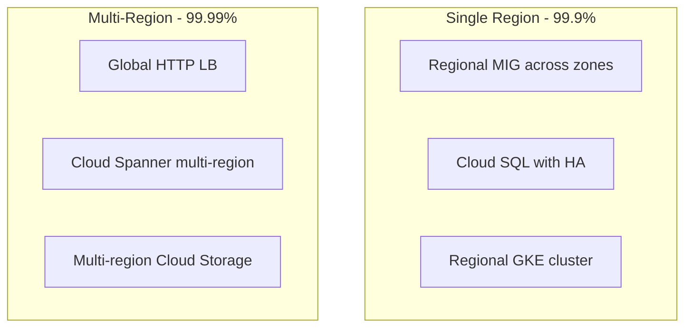

# How to Prepare for the Google Cloud Professional Cloud Architect Exam Architecture Design Topics

Author: [nawazdhandala](https://www.github.com/nawazdhandala)

Tags: GCP, Certification, Professional Cloud Architect, Architecture Design, Study Guide, Google Cloud

Description: Study guide for architecture design topics on the Google Cloud Professional Cloud Architect exam covering solution design, migration planning, and reliability patterns.

---

The Google Cloud Professional Cloud Architect (PCA) exam is a significant step up from the Associate Cloud Engineer. While the ACE tests whether you can use GCP services, the PCA tests whether you can design complete solutions that meet business and technical requirements. The architecture design domain is the largest portion of the exam, and it requires you to think at a systems level.

I spent about three months preparing for this exam after passing the ACE. The architecture design questions were the most challenging because they do not have obvious right answers - you need to weigh trade-offs and pick the best option for the scenario. Here is what to study.

## Exam Structure

The PCA exam covers these domains:

1. Designing and planning a cloud solution architecture (approximately 24%)
2. Managing and provisioning solution infrastructure (15%)
3. Designing for security and compliance (18%)
4. Analyzing and optimizing technical and business processes (18%)
5. Managing implementation (11%)
6. Ensuring solution and operations reliability (14%)

The exam includes case studies. You will be given a fictional company with specific requirements, and multiple questions will reference that case study. Practice reading case studies quickly and identifying the key constraints.

## Design Principles to Know

### High Availability

Know how to design for different availability targets:

- **99.9% (three nines)**: Single region, multiple zones. This handles individual zone failures.
- **99.99% (four nines)**: Multi-region with active-active or active-passive failover.
- **99.999% (five nines)**: Cloud Spanner-level availability with automatic replication and failover.

For each level, understand the GCP services that support it:



### Scalability Patterns

Understand horizontal vs. vertical scaling and when each applies:

- **Horizontal**: Add more instances (Compute Engine MIG, GKE pods, Cloud Run instances). Works for stateless workloads.
- **Vertical**: Use bigger machines. Works when you cannot distribute the workload (single-threaded applications, some databases).

Know the auto-scaling options for each compute service:
- Compute Engine: Managed Instance Groups with autoscaling policies
- GKE: Horizontal Pod Autoscaler, Vertical Pod Autoscaler, Cluster Autoscaler
- Cloud Run: Automatic scaling based on request concurrency
- App Engine: Automatic scaling based on request rate

### Loose Coupling

The exam heavily favors loosely coupled architectures. Know these patterns:

- **Pub/Sub for async communication**: Services publish events instead of calling each other directly.
- **Cloud Tasks for deferred processing**: Reliable task execution with retry logic.
- **API Gateway for service abstraction**: Clients interact with an API layer, not individual services.

## Migration Strategies

Migration questions are guaranteed on the exam. Know the six strategies:

1. **Rehost (Lift and Shift)**: Move VMs to Compute Engine as-is. Use Migrate to Virtual Machines.
2. **Replatform**: Minor modifications, like moving from self-managed MySQL to Cloud SQL.
3. **Refactor**: Redesign the application for cloud-native services (containers, serverless).
4. **Repurchase**: Replace with a SaaS solution.
5. **Retire**: Decommission applications that are no longer needed.
6. **Retain**: Keep on-premises for now (regulatory, technical, or cost reasons).

### Migration Planning

For each migration scenario, consider:

- **Data transfer**: How much data needs to move? For small amounts, use gsutil or the Storage Transfer Service. For petabytes, use Transfer Appliance (physical device shipped to Google).
- **Network connectivity**: Do you need Cloud VPN, Interconnect, or can you transfer over the internet?
- **Downtime tolerance**: Can you do a big-bang cutover, or do you need a phased migration with both systems running in parallel?
- **Dependencies**: Map application dependencies to determine the migration order.

```bash
# Example: Migrating data from on-premises to Cloud Storage
# For moderate data volumes, use the gsutil parallel upload
gsutil -m cp -r /path/to/local/data gs://migration-bucket/

# For cross-cloud transfers, use Storage Transfer Service
gcloud transfer jobs create \
  --source-agent-pool=my-pool \
  --destination=gs://migration-bucket/ \
  --source-directory=/path/to/data
```

## Database Design

Know which database to recommend for different scenarios:

| Requirement | Service |
|-------------|---------|
| Relational, single region, managed | Cloud SQL |
| Relational, global, horizontally scalable | Cloud Spanner |
| Document/NoSQL for web/mobile apps | Cloud Firestore |
| Wide-column, high-throughput analytics/IoT | Cloud Bigtable |
| Data warehousing and analytics | BigQuery |
| In-memory caching | Memorystore (Redis/Memcached) |

Common exam scenarios:

- "Global e-commerce platform needing strong consistency" - Cloud Spanner
- "IoT platform ingesting millions of time-series data points per second" - Cloud Bigtable
- "Data analytics team needs to query petabytes of historical data" - BigQuery
- "Mobile app with offline sync" - Cloud Firestore

## Compute Platform Selection

The exam tests whether you can select the right compute platform:

**Compute Engine**: Full control over the VM, legacy applications, applications that need specific OS configurations or GPU access.

**GKE**: Containerized applications, microservices architectures, teams with Kubernetes expertise, workloads that need fine-grained resource control.

**Cloud Run**: Stateless containers that respond to HTTP requests, event-driven workloads, teams that want managed infrastructure without Kubernetes complexity.

**App Engine**: Web applications and APIs, teams that want the simplest deployment model, applications with standard runtime requirements.

**Cloud Functions**: Event-driven functions, lightweight processing (file uploads, database changes), glue code between services.

## Networking Architecture

### Hybrid Connectivity

The exam loves hybrid connectivity scenarios. Know the decision tree:

- Need encryption over public internet with moderate bandwidth? - Cloud VPN (HA VPN for production)
- Need high bandwidth and low latency without using public internet? - Dedicated Interconnect
- Cannot reach a Dedicated Interconnect location? - Partner Interconnect
- Need to connect multiple branch offices? - SD-WAN partners with Cloud Interconnect

### Network Security

- **Cloud Armor**: DDoS protection and WAF for HTTP(S) load balancers
- **Cloud NAT**: Outbound internet access for VMs without external IPs
- **VPC Service Controls**: Prevent data exfiltration from GCP services
- **Private Google Access**: Allow VMs without external IPs to reach Google APIs

## Case Study Practice

The exam includes detailed case studies. Here is how to approach them:

1. **Read the business requirements first**: These tell you what success looks like (cost reduction, faster time to market, global expansion).
2. **Read the technical requirements**: These constrain your solution (specific SLAs, compliance requirements, existing technology stack).
3. **Identify the key constraints**: Budget, timeline, team skills, regulatory requirements.
4. **Eliminate obviously wrong answers**: Usually one or two options are clearly incorrect.
5. **Choose the option that best fits ALL requirements**: The correct answer usually satisfies both business and technical needs.

Practice case study example:

"MountKirk Games is building a new multiplayer game. Requirements: global player base, sub-100ms latency, millions of concurrent users, player state needs real-time sync."

Key decisions:
- **Compute**: GKE with regional clusters or Cloud Run for game lobby services
- **Database**: Cloud Spanner for player data (global, consistent), Memorystore for real-time game state
- **Networking**: Global HTTP(S) Load Balancer with Cloud CDN for static assets
- **Scaling**: GKE Horizontal Pod Autoscaler for game servers, Cloud Spanner scales automatically

## Architecture Review Checklist

When evaluating any architecture design question, run through this checklist:

1. Does it meet the availability requirements?
2. Can it scale to handle peak load?
3. Is the data protected (backups, replication, encryption)?
4. Does it follow the principle of least privilege for access?
5. Is cost optimized for the expected workload?
6. Can it handle component failures gracefully?
7. Is it operationally manageable (monitoring, logging, alerting)?
8. Does it comply with relevant regulations?

## Study Resources

- **Google's official case studies**: The exam uses updated versions of these. Read MountKirk Games, Dress4Win, and TerramEarth.
- **Architecture Center**: Google's architecture documentation covers design patterns with reference architectures.
- **Practice exam**: Take the official practice exam to calibrate your readiness.
- **Build real solutions**: Set up a multi-tier application with a load balancer, application layer, and database. Practice designing for failure.

## Wrapping Up

The PCA exam tests your ability to design complete cloud solutions, not just use individual services. Focus on understanding the trade-offs between different architectural choices, know when to use which database and compute platform, practice reading case studies and identifying key requirements, and always think about reliability, scalability, security, and cost together. The architecture design questions reward practical experience, so build real systems on GCP and practice making design decisions under constraints.
