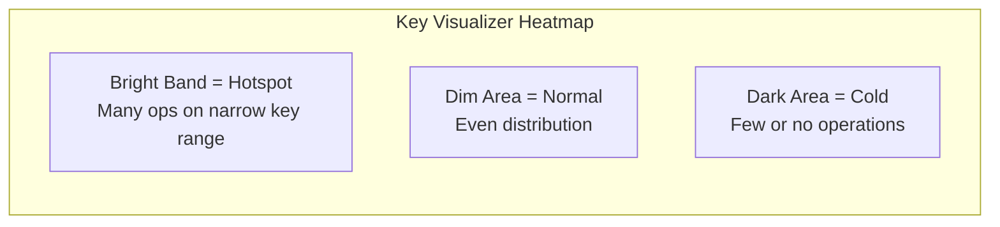

# How to Profile and Optimize Cloud Bigtable Read and Write Latency Using Key Visualizer

Author: [nawazdhandala](https://www.github.com/nawazdhandala)

Tags: GCP, Cloud Bigtable, Key Visualizer, Latency Optimization, Performance Profiling, NoSQL

Description: Learn how to use Cloud Bigtable Key Visualizer to identify hotspots, optimize row key design, and reduce read and write latency in your Bigtable tables.

---

Cloud Bigtable can handle millions of requests per second with single-digit millisecond latency - but only if your data access patterns are healthy. The most common cause of Bigtable performance problems is hotspotting: too many reads or writes hitting the same small range of row keys, overloading the tablet server responsible for that range.

Key Visualizer is Bigtable's built-in profiling tool that shows you exactly how traffic is distributed across your row key space. It turns an abstract concept (hot keys) into a visual heatmap that makes problems obvious at a glance.

## What Key Visualizer Shows

Key Visualizer generates heatmaps where:
- The X-axis is time
- The Y-axis is the row key space (alphabetically ordered)
- The color intensity represents a metric: read ops, write ops, bytes read, or latency



A healthy table shows an even distribution of color across the Y-axis. A problematic table shows bright horizontal bands - these are your hotspots.

## Accessing Key Visualizer

Key Visualizer is available for any Bigtable table that has had at least 30 GB of data for 24 hours.

```bash
# List your Bigtable instances
gcloud bigtable instances list

# Open Key Visualizer in the browser
# Navigate to: Console > Bigtable > Instances > Your Instance > Tables > Your Table > Key Visualizer
```

Alternatively, access it directly at:
`https://console.cloud.google.com/bigtable/instances/INSTANCE_ID/tables/TABLE_NAME/key-visualizer`

## Identifying Common Problems

### Problem 1: Sequential Key Hotspot

The most common issue. When row keys are sequential (timestamps, auto-incrementing IDs), all writes hit the same tablet because new keys always land at the end of the key space.

**What it looks like in Key Visualizer:** A bright horizontal band that moves slowly upward over time as the key range grows.

**The fix:** Prefix your keys with a hash or reverse the timestamp.

```python
# BAD: Sequential timestamp keys create hotspots
# All writes go to the same tablet
row_key = f"2026-02-17T14:30:00#{event_id}"

# GOOD: Hash prefix distributes writes across tablets
import hashlib

def make_distributed_key(timestamp, event_id):
    """Create a row key with a hash prefix for even distribution."""
    # Use the first 4 characters of the hash as a prefix
    hash_prefix = hashlib.sha256(event_id.encode()).hexdigest()[:4]
    return f"{hash_prefix}#{timestamp}#{event_id}"

row_key = make_distributed_key("2026-02-17T14:30:00", "evt-12345")
# Result: "a1b2#2026-02-17T14:30:00#evt-12345"
```

### Problem 2: Hot Row

A single row key gets a disproportionate number of reads or writes.

**What it looks like in Key Visualizer:** A thin, very bright horizontal line.

**The fix:** Redesign the data model to spread the load. For example, if a counter row gets millions of increments, use multiple counter shards:

```python
import random

# BAD: Single counter row - becomes a hot row
# table.mutate_rows([direct_mutation("counter#page-views", ...)])

# GOOD: Sharded counter - distributes writes across N shards
NUM_SHARDS = 100

def increment_counter(table, counter_name, amount=1):
    """Increment a sharded counter in Bigtable."""
    shard = random.randint(0, NUM_SHARDS - 1)
    row_key = f"{counter_name}#shard-{shard:04d}"

    row = table.direct_row(row_key)
    # Use ReadModifyWrite for atomic increment
    row.increment_cell_value(
        column_family_id="counts",
        column="value",
        int_value=amount,
    )
    row.commit()

def read_counter(table, counter_name):
    """Read the total across all shards."""
    prefix = f"{counter_name}#shard-"
    rows = table.read_rows(
        row_set=RowRange(start_key=prefix.encode(), end_key=f"{counter_name}#shard-\xff".encode())
    )

    total = 0
    for row in rows:
        cells = row.cells["counts"]["value"]
        if cells:
            # Bigtable stores integers as 8-byte big-endian
            total += int.from_bytes(cells[0].value, byteorder='big', signed=True)
    return total
```

### Problem 3: Uneven Read Pattern

Reads are concentrated on a specific portion of the key space - often the most recent data.

**What it looks like in Key Visualizer:** A bright band in the read ops heatmap on a specific key range that does not move.

**The fix:** If reads are always for the latest data, consider caching (Memorystore) or restructuring your key design so recent data is spread across the key space.

```python
# Instead of time-first keys where recent reads hit one spot
# Use an entity-first key that distributes reads

# BAD: All "recent" reads hit the same key range
row_key = f"2026-02-17#user-{user_id}#metric-{metric}"

# GOOD: Reads for different users hit different tablets
row_key = f"user-{user_id}#2026-02-17#metric-{metric}"
```

## Interpreting Key Visualizer Patterns

Here is a reference guide for what different patterns mean:

### Even Horizontal Bands
**Meaning:** Uniform read/write distribution. This is healthy.
**Action:** None needed.

### Single Bright Horizontal Line
**Meaning:** One row key getting massive traffic.
**Action:** Shard the hot row or redesign the key.

### Bright Diagonal Line Moving Up
**Meaning:** Sequential key writes (timestamps/IDs).
**Action:** Add hash prefix or reverse the key.

### Periodic Bright Vertical Bands
**Meaning:** Batch operations running on schedule.
**Action:** Stagger batch jobs or use flow control.

### Top-Heavy or Bottom-Heavy Brightness
**Meaning:** Skewed key distribution - certain key prefixes get more traffic.
**Action:** Redistribute key prefixes or add salting.

## Optimizing Based on Key Visualizer Findings

### Step 1: Export Key Visualizer Data for Analysis

You can export Key Visualizer data to BigQuery for more detailed analysis.

```bash
# Key Visualizer data can be accessed via the API
# Use the Bigtable Admin API to fetch scan data
gcloud bigtable instances tables describe TABLE_NAME \
  --instance=INSTANCE_ID
```

### Step 2: Test Key Design Changes

Before changing your production key design, test with a new table.

```python
# Create a test table with the new key design
from google.cloud import bigtable

client = bigtable.Client(project="MY_PROJECT", admin=True)
instance = client.instance("my-instance")

# Create test table with the new key design
table = instance.table("events-test-v2")

# Define column families
cf = table.column_family("data", max_versions=1)
table.create(column_families={"data": cf})

# Write test data with the new key design
import hashlib
import time

def generate_test_data(table, num_rows=100000):
    """Generate test data with hash-prefixed keys."""
    rows = []
    for i in range(num_rows):
        event_id = f"evt-{i:08d}"
        timestamp = "2026-02-17T14:30:00"

        # New key design with hash prefix
        hash_prefix = hashlib.sha256(event_id.encode()).hexdigest()[:4]
        row_key = f"{hash_prefix}#{timestamp}#{event_id}"

        row = table.direct_row(row_key)
        row.set_cell("data", "payload", f"test-data-{i}")
        rows.append(row)

        # Batch write every 1000 rows
        if len(rows) >= 1000:
            table.mutate_rows(rows)
            rows = []

    if rows:
        table.mutate_rows(rows)

generate_test_data(table)
```

Wait 24 hours and check Key Visualizer on the test table to verify even distribution.

### Step 3: Monitor Latency Percentiles

Use Cloud Monitoring to track latency improvements after key changes.

```bash
# Query Bigtable latency metrics
gcloud monitoring time-series list \
  --filter='resource.type="bigtable_table" AND metric.type="bigtable.googleapis.com/server/latencies"' \
  --interval-start-time=$(date -u -d '-1 hour' +%Y-%m-%dT%H:%M:%SZ) \
  --interval-end-time=$(date -u +%Y-%m-%dT%H:%M:%SZ)
```

Key latency metrics to track:

| Metric | Healthy Value | Action Needed |
|---|---|---|
| Read p50 latency | < 5ms | Normal |
| Read p99 latency | < 20ms | Normal |
| Read p99 latency | > 50ms | Check for hotspots |
| Write p50 latency | < 5ms | Normal |
| Write p99 latency | > 30ms | Check for hotspots |

## General Key Design Best Practices

1. **Avoid sequential prefixes.** Do not start keys with timestamps, dates, or auto-incrementing IDs.

2. **Use a hash prefix for write-heavy tables.** A 2-4 character hash prefix distributes writes evenly across all tablets.

3. **Put the most-queried dimension first.** If you always query by user ID, make that the first component of the key.

4. **Keep keys short.** Keys are stored with every cell value. Long keys waste storage and memory.

5. **Use field separators consistently.** Pick a separator (like `#`) and use it everywhere.

```python
# Example of a well-designed key for IoT telemetry
def make_iot_key(device_id, metric_type, timestamp):
    """Create a Bigtable row key for IoT data.

    Format: reversed_device_id#metric#reversed_timestamp
    - Device ID first: reads are per-device
    - Reversed timestamp: newest data has lowest sort order within device
    - Reversed device ID: prevents hot-spotting if device IDs are sequential
    """
    reversed_device = device_id[::-1]
    reversed_ts = str(9999999999 - int(timestamp.timestamp()))
    return f"{reversed_device}#{metric_type}#{reversed_ts}"
```

## Wrapping Up

Key Visualizer is the single most valuable tool for Bigtable performance optimization. It transforms the abstract question "why is my Bigtable slow?" into a visual pattern you can diagnose in seconds. The most common finding is sequential key hotspots, and the fix is almost always a hash prefix or key reversal. Make it a habit to check Key Visualizer weekly on your production tables, not just when something goes wrong. Catching a developing hotspot early - before it impacts latency - is much easier than fixing one that is already causing problems. Good key design is the foundation of Bigtable performance, and Key Visualizer is how you verify that your design is working as intended.
