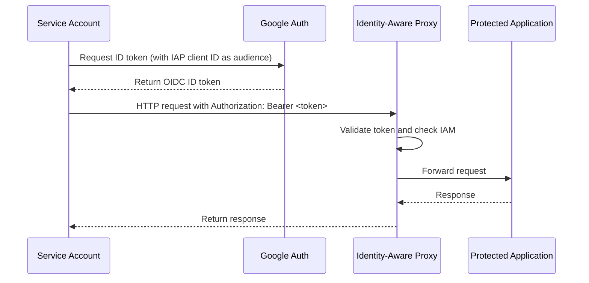

# How to Programmatically Access IAP-Protected Resources Using a Service Account in GCP

Author: [nawazdhandala](https://www.github.com/nawazdhandala)

Tags: GCP, IAP, Service Account, Authentication, API Access, Security

Description: Learn how to use GCP service accounts to programmatically access Identity-Aware Proxy protected web applications and APIs without interactive browser-based authentication.

---

Identity-Aware Proxy works great for human users - they get redirected to Google Sign-In, authenticate, and access the application. But what about service-to-service communication? A cron job, a CI/CD pipeline, or a microservice running in another project cannot open a browser window to sign in.

That is where service account authentication with IAP comes in. You can use a service account to generate an ID token that IAP accepts, allowing programmatic access to IAP-protected resources without any human interaction.

This post covers the complete process, from granting the right permissions to writing code that authenticates against IAP.

## How Programmatic IAP Access Works

The flow is different from browser-based access. Instead of an OAuth redirect, your service account generates an OIDC ID token targeted at IAP's OAuth client ID. IAP validates this token and, if the service account has the right IAM permissions, allows the request through.



## Step 1: Get the IAP OAuth Client ID

First, you need to know the OAuth client ID that IAP uses for your backend service. This is the "audience" your ID token must be targeted at.

```bash
# Get the OAuth client ID for an IAP-protected backend service
gcloud compute backend-services describe my-backend-service \
    --global \
    --format="value(iap.oauth2ClientId)" \
    --project=my-project-id
```

Save this client ID. It looks something like `123456789-abcdefg.apps.googleusercontent.com`.

## Step 2: Grant the Service Account IAP Access

The service account needs the `roles/iap.httpsResourceAccessor` role on the backend service.

```bash
# Grant the service account permission to access the IAP-protected resource
gcloud iap web add-iam-policy-binding \
    --resource-type=backend-services \
    --service=my-backend-service \
    --member="serviceAccount:my-automation@my-project-id.iam.gserviceaccount.com" \
    --role="roles/iap.httpsResourceAccessor" \
    --project=my-project-id
```

## Step 3: Authenticate and Make Requests

Now the actual implementation. There are several ways to do this depending on your programming language and environment.

### Python

The simplest approach uses the `google-auth` library.

```python
import google.auth
import google.auth.transport.requests
from google.oauth2 import id_token
import requests as http_requests

# The OAuth client ID from your IAP configuration
IAP_CLIENT_ID = "123456789-abcdefg.apps.googleusercontent.com"

# The URL of the IAP-protected application
TARGET_URL = "https://my-app.company.com/api/data"

def make_iap_request(url, client_id, method="GET", **kwargs):
    """Make a request to an IAP-protected resource using default credentials."""

    # Get the default credentials (works on GCE, GKE, Cloud Run, etc.)
    credentials, _ = google.auth.default()

    # Create a request adapter
    auth_request = google.auth.transport.requests.Request()

    # Refresh the credentials to get an access token
    credentials.refresh(auth_request)

    # Fetch an ID token targeted at the IAP client ID
    id_token_value = id_token.fetch_id_token(auth_request, client_id)

    # Make the request with the ID token in the Authorization header
    headers = kwargs.pop("headers", {})
    headers["Authorization"] = f"Bearer {id_token_value}"

    response = http_requests.request(method, url, headers=headers, **kwargs)
    return response


# Make a GET request to the IAP-protected API
response = make_iap_request(TARGET_URL, IAP_CLIENT_ID)
print(f"Status: {response.status_code}")
print(f"Body: {response.text}")
```

### Python with Service Account Key File

If you are running outside GCP and need to use a service account key file.

```python
from google.oauth2 import service_account
import google.auth.transport.requests
import requests as http_requests

# Path to the service account key file
SERVICE_ACCOUNT_KEY = "/path/to/service-account-key.json"
IAP_CLIENT_ID = "123456789-abcdefg.apps.googleusercontent.com"
TARGET_URL = "https://my-app.company.com/api/data"

def make_iap_request_with_key(url, client_id, key_file):
    """Make an IAP request using a service account key file."""

    # Load service account credentials with the target audience
    credentials = service_account.IDTokenCredentials.from_service_account_file(
        key_file,
        target_audience=client_id,
    )

    # Refresh to get the ID token
    auth_request = google.auth.transport.requests.Request()
    credentials.refresh(auth_request)

    # Make the HTTP request
    headers = {"Authorization": f"Bearer {credentials.token}"}
    response = http_requests.get(url, headers=headers)
    return response


response = make_iap_request_with_key(TARGET_URL, IAP_CLIENT_ID, SERVICE_ACCOUNT_KEY)
print(f"Status: {response.status_code}")
print(f"Body: {response.text}")
```

### Using curl with gcloud

For quick testing and scripts, you can use `gcloud` to get an ID token.

```bash
# Get an ID token for the IAP client ID
TOKEN=$(gcloud auth print-identity-token \
    --audiences=123456789-abcdefg.apps.googleusercontent.com)

# Make a request to the IAP-protected resource
curl -H "Authorization: Bearer ${TOKEN}" \
    https://my-app.company.com/api/data
```

### Go

```go
package main

import (
	"context"
	"fmt"
	"io"
	"net/http"

	"google.golang.org/api/idtoken"
)

func makeIAPRequest(targetURL, clientID string) (string, error) {
	ctx := context.Background()

	// Create an HTTP client that automatically adds the ID token
	client, err := idtoken.NewClient(ctx, clientID)
	if err != nil {
		return "", fmt.Errorf("failed to create IAP client: %w", err)
	}

	// Make the request - the client handles token generation
	resp, err := client.Get(targetURL)
	if err != nil {
		return "", fmt.Errorf("request failed: %w", err)
	}
	defer resp.Body.Close()

	body, err := io.ReadAll(resp.Body)
	if err != nil {
		return "", fmt.Errorf("failed to read response: %w", err)
	}

	return string(body), nil
}

func main() {
	clientID := "123456789-abcdefg.apps.googleusercontent.com"
	targetURL := "https://my-app.company.com/api/data"

	body, err := makeIAPRequest(targetURL, clientID)
	if err != nil {
		fmt.Printf("Error: %v\n", err)
		return
	}
	fmt.Println(body)
}
```

### Node.js

```javascript
const { GoogleAuth } = require('google-auth-library');

const IAP_CLIENT_ID = '123456789-abcdefg.apps.googleusercontent.com';
const TARGET_URL = 'https://my-app.company.com/api/data';

async function makeIAPRequest(url, clientId) {
    // Create an auth client that generates ID tokens
    const auth = new GoogleAuth();
    const client = await auth.getIdTokenClient(clientId);

    // Make the request - the client adds the Authorization header
    const response = await client.request({ url });
    return response.data;
}

makeIAPRequest(TARGET_URL, IAP_CLIENT_ID)
    .then(data => console.log(data))
    .catch(err => console.error('Error:', err.message));
```

## Service Account Impersonation

If you want a service account to impersonate another service account for IAP access, you can use impersonation. This is useful when you do not want to distribute key files.

```python
from google.auth import impersonated_credentials
import google.auth
import google.auth.transport.requests

# Get the current credentials (the one doing the impersonation)
source_credentials, _ = google.auth.default()

# Create impersonated credentials
target_sa = "iap-accessor@my-project-id.iam.gserviceaccount.com"
IAP_CLIENT_ID = "123456789-abcdefg.apps.googleusercontent.com"

# First, create impersonated credentials for the target service account
impersonated = impersonated_credentials.Credentials(
    source_credentials=source_credentials,
    target_principal=target_sa,
    target_scopes=["https://www.googleapis.com/auth/cloud-platform"],
)

# Then create ID token credentials from the impersonated credentials
id_token_creds = impersonated_credentials.IDTokenCredentials(
    target_credentials=impersonated,
    target_audience=IAP_CLIENT_ID,
)

# Refresh to get the token
auth_request = google.auth.transport.requests.Request()
id_token_creds.refresh(auth_request)

# Use the token in your request
headers = {"Authorization": f"Bearer {id_token_creds.token}"}
```

The source service account needs the `roles/iam.serviceAccountTokenCreator` role on the target service account.

## Common Mistakes

**Using an access token instead of an ID token**: IAP requires an OIDC ID token, not an OAuth access token. The `gcloud auth print-access-token` command gives you an access token, which IAP will reject. Use `gcloud auth print-identity-token` instead.

**Wrong audience in the ID token**: The token audience must match the IAP OAuth client ID exactly. If you use a different audience, IAP rejects the token with a 401.

**Missing IAM binding**: The service account must have `roles/iap.httpsResourceAccessor` on the specific backend service. A project-level binding also works but is less secure.

**Token expiration**: ID tokens expire after about one hour. Your code should handle token refresh. The Google auth libraries do this automatically when you use their HTTP clients.

## Testing Locally

For local development, you can impersonate a service account without downloading key files.

```bash
# Impersonate a service account to get an ID token
gcloud auth print-identity-token \
    --impersonate-service-account=my-automation@my-project-id.iam.gserviceaccount.com \
    --audiences=123456789-abcdefg.apps.googleusercontent.com
```

This requires the `iam.serviceAccountTokenCreator` role on the service account.

## Summary

Programmatic access to IAP-protected resources requires generating an OIDC ID token targeted at IAP's OAuth client ID. Grant the service account the `httpsResourceAccessor` role, use the Google auth libraries to generate tokens, and include them in the Authorization header. The pattern is the same across languages - get the IAP client ID, create an ID token for that audience, and make your HTTP request. Avoid the common pitfall of using access tokens instead of ID tokens, and make sure your audience matches the IAP client ID exactly.
