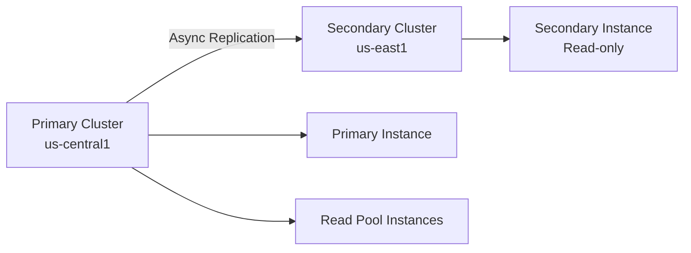

# How to Promote an AlloyDB Secondary Cluster During a Regional Outage

Author: [nawazdhandala](https://www.github.com/nawazdhandala)

Tags: GCP, AlloyDB, Disaster Recovery, Failover, High Availability

Description: Step-by-step guide to promoting an AlloyDB secondary cluster to primary during a regional outage, including preparation, execution, and post-failover tasks.

---

Regional outages happen. Google Cloud regions have gone down before, and they will go down again. If your AlloyDB cluster sits in a single region, an outage there means your database is offline until the region recovers. That is why AlloyDB supports cross-region replication with secondary clusters - and why you need to know how to promote one before you actually need to.

In this post, I will cover how AlloyDB cross-region replication works, how to set up a secondary cluster, and the exact steps to promote it when disaster strikes.

## How AlloyDB Cross-Region Replication Works

AlloyDB uses asynchronous replication to keep a secondary cluster in sync with your primary. The architecture looks like this:



The secondary cluster maintains a near-real-time copy of your data. Because replication is asynchronous, there is always some replication lag - typically seconds, but it can increase during heavy write workloads. This means that when you promote the secondary, you might lose the most recent few seconds of writes. That trade-off is almost always acceptable compared to hours of downtime.

## Setting Up a Secondary Cluster

Before you can promote a secondary, you need to have one running. Here is how to create a secondary cluster in a different region:

```bash
# Create a secondary cluster in us-east1 that replicates from the primary in us-central1
gcloud alloydb clusters create my-secondary-cluster \
  --region=us-east1 \
  --cluster-type=SECONDARY \
  --primary-cluster=projects/my-project/locations/us-central1/clusters/my-primary-cluster \
  --network=projects/my-project/global/networks/my-vpc
```

After the cluster is created, add a secondary instance:

```bash
# Create a secondary instance in the secondary cluster
gcloud alloydb instances create secondary-instance \
  --cluster=my-secondary-cluster \
  --region=us-east1 \
  --instance-type=SECONDARY \
  --cpu-count=4
```

The secondary instance is read-only. It receives replicated data from the primary and can serve read traffic, but it cannot accept writes until you promote it.

## Monitoring Replication Health

Before an outage forces your hand, you should be regularly monitoring replication lag and health:

```bash
# Check replication status and lag for the secondary cluster
gcloud alloydb clusters describe my-secondary-cluster \
  --region=us-east1 \
  --format="yaml(secondaryConfig, state)"
```

Set up alerts so you know if replication lag exceeds acceptable thresholds:

```bash
# Create a Cloud Monitoring alert for high replication lag
gcloud alpha monitoring policies create \
  --display-name="AlloyDB Replication Lag Alert" \
  --condition-display-name="Replication lag exceeds 30 seconds" \
  --condition-filter='resource.type="alloydb.googleapis.com/Instance" AND metric.type="alloydb.googleapis.com/database/replication/replica_lag"' \
  --condition-threshold-value=30 \
  --condition-threshold-comparison=COMPARISON_GT \
  --notification-channels=projects/my-project/notificationChannels/12345
```

## The Promotion Process

When a regional outage hits and you need to promote the secondary cluster, here is the step-by-step process.

### Step 1: Confirm the Outage

Before promoting, verify that the primary region is actually down and not just experiencing a brief hiccup. Check the Google Cloud Status Dashboard and try to reach your primary cluster:

```bash
# Try to connect to the primary - if this times out, the region is likely down
gcloud alloydb clusters describe my-primary-cluster \
  --region=us-central1 \
  --format="yaml(state)"
```

If the command hangs or returns an error indicating the region is unreachable, proceed with promotion.

### Step 2: Promote the Secondary Cluster

The promotion command converts the secondary cluster into an independent primary cluster:

```bash
# Promote the secondary cluster to become the new primary
# This breaks the replication link with the old primary
gcloud alloydb clusters promote my-secondary-cluster \
  --region=us-east1
```

This operation typically takes a few minutes. During promotion, AlloyDB:

1. Stops accepting replicated data from the old primary
2. Applies any remaining WAL records
3. Converts the secondary instance to a read-write primary instance
4. Makes the cluster fully operational for writes

### Step 3: Verify the Promotion

After the command completes, verify the cluster is operational:

```bash
# Verify the promoted cluster is now a primary and in READY state
gcloud alloydb clusters describe my-secondary-cluster \
  --region=us-east1 \
  --format="yaml(clusterType, state)"

# Verify the instance is now a primary instance
gcloud alloydb instances describe secondary-instance \
  --cluster=my-secondary-cluster \
  --region=us-east1 \
  --format="yaml(instanceType, state)"
```

### Step 4: Update Your Application

Your application needs to connect to the new primary. How you handle this depends on your architecture:

If you are using Private Service Connect or Private IP, you will need to update your connection string to point to the new cluster's IP:

```bash
# Get the new primary's IP address
gcloud alloydb instances describe secondary-instance \
  --cluster=my-secondary-cluster \
  --region=us-east1 \
  --format="value(ipAddress)"
```

If you use a DNS-based approach, update your DNS record:

```bash
# Update the DNS record to point to the new primary IP
gcloud dns record-sets update db.internal.mycompany.com \
  --zone=my-internal-zone \
  --type=A \
  --rrdatas="10.1.0.5" \
  --ttl=60
```

### Step 5: Add Read Pool Instances (If Needed)

The promoted cluster only has the former secondary instance, now acting as primary. If your application relies on read pool instances, create them:

```bash
# Create read pool instances in the promoted cluster
gcloud alloydb instances create read-pool-1 \
  --cluster=my-secondary-cluster \
  --region=us-east1 \
  --instance-type=READ_POOL \
  --cpu-count=4 \
  --read-pool-node-count=2
```

## After the Original Region Recovers

Once the original region comes back online, you have a decision to make. You can either:

1. **Stay in the new region**: Set up a new secondary cluster pointing back to the original region for future DR.
2. **Migrate back**: Create a new secondary in the original region, let it sync, then promote it back.

To set up a new secondary pointing back:

```bash
# Create a new secondary in the original region for future DR
gcloud alloydb clusters create my-new-secondary \
  --region=us-central1 \
  --cluster-type=SECONDARY \
  --primary-cluster=projects/my-project/locations/us-east1/clusters/my-secondary-cluster \
  --network=projects/my-project/global/networks/my-vpc
```

## Runbook Template

I recommend keeping a runbook document that your on-call team can follow during an outage. Here is a condensed version:

1. Confirm regional outage via GCP Status Dashboard
2. Run `gcloud alloydb clusters promote` on the secondary
3. Wait for promotion to complete (monitor with `describe`)
4. Update DNS or connection strings
5. Verify application connectivity
6. Create read pool instances if needed
7. Notify stakeholders
8. Plan for setting up new DR secondary

## Testing Your Failover Plan

Do not wait for a real outage to test this. Schedule regular DR drills where you actually promote a secondary cluster and verify your application works against it. Some teams do this quarterly. The process is:

1. Create a temporary secondary cluster
2. Let it sync fully
3. Promote it
4. Point a test instance of your application at it
5. Run your test suite
6. Delete the temporary cluster

The cost of running a secondary for a few hours is negligible compared to discovering during an actual outage that your failover process has a gap.

## Wrapping Up

AlloyDB cross-region replication gives you a solid disaster recovery strategy, but the technology is only half the equation. The other half is preparation - setting up the secondary, monitoring replication health, documenting the promotion process, and actually practicing it. When a regional outage hits at 2 AM, you want the promotion to be a well-rehearsed procedure, not an adventure.
