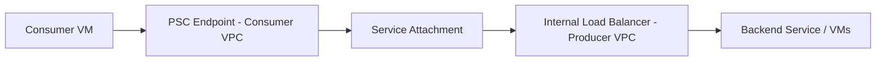

# How to Publish Your Own Services Using Private Service Connect Producer Endpoints on Google Cloud

Author: [nawazdhandala](https://www.github.com/nawazdhandala)

Tags: GCP, Private Service Connect, Networking, Service Publishing, VPC

Description: Learn how to publish your own internal services using Private Service Connect producer endpoints so consumers in other VPCs or projects can access them privately.

---

Private Service Connect is not just for consuming Google APIs privately. You can also use it to publish your own services so that consumers in other VPCs, projects, or even organizations can connect to them without peering networks or exposing anything to the public internet. This is a powerful pattern for building internal service marketplaces, multi-tenant SaaS platforms, or simply sharing services across organizational boundaries.

In this guide, I will walk through the producer side of Private Service Connect - how to publish a service so that consumers can connect to it through a private endpoint in their own VPC.

## How PSC Producer Endpoints Work

The producer publishes a service by attaching it to a service attachment. The consumer then creates a PSC endpoint that connects to that service attachment. Traffic flows from the consumer's VPC through the PSC connection to the producer's internal load balancer.



The key benefit is that the producer and consumer VPCs do not need to be peered. They can have overlapping IP ranges, and the consumer never sees the producer's internal IP addresses.

## Prerequisites

On the producer side, you need:

- An internal TCP/UDP load balancer or internal HTTP(S) load balancer serving your application
- A subnet specifically for PSC NAT (this is separate from your regular subnets)
- IAM permissions to create service attachments

```bash
# Enable the Compute Engine API
gcloud services enable compute.googleapis.com
```

## Step 1 - Set Up the Backend Service

If you do not already have a backend service behind an internal load balancer, here is a quick setup. I will use an internal TCP load balancer with a managed instance group.

```bash
# Create an instance template for the backend
gcloud compute instance-templates create my-service-template \
    --machine-type=e2-medium \
    --network=producer-vpc \
    --subnet=producer-subnet \
    --region=us-central1 \
    --metadata=startup-script='#!/bin/bash
apt-get update && apt-get install -y nginx
echo "Hello from PSC producer" > /var/www/html/index.html
systemctl start nginx'

# Create a managed instance group
gcloud compute instance-groups managed create my-service-mig \
    --template=my-service-template \
    --size=2 \
    --zone=us-central1-a

# Create a health check
gcloud compute health-checks create tcp my-service-hc \
    --port=80

# Create a backend service
gcloud compute backend-services create my-backend-service \
    --protocol=TCP \
    --health-checks=my-service-hc \
    --load-balancing-scheme=INTERNAL \
    --region=us-central1

# Add the instance group to the backend service
gcloud compute backend-services add-backend my-backend-service \
    --instance-group=my-service-mig \
    --instance-group-zone=us-central1-a \
    --region=us-central1
```

## Step 2 - Create the Internal Load Balancer

Now create the forwarding rule that acts as the internal load balancer frontend.

```bash
# Create a forwarding rule for the internal load balancer
gcloud compute forwarding-rules create my-service-ilb \
    --region=us-central1 \
    --network=producer-vpc \
    --subnet=producer-subnet \
    --load-balancing-scheme=INTERNAL \
    --backend-service=my-backend-service \
    --ports=80 \
    --address=10.0.0.50
```

At this point you have a working internal load balancer. Verify it by SSHing into a VM in the same VPC and curling the internal IP.

## Step 3 - Create a PSC NAT Subnet

PSC requires a dedicated subnet for NAT purposes. This subnet is used by PSC to translate consumer traffic before it reaches your load balancer. The consumer's source IP gets NATed to an address from this subnet.

```bash
# Create a subnet specifically for PSC NAT
# This subnet should be small - /24 or /26 is usually sufficient
gcloud compute networks subnets create psc-nat-subnet \
    --network=producer-vpc \
    --region=us-central1 \
    --range=10.0.10.0/24 \
    --purpose=PRIVATE_SERVICE_CONNECT
```

The `--purpose=PRIVATE_SERVICE_CONNECT` flag is critical. It tells GCP that this subnet is reserved for PSC NAT and cannot be used for regular workloads.

## Step 4 - Create the Service Attachment

The service attachment is what makes your internal load balancer available to consumers.

```bash
# Create the service attachment
gcloud compute service-attachments create my-service-attachment \
    --region=us-central1 \
    --producer-forwarding-rule=my-service-ilb \
    --nat-subnets=psc-nat-subnet \
    --connection-preference=ACCEPT_MANUAL \
    --consumer-accept-list=consumer-project-id=5
```

Let me break down the important flags:

- `--producer-forwarding-rule`: Points to your internal load balancer
- `--nat-subnets`: The PSC NAT subnet for address translation
- `--connection-preference`: Either `ACCEPT_AUTOMATIC` (any consumer can connect) or `ACCEPT_MANUAL` (you explicitly approve each consumer)
- `--consumer-accept-list`: When using manual acceptance, specifies which projects can connect and the maximum number of connections allowed

## Step 5 - Share the Service Attachment URI with Consumers

After creating the service attachment, get its URI and share it with your consumers. They will need this to create their PSC endpoint.

```bash
# Get the details of the service attachment
gcloud compute service-attachments describe my-service-attachment \
    --region=us-central1

# The URI will look like:
# projects/my-producer-project/regions/us-central1/serviceAttachments/my-service-attachment
```

## Consumer Side - Creating the PSC Endpoint

On the consumer side, the setup is straightforward. The consumer creates a forwarding rule that targets the service attachment.

```bash
# Reserve an IP address in the consumer VPC
gcloud compute addresses create psc-consumer-ip \
    --region=us-central1 \
    --subnet=consumer-subnet \
    --addresses=192.168.1.50

# Create the PSC endpoint (consumer-side forwarding rule)
gcloud compute forwarding-rules create my-psc-endpoint \
    --region=us-central1 \
    --network=consumer-vpc \
    --address=psc-consumer-ip \
    --target-service-attachment=projects/producer-project/regions/us-central1/serviceAttachments/my-service-attachment
```

Now the consumer can reach the producer's service at 192.168.1.50, which is an IP in their own VPC. There is no VPC peering, no public IP, and no internet exposure.

## Managing Consumer Connections

As a producer, you can manage consumer connections by approving, rejecting, or revoking access.

```bash
# List current connections to your service attachment
gcloud compute service-attachments describe my-service-attachment \
    --region=us-central1 \
    --format="yaml(connectedEndpoints)"

# Accept a pending consumer connection
gcloud compute service-attachments update my-service-attachment \
    --region=us-central1 \
    --consumer-accept-list=new-consumer-project=3

# Reject a consumer project
gcloud compute service-attachments update my-service-attachment \
    --region=us-central1 \
    --consumer-reject-list=blocked-project
```

## Adding DNS for a Better Consumer Experience

You can optionally register your service attachment with Service Directory, which allows consumers to use DNS names instead of raw IP addresses.

```bash
# Update the service attachment to register with Service Directory
gcloud compute service-attachments update my-service-attachment \
    --region=us-central1 \
    --enable-proxy-protocol=false
```

## Monitoring and Logging

Monitor your PSC service attachment to understand connection patterns and detect issues.

```bash
# Check the status of all connections
gcloud compute service-attachments describe my-service-attachment \
    --region=us-central1

# Look at the connection count and status for each consumer
# Status values: ACCEPTED, PENDING, REJECTED, CLOSED
```

You should also set up Cloud Monitoring alerts for:

- Connection count approaching the limit
- NAT subnet IP exhaustion
- Backend health check failures

## Security Considerations

A few important security points when publishing services via PSC:

- **Always prefer manual acceptance** for production services. Automatic acceptance means any project in your organization (or any project at all, if cross-org is enabled) can connect.
- **Size your NAT subnet appropriately**. Each consumer connection uses one IP from the NAT subnet. If you expect many consumers, use a larger subnet.
- **Use firewall rules** on the producer side to restrict which source IP ranges can reach your backends. Since consumer traffic gets NATed to the PSC NAT subnet, you can write rules targeting that subnet range.
- **Monitor connection limits**. Service attachments have a maximum number of connected endpoints. Plan capacity accordingly.

## Wrapping Up

Publishing services via Private Service Connect gives you a secure, scalable way to share services across VPC and project boundaries without the complexity and limitations of VPC peering. The producer controls who can connect, and the consumer gets a simple private IP in their own VPC. This pattern works well for internal platform teams providing shared services, for SaaS providers offering private connectivity to customers, and for any scenario where you need private cross-project communication without network merging.
