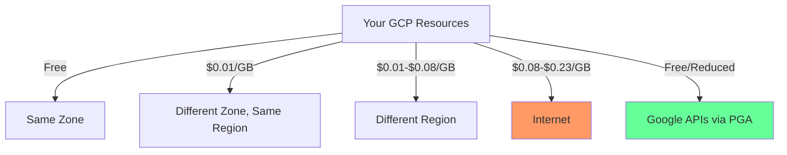

# How to Reduce Network Egress Costs on GCP Using Cloud CDN Private Google Access and Peering

Author: [nawazdhandala](https://www.github.com/nawazdhandala)

Tags: GCP, Network Egress, Cloud CDN, Private Google Access, Cost Optimization, Networking

Description: Practical strategies to reduce GCP network egress costs using Cloud CDN for caching, Private Google Access for internal traffic, and peering for high-volume data transfers.

---

Network egress is one of those cost categories that catches teams off guard. You focus on compute and storage costs, then discover that data leaving your GCP network is a significant chunk of your bill. The good news is that several GCP features can dramatically reduce egress costs - Cloud CDN caches content at the edge, Private Google Access keeps traffic on Google's network, and peering reduces the per-GB rate for high-volume transfers. Here is how to use each one.

## Understanding Where Egress Costs Come From

Not all egress is created equal. GCP charges different rates depending on where the data is going:

- Egress within the same zone: Free
- Egress within the same region but different zones: Small charge
- Egress between regions: More expensive
- Egress to the internet: Most expensive
- Egress to other GCP services via Private Google Access: Often free



## Strategy 1: Cloud CDN for Internet Egress

If you serve static content, APIs, or media to end users, Cloud CDN can cache responses at over 150 edge locations worldwide. Cache hits are served from the edge and cost significantly less than origin egress.

### Set Up Cloud CDN with a Cloud Storage Backend

```bash
# Create a Cloud Storage bucket for static content
gcloud storage buckets create gs://my-project-cdn-content \
  --location=us-central1 \
  --uniform-bucket-level-access

# Make it publicly readable (for CDN-served content)
gcloud storage buckets add-iam-policy-binding gs://my-project-cdn-content \
  --member=allUsers \
  --role=roles/storage.objectViewer

# Create a backend bucket pointing to Cloud Storage
gcloud compute backend-buckets create cdn-backend \
  --gcs-bucket-name=my-project-cdn-content \
  --enable-cdn \
  --cache-mode=CACHE_ALL_STATIC \
  --default-ttl=3600 \
  --max-ttl=86400

# Create a URL map
gcloud compute url-maps create cdn-url-map \
  --default-backend-bucket=cdn-backend

# Create an HTTPS proxy
gcloud compute target-https-proxies create cdn-https-proxy \
  --url-map=cdn-url-map \
  --ssl-certificates=my-ssl-cert

# Create a global forwarding rule
gcloud compute forwarding-rules create cdn-forwarding-rule \
  --global \
  --target-https-proxy=cdn-https-proxy \
  --ports=443
```

### Set Up Cloud CDN with a GKE or Compute Engine Backend

For dynamic content, put Cloud CDN in front of your application load balancer:

```bash
# Enable CDN on an existing backend service
gcloud compute backend-services update my-backend-service \
  --global \
  --enable-cdn \
  --cache-mode=USE_ORIGIN_HEADERS

# Configure cache key policy to improve cache hit rates
gcloud compute backend-services update my-backend-service \
  --global \
  --cache-key-include-protocol \
  --cache-key-include-host \
  --no-cache-key-include-query-string
```

### Optimize Cache Hit Rate

The higher your cache hit rate, the more you save on egress:

```bash
# Check your CDN cache hit rate
gcloud compute backend-services get-health my-backend-service --global

# View CDN metrics in Cloud Monitoring
gcloud monitoring metrics list --filter='metric.type="loadbalancing.googleapis.com/https/request_count"'
```

Set proper cache headers in your application:

```python
# Flask example - Set cache headers for CDN
from flask import Flask, make_response

app = Flask(__name__)

@app.route('/api/products')
def get_products():
    """Return product list with CDN-friendly cache headers."""
    response = make_response(get_product_data())

    # Cache for 5 minutes at CDN edge, 1 minute in browser
    response.headers['Cache-Control'] = 'public, max-age=60, s-maxage=300'
    response.headers['Vary'] = 'Accept-Encoding'

    return response

@app.route('/api/user/profile')
def get_profile():
    """User-specific data should not be cached by CDN."""
    response = make_response(get_user_profile())

    # Prevent CDN caching for private data
    response.headers['Cache-Control'] = 'private, no-store'

    return response
```

### CDN Cost Savings Example

Here is a rough calculation. Say you serve 10 TB per month of content to users:

| Scenario | Egress Cost |
|----------|------------|
| No CDN (all from origin) | ~$850/month (at $0.085/GB) |
| 80% CDN cache hit rate | ~$170 origin egress + ~$64 CDN egress = ~$234/month |
| Savings | ~$616/month (72% reduction) |

CDN cache egress is charged at $0.02-0.08/GB depending on region, significantly less than standard internet egress.

## Strategy 2: Private Google Access

Private Google Access (PGA) allows VM instances without external IP addresses to access Google APIs and services through Google's internal network instead of the internet. This eliminates egress charges for accessing services like Cloud Storage, BigQuery, and Artifact Registry.

### Enable Private Google Access on Subnets

```bash
# Enable Private Google Access on an existing subnet
gcloud compute networks subnets update my-subnet \
  --region=us-central1 \
  --enable-private-google-access

# Verify it is enabled
gcloud compute networks subnets describe my-subnet \
  --region=us-central1 \
  --format='value(privateIpGoogleAccess)'
```

### Configure DNS for Private Google Access

For VMs without external IPs to reach Google APIs, configure DNS to resolve to the restricted or private VIP ranges:

```bash
# Create a Cloud DNS managed zone for googleapis.com
gcloud dns managed-zones create google-apis \
  --dns-name="googleapis.com." \
  --description="Route Google API traffic through Private Google Access" \
  --visibility=private \
  --networks=my-vpc

# Add DNS records pointing to the private VIP
gcloud dns record-sets create "*.googleapis.com." \
  --zone=google-apis \
  --type=CNAME \
  --rrdatas="private.googleapis.com."

gcloud dns record-sets create "private.googleapis.com." \
  --zone=google-apis \
  --type=A \
  --rrdatas="199.36.153.8,199.36.153.9,199.36.153.10,199.36.153.11"
```

### Impact of Private Google Access

Common scenarios where PGA saves money:

```bash
# Without PGA: GKE pods pulling images from gcr.io/Artifact Registry
# go through the internet = egress charges
# With PGA: Same traffic stays on Google's network = no egress charges

# Without PGA: Dataflow workers reading from Cloud Storage
# through public IPs = egress charges for cross-region reads
# With PGA: Internal routing = reduced or eliminated egress
```

## Strategy 3: VPC Network Peering and Interconnect

For high-volume data transfers between your on-premises network and GCP, or between GCP and other clouds, the per-GB internet egress rate adds up fast. Dedicated Interconnect or Partner Interconnect offers lower egress rates.

```bash
# Check current interconnect pricing (as reference)
# Dedicated Interconnect egress: $0.02/GB (vs $0.08-0.23/GB for internet)
# Partner Interconnect: Similar savings depending on partner

# Create a Dedicated Interconnect (requires physical cross-connect)
gcloud compute interconnects create my-interconnect \
  --interconnect-type=DEDICATED \
  --admin-enabled \
  --customer-name="My Company" \
  --location=iad-zone1-1
```

For GCP-to-GCP traffic between projects or VPCs:

```bash
# Set up VPC Network Peering between projects
# Peered VPC traffic within the same region is free
gcloud compute networks peerings create project-a-to-b \
  --network=project-a-vpc \
  --peer-project=project-b \
  --peer-network=project-b-vpc

gcloud compute networks peerings create project-b-to-a \
  --network=project-b-vpc \
  --peer-project=project-a \
  --peer-network=project-a-vpc \
  --project=project-b
```

## Strategy 4: Co-Locate Resources in the Same Region

This seems obvious, but it is one of the most effective strategies. Resources in the same region communicating through internal IPs have minimal egress charges:

```bash
# Audit cross-region traffic in your billing data
bq query --use_legacy_sql=false '
SELECT
  sku.description,
  location.region,
  SUM(cost) AS monthly_cost
FROM `billing_export.gcp_billing_export_v1_BILLING_ACCOUNT_ID`
WHERE service.description = "Networking"
  AND DATE(usage_start_time) >= DATE_SUB(CURRENT_DATE(), INTERVAL 30 DAY)
  AND sku.description LIKE "%Egress%"
GROUP BY 1, 2
HAVING monthly_cost > 10
ORDER BY monthly_cost DESC
'
```

## Strategy 5: Use Cloud Storage Transfer Service for Large Moves

For large data transfers between regions, Cloud Storage Transfer Service can be cheaper than moving data through your application:

```bash
# Create a transfer job to replicate data between regions
gcloud transfer jobs create \
  --source-bucket=gs://source-bucket-us-east1 \
  --destination-bucket=gs://dest-bucket-us-central1 \
  --schedule-repeats-every=24h \
  --description="Daily cross-region replication"
```

## Monitoring Egress Costs

Track your egress spending to measure the impact of optimizations:

```sql
-- Monitor egress costs by type and destination
SELECT
  DATE_TRUNC(DATE(usage_start_time), WEEK) AS week,
  sku.description AS egress_type,
  SUM(cost) AS weekly_cost,
  SUM(usage.amount) AS total_gb
FROM `billing_export.gcp_billing_export_v1_BILLING_ACCOUNT_ID`
WHERE service.description = 'Networking'
  AND sku.description LIKE '%Egress%'
  AND DATE(usage_start_time) >= DATE_SUB(CURRENT_DATE(), INTERVAL 90 DAY)
GROUP BY 1, 2
HAVING weekly_cost > 5
ORDER BY week DESC, weekly_cost DESC;
```

## Quick Win Checklist

1. Enable Private Google Access on all subnets - this costs nothing and immediately eliminates egress charges for Google API traffic from private instances.

2. Enable Cloud CDN on any public-facing load balancer serving cacheable content - even a modest cache hit rate saves money.

3. Audit cross-region traffic - move resources to the same region where possible.

4. Remove external IPs from VMs that do not need them - use IAP tunnels for SSH access instead.

5. Use Standard tier networking for non-latency-sensitive workloads - it costs less per GB than Premium tier.

6. For high-volume internet egress (over 5 TB/month), consider a CDN Interconnect partner for even lower rates.

Network egress is rarely the largest line item on your GCP bill, but it is one of the easiest to optimize. Most of these changes are infrastructure-level configurations that do not require any application code changes, and the savings start immediately.
