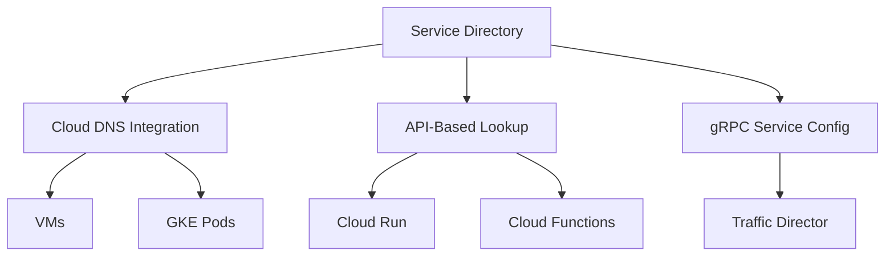

# How to Register and Discover Microservices Using Service Directory on Google Cloud

Author: [nawazdhandala](https://www.github.com/nawazdhandala)

Tags: GCP, Service Directory, Microservices, Service Discovery, Networking

Description: Learn how to use Google Cloud Service Directory to register, discover, and resolve microservices across your infrastructure with DNS and API-based lookups.

---

In a microservices architecture, knowing where services are running is half the battle. IP addresses change, instances scale up and down, and services move across environments. Hardcoding endpoints is a recipe for outages. Google Cloud Service Directory provides a managed service registry where you can register your services with their endpoints and metadata, then discover them using either DNS or direct API calls.

This post covers how to set up Service Directory, register services, and integrate service discovery into your applications.

## Why Service Directory Over Other Options

You might be wondering why you would use Service Directory when tools like Consul, etcd, or even Kubernetes DNS exist. The answer comes down to scope. Service Directory works across all your GCP resources - VMs, GKE clusters, Cloud Run services, on-prem workloads connected via VPN - from a single registry. It also integrates natively with Cloud DNS, so services can be discovered through standard DNS lookups without any application-level SDK.



## Setting Up Service Directory

Start by enabling the API and creating a namespace. Namespaces are organizational units that group related services together.

```bash
# Enable the Service Directory API
gcloud services enable servicedirectory.googleapis.com

# Create a namespace for your production services
gcloud service-directory namespaces create production \
    --location=us-central1

# Create a namespace for staging
gcloud service-directory namespaces create staging \
    --location=us-central1
```

Namespaces help you separate services by environment, team, or any other organizational boundary that makes sense for your setup.

## Registering a Service

Once you have a namespace, you can register services and their endpoints.

```bash
# Register a service called "user-api" in the production namespace
gcloud service-directory services create user-api \
    --namespace=production \
    --location=us-central1 \
    --metadata=version=v2.1,team=platform

# Add an endpoint to the service
gcloud service-directory endpoints create user-api-instance-1 \
    --service=user-api \
    --namespace=production \
    --location=us-central1 \
    --address=10.0.1.15 \
    --port=8080 \
    --metadata=zone=us-central1-a,weight=50

# Add a second endpoint for redundancy
gcloud service-directory endpoints create user-api-instance-2 \
    --service=user-api \
    --namespace=production \
    --location=us-central1 \
    --address=10.0.1.16 \
    --port=8080 \
    --metadata=zone=us-central1-b,weight=50
```

Each endpoint has an address, port, and optional metadata. The metadata is free-form key-value pairs that you can use for routing decisions, canary deployments, or any other purpose.

## Registering Services Programmatically

In production, you will want to register services programmatically, typically during deployment. Here is how to do it with the Python client library.

```python
from google.cloud import servicedirectory_v1

# Initialize the client
client = servicedirectory_v1.RegistrationServiceClient()

# Define the parent path for the namespace
namespace_path = client.namespace_path(
    "my-project", "us-central1", "production"
)

# Register a new service
service = servicedirectory_v1.Service()
service.metadata = {"version": "v3.0", "team": "payments"}

created_service = client.create_service(
    parent=namespace_path,
    service=service,
    service_id="payment-service"
)
print(f"Created service: {created_service.name}")

# Add an endpoint to the service
endpoint = servicedirectory_v1.Endpoint()
endpoint.address = "10.0.2.20"
endpoint.port = 443
endpoint.metadata = {"zone": "us-central1-a"}

created_endpoint = client.create_endpoint(
    parent=created_service.name,
    endpoint=endpoint,
    endpoint_id="payment-instance-1"
)
print(f"Created endpoint: {created_endpoint.name}")
```

## Discovering Services via API

The lookup API lets your applications discover services at runtime.

```python
from google.cloud import servicedirectory_v1

# Initialize the lookup client
lookup_client = servicedirectory_v1.LookupServiceClient()

# Build the service path
service_path = servicedirectory_v1.RegistrationServiceClient.service_path(
    "my-project", "us-central1", "production", "user-api"
)

# Resolve the service to get its endpoints
request = servicedirectory_v1.ResolveServiceRequest(name=service_path)
response = lookup_client.resolve_service(request=request)

# Iterate over the endpoints
for endpoint in response.service.endpoints:
    print(f"Endpoint: {endpoint.name}")
    print(f"  Address: {endpoint.address}:{endpoint.port}")
    print(f"  Metadata: {endpoint.metadata}")
```

This API call returns all endpoints registered under the service, along with their metadata. Your application can then implement client-side load balancing, pick endpoints based on metadata (like zone affinity), or fall back to secondary endpoints if primary ones are unhealthy.

## Discovering Services via DNS

The DNS integration is where Service Directory really shines for brownfield applications. You can create a Cloud DNS zone backed by Service Directory, which makes your registered services discoverable through standard DNS queries.

```bash
# Create a DNS zone backed by Service Directory
gcloud dns managed-zones create sd-production \
    --dns-name="production.internal." \
    --visibility=private \
    --networks=my-vpc \
    --service-directory-namespace=projects/my-project/locations/us-central1/namespaces/production \
    --description="DNS zone backed by Service Directory production namespace"
```

Now any VM in your VPC can discover services using regular DNS:

```bash
# Query the service using dig
dig user-api.production.internal SRV

# This returns SRV records with the endpoints:
# user-api.production.internal. 300 IN SRV 0 0 8080 user-api-instance-1.user-api.production.internal.
# user-api.production.internal. 300 IN SRV 0 0 8080 user-api-instance-2.user-api.production.internal.

# You can also query A records
dig user-api.production.internal A
# Returns: 10.0.1.15 and 10.0.1.16
```

This means your existing applications that already use DNS-based discovery do not need any code changes. Just point them at the right DNS name.

## Automating Registration with GKE

If your services run on GKE, you can automate registration using a sidecar or init container that registers the pod with Service Directory on startup.

```python
import os
import socket
from google.cloud import servicedirectory_v1

def register_pod():
    """Register this pod as an endpoint in Service Directory."""
    client = servicedirectory_v1.RegistrationServiceClient()

    # Get pod details from environment variables
    pod_name = os.environ.get("HOSTNAME", socket.gethostname())
    pod_ip = os.environ.get("POD_IP", "")
    service_name = os.environ.get("SERVICE_NAME", "")
    namespace = os.environ.get("SD_NAMESPACE", "production")
    port = int(os.environ.get("SERVICE_PORT", "8080"))

    # Build the service path
    service_path = client.service_path(
        "my-project", "us-central1", namespace, service_name
    )

    # Create the endpoint
    endpoint = servicedirectory_v1.Endpoint()
    endpoint.address = pod_ip
    endpoint.port = port
    endpoint.metadata = {
        "pod": pod_name,
        "version": os.environ.get("APP_VERSION", "unknown")
    }

    try:
        client.create_endpoint(
            parent=service_path,
            endpoint=endpoint,
            endpoint_id=pod_name
        )
        print(f"Registered {pod_name} at {pod_ip}:{port}")
    except Exception as e:
        print(f"Failed to register: {e}")

if __name__ == "__main__":
    register_pod()
```

You would also want a deregistration hook that removes the endpoint when the pod shuts down.

## Health Checking and Stale Endpoints

Service Directory does not perform health checks on its own. This is an important distinction from tools like Consul. You are responsible for removing or updating endpoints when they become unhealthy. You have a few options:

1. Use a sidecar that periodically checks health and updates the registration
2. Integrate with your deployment pipeline to update endpoints during deploys
3. Use Cloud Monitoring alerts to trigger a Cloud Function that deregisters unhealthy endpoints

## IAM and Access Control

Control who can register and discover services using IAM roles:

```bash
# Grant a service account the ability to register services
gcloud projects add-iam-policy-binding my-project \
    --member="serviceAccount:deployer@my-project.iam.gserviceaccount.com" \
    --role="roles/servicedirectory.editor"

# Grant read-only access for service consumers
gcloud projects add-iam-policy-binding my-project \
    --member="serviceAccount:app@my-project.iam.gserviceaccount.com" \
    --role="roles/servicedirectory.viewer"
```

## Wrapping Up

Service Directory provides a managed, centralized registry for your services on GCP. The DNS integration makes it particularly useful because existing applications can discover services without code changes. For new applications, the API-based lookup gives you more control over how endpoints are selected. Whether you are running VMs, GKE, Cloud Run, or a mix of everything, Service Directory gives you one place to register and find services. The main thing to remember is that health checking is your responsibility - build automation around registration and deregistration so your registry stays accurate.
