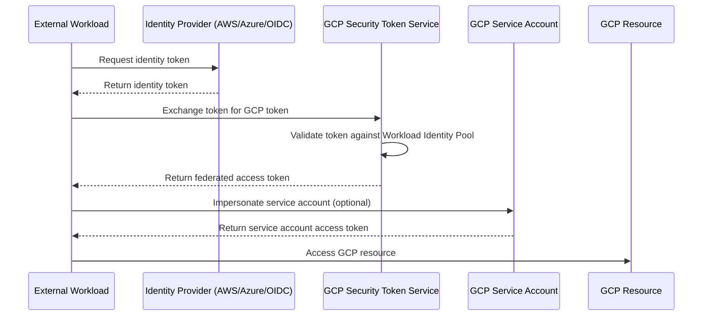

# How to Replace Service Account Keys with Workload Identity Federation in GCP

Author: [nawazdhandala](https://www.github.com/nawazdhandala)

Tags: GCP, Workload Identity Federation, IAM, Security, Service Account

Description: Learn how to eliminate long-lived service account keys by configuring Workload Identity Federation to authenticate external workloads using tokens from AWS, Azure, or OIDC providers.

---

If you are running workloads outside of GCP that need access to Google Cloud resources, you have probably dealt with service account keys. You download a JSON key file, copy it to your CI/CD server, your on-premises application, or your AWS Lambda function, and use it to authenticate. It works, but it creates a persistent credential that can be stolen, accidentally committed to source control, or left in a container image layer for anyone to extract.

Workload Identity Federation eliminates this problem by letting external workloads exchange their native identity tokens for short-lived GCP access tokens. Your GitHub Actions workflow uses its OIDC token. Your AWS EC2 instance uses its IAM role. Your Azure VM uses its managed identity. No key files involved at all.

## How Workload Identity Federation Works

The core idea is a trust relationship. You tell GCP: "I trust tokens issued by this specific identity provider, and when a token comes in with these attributes, treat it as this service account."

The flow looks like this:



There are two steps: exchanging the external token for a federated token, and optionally impersonating a service account to get a service account token. Some GCP APIs accept federated tokens directly, but most workflows impersonate a service account for compatibility.

## Prerequisites

- A GCP project with the IAM, Resource Manager, and Security Token Service APIs enabled
- An external identity provider that issues tokens (AWS IAM, Azure AD, GitHub Actions, any OIDC provider)
- A service account in GCP with the roles needed for your workload

Enable the required APIs:

```bash
# Enable required APIs for Workload Identity Federation
gcloud services enable \
  iam.googleapis.com \
  sts.googleapis.com \
  iamcredentials.googleapis.com \
  --project=my-project-id
```

## Step 1 - Create a Workload Identity Pool

A Workload Identity Pool is a container for external identities. You can think of it as a namespace that groups related external providers:

```bash
# Create the Workload Identity Pool
gcloud iam workload-identity-pools create my-external-pool \
  --location="global" \
  --display-name="External Workloads Pool" \
  --description="Pool for authenticating external workloads" \
  --project=my-project-id
```

## Step 2 - Add a Provider to the Pool

The provider configuration depends on your external identity source. Here are examples for the most common scenarios.

### GitHub Actions (OIDC)

```bash
# Add GitHub Actions as an OIDC provider
gcloud iam workload-identity-pools providers create-oidc github-provider \
  --location="global" \
  --workload-identity-pool="my-external-pool" \
  --display-name="GitHub Actions" \
  --issuer-uri="https://token.actions.githubusercontent.com" \
  --attribute-mapping="google.subject=assertion.sub,attribute.repository=assertion.repository,attribute.actor=assertion.actor" \
  --attribute-condition="assertion.repository_owner == 'my-github-org'" \
  --project=my-project-id
```

The `attribute-condition` is critical for security. Without it, any GitHub Actions workflow from any repository could potentially exchange tokens. The condition restricts it to repositories owned by your organization.

### AWS

```bash
# Add AWS as an identity provider
gcloud iam workload-identity-pools providers create-aws aws-provider \
  --location="global" \
  --workload-identity-pool="my-external-pool" \
  --display-name="AWS Workloads" \
  --account-id="123456789012" \
  --project=my-project-id
```

### Azure AD (OIDC)

```bash
# Add Azure AD as an OIDC provider
gcloud iam workload-identity-pools providers create-oidc azure-provider \
  --location="global" \
  --workload-identity-pool="my-external-pool" \
  --display-name="Azure AD" \
  --issuer-uri="https://login.microsoftonline.com/TENANT_ID/v2.0" \
  --allowed-audiences="api://my-app-id" \
  --attribute-mapping="google.subject=assertion.sub,attribute.tid=assertion.tid" \
  --project=my-project-id
```

## Step 3 - Create a Service Account and Grant Access

Create a service account that external workloads will impersonate:

```bash
# Create the service account for external workloads
gcloud iam service-accounts create external-workload-sa \
  --display-name="External Workload SA" \
  --project=my-project-id

# Grant the service account whatever roles it needs
gcloud projects add-iam-policy-binding my-project-id \
  --member="serviceAccount:external-workload-sa@my-project-id.iam.gserviceaccount.com" \
  --role="roles/storage.objectAdmin"
```

Now allow the federated identity to impersonate this service account. The member format uses the Workload Identity Pool principal:

```bash
# Allow GitHub Actions from a specific repo to impersonate the service account
gcloud iam service-accounts add-iam-policy-binding \
  external-workload-sa@my-project-id.iam.gserviceaccount.com \
  --member="principalSet://iam.googleapis.com/projects/PROJECT_NUMBER/locations/global/workloadIdentityPools/my-external-pool/attribute.repository/my-github-org/my-repo" \
  --role="roles/iam.workloadIdentityUser" \
  --project=my-project-id
```

## Step 4 - Configure Your External Workload

### GitHub Actions Example

In your GitHub Actions workflow, use the `google-github-actions/auth` action:

```yaml
# .github/workflows/deploy.yml
# GitHub Actions workflow that authenticates to GCP without a key file
name: Deploy to GCP
on:
  push:
    branches: [main]

permissions:
  id-token: write  # Required for OIDC token generation
  contents: read

jobs:
  deploy:
    runs-on: ubuntu-latest
    steps:
      - uses: actions/checkout@v4

      # Authenticate using Workload Identity Federation
      - id: auth
        uses: google-github-actions/auth@v2
        with:
          workload_identity_provider: "projects/PROJECT_NUMBER/locations/global/workloadIdentityPools/my-external-pool/providers/github-provider"
          service_account: "external-workload-sa@my-project-id.iam.gserviceaccount.com"

      # Now you can use gcloud or any Google Cloud client library
      - uses: google-github-actions/setup-gcloud@v2

      - run: gcloud storage cp ./dist/* gs://my-deployment-bucket/
```

### Python Application Example

For a Python application running on AWS or any environment with OIDC tokens:

```python
# Python authentication using Workload Identity Federation
# This replaces the pattern of loading a JSON key file
from google.auth import identity_pool
from google.cloud import storage

# Create a credential configuration file (usually generated once)
# This file does NOT contain secrets - it only describes where to get tokens
credential_config = {
    "type": "external_account",
    "audience": "//iam.googleapis.com/projects/PROJECT_NUMBER/locations/global/workloadIdentityPools/my-external-pool/providers/github-provider",
    "subject_token_type": "urn:ietf:params:oauth:token-type:jwt",
    "token_url": "https://sts.googleapis.com/v1/token",
    "service_account_impersonation_url": "https://iamcredentials.googleapis.com/v1/projects/-/serviceAccounts/external-workload-sa@my-project-id.iam.gserviceaccount.com:generateAccessToken",
    "credential_source": {
        "file": "/var/run/secrets/tokens/gcp-token",
        "format": {
            "type": "text"
        }
    }
}

# The client libraries handle the token exchange automatically
credentials = identity_pool.Credentials.from_info(credential_config)
client = storage.Client(credentials=credentials, project="my-project-id")

# Use GCP resources normally
buckets = list(client.list_buckets())
for bucket in buckets:
    print(bucket.name)
```

## Step 5 - Migrate Away from Key Files

Once Workload Identity Federation is working, follow these steps to remove old key files:

1. Identify all service accounts using key files by checking audit logs for `google.iam.admin.v1.CreateServiceAccountKey` events
2. For each one, set up Workload Identity Federation for the external workload
3. Update the workload to use federation instead of the key file
4. Disable the old key and monitor for errors over a few days
5. Delete the old key once you are confident the workload is using federation

```bash
# List existing keys for a service account
gcloud iam service-accounts keys list \
  --iam-account=target-sa@my-project-id.iam.gserviceaccount.com \
  --managed-by=user

# Disable an old key (keeps it around but makes it unusable)
gcloud iam service-accounts keys disable KEY_ID \
  --iam-account=target-sa@my-project-id.iam.gserviceaccount.com

# Delete the key after confirming no workloads depend on it
gcloud iam service-accounts keys delete KEY_ID \
  --iam-account=target-sa@my-project-id.iam.gserviceaccount.com
```

## Security Best Practices

Always use attribute conditions on your providers. Without them, any identity from the external provider could potentially exchange tokens for GCP access.

Use the most specific principal identifier possible when granting service account impersonation. Instead of allowing the entire pool, restrict it to specific attributes like repository name, branch, or environment.

Monitor token exchange activity in Cloud Audit Logs. Look for `ExchangeToken` events from the Security Token Service to track which external identities are authenticating.

Workload Identity Federation completely eliminates the need for service account key files in most external integration scenarios. The setup takes a bit more work upfront than downloading a key file, but the security improvement is substantial. No more key rotation schedules, no more worried about leaked credentials, and no more compliance findings about long-lived keys.
