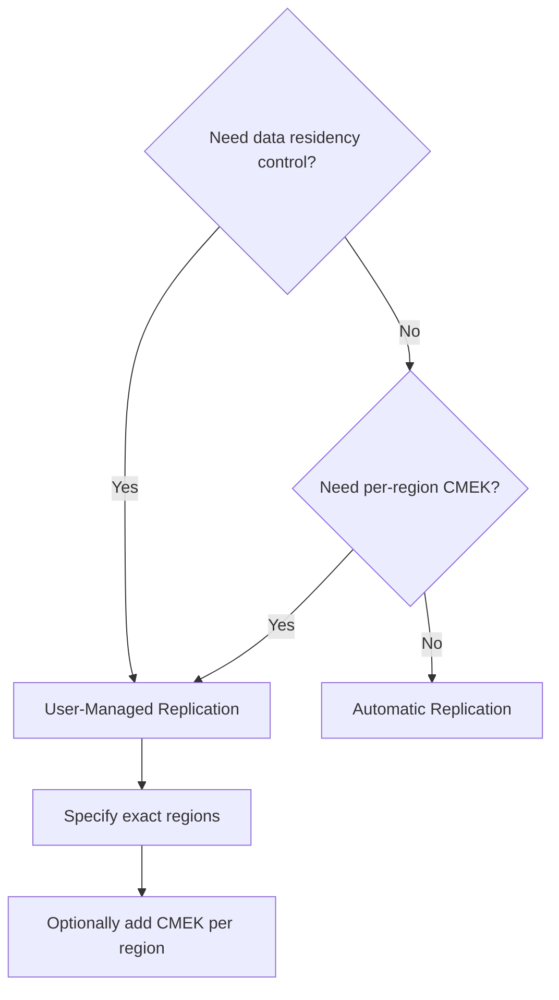

# How to Replicate Secrets Across Multiple Regions in GCP Secret Manager

Author: [nawazdhandala](https://www.github.com/nawazdhandala)

Tags: GCP, Secret Manager, Replication, Multi-Region, High Availability

Description: Learn how to configure secret replication policies in GCP Secret Manager for high availability, compliance, and low-latency access across multiple regions.

---

When your application runs in multiple regions, the secrets it depends on need to be available in those regions too. A database password stored only in us-central1 creates a single point of failure for your eu-west1 deployment. If there is a regional outage or network issue, your European workloads cannot authenticate, even though the application itself is perfectly healthy.

Secret Manager supports two replication policies: automatic and user-managed. Automatic replication lets Google decide where to store copies based on its global infrastructure. User-managed replication lets you specify exact regions, which is essential for compliance requirements that restrict where data can be stored.

## Understanding Replication Policies

### Automatic Replication

With automatic replication, Secret Manager stores the secret data in multiple Google-managed locations. You do not control which locations are used. This provides good availability and performance globally, and it is the simplest option.

```bash
# Create a secret with automatic replication
echo -n "my-api-key" | gcloud secrets create api-key \
  --data-file=- \
  --replication-policy="automatic" \
  --project=my-project-id
```

### User-Managed Replication

With user-managed replication, you specify exactly which regions store copies of the secret data. This is necessary when you have data residency requirements or when you want secrets stored close to specific workloads.

```bash
# Create a secret replicated to specific regions
echo -n "my-database-password" | gcloud secrets create db-password \
  --data-file=- \
  --replication-policy="user-managed" \
  --locations="us-central1,us-east1,europe-west1" \
  --project=my-project-id
```

## Choosing a Replication Strategy

The choice between automatic and user-managed depends on your requirements:

| Requirement | Recommended Policy |
|---|---|
| Simplest setup, global availability | Automatic |
| Data must stay in specific countries | User-managed |
| Low-latency access from specific regions | User-managed |
| Compliance (GDPR, data sovereignty) | User-managed |
| Customer-managed encryption (CMEK) | User-managed (different key per region) |



## Setting Up User-Managed Replication

### Basic Multi-Region Setup

For a typical multi-region application deployed in the US and Europe:

```bash
# Create a secret replicated to US and EU regions
echo -n "db-connection-string" | gcloud secrets create app-db-credentials \
  --data-file=- \
  --replication-policy="user-managed" \
  --locations="us-central1,us-east4,europe-west1,europe-west4" \
  --project=my-project-id
```

### Multi-Region with CMEK

For compliance-heavy environments where each region needs its own encryption key:

First, create KMS keys in each region:

```bash
# Create key rings and keys in each region
for region in us-central1 us-east4 europe-west1 europe-west4; do
  gcloud kms keyrings create secret-keyring \
    --location=$region \
    --project=my-project-id

  gcloud kms keys create secret-key \
    --keyring=secret-keyring \
    --location=$region \
    --purpose=encryption \
    --project=my-project-id

  # Grant Secret Manager access to each key
  gcloud kms keys add-iam-policy-binding secret-key \
    --keyring=secret-keyring \
    --location=$region \
    --member="serviceAccount:service-PROJECT_NUMBER@gcp-sa-secretmanager.iam.gserviceaccount.com" \
    --role="roles/cloudkms.cryptoKeyEncrypterDecrypter" \
    --project=my-project-id
done
```

Then create a replication configuration file:

```yaml
# replication-config.yaml
# User-managed replication with per-region CMEK
userManaged:
  replicas:
    - location: us-central1
      customerManagedEncryption:
        kmsKeyName: projects/my-project-id/locations/us-central1/keyRings/secret-keyring/cryptoKeys/secret-key
    - location: us-east4
      customerManagedEncryption:
        kmsKeyName: projects/my-project-id/locations/us-east4/keyRings/secret-keyring/cryptoKeys/secret-key
    - location: europe-west1
      customerManagedEncryption:
        kmsKeyName: projects/my-project-id/locations/europe-west1/keyRings/secret-keyring/cryptoKeys/secret-key
    - location: europe-west4
      customerManagedEncryption:
        kmsKeyName: projects/my-project-id/locations/europe-west4/keyRings/secret-keyring/cryptoKeys/secret-key
```

Create the secret with this configuration:

```bash
# Create a secret with per-region CMEK
echo -n "encrypted-db-password" | gcloud secrets create encrypted-credentials \
  --data-file=- \
  --replication-policy-file=replication-config.yaml \
  --project=my-project-id
```

## Terraform Configuration

```hcl
# User-managed replication across US and EU regions
resource "google_secret_manager_secret" "multi_region_secret" {
  secret_id = "app-db-credentials"
  project   = var.project_id

  replication {
    user_managed {
      replicas {
        location = "us-central1"
      }
      replicas {
        location = "us-east4"
      }
      replicas {
        location = "europe-west1"
      }
      replicas {
        location = "europe-west4"
      }
    }
  }
}

# User-managed replication with CMEK
resource "google_secret_manager_secret" "cmek_multi_region" {
  secret_id = "encrypted-credentials"
  project   = var.project_id

  replication {
    user_managed {
      replicas {
        location = "us-central1"
        customer_managed_encryption {
          kms_key_name = google_kms_crypto_key.us_central1.id
        }
      }
      replicas {
        location = "europe-west1"
        customer_managed_encryption {
          kms_key_name = google_kms_crypto_key.europe_west1.id
        }
      }
    }
  }
}
```

## Verifying Replication Configuration

Check the replication policy of an existing secret:

```bash
# View the replication configuration of a secret
gcloud secrets describe app-db-credentials \
  --project=my-project-id \
  --format="yaml(replication)"
```

The output shows each replica location and its encryption configuration.

## Changing Replication Policy

You cannot change the replication policy of an existing secret. If you need to change from automatic to user-managed (or change the regions), you need to create a new secret with the desired policy and migrate the data:

```bash
# Read the current secret value
CURRENT_VALUE=$(gcloud secrets versions access latest --secret=old-secret --project=my-project-id)

# Create a new secret with the desired replication policy
echo -n "$CURRENT_VALUE" | gcloud secrets create new-secret \
  --data-file=- \
  --replication-policy="user-managed" \
  --locations="us-central1,europe-west1" \
  --project=my-project-id

# Update applications to reference the new secret name
# Then delete the old secret
gcloud secrets delete old-secret --project=my-project-id
```

## Data Residency Considerations

For GDPR and other data sovereignty requirements, user-managed replication is essential. With automatic replication, Google may store your secret data in any region it chooses, which could violate data residency requirements.

For EU-only data:

```bash
# Create a secret that stays within the EU
echo -n "eu-customer-data-key" | gcloud secrets create eu-encryption-key \
  --data-file=- \
  --replication-policy="user-managed" \
  --locations="europe-west1,europe-west3,europe-west4" \
  --project=my-project-id
```

For US-only data:

```bash
# Create a secret that stays within the US
echo -n "us-financial-data-key" | gcloud secrets create us-encryption-key \
  --data-file=- \
  --replication-policy="user-managed" \
  --locations="us-central1,us-east1,us-east4,us-west1" \
  --project=my-project-id
```

## Performance Considerations

Secret Manager serves requests from the nearest replica. If your workload in europe-west1 accesses a secret that has a replica in europe-west1, the read is served locally. If the secret only has replicas in US regions, the request crosses the Atlantic, adding latency.

For latency-sensitive applications, make sure secrets are replicated to the same regions where your workloads run. The latency difference between a local read (under 10ms) and a cross-region read (50-100ms) is significant for applications that read secrets frequently.

## Disaster Recovery

With user-managed replication, consider how many replicas you need for adequate redundancy. A secret with only one replica is a single point of failure. If that region goes down, the secret is inaccessible.

For critical secrets, use at least two replicas in different regions within the same geographic area:

```bash
# Two replicas in the US for redundancy
echo -n "critical-api-key" | gcloud secrets create critical-secret \
  --data-file=- \
  --replication-policy="user-managed" \
  --locations="us-central1,us-east4" \
  --project=my-project-id
```

For the highest availability, use automatic replication. Google manages the replicas across its global infrastructure and provides the best availability guarantees.

## Monitoring Replication

Secret Manager does not expose replication lag metrics because replication is synchronous - when you create a version, it is available in all replicas before the API call returns. This means there is no eventual consistency to worry about. If the `add_secret_version` call succeeds, the new value is immediately available in every configured region.

However, you should monitor access patterns by region to verify that your workloads are reaching the expected replicas:

```bash
# Check secret access patterns in audit logs
gcloud logging read 'protoPayload.methodName="AccessSecretVersion" AND protoPayload.resourceName:"app-db-credentials"' \
  --project=my-project-id \
  --limit=20 \
  --format="table(timestamp, protoPayload.requestMetadata.callerIp)"
```

Replication in Secret Manager is a set-it-and-forget-it configuration for most use cases. Choose automatic if you do not have compliance constraints. Choose user-managed when you need control over data location, per-region encryption keys, or guaranteed low-latency access from specific regions. Either way, your secrets are available where your workloads need them.
