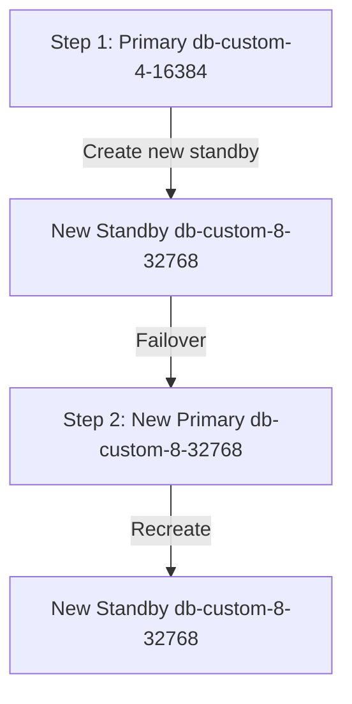

# How to Resize a Cloud SQL Instance Without Downtime

Author: [nawazdhandala](https://www.github.com/nawazdhandala)

Tags: GCP, Cloud SQL, Scaling, Instance Resize, Zero Downtime

Description: Learn how to resize a Cloud SQL instance by changing its machine type or storage with minimal or zero downtime using high availability and proper planning.

---

Your database needs more CPU. Or memory. Or disk space. The question is whether you can scale it up without taking an outage. The answer depends on what kind of resize you are doing and whether you have high availability enabled. This guide covers each scenario and the strategies for minimizing downtime.

## Types of Resizing

There are three types of resize operations in Cloud SQL:

1. **Machine type change** (CPU/memory) - Requires a restart
2. **Storage increase** - No restart needed
3. **Storage type change** (HDD to SSD) - Requires a restart

## Storage Increases: Truly Zero Downtime

Increasing disk size is the one resize operation that requires no restart and causes no downtime:

```bash
# Increase storage size - no restart required
gcloud sql instances patch my-instance \
    --storage-size=200GB
```

This works immediately. The disk grows while the instance continues serving traffic. You can only increase storage, never decrease it.

### Automatic Storage Increase

For even less manual work, enable automatic storage increases:

```bash
# Enable automatic storage increase with a cap
gcloud sql instances patch my-instance \
    --storage-auto-increase \
    --storage-auto-increase-limit=500
```

Cloud SQL will automatically add storage when the instance reaches 90% utilization. The `--storage-auto-increase-limit` sets a maximum to prevent runaway growth (and runaway costs).

## Machine Type Changes: Minimizing Downtime

Changing the CPU or memory allocation requires a restart. Here is how to minimize the impact.

### Strategy 1: HA Instance with Planned Failover

If your instance has high availability enabled, the resize process causes a failover, which reduces downtime to seconds:

```bash
# Step 1: Verify HA is enabled
gcloud sql instances describe my-instance \
    --format="value(settings.availabilityType)"
# Should return: REGIONAL

# Step 2: Resize the instance
# Cloud SQL will apply the change during a failover
gcloud sql instances patch my-instance \
    --tier=db-custom-8-32768
```

With HA, the process works like this:

1. Cloud SQL creates a new standby with the updated machine type
2. A failover occurs (new standby becomes primary)
3. The old primary is recreated with the updated machine type as the new standby
4. Total downtime: approximately 30-60 seconds



### Strategy 2: Blue-Green Deployment

For zero downtime, use a blue-green approach with a read replica:

```bash
# Step 1: Create a read replica with the desired machine type
gcloud sql instances create my-instance-green \
    --master-instance-name=my-instance \
    --tier=db-custom-8-32768 \
    --storage-type=SSD \
    --storage-size=200GB

# Step 2: Wait for the replica to catch up
# Monitor replication lag until it is near zero
gcloud sql instances describe my-instance-green \
    --format="json(replicaConfiguration)"

# Step 3: Promote the replica to become the new primary
gcloud sql instances promote-replica my-instance-green

# Step 4: Update your application connection strings
# Step 5: Delete the old instance after verifying everything works
```

This approach gives you:

- Zero downtime (reads continue during the entire process)
- Ability to test the new instance before cutting over
- Easy rollback (just point back to the old instance)

The trade-off is that you need to update connection strings in your application, which might require a deployment.

### Strategy 3: Maintenance Window Resize

For non-critical environments, just resize during a low-traffic period:

```bash
# Resize during off-peak hours
# This causes a restart of approximately 1-5 minutes
gcloud sql instances patch my-instance \
    --tier=db-custom-8-32768
```

The instance will restart with the new machine type. Downtime is typically 1-5 minutes.

## Choosing the Right Machine Type

Before resizing, understand what your database needs:

```bash
# Check current CPU utilization
gcloud monitoring read \
    --resource-type=cloudsql_database \
    --metric-type=cloudsql.googleapis.com/database/cpu/utilization \
    --filter='resource.labels.database_id="my-project:my-instance"' \
    --start-time="-24h"
```

Guidelines for sizing:

- **CPU-bound**: Queries are slow, CPU utilization is consistently above 80%. Scale up vCPUs.
- **Memory-bound**: Frequent disk reads, low cache hit ratio. Scale up memory.
- **Both**: Increase both proportionally.

Cloud SQL custom machine types let you independently choose vCPUs and memory:

```bash
# Custom machine type format: db-custom-{vCPUs}-{memory_MB}
# 4 vCPUs, 16 GB RAM
gcloud sql instances patch my-instance --tier=db-custom-4-16384

# 8 vCPUs, 32 GB RAM
gcloud sql instances patch my-instance --tier=db-custom-8-32768

# 16 vCPUs, 64 GB RAM
gcloud sql instances patch my-instance --tier=db-custom-16-65536
```

Memory must be between 3840 MB and 6656 MB per vCPU, in increments of 256 MB.

## Scaling Down

Scaling down (reducing vCPUs or memory) follows the same process as scaling up. However, be careful:

- Verify that your workload fits in the smaller instance
- Check that `max_connections` will still accommodate your connection count (it is tied to machine type)
- Run the smaller configuration in a staging environment first

```bash
# Scale down - same command, smaller tier
gcloud sql instances patch my-instance \
    --tier=db-custom-2-8192
```

## Application-Side Preparation

Before any resize that involves a restart, prepare your application:

### Connection Retry Logic

Make sure your application handles connection drops:

```python
# Retry wrapper for database operations during resize
import time
from functools import wraps

def retry_on_db_error(max_retries=5, base_delay=1):
    """Decorator that retries database operations on connection errors."""
    def decorator(func):
        @wraps(func)
        def wrapper(*args, **kwargs):
            for attempt in range(max_retries):
                try:
                    return func(*args, **kwargs)
                except Exception as e:
                    if "connection" in str(e).lower() and attempt < max_retries - 1:
                        delay = base_delay * (2 ** attempt)
                        print(f"DB connection error, retrying in {delay}s: {e}")
                        time.sleep(delay)
                    else:
                        raise
        return wrapper
    return decorator

@retry_on_db_error(max_retries=5, base_delay=2)
def get_user(user_id):
    """Fetch a user from the database with automatic retry."""
    with engine.connect() as conn:
        return conn.execute("SELECT * FROM users WHERE id = %s", (user_id,)).fetchone()
```

### Health Check Updates

If your application has health checks that include database connectivity, make sure they handle brief disconnections gracefully. A health check that fails immediately on a database connection error can cause cascading restarts in Kubernetes.

```python
# Health check that tolerates brief database outages
import time

last_db_check = 0
db_healthy = True
DB_CHECK_INTERVAL = 10  # Only check DB every 10 seconds

def health_check():
    """Health check that does not immediately fail on DB disconnect."""
    global last_db_check, db_healthy

    current_time = time.time()
    if current_time - last_db_check > DB_CHECK_INTERVAL:
        try:
            with engine.connect() as conn:
                conn.execute("SELECT 1")
            db_healthy = True
        except Exception:
            db_healthy = False
        last_db_check = current_time

    return db_healthy
```

## Monitoring During Resize

Watch these metrics during and after a resize:

```bash
# Monitor instance state
watch -n 10 "gcloud sql instances describe my-instance --format='value(state)'"
```

After the resize completes:

- Check CPU and memory utilization at the new tier
- Verify query performance has improved
- Monitor connection counts to ensure your application reconnected
- Check for any errors in application logs

## Automated Scaling

Cloud SQL does not have built-in autoscaling, but you can build it:

```python
# Simple scaling automation based on CPU utilization
# Run this as a Cloud Function triggered by Cloud Monitoring alerts

def scale_up_instance(event, context):
    """Scale up Cloud SQL instance when CPU is consistently high."""
    from googleapiclient import discovery

    service = discovery.build('sqladmin', 'v1beta4')

    # Current tier mapping for scale-up
    scale_map = {
        'db-custom-2-8192': 'db-custom-4-16384',
        'db-custom-4-16384': 'db-custom-8-32768',
        'db-custom-8-32768': 'db-custom-16-65536',
    }

    instance = service.instances().get(
        project='my-project',
        instance='my-instance'
    ).execute()

    current_tier = instance['settings']['tier']
    new_tier = scale_map.get(current_tier)

    if new_tier:
        instance['settings']['tier'] = new_tier
        service.instances().patch(
            project='my-project',
            instance='my-instance',
            body={'settings': {'tier': new_tier}}
        ).execute()
```

## Cost Impact of Resizing

Understand the cost changes before resizing:

| Machine Type | vCPUs | RAM | Approximate Monthly Cost |
|-------------|-------|-----|------------------------|
| db-custom-2-8192 | 2 | 8 GB | ~$150 |
| db-custom-4-16384 | 4 | 16 GB | ~$300 |
| db-custom-8-32768 | 8 | 32 GB | ~$600 |
| db-custom-16-65536 | 16 | 64 GB | ~$1,200 |

Prices are approximate and vary by region. HA doubles these costs.

## Summary

Resizing a Cloud SQL instance does not have to mean downtime for your users. Storage increases happen live with zero impact. For machine type changes, use HA for automatic failover (seconds of downtime) or the blue-green approach with read replicas for true zero downtime. Always implement connection retry logic in your application, monitor during the resize, and verify performance afterward. And if you are scaling up frequently, consider whether your queries need optimization before throwing more hardware at the problem.
