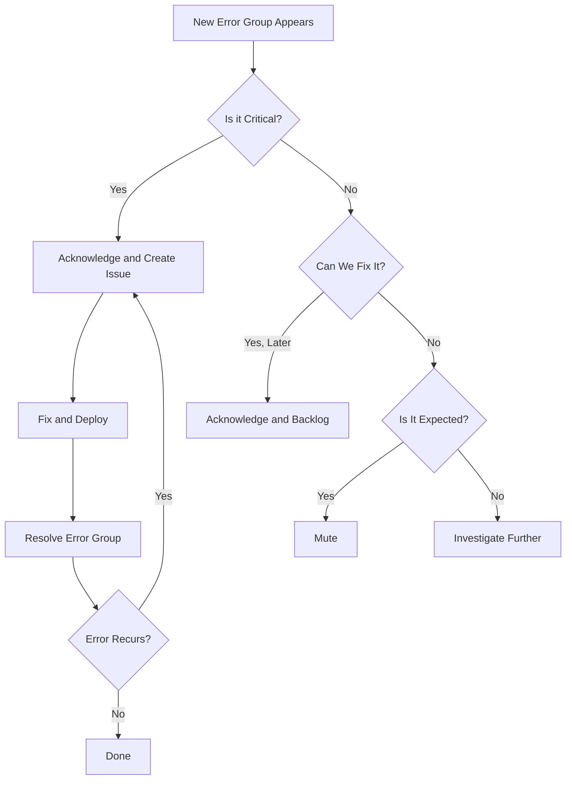

# How to Resolve and Mute Errors in Cloud Error Reporting to Manage Alert Noise

Author: [nawazdhandala](https://www.github.com/nawazdhandala)

Tags: GCP, Cloud Error Reporting, Alert Management, Error Resolution, Monitoring

Description: Learn how to use resolve and mute features in Google Cloud Error Reporting to cut through alert noise and focus on the errors that actually matter.

---

Every production system generates errors. Some are critical and need immediate attention. Others are known issues, expected behaviors, or things you simply cannot fix right now. If you treat every error the same, your team will burn out from alert fatigue and start ignoring notifications altogether.

Google Cloud Error Reporting has two powerful features for managing this noise: resolving and muting errors. Using them effectively is the difference between a useful error tracking system and one that everyone ignores.

## Understanding Error States

Before diving into resolve and mute, let us look at the full lifecycle of an error group in Error Reporting.

Every error group goes through states:

- **Open** - The default state when Error Reporting first sees the error. It appears prominently in the dashboard.
- **Acknowledged** - Someone has seen it and is aware. It still appears in the main view but is marked as being tracked.
- **Resolved** - The error is considered fixed. If it occurs again, the group automatically reopens and you get notified.
- **Muted** - The error is intentionally hidden. It does not appear in the default view and does not trigger notifications, even if new occurrences happen.

The important distinction between resolved and muted is what happens when the error recurs. Resolved errors come back to life. Muted errors stay silent.

## When to Resolve vs When to Mute

Choosing the right action depends on your expectations for the error.

**Resolve** when you have deployed a fix and expect the error to stop occurring. If the error comes back, you want to know about it because that means your fix did not work or there is a regression.

**Mute** when the error is something you cannot or will not fix, and you do not want to be notified about it. Common candidates for muting include:

- Client-side errors caused by bots or scrapers
- Errors from deprecated API versions that you still need to support
- Transient errors from third-party services that resolve on their own
- Errors in legacy code that is scheduled for retirement

## Resolving Errors in the Console

To resolve an error group in the Cloud Console:

1. Navigate to Error Reporting
2. Click on the error group you want to resolve
3. Click the "Resolve" button in the top right of the error detail page

You can also resolve errors in bulk by selecting multiple error groups from the list view and clicking the bulk action menu.

## Resolving Errors with the API

For automation or bulk operations, use the Error Reporting API:

```python
# Resolve an error group using the Error Reporting API
from google.cloud import errorreporting_v1beta1
from google.cloud.errorreporting_v1beta1 import types

def resolve_error_group(project_id, group_id):
    # Initialize the Error Group Service client
    client = errorreporting_v1beta1.ErrorGroupServiceClient()

    # Build the full group name
    group_name = f"projects/{project_id}/groups/{group_id}"

    # Get the current error group
    group = client.get_group(group_name=group_name)

    # Set the resolution status to RESOLVED
    group.resolution_status = types.ResolutionStatus.RESOLVED

    # Update the group
    updated = client.update_group(group=group)
    print(f"Resolved error group: {group_id}")
    return updated

resolve_error_group("my-gcp-project", "CK3ax92Fq")
```

Here is a script that resolves all error groups that have not had new occurrences in the last 30 days:

```python
# Bulk resolve stale error groups that haven't recurred in 30 days
from google.cloud import errorreporting_v1beta1
from google.cloud.errorreporting_v1beta1 import types
from datetime import datetime, timedelta, timezone

def resolve_stale_errors(project_id, days_threshold=30):
    stats_client = errorreporting_v1beta1.ErrorStatsServiceClient()
    group_client = errorreporting_v1beta1.ErrorGroupServiceClient()

    project_name = f"projects/{project_id}"
    cutoff = datetime.now(timezone.utc) - timedelta(days=days_threshold)

    # Fetch all open error groups
    time_range = types.QueryTimeRange(period=types.QueryTimeRange.Period.PERIOD_30_DAYS)

    response = stats_client.list_group_stats(
        project_name=project_name,
        time_range=time_range
    )

    resolved_count = 0
    for group_stats in response:
        # Check if the last occurrence is older than the threshold
        if group_stats.last_seen_time < cutoff:
            group = group_stats.group
            group.resolution_status = types.ResolutionStatus.RESOLVED
            group_client.update_group(group=group)
            resolved_count += 1
            print(f"Resolved: {group.group_id}")

    print(f"Resolved {resolved_count} stale error groups")

resolve_stale_errors("my-gcp-project", days_threshold=30)
```

## Muting Errors

Muting is more aggressive than resolving. A muted error will not reopen and will not generate notifications regardless of how many new occurrences happen.

In the Console, click on an error group and select "Mute" from the actions menu. The error group will disappear from the default view.

To see muted errors, toggle the filter at the top of the Error Reporting page to include muted groups.

```python
# Mute an error group
def mute_error_group(project_id, group_id):
    client = errorreporting_v1beta1.ErrorGroupServiceClient()
    group_name = f"projects/{project_id}/groups/{group_id}"

    # Get the current group
    group = client.get_group(group_name=group_name)

    # Set status to MUTED
    group.resolution_status = types.ResolutionStatus.MUTED

    # Update the group
    updated = client.update_group(group=group)
    print(f"Muted error group: {group_id}")
    return updated
```

## Automating Error Management

Manual triage works when you have a handful of services. At scale, you need automation. Here is an approach that uses the Error Reporting API to apply rules based on error patterns.

```python
# Automated error triage based on configurable rules
import re
from google.cloud import errorreporting_v1beta1
from google.cloud.errorreporting_v1beta1 import types

# Define rules for automatic muting and resolving
MUTE_RULES = [
    # Mute known bot-related errors
    re.compile(r'Googlebot|bingbot|Baiduspider'),
    # Mute deprecated API endpoint errors
    re.compile(r'/api/v1/.*deprecated'),
    # Mute transient DNS resolution failures
    re.compile(r'getaddrinfo ENOTFOUND'),
]

RESOLVE_RULES = [
    # Auto-resolve rate limiting errors (they are self-correcting)
    re.compile(r'Rate limit exceeded'),
]

def auto_triage_errors(project_id):
    stats_client = errorreporting_v1beta1.ErrorStatsServiceClient()
    group_client = errorreporting_v1beta1.ErrorGroupServiceClient()

    project_name = f"projects/{project_id}"
    time_range = types.QueryTimeRange(period=types.QueryTimeRange.Period.PERIOD_1_DAY)

    response = stats_client.list_group_stats(
        project_name=project_name,
        time_range=time_range
    )

    for group_stats in response:
        message = group_stats.representative.message
        group = group_stats.group

        # Check against mute rules
        for pattern in MUTE_RULES:
            if pattern.search(message):
                group.resolution_status = types.ResolutionStatus.MUTED
                group_client.update_group(group=group)
                print(f"Auto-muted: {message[:60]}")
                break

        # Check against resolve rules
        for pattern in RESOLVE_RULES:
            if pattern.search(message):
                group.resolution_status = types.ResolutionStatus.RESOLVED
                group_client.update_group(group=group)
                print(f"Auto-resolved: {message[:60]}")
                break

auto_triage_errors("my-gcp-project")
```

## Building an Error Triage Workflow

Here is a practical workflow for teams managing error groups:



## Handling Reopened Errors

When a resolved error recurs, Error Reporting automatically reopens the group and can trigger a notification if you have alerting configured. This is extremely valuable because it catches regressions.

When an error reopens, check:

1. Did the fix actually get deployed? Sometimes a deployment pipeline issue means the fix never made it to production.
2. Is this a new variant of the same error? Check if the stack trace or circumstances are different.
3. Was the fix incomplete? Maybe it handled one code path but not another.

## Tracking Muted Error Counts

Even though you are muting errors, it is a good idea to periodically review them. Set a calendar reminder to check muted errors monthly. Some things to look for:

- Muted errors with rapidly growing occurrence counts might indicate a bigger problem
- Errors that were muted because of a planned migration might be safe to unmute once the migration is complete
- Some muted errors might now be fixable due to dependency updates or code changes

## Best Practices

1. **Resolve after deploying a fix, not before.** Do not mark errors as resolved when you commit the fix. Wait until the deployment is live.
2. **Document why you are muting.** Add a comment or link a tracking issue before muting so future team members understand the decision.
3. **Do not mute as a first response.** It is tempting to mute noisy errors immediately, but take the time to understand them first. A high-volume error might be a symptom of something serious.
4. **Review error states during sprint planning.** Use the acknowledged state as a backlog indicator and prioritize accordingly.
5. **Automate stale error cleanup.** Errors that have not recurred in 30 to 60 days can usually be safely resolved.

## Wrapping Up

Resolving and muting errors in Cloud Error Reporting is not just housekeeping - it is how you keep your error tracking system useful. Without active management, your error dashboard becomes a wall of noise that everyone ignores. Use resolve for fixed errors, mute for intentional noise, and automate the process where you can. A clean Error Reporting dashboard means your team actually pays attention when something new breaks.
