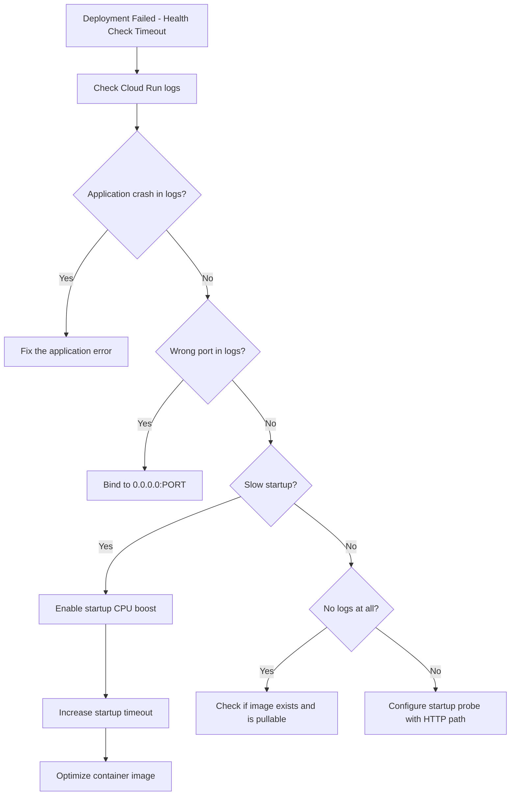

# How to Resolve Cloud Run Deployment Failures Due to Container Health Check Timeouts

Author: [nawazdhandala](https://www.github.com/nawazdhandala)

Tags: GCP, Cloud Run, Health Checks, Containers, Deployment

Description: Fix Cloud Run deployment failures caused by container health check timeouts by configuring startup probes, adjusting timeout settings, and optimizing container startup time.

---

You push a new revision to Cloud Run and the deployment fails with a message about the container not starting in time. Cloud Run expected your container to start listening on a port within a time window, and it did not happen. Traffic stays on the old revision, and your deployment is stuck.

This is one of the trickiest Cloud Run issues because the container might work perfectly on your local machine but fail the health check in Cloud Run's environment.

## The Error Messages

Cloud Run health check failures show up in a few different ways:

```
ERROR: Revision 'my-service-00002-abc' is not ready and cannot serve traffic.
The user-provided container failed to start and listen on the port defined
provided by the PORT environment variable. Logs for this revision might contain
more information.
```

Or:

```
Container failed to start. Failed to start and then listen on the port defined
by the PORT environment variable when it is set, or on port 8080.
```

Or for newer deployments with startup probes:

```
Startup probe failed: container did not respond to health check request within the configured time limit.
```

## Understanding Cloud Run's Health Check

Cloud Run performs a startup check on every new revision. It sends a TCP connection attempt to the port your container should be listening on (default 8080, or whatever `PORT` is set to). If the container does not accept a connection within the timeout, the deployment fails.

The default startup timeout is 240 seconds (4 minutes). If your application takes longer than that to start, it will fail.

## Step 1: Check the Logs

The first thing to do is check what actually happened during container startup:

```bash
# View logs for the failed revision
gcloud logging read \
    'resource.type="cloud_run_revision" AND resource.labels.revision_name="my-service-00002-abc"' \
    --project=my-project \
    --limit=50 \
    --format="table(timestamp, textPayload)"

# Or use gcloud run
gcloud run revisions logs my-service-00002-abc \
    --project=my-project \
    --region=us-central1 \
    --limit=50
```

Common things you will find in the logs:
- Application crash on startup (unhandled exception, missing dependency)
- Database connection timeout during startup
- Listening on the wrong port
- Application starts but on `localhost` instead of `0.0.0.0`

## Step 2: Fix the Port Configuration

Cloud Run sets the `PORT` environment variable and expects your container to listen on that port. Your application must bind to `0.0.0.0:$PORT`, not `localhost:$PORT` or a hardcoded port number.

Here is a Node.js example of doing it correctly:

```javascript
// Correct: Listen on the PORT environment variable and bind to 0.0.0.0
const port = process.env.PORT || 8080;
app.listen(port, '0.0.0.0', () => {
    console.log(`Server listening on port ${port}`);
});
```

A Python Flask example:

```python
# Correct: Use the PORT environment variable
import os
port = int(os.environ.get('PORT', 8080))
app.run(host='0.0.0.0', port=port)
```

A Go example:

```go
// Correct: Read PORT from environment and listen on all interfaces
port := os.Getenv("PORT")
if port == "" {
    port = "8080"
}
log.Fatal(http.ListenAndServe(":"+port, handler))
```

If you want to use a different container port, configure it in Cloud Run:

```bash
# Set a custom container port
gcloud run services update my-service \
    --region=us-central1 \
    --port=3000
```

## Step 3: Increase the Startup Timeout

If your application legitimately takes a long time to start (loading ML models, warming caches, running migrations), increase the startup timeout:

```bash
# Increase the startup timeout to 600 seconds (10 minutes)
gcloud run deploy my-service \
    --image=us-docker.pkg.dev/my-project/my-repo/my-app:latest \
    --region=us-central1 \
    --startup-cpu-boost \
    --timeout=600
```

You can also configure a startup probe with custom settings:

```yaml
# Cloud Run service YAML with startup probe
apiVersion: serving.knative.dev/v1
kind: Service
metadata:
  name: my-service
spec:
  template:
    spec:
      containers:
      - image: us-docker.pkg.dev/my-project/my-repo/my-app:latest
        ports:
        - containerPort: 8080
        startupProbe:
          httpGet:
            path: /health
            port: 8080
          initialDelaySeconds: 10
          periodSeconds: 10
          failureThreshold: 30    # 30 x 10s = 5 minutes to start
          timeoutSeconds: 5
```

Apply the YAML:

```bash
# Deploy with the custom configuration
gcloud run services replace service.yaml --region=us-central1
```

## Step 4: Use Startup CPU Boost

Cloud Run allocates CPU only during request processing by default. During startup (before any requests), CPU might be throttled, making your application start slowly. Enable startup CPU boost to get full CPU during container initialization:

```bash
# Enable startup CPU boost
gcloud run deploy my-service \
    --image=us-docker.pkg.dev/my-project/my-repo/my-app:latest \
    --region=us-central1 \
    --startup-cpu-boost
```

This can significantly reduce startup time for CPU-intensive initialization like loading ML models or compiling JIT code.

## Step 5: Optimize Container Startup

Instead of just increasing timeouts, optimize your container to start faster:

### Use a Smaller Base Image

```dockerfile
# Bad: Full Ubuntu image (200MB+)
FROM ubuntu:22.04

# Good: Slim image (50MB)
FROM python:3.11-slim

# Better: Distroless image (minimal)
FROM gcr.io/distroless/python3
```

### Defer Heavy Initialization

```python
# Instead of loading everything at startup, defer non-critical initialization
import threading

app = Flask(__name__)

# Load the ML model in the background after the server starts
model = None

def load_model():
    global model
    model = load_heavy_model()

# Start model loading in a background thread
threading.Thread(target=load_model).start()

@app.route('/health')
def health():
    # Return 200 even before model is loaded
    # This passes the health check
    return 'ok', 200

@app.route('/predict')
def predict():
    if model is None:
        return 'Model loading', 503
    return model.predict(request.json)
```

### Pre-build Dependencies

```dockerfile
# Install dependencies in a separate layer so they are cached
COPY requirements.txt .
RUN pip install --no-cache-dir -r requirements.txt

# Then copy application code
COPY . .
```

## Step 6: Test Locally with the Same Constraints

Reproduce the Cloud Run environment locally:

```bash
# Build and run the container with the PORT variable
docker build -t my-app .
docker run -p 8080:8080 -e PORT=8080 my-app

# Test if the container responds to health checks
curl http://localhost:8080/health
```

## Debugging Flowchart



The most common fix is making sure your application binds to `0.0.0.0` on the `PORT` environment variable. The second most common is enabling startup CPU boost. Start with those and work your way through the list.
