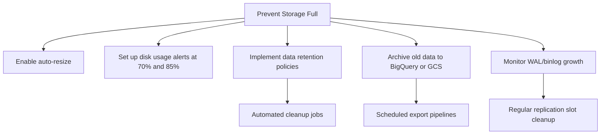

# How to Resolve Cloud SQL Instance Storage Full and Automatic Storage Increase Failures

Author: [nawazdhandala](https://www.github.com/nawazdhandala)

Tags: GCP, Cloud SQL, Storage, Database, Disk Space, Troubleshooting

Description: How to handle Cloud SQL storage full situations and fix automatic storage increase failures, including emergency actions and long-term storage management.

---

A full disk on your Cloud SQL instance is one of those emergencies that can take your entire application down. Writes fail, transactions abort, and if automatic storage increase is not working, you have a ticking time bomb. Let me walk through how to handle this immediately and how to prevent it from happening again.

## Recognizing the Problem

You will see errors like these in your application:

For MySQL:
```
ERROR 1114 (HY000): The table 'my_table' is full
ERROR 3 (HY000): Error writing file '/tmp/...' (Errcode: 28 - No space left on device)
```

For PostgreSQL:
```
ERROR: could not extend file "base/16384/123456": No space left on device
PANIC: could not write to file "pg_wal/...": No space left on device
```

## Step 1: Check Current Storage Status

```bash
# Check instance storage usage
gcloud sql instances describe my-instance \
    --project=my-project \
    --format="table(settings.dataDiskSizeGb, settings.dataDiskType, settings.storageAutoResize, settings.storageAutoResizeLimit)"
```

Also check from Cloud Monitoring:

```bash
# Get current disk usage percentage
gcloud monitoring time-series list \
    --filter='resource.type="cloudsql_database" AND resource.labels.database_id="my-project:my-instance" AND metric.type="cloudsql.googleapis.com/database/disk/utilization"' \
    --interval-start-time=$(date -u -v-1H +%Y-%m-%dT%H:%M:%SZ) \
    --format="table(points.value.doubleValue)"
```

## Step 2: Why Automatic Storage Increase Failed

Cloud SQL has an automatic storage increase feature, but it can fail for several reasons:

1. **Storage auto-resize is disabled** - it is not on by default for all instances
2. **Auto-resize limit reached** - you may have set a maximum limit that has been hit
3. **Storage increase too slow** - the disk was filling faster than the automatic increase could keep up
4. **Maximum storage size reached** - Cloud SQL has a maximum disk size (currently 64 TB)
5. **Billing issues** - if billing is suspended, storage increases will fail

```bash
# Check if auto-resize is enabled and what the limit is
gcloud sql instances describe my-instance \
    --format="json(settings.storageAutoResize, settings.storageAutoResizeLimit)"
```

If `storageAutoResize` is `false`, enable it:

```bash
# Enable automatic storage increase
gcloud sql instances patch my-instance \
    --storage-auto-increase \
    --project=my-project
```

If there is a limit that was reached, increase or remove it:

```bash
# Remove the auto-resize limit (allow unlimited growth)
gcloud sql instances patch my-instance \
    --storage-auto-increase \
    --storage-auto-increase-limit=0 \
    --project=my-project

# Or set a higher limit (in GB)
gcloud sql instances patch my-instance \
    --storage-auto-increase \
    --storage-auto-increase-limit=500 \
    --project=my-project
```

## Step 3: Emergency - Manually Increase Storage

If you need space right now, manually increase the disk size:

```bash
# Increase storage size immediately (this does NOT cause downtime)
gcloud sql instances patch my-instance \
    --storage-size=200GB \
    --project=my-project
```

Important: Cloud SQL storage increases are permanent. You cannot shrink the disk later. So increase by a reasonable amount, not the maximum.

## Step 4: Find What Is Consuming All the Storage

Once you have breathing room, figure out what filled up the disk.

### For MySQL

```sql
-- Check table sizes in each database
SELECT
  table_schema AS database_name,
  ROUND(SUM(data_length + index_length) / (1024 * 1024 * 1024), 2) AS size_gb,
  COUNT(*) AS table_count
FROM information_schema.tables
WHERE table_schema NOT IN ('mysql', 'information_schema', 'performance_schema', 'sys')
GROUP BY table_schema
ORDER BY size_gb DESC;

-- Find the largest individual tables
SELECT
  table_schema,
  table_name,
  ROUND((data_length + index_length) / (1024 * 1024 * 1024), 2) AS size_gb,
  table_rows AS approximate_rows
FROM information_schema.tables
WHERE table_schema NOT IN ('mysql', 'information_schema', 'performance_schema', 'sys')
ORDER BY (data_length + index_length) DESC
LIMIT 20;
```

### For PostgreSQL

```sql
-- Check database sizes
SELECT
  datname AS database_name,
  pg_size_pretty(pg_database_size(datname)) AS size
FROM pg_database
WHERE datistemplate = false
ORDER BY pg_database_size(datname) DESC;

-- Find the largest tables
SELECT
  schemaname,
  tablename,
  pg_size_pretty(pg_total_relation_size(schemaname || '.' || tablename)) AS total_size,
  pg_size_pretty(pg_relation_size(schemaname || '.' || tablename)) AS table_size,
  pg_size_pretty(pg_indexes_size(schemaname || '.' || tablename::regclass)) AS index_size
FROM pg_tables
WHERE schemaname NOT IN ('pg_catalog', 'information_schema')
ORDER BY pg_total_relation_size(schemaname || '.' || tablename) DESC
LIMIT 20;
```

## Step 5: Reclaim Space

### Delete Unnecessary Data

```sql
-- MySQL: Delete old log entries
DELETE FROM application_logs WHERE created_at < DATE_SUB(NOW(), INTERVAL 90 DAY);

-- Optimize tables to reclaim space after large deletes
OPTIMIZE TABLE application_logs;
```

```sql
-- PostgreSQL: Delete old data
DELETE FROM application_logs WHERE created_at < NOW() - INTERVAL '90 days';

-- Run VACUUM FULL to reclaim disk space (this locks the table)
VACUUM FULL application_logs;

-- Or use regular VACUUM for less locking but slower space recovery
VACUUM VERBOSE application_logs;
```

### Check for Temporary Files and WAL Accumulation

For PostgreSQL, WAL files can consume significant space:

```sql
-- Check WAL directory size (PostgreSQL)
SELECT pg_size_pretty(sum(size)) AS wal_size
FROM pg_ls_waldir();

-- Check for replication slots that might be preventing WAL cleanup
SELECT
  slot_name,
  slot_type,
  active,
  pg_size_pretty(pg_wal_lsn_diff(pg_current_wal_lsn(), restart_lsn)) AS retained_wal
FROM pg_replication_slots;
```

Inactive replication slots are a common cause of WAL buildup. Drop any that are no longer needed:

```sql
-- Drop an inactive replication slot
SELECT pg_drop_replication_slot('unused_slot_name');
```

### Clean Up Binary Logs (MySQL)

```sql
-- Check binary log usage
SHOW BINARY LOGS;

-- Purge old binary logs (be careful with replication)
PURGE BINARY LOGS BEFORE DATE_SUB(NOW(), INTERVAL 7 DAY);
```

## Step 6: Set Up Proper Monitoring

```bash
# Create an alert for disk usage above 80%
gcloud alpha monitoring policies create \
    --display-name="Cloud SQL Disk Usage High" \
    --condition-display-name="Disk usage > 80%" \
    --condition-filter='resource.type="cloudsql_database" AND metric.type="cloudsql.googleapis.com/database/disk/utilization"' \
    --condition-threshold-value=0.8 \
    --condition-threshold-comparison=COMPARISON_GT \
    --duration="300s" \
    --notification-channels=projects/my-project/notificationChannels/12345
```

## Long-Term Storage Strategy



The key lesson: always enable automatic storage increase on production Cloud SQL instances, set up alerts at 70% and 85% disk usage, and have a data retention policy that automatically removes or archives old data. Prevention is far easier than dealing with a full disk emergency.
