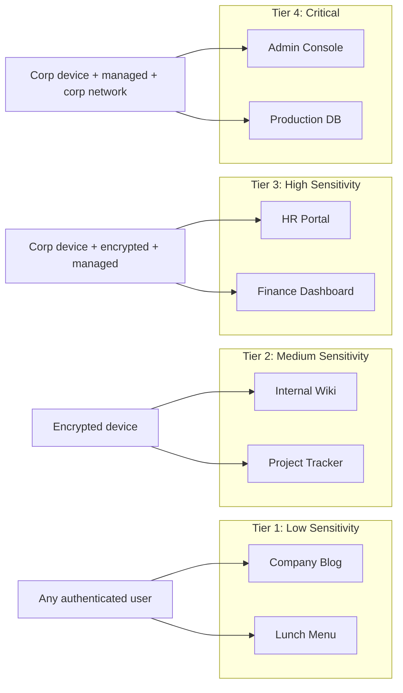

# How to Restrict Application Access by Device Security Posture with BeyondCorp

Author: [nawazdhandala](https://www.github.com/nawazdhandala)

Tags: GCP, BeyondCorp, Device Security, Zero Trust, Endpoint Verification

Description: Learn how to restrict access to GCP applications based on device security posture using BeyondCorp Enterprise, including encryption, OS version, and management status checks.

---

Verifying a user's identity is only half the battle. A legitimate user on a compromised or unpatched device is still a security risk. BeyondCorp Enterprise lets you evaluate the security posture of the connecting device and deny access if the device does not meet your requirements. This is device-based access control, and it is a key piece of any zero trust strategy.

This guide shows you how to define device security requirements, create policies that enforce them, and handle edge cases like BYOD and unmanaged devices.

## Device Signals Available for Policy Decisions

BeyondCorp Enterprise, through Endpoint Verification, collects these device security signals:

- **Disk encryption**: Is the device's disk encrypted (FileVault, BitLocker, dm-crypt)?
- **Screen lock**: Is the device configured to lock after inactivity?
- **OS version**: What operating system and version is the device running?
- **OS firewall**: Is the built-in firewall enabled?
- **Device ownership**: Is this a company-owned or personal device?
- **Management level**: Is the device managed by an MDM solution?
- **Password compliance**: Does the device meet password policy requirements?
- **Jailbreak/root status**: Has the device been tampered with?

Each of these can be used as a condition in your access policies.

## Prerequisites

- BeyondCorp Enterprise enabled on your organization
- Endpoint Verification deployed to your device fleet
- Access Context Manager configured with an access policy
- IAP-protected applications to apply policies to

## Creating Device Posture Policies

Let us build up from basic to advanced device posture requirements.

### Basic: Require Disk Encryption

The minimum security requirement for most organizations.

```yaml
# encryption-required-spec.yaml
# Blocks access from devices without full disk encryption
- devicePolicy:
    allowedEncryptionStatuses:
      - ENCRYPTED
```

```bash
# Create the access level
gcloud access-context-manager levels create disk-encrypted \
  --title="Disk Encryption Required" \
  --basic-level-spec=encryption-required-spec.yaml \
  --policy=POLICY_NUMBER
```

### Intermediate: Require Encryption and Screen Lock

Add screen lock to prevent unauthorized physical access.

```yaml
# secured-device-spec.yaml
# Requires both encryption and automatic screen lock
- devicePolicy:
    requireScreenlock: true
    allowedEncryptionStatuses:
      - ENCRYPTED
```

```bash
gcloud access-context-manager levels create secured-device \
  --title="Secured Device" \
  --basic-level-spec=secured-device-spec.yaml \
  --policy=POLICY_NUMBER
```

### Advanced: Full Posture Check

For sensitive applications, enforce comprehensive device security.

```yaml
# full-posture-spec.yaml
# Comprehensive device security check for high-sensitivity applications
- devicePolicy:
    requireScreenlock: true
    requireCorpOwned: true
    allowedEncryptionStatuses:
      - ENCRYPTED
    allowedDeviceManagementLevels:
      - ADVANCED
    osConstraints:
      - osType: DESKTOP_MAC
        minimumVersion: "14.0.0"
        requireVerifiedChromeOs: false
      - osType: DESKTOP_WINDOWS
        minimumVersion: "10.0.22631"
        requireVerifiedChromeOs: false
      - osType: DESKTOP_CHROME_OS
        requireVerifiedChromeOs: true
```

```bash
gcloud access-context-manager levels create full-posture \
  --title="Full Device Posture Check" \
  --basic-level-spec=full-posture-spec.yaml \
  --policy=POLICY_NUMBER
```

## Applying Posture Policies to Applications

Bind device posture access levels to your IAP-protected resources.

```bash
# Protect a sensitive internal tool with the full posture check
gcloud iap web add-iam-policy-binding \
  --resource-type=backend-services \
  --service=hr-portal \
  --member="group:hr-team@example.com" \
  --role="roles/iap.httpsResourceAccessor" \
  --condition="expression=\"accessPolicies/POLICY_NUMBER/accessLevels/full-posture\" in request.auth.access_levels,title=Full Device Posture Required" \
  --project=my-project-id
```

For less sensitive applications, use a lighter posture check.

```bash
# Internal wiki only needs basic encryption
gcloud iap web add-iam-policy-binding \
  --resource-type=backend-services \
  --service=internal-wiki \
  --member="group:all-staff@example.com" \
  --role="roles/iap.httpsResourceAccessor" \
  --condition="expression=\"accessPolicies/POLICY_NUMBER/accessLevels/disk-encrypted\" in request.auth.access_levels,title=Encryption Required" \
  --project=my-project-id
```

## Tiered Access Based on Device Posture

A practical approach is to tier your applications and assign device requirements accordingly.



## Handling BYOD Scenarios

Not every organization can require company-owned devices. Here is how to handle BYOD while maintaining security.

Create separate access levels for BYOD and corporate devices.

```yaml
# byod-acceptable-spec.yaml
# BYOD devices need encryption and screen lock at minimum
- devicePolicy:
    requireScreenlock: true
    allowedEncryptionStatuses:
      - ENCRYPTED
    requireCorpOwned: false
```

```yaml
# corp-device-spec.yaml
# Corporate devices have stricter requirements
- devicePolicy:
    requireScreenlock: true
    requireCorpOwned: true
    allowedEncryptionStatuses:
      - ENCRYPTED
    allowedDeviceManagementLevels:
      - ADVANCED
```

Then create IAP bindings that give BYOD users access to some resources and corporate device users access to more.

```bash
# BYOD users can access general internal tools
gcloud iap web add-iam-policy-binding \
  --resource-type=backend-services \
  --service=general-tools \
  --member="group:all-staff@example.com" \
  --role="roles/iap.httpsResourceAccessor" \
  --condition="expression=\"accessPolicies/POLICY_NUMBER/accessLevels/byod-acceptable\" in request.auth.access_levels,title=BYOD Acceptable" \
  --project=my-project-id

# Only corporate device users can access sensitive tools
gcloud iap web add-iam-policy-binding \
  --resource-type=backend-services \
  --service=sensitive-tools \
  --member="group:all-staff@example.com" \
  --role="roles/iap.httpsResourceAccessor" \
  --condition="expression=\"accessPolicies/POLICY_NUMBER/accessLevels/corp-device\" in request.auth.access_levels,title=Corp Device Required" \
  --project=my-project-id
```

## Enforcing OS Version Minimums

Outdated operating systems are a common attack vector. Force users to keep their OS updated.

```yaml
# current-os-spec.yaml
# Require recent OS versions across all platforms
- devicePolicy:
    osConstraints:
      - osType: DESKTOP_MAC
        minimumVersion: "14.0.0"
      - osType: DESKTOP_WINDOWS
        minimumVersion: "10.0.22631"
      - osType: DESKTOP_CHROME_OS
      - osType: DESKTOP_LINUX
        minimumVersion: "6.1.0"
```

When users are blocked due to an outdated OS, they see a 403 error. You should provide clear communication about the requirement through your IT help desk or a custom error page.

## Monitoring Device Compliance

Track how many devices in your organization meet each posture level.

```bash
# List all devices and their compliance status
gcloud endpoint-verification list \
  --project=my-project-id \
  --format="table(deviceName,userEmail,osType,osVersion,encryptionStatus,screenLockEnabled)"

# Filter for non-compliant devices
gcloud endpoint-verification list \
  --project=my-project-id \
  --filter="encryptionStatus!=ENCRYPTED OR screenLockEnabled=false" \
  --format="table(deviceName,userEmail,encryptionStatus,screenLockEnabled)"
```

Set up alerts for compliance trends.

```bash
# Create a dashboard to track device compliance over time
gcloud monitoring dashboards create \
  --config-from-file=device-compliance-dashboard.json \
  --project=my-project-id
```

## Handling Access Denied Scenarios

When a user is denied access due to device posture, provide a helpful experience.

1. Set up a custom 403 page that explains why access was denied and how to fix it
2. Link to your IT documentation for enabling encryption, screen lock, etc.
3. Provide a self-service portal where users can check their device compliance
4. Set up a help desk workflow for exceptions

You can customize the IAP error page.

```bash
# Set a custom error page URL for IAP
gcloud iap settings set \
  --resource-type=backend-services \
  --service=my-app \
  --access-denied-page-uri="https://help.example.com/access-denied" \
  --project=my-project-id
```

## Gradual Rollout Strategy

Do not enforce device posture for everyone at once. Roll it out gradually.

1. Start in monitor-only mode - log which requests would be blocked without actually blocking them
2. Communicate requirements to users and give them time to comply
3. Enforce for a pilot group first
4. Roll out to the broader organization
5. Tighten requirements over time

## Summary

Device security posture enforcement is what separates basic identity checks from true zero trust. BeyondCorp Enterprise gives you the tools to check encryption status, screen lock, OS version, device ownership, and management level before granting access. Start with basic encryption requirements and build up to comprehensive posture checks as your organization matures. Use tiered access to match device requirements to application sensitivity, and handle BYOD with separate, less strict access levels.
