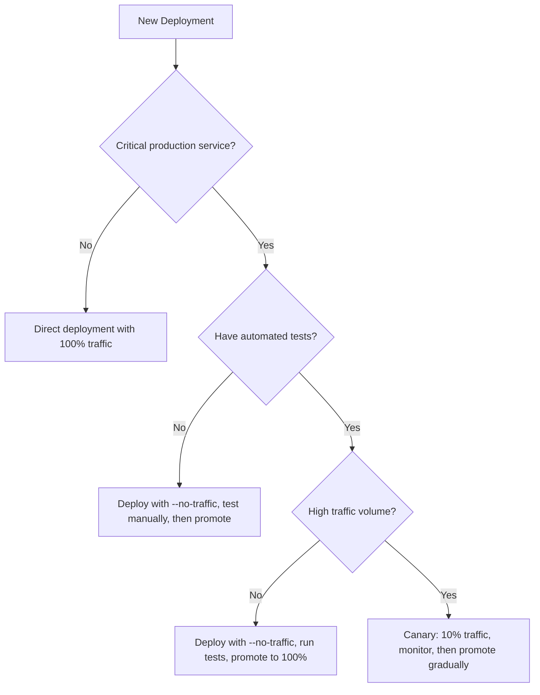

# How to Roll Back a Failed Cloud Run Deployment to a Previous Stable Revision

Author: [nawazdhandala](https://www.github.com/nawazdhandala)

Tags: GCP, Cloud Run, Deployment, Rollback, Revision Management

Description: Learn how to quickly roll back a failed Cloud Run deployment to a previous stable revision using gcloud CLI and traffic splitting strategies.

---

You just deployed a new version of your Cloud Run service and something is wrong. Requests are failing, latency is spiking, or the container is crash-looping. You need to get back to the previous working version as fast as possible. Cloud Run makes this straightforward because every deployment creates an immutable revision, and you can switch traffic between revisions instantly.

This post covers the mechanics of rolling back, strategies for safer deployments, and how to set up your workflow so rollbacks are always one command away.

## Understanding Cloud Run Revisions

Every time you deploy to Cloud Run - whether by updating the container image, changing environment variables, or modifying resource limits - Cloud Run creates a new revision. Revisions are immutable snapshots of your service configuration. They are named automatically with a format like `my-service-00042-abc`.

```bash
# List all revisions for a service
gcloud run revisions list \
    --service=my-service \
    --region=us-central1 \
    --format="table(REVISION, ACTIVE, SERVICE_URL)"
```

By default, when you deploy a new revision, Cloud Run routes 100% of traffic to it immediately. The old revisions still exist but receive no traffic.

## Quick Rollback - Route Traffic to the Previous Revision

The fastest way to roll back is to redirect all traffic to the previous revision.

```bash
# First, find the previous revision name
gcloud run revisions list \
    --service=my-service \
    --region=us-central1 \
    --sort-by="~creationTimestamp" \
    --limit=5 \
    --format="table(REVISION, ACTIVE, DEPLOYED)"
```

The output will show your revisions in order. The second one in the list is typically your previous stable revision.

```bash
# Route 100% of traffic to the previous revision
gcloud run services update-traffic my-service \
    --to-revisions=my-service-00041-xyz=100 \
    --region=us-central1
```

This takes effect in seconds. No new containers need to start - the previous revision's containers are still running (or will be started from the existing image). Your users are back to the working version while you investigate what went wrong.

## Rollback Using Tags

A cleaner approach is to use Cloud Run revision tags. Tags let you give meaningful names to revisions before routing traffic.

```bash
# Tag the current production revision before deploying
gcloud run services update-traffic my-service \
    --set-tags=stable=my-service-00041-xyz \
    --region=us-central1

# After tagging, you can access it at a dedicated URL
# https://stable---my-service-xxxxx.run.app
```

When a deployment fails, roll back to the tagged revision.

```bash
# Roll back by routing traffic to the stable-tagged revision
gcloud run services update-traffic my-service \
    --to-tags=stable=100 \
    --region=us-central1
```

## Gradual Rollouts for Safer Deployments

The best way to handle rollbacks is to avoid needing them by deploying gradually. Instead of sending 100% of traffic to a new revision immediately, you can route a small percentage first and increase it as confidence grows.

```bash
# Deploy without routing traffic (the --no-traffic flag)
gcloud run deploy my-service \
    --image=gcr.io/my-project/my-service:v2 \
    --no-traffic \
    --region=us-central1
```

This creates the new revision but sends zero traffic to it. You can test it using the revision URL.

```bash
# Tag the new revision so you can test it directly
gcloud run services update-traffic my-service \
    --set-tags=canary=LATEST \
    --region=us-central1

# Test the new revision directly
curl https://canary---my-service-xxxxx.run.app/health
```

Once you are satisfied, start routing traffic gradually.

```bash
# Send 10% of traffic to the new revision
gcloud run services update-traffic my-service \
    --to-revisions=LATEST=10 \
    --region=us-central1

# If metrics look good, increase to 50%
gcloud run services update-traffic my-service \
    --to-revisions=LATEST=50 \
    --region=us-central1

# Finally, promote to 100%
gcloud run services update-traffic my-service \
    --to-revisions=LATEST=100 \
    --region=us-central1
```

If something goes wrong at any point, route traffic back to the stable revision.

```bash
# Instant rollback - send all traffic to the previous revision
gcloud run services update-traffic my-service \
    --to-revisions=my-service-00041-xyz=100 \
    --region=us-central1
```

## Automating Rollbacks with Health Checks

You can automate the rollback process by monitoring error rates after deployment and automatically rolling back if things go wrong.

Here is a shell script that deploys, monitors, and rolls back if necessary.

```bash
#!/bin/bash
# deploy-with-rollback.sh
# Deploys a new revision, monitors error rate, rolls back if needed

SERVICE="my-service"
REGION="us-central1"
NEW_IMAGE="$1"
ERROR_THRESHOLD=5  # Percentage of 5xx errors that triggers rollback

# Get the current stable revision before deploying
STABLE_REVISION=$(gcloud run revisions list \
    --service=$SERVICE \
    --region=$REGION \
    --sort-by="~creationTimestamp" \
    --limit=1 \
    --format="value(REVISION)")

echo "Current stable revision: $STABLE_REVISION"

# Deploy with 10% canary traffic
gcloud run deploy $SERVICE \
    --image=$NEW_IMAGE \
    --region=$REGION \
    --no-traffic

gcloud run services update-traffic $SERVICE \
    --to-revisions=LATEST=10 \
    --region=$REGION

echo "Canary deployed with 10% traffic. Monitoring for 5 minutes..."
sleep 300

# Check error rate (simplified - use Cloud Monitoring API for production)
ERROR_RATE=$(gcloud logging read \
    "resource.type=\"cloud_run_revision\" AND resource.labels.service_name=\"$SERVICE\" AND httpRequest.status>=500" \
    --project=my-project \
    --freshness=5m \
    --format="value(httpRequest.status)" | wc -l)

if [ "$ERROR_RATE" -gt "$ERROR_THRESHOLD" ]; then
    echo "Error rate too high ($ERROR_RATE errors). Rolling back..."
    gcloud run services update-traffic $SERVICE \
        --to-revisions=$STABLE_REVISION=100 \
        --region=$REGION
    echo "Rolled back to $STABLE_REVISION"
    exit 1
fi

echo "Canary looks healthy. Promoting to 100%."
gcloud run services update-traffic $SERVICE \
    --to-revisions=LATEST=100 \
    --region=$REGION
```

## Rollback in CI/CD Pipelines

If you are using Cloud Build, integrate rollback capability into your pipeline.

```yaml
# cloudbuild.yaml with rollback support
steps:
  # Build the container image
  - name: 'gcr.io/cloud-builders/docker'
    args: ['build', '-t', 'gcr.io/$PROJECT_ID/my-service:$SHORT_SHA', '.']

  # Push the image to Container Registry
  - name: 'gcr.io/cloud-builders/docker'
    args: ['push', 'gcr.io/$PROJECT_ID/my-service:$SHORT_SHA']

  # Deploy without traffic
  - name: 'gcr.io/google.com/cloudsdktool/cloud-sdk'
    args:
      - 'gcloud'
      - 'run'
      - 'deploy'
      - 'my-service'
      - '--image=gcr.io/$PROJECT_ID/my-service:$SHORT_SHA'
      - '--no-traffic'
      - '--region=us-central1'

  # Run smoke tests against the new revision
  - name: 'gcr.io/cloud-builders/curl'
    entrypoint: 'sh'
    args:
      - '-c'
      - 'curl -f https://canary---my-service-xxxxx.run.app/health || exit 1'

  # If tests pass, route traffic to the new revision
  - name: 'gcr.io/google.com/cloudsdktool/cloud-sdk'
    args:
      - 'gcloud'
      - 'run'
      - 'services'
      - 'update-traffic'
      - 'my-service'
      - '--to-revisions=LATEST=100'
      - '--region=us-central1'
```

## Cleaning Up Old Revisions

Over time, you will accumulate many revisions. While they do not cost anything when not serving traffic, it is good practice to clean up.

```bash
# List revisions and delete old ones (keep the last 5)
gcloud run revisions list \
    --service=my-service \
    --region=us-central1 \
    --sort-by="~creationTimestamp" \
    --format="value(REVISION)" | tail -n +6 | while read revision; do
    echo "Deleting $revision"
    gcloud run revisions delete "$revision" --region=us-central1 --quiet
done
```

## Deployment Strategy Decision Flow

Here is how I decide which deployment strategy to use.



## Summary

Cloud Run revisions make rollbacks nearly instant. The key practices are: always know your current stable revision before deploying, use the `--no-traffic` flag for safer deployments, consider gradual traffic shifting for critical services, and automate rollback checks in your CI/CD pipeline. A rollback should take seconds, not minutes - and with Cloud Run, it can.
