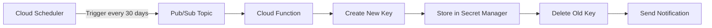

# How to Rotate Service Account Keys Automatically in GCP

Author: [nawazdhandala](https://www.github.com/nawazdhandala)

Tags: GCP, Service Account, Key Rotation, Security, Automation

Description: A practical guide to automating the rotation of GCP service account keys using Cloud Functions and Cloud Scheduler, reducing the risk of compromised credentials.

---

Service account keys are one of the biggest security liabilities in GCP. They are long-lived credentials that never expire on their own, and if one gets leaked into a Git repository, a Docker image, or a Slack message, an attacker can use it until someone manually revokes it. Google strongly recommends avoiding user-managed keys entirely and using workload identity or impersonation instead. But the reality is that some integrations - third-party tools, on-premises systems, legacy applications - still require a key file.

If you are stuck with service account keys, the next best thing you can do is rotate them frequently and automatically. This post walks through building an automated key rotation pipeline using Cloud Scheduler, Pub/Sub, and Cloud Functions.

## The Rotation Strategy

The approach is straightforward:

1. A Cloud Scheduler job fires on a schedule (every 30 days, for example)
2. It publishes a message to a Pub/Sub topic
3. A Cloud Function listens on that topic and performs the rotation
4. The function creates a new key, stores it in Secret Manager, deletes the old key, and notifies the team

The reason we create the new key before deleting the old one is to avoid downtime. There is a brief window where both keys are valid, and the consuming application can switch over seamlessly.



## Prerequisites

You need the following set up before building this pipeline:

- A GCP project with billing enabled
- The Cloud Functions, Cloud Scheduler, Pub/Sub, and Secret Manager APIs enabled
- A service account whose keys you want to rotate
- A separate service account for the rotation function with appropriate permissions

Enable the required APIs:

```bash
# Enable all required APIs
gcloud services enable \
  cloudfunctions.googleapis.com \
  cloudscheduler.googleapis.com \
  pubsub.googleapis.com \
  secretmanager.googleapis.com \
  iam.googleapis.com \
  --project=my-project-id
```

## Step 1 - Create the Pub/Sub Topic

Create a topic that will receive rotation trigger messages:

```bash
# Create the Pub/Sub topic for rotation triggers
gcloud pubsub topics create sa-key-rotation-trigger \
  --project=my-project-id
```

## Step 2 - Create the Rotation Service Account

The Cloud Function needs its own service account with permissions to manage keys and secrets:

```bash
# Create a service account for the rotation function
gcloud iam service-accounts create key-rotator \
  --display-name="Key Rotation Function SA" \
  --project=my-project-id

# Grant it permission to manage keys on the target service account
gcloud iam service-accounts add-iam-policy-binding \
  target-sa@my-project-id.iam.gserviceaccount.com \
  --member="serviceAccount:key-rotator@my-project-id.iam.gserviceaccount.com" \
  --role="roles/iam.serviceAccountKeyAdmin"

# Grant it permission to create and update secrets
gcloud projects add-iam-policy-binding my-project-id \
  --member="serviceAccount:key-rotator@my-project-id.iam.gserviceaccount.com" \
  --role="roles/secretmanager.admin"
```

## Step 3 - Write the Cloud Function

Here is the Cloud Function code that performs the rotation. Create a directory for the function:

```python
# main.py - Cloud Function for automatic service account key rotation
import base64
import json
import os
from google.cloud import iam_admin_v1
from google.cloud import secretmanager
from google.protobuf import field_mask_pb2
import functions_framework

# Configuration - set these as environment variables
TARGET_SA_EMAIL = os.environ.get("TARGET_SA_EMAIL")
SECRET_ID = os.environ.get("SECRET_ID", "sa-key-secret")
PROJECT_ID = os.environ.get("GCP_PROJECT")

@functions_framework.cloud_event
def rotate_key(cloud_event):
    """Main rotation function triggered by Pub/Sub message."""

    # Step 1: Create a new key for the target service account
    iam_client = iam_admin_v1.IAMClient()
    sa_name = f"projects/-/serviceAccounts/{TARGET_SA_EMAIL}"

    # Create the new key
    new_key = iam_client.create_service_account_key(
        request={
            "name": sa_name,
            "private_key_type": iam_admin_v1.ServiceAccountPrivateKeyType.TYPE_GOOGLE_CREDENTIALS_FILE,
        }
    )
    print(f"Created new key: {new_key.name}")

    # Step 2: Store the new key in Secret Manager
    secret_client = secretmanager.SecretManagerServiceClient()
    secret_path = f"projects/{PROJECT_ID}/secrets/{SECRET_ID}"

    # Add the new key as a new secret version
    secret_client.add_secret_version(
        request={
            "parent": secret_path,
            "payload": {
                "data": new_key.private_key_data,
            },
        }
    )
    print(f"Stored new key in Secret Manager: {SECRET_ID}")

    # Step 3: List all keys and delete the old ones
    keys = iam_client.list_service_account_keys(
        request={
            "name": sa_name,
            "key_types": [
                iam_admin_v1.ListServiceAccountKeysRequest.KeyType.USER_MANAGED
            ],
        }
    )

    new_key_id = new_key.name.split("/")[-1]
    for key in keys.keys:
        key_id = key.name.split("/")[-1]
        # Delete all keys except the newly created one
        if key_id != new_key_id:
            iam_client.delete_service_account_key(request={"name": key.name})
            print(f"Deleted old key: {key.name}")

    print("Key rotation completed successfully")
    return "OK"
```

Create the requirements file:

```
# requirements.txt
functions-framework==3.*
google-cloud-iam==2.*
google-cloud-secret-manager==2.*
```

## Step 4 - Create the Secret in Secret Manager

Before deploying the function, create the secret that will hold the key:

```bash
# Create the secret (the actual value will be added by the function)
gcloud secrets create sa-key-secret \
  --replication-policy="automatic" \
  --project=my-project-id
```

## Step 5 - Deploy the Cloud Function

Deploy the function with the rotation service account:

```bash
# Deploy the Cloud Function
gcloud functions deploy rotate-sa-key \
  --gen2 \
  --runtime=python311 \
  --region=us-central1 \
  --source=./rotation-function/ \
  --entry-point=rotate_key \
  --trigger-topic=sa-key-rotation-trigger \
  --service-account=key-rotator@my-project-id.iam.gserviceaccount.com \
  --set-env-vars="TARGET_SA_EMAIL=target-sa@my-project-id.iam.gserviceaccount.com,SECRET_ID=sa-key-secret,GCP_PROJECT=my-project-id" \
  --project=my-project-id
```

## Step 6 - Create the Cloud Scheduler Job

Set up a scheduler job that triggers rotation every 30 days:

```bash
# Create a scheduler job that fires every 30 days
gcloud scheduler jobs create pubsub rotate-sa-key-job \
  --schedule="0 2 1 * *" \
  --topic=sa-key-rotation-trigger \
  --message-body='{"action": "rotate"}' \
  --location=us-central1 \
  --project=my-project-id
```

The cron expression `0 2 1 * *` means "at 2:00 AM on the first day of every month."

## Step 7 - Test the Rotation

Trigger the scheduler job manually to verify everything works:

```bash
# Manually trigger the rotation job
gcloud scheduler jobs run rotate-sa-key-job \
  --location=us-central1 \
  --project=my-project-id

# Check the function logs
gcloud functions logs read rotate-sa-key \
  --gen2 \
  --region=us-central1 \
  --project=my-project-id \
  --limit=20
```

Verify the new key was stored in Secret Manager:

```bash
# List secret versions to confirm the new key was stored
gcloud secrets versions list sa-key-secret \
  --project=my-project-id
```

## Handling the Consumer Side

The application that uses the service account key needs to pick up the new key after rotation. There are several approaches:

**Pull from Secret Manager at startup**: Have your application fetch the key from Secret Manager every time it starts. This works well for containerized workloads that restart regularly.

**Use Pub/Sub notifications**: Secret Manager can send notifications when a new version is created. Your application can subscribe and reload the key dynamically.

**Rolling restart**: After rotation, trigger a rolling restart of the application pods or instances so they pick up the new key.

## Monitoring Rotation Health

Set up alerts to catch rotation failures. Create a Cloud Monitoring alert that triggers if the Cloud Function returns errors:

```bash
# Create an alert policy for rotation failures
gcloud monitoring alert-policies create \
  --display-name="SA Key Rotation Failure" \
  --condition-display-name="Function execution errors" \
  --condition-filter='resource.type="cloud_function" AND resource.labels.function_name="rotate-sa-key" AND metric.type="cloudfunctions.googleapis.com/function/execution_count" AND metric.labels.status!="ok"' \
  --notification-channels=CHANNEL_ID \
  --project=my-project-id
```

Also monitor the age of your service account keys. GCP provides a built-in Security Health Analytics finding for keys older than 90 days through Security Command Center.

## Moving Beyond Keys

Automatic rotation is a good intermediate step, but the long-term goal should be eliminating user-managed keys entirely. For GCP-native workloads, Workload Identity (on GKE) and attached service accounts (on Compute Engine, Cloud Functions, Cloud Run) provide keyless authentication. For external workloads, Workload Identity Federation lets you exchange tokens from external identity providers for short-lived GCP credentials.

Use automatic rotation as a bridge while you migrate away from keys. The rotation pipeline also serves as a useful inventory tool - it tells you exactly which service accounts still depend on keys, making it easier to track your migration progress.
