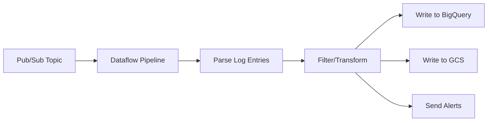

# How to Route Logs to Pub/Sub Topics Using Cloud Logging Sinks

Author: [nawazdhandala](https://www.github.com/nawazdhandala)

Tags: GCP, Cloud Logging, Pub/Sub, Log Sinks, Event-Driven

Description: Learn how to route logs from Cloud Logging to Pub/Sub topics for real-time log processing, SIEM integration, and event-driven architectures.

---

Sometimes you need to do more with your logs than just store and search them. Maybe you want to trigger an automated response when a specific error occurs, feed logs into a third-party SIEM system, or process log data in real time with a custom application. Routing logs to Pub/Sub topics through Cloud Logging sinks makes all of this possible.

In this post, I will walk through setting up Pub/Sub log sinks, building subscribers that process the log data, and common patterns for real-time log processing.

## Why Route Logs to Pub/Sub?

Pub/Sub sits between Cloud Logging and whatever you want to do with the logs. It gives you:

- **Real-time delivery**: Logs are forwarded to Pub/Sub within seconds of being ingested by Cloud Logging
- **Decoupled processing**: Multiple subscribers can process the same logs independently
- **Integration flexibility**: Connect to Cloud Functions, Cloud Run, Dataflow, or external systems
- **Buffering**: Pub/Sub holds messages for up to 31 days if your subscriber is temporarily down

Common use cases include:

- Forwarding logs to Splunk, Datadog, or another SIEM
- Triggering alerts in custom notification systems
- Running real-time log analysis with Dataflow
- Feeding logs into machine learning pipelines for anomaly detection

## Step 1: Create a Pub/Sub Topic

Start by creating a topic that will receive the log entries:

```bash
# Create a Pub/Sub topic for log routing
gcloud pubsub topics create log-export \
  --project=my-project
```

If you want to retain messages for a specific duration (useful for replaying missed messages):

```bash
# Create a topic with 7-day message retention
gcloud pubsub topics create log-export \
  --message-retention-duration=7d \
  --project=my-project
```

## Step 2: Create the Log Sink

Create a sink that routes matching logs to the Pub/Sub topic:

```bash
# Create a log sink that routes error logs to Pub/Sub
gcloud logging sinks create pubsub-error-logs \
  pubsub.googleapis.com/projects/my-project/topics/log-export \
  --log-filter='severity>=ERROR' \
  --project=my-project
```

### Filtered Sink Examples

Route only security-related logs:

```bash
# Route audit logs and IAM-related logs
gcloud logging sinks create pubsub-security-logs \
  pubsub.googleapis.com/projects/my-project/topics/security-logs \
  --log-filter='logName:"cloudaudit.googleapis.com" OR logName:"iam.googleapis.com"' \
  --project=my-project
```

Route logs from a specific application:

```bash
# Route logs from a specific Cloud Run service
gcloud logging sinks create pubsub-app-logs \
  pubsub.googleapis.com/projects/my-project/topics/app-logs \
  --log-filter='resource.type="cloud_run_revision" AND resource.labels.service_name="my-api-service"' \
  --project=my-project
```

Route logs containing specific text patterns:

```bash
# Route logs that mention database connection errors
gcloud logging sinks create pubsub-db-errors \
  pubsub.googleapis.com/projects/my-project/topics/db-errors \
  --log-filter='textPayload=~"connection refused" OR textPayload=~"timeout expired"' \
  --project=my-project
```

## Step 3: Grant Permissions

The sink needs permission to publish to the Pub/Sub topic:

```bash
# Get the sink's writer identity
WRITER=$(gcloud logging sinks describe pubsub-error-logs \
  --project=my-project \
  --format='value(writerIdentity)')

# Grant Pub/Sub Publisher role
gcloud pubsub topics add-iam-policy-binding log-export \
  --member="$WRITER" \
  --role="roles/pubsub.publisher" \
  --project=my-project
```

## Step 4: Create a Subscription

You need at least one subscription to consume the log messages:

```bash
# Create a pull subscription
gcloud pubsub subscriptions create log-processor \
  --topic=log-export \
  --ack-deadline=60 \
  --project=my-project
```

For push-based delivery to a webhook endpoint:

```bash
# Create a push subscription that sends to a Cloud Run endpoint
gcloud pubsub subscriptions create log-processor-push \
  --topic=log-export \
  --push-endpoint=https://my-log-processor-abc123.run.app/logs \
  --ack-deadline=60 \
  --project=my-project
```

## Understanding the Message Format

When Cloud Logging routes a log entry to Pub/Sub, the message is a base64-encoded JSON object containing the full log entry. Here is what a decoded message looks like:

```json
{
  "insertId": "abc123",
  "logName": "projects/my-project/logs/cloudaudit.googleapis.com%2Factivity",
  "timestamp": "2026-02-17T10:30:00.000Z",
  "severity": "ERROR",
  "resource": {
    "type": "cloud_run_revision",
    "labels": {
      "service_name": "my-api-service",
      "project_id": "my-project"
    }
  },
  "textPayload": "Connection refused to database server",
  "labels": {
    "instanceId": "abc123"
  }
}
```

## Processing Logs with Cloud Functions

One of the most common patterns is using Cloud Functions to process log messages from Pub/Sub. Here is an example that sends a Slack notification when an error log is received:

```python
# Cloud Function that sends Slack notifications for error logs
import base64
import json
import os
import requests

def process_log_entry(event, context):
    """Triggered by a Pub/Sub message containing a log entry."""

    # Decode the Pub/Sub message
    pubsub_message = base64.b64decode(event['data']).decode('utf-8')
    log_entry = json.loads(pubsub_message)

    # Extract relevant fields
    severity = log_entry.get('severity', 'UNKNOWN')
    resource_type = log_entry.get('resource', {}).get('type', 'unknown')
    text = log_entry.get('textPayload', '')
    json_payload = log_entry.get('jsonPayload', {})
    timestamp = log_entry.get('timestamp', '')

    # Build the Slack message
    message = {
        "text": f"*{severity}* log from `{resource_type}`",
        "blocks": [
            {
                "type": "section",
                "text": {
                    "type": "mrkdwn",
                    "text": f"*Severity:* {severity}\n*Resource:* {resource_type}\n*Time:* {timestamp}\n*Message:* {text or json.dumps(json_payload)[:500]}"
                }
            }
        ]
    }

    # Send to Slack webhook
    webhook_url = os.environ.get('SLACK_WEBHOOK_URL')
    if webhook_url:
        requests.post(webhook_url, json=message)
```

Deploy it:

```bash
# Deploy the Cloud Function triggered by the Pub/Sub topic
gcloud functions deploy process-error-logs \
  --runtime=python311 \
  --trigger-topic=log-export \
  --entry-point=process_log_entry \
  --set-env-vars=SLACK_WEBHOOK_URL=https://hooks.slack.com/services/xxx/yyy/zzz \
  --project=my-project
```

## Processing Logs with Dataflow

For high-volume log processing, Dataflow provides a scalable streaming pipeline. Here is a conceptual pipeline structure:



You can use the built-in Pub/Sub to BigQuery template:

```bash
# Run a Dataflow template to stream Pub/Sub messages to BigQuery
gcloud dataflow jobs run log-to-bigquery \
  --gcs-location=gs://dataflow-templates/latest/PubSub_to_BigQuery \
  --parameters=inputTopic=projects/my-project/topics/log-export,outputTableSpec=my-project:logs.error_logs \
  --region=us-central1 \
  --project=my-project
```

## Forwarding to External Systems

### Forwarding to Splunk

Splunk has a native Pub/Sub integration. Create a pull subscription and configure the Splunk Add-on for Google Cloud Platform to consume from it.

### Forwarding to Datadog

Datadog provides a Cloud Function that reads from Pub/Sub and forwards logs to the Datadog API:

```bash
# Deploy the Datadog log forwarder
gcloud functions deploy datadog-log-forwarder \
  --runtime=python311 \
  --trigger-topic=log-export \
  --set-env-vars=DD_API_KEY=your-datadog-api-key,DD_SITE=datadoghq.com \
  --source=./datadog-forwarder/ \
  --project=my-project
```

## Terraform Configuration

```hcl
# Pub/Sub topic for log routing
resource "google_pubsub_topic" "log_export" {
  name = "log-export"

  message_retention_duration = "604800s"  # 7 days
}

# Subscription for log processing
resource "google_pubsub_subscription" "log_processor" {
  name  = "log-processor"
  topic = google_pubsub_topic.log_export.id

  ack_deadline_seconds = 60

  retry_policy {
    minimum_backoff = "10s"
    maximum_backoff = "600s"
  }

  # Dead letter policy for messages that fail processing
  dead_letter_policy {
    dead_letter_topic     = google_pubsub_topic.dead_letter.id
    max_delivery_attempts = 5
  }
}

# Dead letter topic for failed messages
resource "google_pubsub_topic" "dead_letter" {
  name = "log-export-dead-letter"
}

# Log sink to Pub/Sub
resource "google_logging_project_sink" "pubsub" {
  name                   = "pubsub-error-logs"
  destination            = "pubsub.googleapis.com/${google_pubsub_topic.log_export.id}"
  filter                 = "severity>=ERROR"
  unique_writer_identity = true
}

# Grant publish access to the sink
resource "google_pubsub_topic_iam_member" "log_writer" {
  topic  = google_pubsub_topic.log_export.name
  role   = "roles/pubsub.publisher"
  member = google_logging_project_sink.pubsub.writer_identity
}
```

## Wrapping Up

Routing logs to Pub/Sub opens up a world of possibilities beyond simple storage and search. Whether you are building automated incident response, feeding a SIEM, or running real-time analytics, the combination of Cloud Logging sinks and Pub/Sub provides a reliable, scalable bridge between your logs and your processing logic. Start with a focused filter to keep message volume manageable, set up a dead letter queue for failed processing, and build from there.
