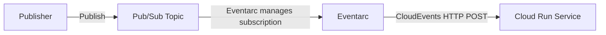

# How to Route Pub/Sub Messages to Cloud Run Services Using Eventarc

Author: [nawazdhandala](https://www.github.com/nawazdhandala)

Tags: GCP, Eventarc, Pub/Sub, Cloud Run, Event-Driven Architecture

Description: Learn how to use Eventarc to route Google Cloud Pub/Sub messages to Cloud Run services for building event-driven architectures with managed event delivery.

---

Pub/Sub is the backbone of event-driven systems on Google Cloud, and Cloud Run is where you run your event handlers. Eventarc connects the two by automatically creating the subscription and routing messages from a Pub/Sub topic to your Cloud Run service. This is cleaner than manually creating push subscriptions and managing the connection yourself.

In this post, I will walk through setting up Eventarc triggers that route Pub/Sub messages to Cloud Run, covering the full setup from topic creation to message handling.

## How Eventarc and Pub/Sub Work Together

When you create an Eventarc trigger with a Pub/Sub source, Eventarc:

1. Creates a Pub/Sub subscription on the specified topic
2. Configures the subscription to push messages to your Cloud Run service
3. Handles authentication between Pub/Sub and Cloud Run
4. Delivers messages in CloudEvents format

This means you do not have to manage the subscription yourself. Eventarc does it for you.



## Prerequisites

Enable the required APIs.

```bash
# Enable required APIs
gcloud services enable \
  run.googleapis.com \
  eventarc.googleapis.com \
  pubsub.googleapis.com
```

## Step 1: Create the Pub/Sub Topic

Create the topic that will be the event source.

```bash
# Create a Pub/Sub topic
gcloud pubsub topics create order-events
```

## Step 2: Build the Cloud Run Service

Create a service that handles Pub/Sub messages delivered via Eventarc. The messages arrive as CloudEvents, with the Pub/Sub message data base64-encoded in the body.

```javascript
// server.js
// Cloud Run service that processes Pub/Sub messages via Eventarc
const express = require("express");
const app = express();
app.use(express.json());

app.post("/", async (req, res) => {
  // Extract CloudEvents headers
  const eventType = req.headers["ce-type"];
  const eventSource = req.headers["ce-source"];
  const eventId = req.headers["ce-id"];
  const eventTime = req.headers["ce-time"];

  console.log(`Event received - Type: ${eventType}, ID: ${eventId}`);

  try {
    // The Pub/Sub message is in the request body
    const pubsubMessage = req.body.message;

    if (!pubsubMessage || !pubsubMessage.data) {
      console.error("No Pub/Sub message data found");
      res.status(200).json({ error: "no_data" });
      return;
    }

    // Decode the base64-encoded message data
    const messageData = JSON.parse(
      Buffer.from(pubsubMessage.data, "base64").toString("utf-8")
    );

    // Access message attributes if present
    const attributes = pubsubMessage.attributes || {};
    const messageId = pubsubMessage.messageId;

    console.log(`Message ID: ${messageId}`);
    console.log(`Message data:`, messageData);
    console.log(`Attributes:`, attributes);

    // Process based on the event type in the message
    await processEvent(messageData, attributes);

    // Return 200 to acknowledge the message
    res.status(200).json({ status: "processed", messageId });
  } catch (error) {
    console.error(`Error processing message: ${error.message}`);
    // Return 500 to nack the message (Pub/Sub will redeliver)
    res.status(500).json({ error: error.message });
  }
});

async function processEvent(data, attributes) {
  const eventType = data.type || attributes.event_type;

  switch (eventType) {
    case "order.created":
      console.log(`New order created: ${data.orderId}`);
      await handleNewOrder(data);
      break;

    case "order.updated":
      console.log(`Order updated: ${data.orderId}`);
      await handleOrderUpdate(data);
      break;

    case "order.cancelled":
      console.log(`Order cancelled: ${data.orderId}`);
      await handleOrderCancellation(data);
      break;

    default:
      console.log(`Unknown event type: ${eventType}`);
  }
}

async function handleNewOrder(data) {
  // Process new order - update inventory, send notification, etc.
  console.log(`Processing new order ${data.orderId} for ${data.customerEmail}`);
}

async function handleOrderUpdate(data) {
  console.log(`Processing order update ${data.orderId}: ${data.status}`);
}

async function handleOrderCancellation(data) {
  console.log(`Processing cancellation for order ${data.orderId}`);
}

const PORT = process.env.PORT || 8080;
app.listen(PORT, () => {
  console.log(`Pub/Sub handler listening on port ${PORT}`);
});
```

Deploy the service.

```bash
# Deploy to Cloud Run
gcloud run deploy order-event-handler \
  --source=. \
  --region=us-central1 \
  --no-allow-unauthenticated \
  --memory=256Mi \
  --timeout=60s \
  --max-instances=20
```

## Step 3: Set Up IAM

Create a service account for the Eventarc trigger.

```bash
# Create the service account
gcloud iam service-accounts create eventarc-pubsub-sa \
  --display-name="Eventarc Pub/Sub SA"

# Grant Cloud Run invoker role
gcloud run services add-iam-policy-binding order-event-handler \
  --region=us-central1 \
  --member="serviceAccount:eventarc-pubsub-sa@YOUR_PROJECT.iam.gserviceaccount.com" \
  --role="roles/run.invoker"
```

## Step 4: Create the Eventarc Trigger

Create the trigger that connects the Pub/Sub topic to the Cloud Run service.

```bash
# Create an Eventarc trigger for Pub/Sub messages
gcloud eventarc triggers create order-events-trigger \
  --location=us-central1 \
  --destination-run-service=order-event-handler \
  --destination-run-region=us-central1 \
  --destination-run-path="/" \
  --event-filters="type=google.cloud.pubsub.topic.v1.messagePublished" \
  --transport-topic=projects/YOUR_PROJECT/topics/order-events \
  --service-account=eventarc-pubsub-sa@YOUR_PROJECT.iam.gserviceaccount.com
```

The `--transport-topic` specifies which Pub/Sub topic to subscribe to. Eventarc creates the subscription automatically.

## Step 5: Test the Setup

Publish a message to the topic and verify it reaches your Cloud Run service.

```bash
# Publish a test message
gcloud pubsub topics publish order-events \
  --message='{"type": "order.created", "orderId": "ORD-001", "customerEmail": "test@example.com", "total": 99.99}' \
  --attribute="event_type=order.created,source=test"

# Check the Cloud Run service logs
gcloud run services logs read order-event-handler \
  --region=us-central1 \
  --limit=5
```

## Publishing Messages from Application Code

Here is how your application publishes events.

```javascript
// publisher.js
// Publishes order events to the Pub/Sub topic
const { PubSub } = require("@google-cloud/pubsub");

const pubsub = new PubSub();
const topic = pubsub.topic("order-events");

async function publishOrderEvent(eventType, orderData) {
  const message = {
    type: eventType,
    ...orderData,
    timestamp: new Date().toISOString(),
  };

  const messageId = await topic.publishMessage({
    data: Buffer.from(JSON.stringify(message)),
    attributes: {
      event_type: eventType,
      order_id: orderData.orderId,
    },
  });

  console.log(`Published ${eventType} event: ${messageId}`);
  return messageId;
}

// Usage
publishOrderEvent("order.created", {
  orderId: "ORD-12345",
  customerEmail: "john@example.com",
  items: [
    { sku: "WIDGET-001", quantity: 2, price: 29.99 },
    { sku: "GADGET-002", quantity: 1, price: 49.99 },
  ],
  total: 109.97,
});
```

## Multiple Triggers for Different Services

You can create multiple Eventarc triggers on the same topic, routing messages to different Cloud Run services. Each trigger gets its own subscription.

```bash
# Trigger 1: Route to inventory service
gcloud eventarc triggers create order-to-inventory \
  --location=us-central1 \
  --destination-run-service=inventory-service \
  --destination-run-region=us-central1 \
  --event-filters="type=google.cloud.pubsub.topic.v1.messagePublished" \
  --transport-topic=projects/YOUR_PROJECT/topics/order-events \
  --service-account=eventarc-pubsub-sa@YOUR_PROJECT.iam.gserviceaccount.com

# Trigger 2: Route to notification service
gcloud eventarc triggers create order-to-notifications \
  --location=us-central1 \
  --destination-run-service=notification-service \
  --destination-run-region=us-central1 \
  --event-filters="type=google.cloud.pubsub.topic.v1.messagePublished" \
  --transport-topic=projects/YOUR_PROJECT/topics/order-events \
  --service-account=eventarc-pubsub-sa@YOUR_PROJECT.iam.gserviceaccount.com

# Trigger 3: Route to analytics service
gcloud eventarc triggers create order-to-analytics \
  --location=us-central1 \
  --destination-run-service=analytics-service \
  --destination-run-region=us-central1 \
  --event-filters="type=google.cloud.pubsub.topic.v1.messagePublished" \
  --transport-topic=projects/YOUR_PROJECT/topics/order-events \
  --service-account=eventarc-pubsub-sa@YOUR_PROJECT.iam.gserviceaccount.com
```

Each service independently receives every message published to the topic.

## Handling Message Acknowledgment

Eventarc uses Pub/Sub's push delivery. The acknowledgment behavior is:

- Return HTTP 2xx: Message is acknowledged and removed from the subscription
- Return HTTP 4xx or 5xx: Message is nacked and will be redelivered after the ack deadline

```javascript
// Proper acknowledgment handling
app.post("/", async (req, res) => {
  try {
    const data = decodeMessage(req.body);

    // Process the message
    await processMessage(data);

    // Acknowledge with 200
    res.status(200).send("OK");
  } catch (error) {
    if (error.permanent) {
      // Permanent failure - ack to prevent infinite redelivery
      console.error(`Permanent failure, acknowledging: ${error.message}`);
      res.status(200).json({ error: "permanent_failure" });
    } else {
      // Transient failure - nack to retry
      console.error(`Transient failure, will retry: ${error.message}`);
      res.status(500).json({ error: error.message });
    }
  }
});
```

## Managing Triggers

```bash
# List all Eventarc triggers
gcloud eventarc triggers list --location=us-central1

# View trigger details (including the auto-created subscription)
gcloud eventarc triggers describe order-events-trigger \
  --location=us-central1

# Update the destination path
gcloud eventarc triggers update order-events-trigger \
  --location=us-central1 \
  --destination-run-path="/v2/process"

# Delete a trigger (also cleans up the subscription)
gcloud eventarc triggers delete order-events-trigger \
  --location=us-central1
```

## Wrapping Up

Eventarc simplifies the connection between Pub/Sub and Cloud Run by managing subscriptions, authentication, and message delivery for you. The setup involves creating a Cloud Run service that handles CloudEvents, creating an Eventarc trigger pointing to your topic, and publishing messages to the topic. The beauty of this approach is that adding new consumers is as simple as creating another trigger - no changes to the publisher or existing consumers needed.
