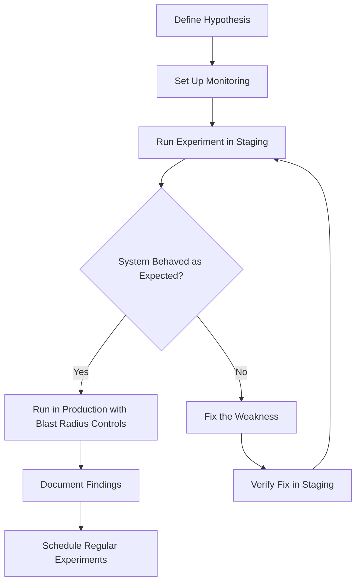

# How to Run Chaos Engineering Experiments on GKE Using Chaos Mesh on Google Cloud

Author: [nawazdhandala](https://www.github.com/nawazdhandala)

Tags: GCP, GKE, Chaos Engineering, Chaos Mesh, Kubernetes, Reliability, Google Cloud

Description: A hands-on guide to running chaos engineering experiments on Google Kubernetes Engine using Chaos Mesh to validate system resilience.

---

You can have all the monitoring, alerting, and redundancy in the world, but until you actually test what happens when things break, you are just guessing about your system's resilience. Chaos engineering is the practice of deliberately injecting failures to find weaknesses before they find you in production. Chaos Mesh is an open-source chaos engineering platform built specifically for Kubernetes, and it works great on GKE. In this post, I will walk through setting it up and running real experiments.

## What is Chaos Mesh?

Chaos Mesh is a CNCF incubating project that provides a comprehensive set of failure injection tools for Kubernetes. It can simulate pod failures, network partitions, DNS errors, disk I/O problems, CPU stress, memory pressure, and more. It runs as a set of controllers and sidecars on your cluster, controlled through Kubernetes custom resources or a web dashboard.

## Prerequisites

- A GKE cluster (Standard or Autopilot)
- kubectl configured
- Helm 3 installed
- At least one application deployed that you want to test

## Step 1: Install Chaos Mesh on GKE

```bash
# Add the Chaos Mesh Helm repository
helm repo add chaos-mesh https://charts.chaos-mesh.org
helm repo update

# Create a namespace for Chaos Mesh
kubectl create namespace chaos-mesh

# Install Chaos Mesh with GKE-compatible settings
helm install chaos-mesh chaos-mesh/chaos-mesh \
    --namespace chaos-mesh \
    --set chaosDaemon.runtime=containerd \
    --set chaosDaemon.socketPath=/run/containerd/containerd.sock \
    --version 2.7.0
```

Verify the installation.

```bash
# Check that all Chaos Mesh pods are running
kubectl get pods -n chaos-mesh
```

You should see the chaos-controller-manager, chaos-daemon (one per node), and chaos-dashboard pods all in Running state.

## Step 2: Access the Chaos Mesh Dashboard

The dashboard gives you a visual way to create and manage experiments.

```bash
# Port-forward to the dashboard
kubectl port-forward -n chaos-mesh svc/chaos-dashboard 2333:2333

# Open http://localhost:2333 in your browser
```

For production use, set up an Ingress with authentication.

## Step 3: Run Your First Experiment - Pod Kill

Let us start simple. This experiment randomly kills pods of a target deployment to test that your service recovers gracefully.

```yaml
# pod-kill-experiment.yaml
# This kills one random pod of the target deployment every 60 seconds
apiVersion: chaos-mesh.org/v1alpha1
kind: PodChaos
metadata:
  name: pod-kill-experiment
  namespace: default
spec:
  action: pod-kill
  mode: one
  selector:
    namespaces:
      - default
    labelSelectors:
      app: my-web-service
  scheduler:
    cron: "*/1 * * * *"
  duration: "30s"
```

Apply and observe.

```bash
# Apply the chaos experiment
kubectl apply -f pod-kill-experiment.yaml

# Watch pods being killed and recreated
kubectl get pods -l app=my-web-service -w
```

While the experiment runs, check if your service still responds to requests. If it does, your replica count and health checks are working.

## Step 4: Network Chaos - Simulating Latency

Inject network latency to simulate a slow dependency.

```yaml
# network-latency-experiment.yaml
# Adds 200ms of latency to all traffic to the database service
apiVersion: chaos-mesh.org/v1alpha1
kind: NetworkChaos
metadata:
  name: database-latency
  namespace: default
spec:
  action: delay
  mode: all
  selector:
    namespaces:
      - default
    labelSelectors:
      app: my-web-service
  delay:
    latency: "200ms"
    jitter: "50ms"
    correlation: "75"
  direction: to
  target:
    selector:
      namespaces:
        - default
      labelSelectors:
        app: postgres
    mode: all
  duration: "5m"
```

This adds 200ms of latency (plus or minus 50ms of jitter) to network packets going from your web service to the Postgres pods. Check if your application handles the increased latency gracefully - does it timeout? Do retries work? Do users see errors?

## Step 5: Network Partition

Test what happens when services completely lose connectivity.

```yaml
# network-partition-experiment.yaml
# Completely block traffic between two services
apiVersion: chaos-mesh.org/v1alpha1
kind: NetworkChaos
metadata:
  name: network-partition
  namespace: default
spec:
  action: partition
  mode: all
  selector:
    namespaces:
      - default
    labelSelectors:
      app: order-service
  direction: both
  target:
    selector:
      namespaces:
        - default
      labelSelectors:
        app: payment-service
    mode: all
  duration: "3m"
```

## Step 6: CPU and Memory Stress

Test how your application behaves under resource pressure.

```yaml
# cpu-stress-experiment.yaml
# Consume 80% of CPU on target pods
apiVersion: chaos-mesh.org/v1alpha1
kind: StressChaos
metadata:
  name: cpu-stress-test
  namespace: default
spec:
  mode: all
  selector:
    namespaces:
      - default
    labelSelectors:
      app: my-web-service
  stressors:
    cpu:
      workers: 2
      load: 80
  duration: "5m"
```

```yaml
# memory-stress-experiment.yaml
# Consume 256MB of memory in target pods
apiVersion: chaos-mesh.org/v1alpha1
kind: StressChaos
metadata:
  name: memory-stress-test
  namespace: default
spec:
  mode: one
  selector:
    namespaces:
      - default
    labelSelectors:
      app: my-web-service
  stressors:
    memory:
      workers: 1
      size: "256MB"
  duration: "5m"
```

## Step 7: DNS Chaos

Simulate DNS resolution failures, which are surprisingly common in real outages.

```yaml
# dns-chaos-experiment.yaml
# Make DNS lookups for a specific domain fail
apiVersion: chaos-mesh.org/v1alpha1
kind: DNSChaos
metadata:
  name: dns-failure
  namespace: default
spec:
  action: error
  mode: all
  selector:
    namespaces:
      - default
    labelSelectors:
      app: my-web-service
  patterns:
    - "payment-service.default.svc.cluster.local"
  duration: "3m"
```

## Experiment Workflow

Here is a structured approach to running chaos experiments.



## Step 8: Running Experiments Safely

Safety controls are essential. Chaos Mesh provides several mechanisms.

```yaml
# A workflow that runs multiple experiments in sequence with safety checks
apiVersion: chaos-mesh.org/v1alpha1
kind: Workflow
metadata:
  name: comprehensive-resilience-test
  namespace: default
spec:
  entry: the-entry
  templates:
    - name: the-entry
      templateType: Serial
      deadline: "30m"
      children:
        - pod-kill-phase
        - network-latency-phase
        - stress-phase

    - name: pod-kill-phase
      templateType: PodChaos
      deadline: "5m"
      podChaos:
        action: pod-kill
        mode: one
        selector:
          namespaces: [default]
          labelSelectors:
            app: my-web-service

    - name: network-latency-phase
      templateType: NetworkChaos
      deadline: "5m"
      networkChaos:
        action: delay
        mode: all
        selector:
          namespaces: [default]
          labelSelectors:
            app: my-web-service
        delay:
          latency: "100ms"
        direction: to
        target:
          selector:
            namespaces: [default]
            labelSelectors:
              app: postgres
          mode: all

    - name: stress-phase
      templateType: StressChaos
      deadline: "5m"
      stressChaos:
        mode: one
        selector:
          namespaces: [default]
          labelSelectors:
            app: my-web-service
        stressors:
          cpu:
            workers: 1
            load: 60
```

## Step 9: Integrate with CI/CD

Run chaos experiments as part of your deployment pipeline to catch regressions.

```bash
# In your CI/CD pipeline, after deploying to staging:

# Apply the chaos experiment
kubectl apply -f chaos-experiments/pod-kill.yaml

# Wait for the experiment duration
sleep 300

# Check application health
HTTP_STATUS=$(curl -s -o /dev/null -w "%{http_code}" https://staging.example.com/health)
if [ "$HTTP_STATUS" != "200" ]; then
    echo "Application failed chaos test!"
    # Clean up the experiment
    kubectl delete -f chaos-experiments/pod-kill.yaml
    exit 1
fi

# Clean up
kubectl delete -f chaos-experiments/pod-kill.yaml
echo "Chaos test passed"
```

## Monitoring During Experiments

Always have your monitoring dashboards open during experiments. Set up specific alerts for chaos testing windows.

```bash
# Create an alert that fires during chaos experiments if error rate exceeds acceptable levels
gcloud monitoring policies create --policy-from-file=- << 'EOF'
{
  "displayName": "Chaos Test Safety Net",
  "conditions": [{
    "displayName": "Error rate during chaos test",
    "conditionThreshold": {
      "filter": "metric.type=\"loadbalancing.googleapis.com/https/request_count\" AND metric.labels.response_code_class=\"500\"",
      "comparison": "COMPARISON_GT",
      "thresholdValue": 100,
      "duration": "60s",
      "aggregations": [{
        "alignmentPeriod": "60s",
        "perSeriesAligner": "ALIGN_RATE"
      }]
    }
  }],
  "combiner": "OR"
}
EOF
```

## Wrapping Up

Chaos engineering with Chaos Mesh on GKE lets you proactively find weaknesses in your system before they cause real incidents. Start small - kill a single pod and see if your service recovers. Then gradually increase the blast radius: add network latency, partition services, stress CPU and memory. Each experiment should have a clear hypothesis (e.g., "if one pod dies, the service continues handling requests without errors") and clear success criteria. Document your findings and fix the weaknesses you discover. Over time, this practice builds real confidence in your system's resilience, not just hope.
