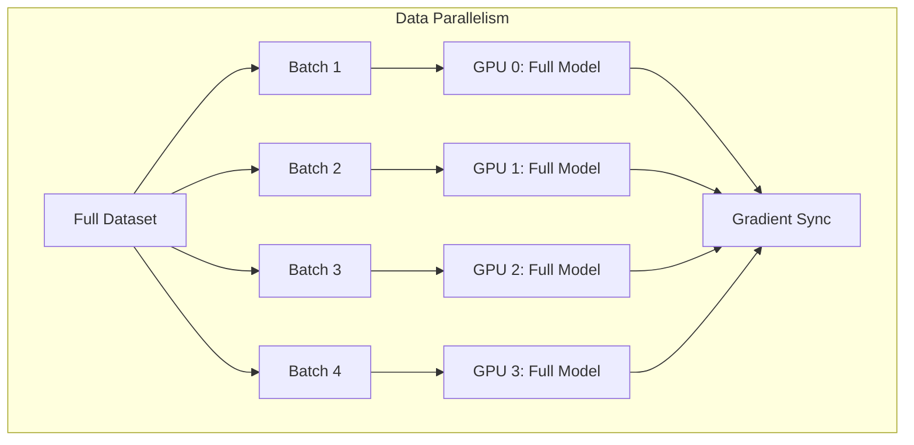

# How to Run Distributed Training Jobs with Multiple GPUs on Vertex AI

Author: [nawazdhandala](https://www.github.com/nawazdhandala)

Tags: GCP, Vertex AI, Distributed Training, GPU, Deep Learning

Description: Learn how to configure and run distributed training jobs across multiple GPUs on Vertex AI to accelerate model training for large datasets and complex architectures.

---

Training a large neural network on a single GPU can take days or even weeks. Distributed training splits the workload across multiple GPUs - either on a single machine or across multiple machines - to dramatically reduce training time. Vertex AI makes this straightforward by handling the cluster provisioning and inter-node communication while you focus on your training code.

This guide covers the different distributed training strategies, how to configure multi-GPU jobs on Vertex AI, and the practical details that determine whether your training actually scales well.

## Distributed Training Strategies

There are two main approaches to distributed training, and which one you use depends on what is bottlenecking your training.

Data parallelism replicates your model on every GPU. Each GPU processes a different batch of data, computes gradients, and then all GPUs synchronize their gradients before updating the model weights. This is the most common approach and works well when your model fits on a single GPU but you want to process more data per step.

Model parallelism splits the model itself across GPUs. Different parts of the model live on different GPUs. This is necessary when your model is too large to fit on a single GPU's memory.



## Setting Up a Multi-GPU Training Job

Let us start with the most common scenario: data-parallel training with TensorFlow's MirroredStrategy across multiple GPUs on a single machine.

This is the training script that uses MirroredStrategy:

```python
# train.py - Distributed training with TensorFlow MirroredStrategy

import os
import tensorflow as tf
import argparse

def create_model():
    """Build a simple CNN for demonstration."""
    model = tf.keras.Sequential([
        tf.keras.layers.Conv2D(32, 3, activation="relu", input_shape=(28, 28, 1)),
        tf.keras.layers.MaxPooling2D(),
        tf.keras.layers.Conv2D(64, 3, activation="relu"),
        tf.keras.layers.MaxPooling2D(),
        tf.keras.layers.Flatten(),
        tf.keras.layers.Dense(128, activation="relu"),
        tf.keras.layers.Dropout(0.3),
        tf.keras.layers.Dense(10, activation="softmax")
    ])
    return model

def main(args):
    # MirroredStrategy handles data-parallel training across all GPUs
    strategy = tf.distribute.MirroredStrategy()
    print(f"Number of devices: {strategy.num_replicas_in_sync}")

    # Scale batch size by the number of GPUs
    global_batch_size = args.batch_size * strategy.num_replicas_in_sync

    # Load and preprocess data
    (x_train, y_train), (x_test, y_test) = tf.keras.datasets.mnist.load_data()
    x_train = x_train.reshape(-1, 28, 28, 1).astype("float32") / 255.0
    x_test = x_test.reshape(-1, 28, 28, 1).astype("float32") / 255.0

    # Create tf.data datasets with proper batching
    train_dataset = tf.data.Dataset.from_tensor_slices((x_train, y_train))
    train_dataset = train_dataset.shuffle(10000).batch(global_batch_size)

    test_dataset = tf.data.Dataset.from_tensor_slices((x_test, y_test))
    test_dataset = test_dataset.batch(global_batch_size)

    # Build and compile model within the strategy scope
    with strategy.scope():
        model = create_model()
        model.compile(
            optimizer=tf.keras.optimizers.Adam(learning_rate=args.learning_rate),
            loss="sparse_categorical_crossentropy",
            metrics=["accuracy"]
        )

    # Train the model
    model.fit(
        train_dataset,
        epochs=args.epochs,
        validation_data=test_dataset,
        callbacks=[
            tf.keras.callbacks.TensorBoard(log_dir=os.environ.get("AIP_TENSORBOARD_LOG_DIR", "/tmp/logs")),
        ]
    )

    # Save the model
    model_dir = os.environ.get("AIP_MODEL_DIR", args.model_dir)
    model.save(model_dir)
    print(f"Model saved to {model_dir}")

if __name__ == "__main__":
    parser = argparse.ArgumentParser()
    parser.add_argument("--batch-size", type=int, default=64)
    parser.add_argument("--epochs", type=int, default=10)
    parser.add_argument("--learning-rate", type=float, default=0.001)
    parser.add_argument("--model-dir", type=str, default="gs://your-bucket/models/")
    args = parser.parse_args()
    main(args)
```

## Submitting the Job to Vertex AI

Now submit this training script as a Vertex AI Custom Job with multiple GPUs.

This code submits the job with 4 GPUs:

```python
from google.cloud import aiplatform

aiplatform.init(project="your-project-id", location="us-central1")

# Create a custom training job with 4 GPUs on a single machine
job = aiplatform.CustomJob(
    display_name="distributed-training-4gpu",
    worker_pool_specs=[
        {
            "machine_spec": {
                "machine_type": "n1-standard-16",
                "accelerator_type": "NVIDIA_TESLA_V100",
                "accelerator_count": 4  # 4 GPUs per machine
            },
            "replica_count": 1,  # Single machine with multiple GPUs
            "python_package_spec": {
                "executor_image_uri": "us-docker.pkg.dev/vertex-ai/training/tf-gpu.2-13:latest",
                "package_uris": ["gs://your-bucket/packages/trainer-0.1.tar.gz"],
                "python_module": "trainer.train",
                "args": [
                    "--batch-size=64",
                    "--epochs=20",
                    "--learning-rate=0.001",
                    "--model-dir=gs://your-bucket/models/distributed/"
                ]
            }
        }
    ]
)

job.run(sync=False)  # Run asynchronously
print(f"Job submitted: {job.resource_name}")
```

## Multi-Worker Distributed Training

For even larger scale, you can distribute training across multiple machines, each with multiple GPUs. TensorFlow's MultiWorkerMirroredStrategy handles this.

This training script uses MultiWorkerMirroredStrategy:

```python
# multi_worker_train.py - Training across multiple machines

import os
import json
import tensorflow as tf

def main():
    # Vertex AI sets TF_CONFIG automatically for multi-worker jobs
    tf_config = json.loads(os.environ.get("TF_CONFIG", "{}"))
    print(f"TF_CONFIG: {json.dumps(tf_config, indent=2)}")

    # MultiWorkerMirroredStrategy uses NCCL for GPU communication
    strategy = tf.distribute.MultiWorkerMirroredStrategy(
        communication_options=tf.distribute.experimental.CommunicationOptions(
            implementation=tf.distribute.experimental.CommunicationImplementation.NCCL
        )
    )
    print(f"Total replicas: {strategy.num_replicas_in_sync}")

    # Scale batch size by total number of GPUs across all workers
    per_replica_batch = 64
    global_batch_size = per_replica_batch * strategy.num_replicas_in_sync

    # Create dataset - each worker processes its own shard
    train_dataset = tf.data.Dataset.from_tensor_slices(load_data())
    train_dataset = train_dataset.shuffle(10000).batch(global_batch_size)

    # Auto-shard dataset across workers
    options = tf.data.Options()
    options.experimental_distribute.auto_shard_policy = (
        tf.data.experimental.AutoShardPolicy.DATA
    )
    train_dataset = train_dataset.with_options(options)

    with strategy.scope():
        model = build_model()
        model.compile(
            optimizer=tf.keras.optimizers.Adam(0.001),
            loss="sparse_categorical_crossentropy",
            metrics=["accuracy"]
        )

    model.fit(train_dataset, epochs=20)

    # Only save from the chief worker to avoid conflicts
    task_type = tf_config.get("task", {}).get("type", "")
    if task_type == "chief" or not tf_config:
        model.save(os.environ.get("AIP_MODEL_DIR", "/tmp/model"))
```

Submit the multi-worker job to Vertex AI:

```python
# Submit with 4 workers, each with 2 GPUs = 8 GPUs total
job = aiplatform.CustomJob(
    display_name="multi-worker-training-8gpu",
    worker_pool_specs=[
        {
            # Chief worker
            "machine_spec": {
                "machine_type": "n1-standard-16",
                "accelerator_type": "NVIDIA_TESLA_V100",
                "accelerator_count": 2
            },
            "replica_count": 1,
            "python_package_spec": {
                "executor_image_uri": "us-docker.pkg.dev/vertex-ai/training/tf-gpu.2-13:latest",
                "package_uris": ["gs://your-bucket/packages/trainer-0.1.tar.gz"],
                "python_module": "trainer.multi_worker_train"
            }
        },
        {
            # Worker pool
            "machine_spec": {
                "machine_type": "n1-standard-16",
                "accelerator_type": "NVIDIA_TESLA_V100",
                "accelerator_count": 2
            },
            "replica_count": 3,  # 3 additional workers
            "python_package_spec": {
                "executor_image_uri": "us-docker.pkg.dev/vertex-ai/training/tf-gpu.2-13:latest",
                "package_uris": ["gs://your-bucket/packages/trainer-0.1.tar.gz"],
                "python_module": "trainer.multi_worker_train"
            }
        }
    ]
)

job.run(sync=False)
```

## PyTorch Distributed Training

If you are using PyTorch, the distributed training setup is slightly different. PyTorch uses DistributedDataParallel (DDP).

This PyTorch training script handles multi-GPU training:

```python
# pytorch_train.py - PyTorch distributed training

import os
import torch
import torch.nn as nn
import torch.distributed as dist
from torch.nn.parallel import DistributedDataParallel as DDP
from torch.utils.data import DataLoader, DistributedSampler

def setup_distributed():
    """Initialize distributed training from Vertex AI environment."""
    # Vertex AI sets these environment variables
    master_addr = os.environ.get("MASTER_ADDR", "localhost")
    master_port = os.environ.get("MASTER_PORT", "12355")
    world_size = int(os.environ.get("WORLD_SIZE", 1))
    rank = int(os.environ.get("RANK", 0))
    local_rank = int(os.environ.get("LOCAL_RANK", 0))

    os.environ["MASTER_ADDR"] = master_addr
    os.environ["MASTER_PORT"] = master_port

    # Initialize the process group
    dist.init_process_group(
        backend="nccl",  # Use NCCL for GPU communication
        world_size=world_size,
        rank=rank
    )

    # Set the GPU for this process
    torch.cuda.set_device(local_rank)

    return rank, local_rank, world_size

def train():
    rank, local_rank, world_size = setup_distributed()

    # Create model and move to GPU
    model = nn.Sequential(
        nn.Linear(784, 256),
        nn.ReLU(),
        nn.Linear(256, 10)
    ).cuda(local_rank)

    # Wrap with DDP
    model = DDP(model, device_ids=[local_rank])

    optimizer = torch.optim.Adam(model.parameters(), lr=0.001)
    criterion = nn.CrossEntropyLoss()

    # Use DistributedSampler for data sharding
    dataset = load_dataset()
    sampler = DistributedSampler(dataset, num_replicas=world_size, rank=rank)
    loader = DataLoader(dataset, batch_size=64, sampler=sampler)

    for epoch in range(20):
        sampler.set_epoch(epoch)  # Ensure different shuffling each epoch
        for batch_x, batch_y in loader:
            batch_x = batch_x.cuda(local_rank)
            batch_y = batch_y.cuda(local_rank)

            optimizer.zero_grad()
            output = model(batch_x)
            loss = criterion(output, batch_y)
            loss.backward()
            optimizer.step()

        if rank == 0:
            print(f"Epoch {epoch}: loss = {loss.item():.4f}")

    # Save model from rank 0 only
    if rank == 0:
        torch.save(model.module.state_dict(), os.environ.get("AIP_MODEL_DIR", "/tmp/model.pt"))

    dist.destroy_process_group()

if __name__ == "__main__":
    train()
```

## Scaling Tips

Linear scaling of learning rate is important when increasing the number of GPUs. If you use a learning rate of 0.001 with 1 GPU, consider using 0.004 with 4 GPUs. This compensates for the larger effective batch size. Some teams also use a warmup period where the learning rate gradually increases during the first few epochs.

Monitor GPU utilization during training. If your GPUs are not consistently above 80% utilization, the bottleneck is likely data loading rather than computation. Use prefetching, parallel data loading, and efficient data formats like TFRecord or WebDataset to keep the GPUs fed.

Use the fastest available interconnect. On Vertex AI, A100 GPUs come with NVLink for intra-node communication, which is significantly faster than PCIe. For multi-node training, request machines with high-bandwidth networking.

Gradient accumulation is an alternative when you cannot afford enough GPUs. Instead of processing a large batch across many GPUs, you accumulate gradients over multiple small batches on fewer GPUs and update weights less frequently. This achieves the same effective batch size with less hardware.

Distributed training on Vertex AI removes the infrastructure burden of managing GPU clusters, but understanding the training strategies and their configuration remains essential for getting good scaling efficiency.
