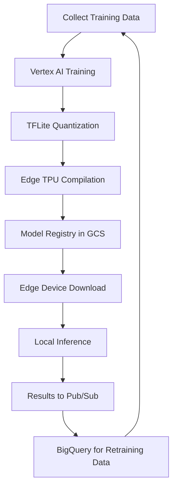

# How to Run ML Inference at the Edge with Google Cloud Vertex AI and Edge TPU for IoT Applications

Author: [nawazdhandala](https://www.github.com/nawazdhandala)

Tags: GCP, Vertex AI, Edge TPU, Machine Learning, IoT

Description: Train models with Vertex AI and deploy them to Edge TPU devices for real-time ML inference in IoT applications at the network edge.

---

Training a machine learning model in the cloud and running inference at the edge is a powerful pattern for IoT. You get the computational resources of Google Cloud for training while keeping inference fast and local on Edge TPU hardware. Vertex AI provides the training and model management layer, and the Edge TPU handles the actual prediction at the device level.

This guide covers the full workflow: training a model with Vertex AI, exporting it for Edge TPU, deploying it to edge devices, and building a feedback loop for continuous improvement.

## The Cloud-to-Edge ML Workflow



The cycle is continuous. Edge devices send inference results and raw data back to the cloud, which feeds into the next training cycle.

## Prerequisites

- GCP project with Vertex AI, Cloud Storage, and Pub/Sub APIs enabled
- Coral Edge TPU device (USB Accelerator or Dev Board)
- Python 3.8+ with the Vertex AI SDK
- Training data in Cloud Storage

```bash
# Install required packages
pip install google-cloud-aiplatform tensorflow pycoral
```

## Step 1: Prepare Training Data

For this example, I will use a predictive maintenance use case - classifying vibration sensor data from industrial equipment as "normal," "warning," or "failure."

```python
# prepare_data.py - Prepares training data and uploads to GCS

import numpy as np
import pandas as pd
from google.cloud import storage

def generate_sample_data(num_samples=10000):
    """Generates synthetic vibration sensor data for training.
    In production, this would come from your actual sensor readings."""

    data = []
    for _ in range(num_samples):
        # Randomly assign a class
        label = np.random.choice(["normal", "warning", "failure"], p=[0.7, 0.2, 0.1])

        if label == "normal":
            # Normal vibration pattern - low amplitude, regular frequency
            features = np.random.normal(loc=0.5, scale=0.1, size=128)
        elif label == "warning":
            # Warning pattern - higher amplitude, some irregularity
            features = np.random.normal(loc=1.2, scale=0.3, size=128)
        else:
            # Failure pattern - high amplitude, irregular frequency
            features = np.random.normal(loc=2.5, scale=0.8, size=128)

        data.append({"features": features.tolist(), "label": label})

    return pd.DataFrame(data)

# Upload to GCS for Vertex AI training
client = storage.Client()
bucket = client.bucket("your-training-bucket")
df = generate_sample_data()
blob = bucket.blob("training-data/vibration_data.csv")
blob.upload_from_string(df.to_csv(index=False))
print("Training data uploaded to GCS")
```

## Step 2: Train with Vertex AI

Create a custom training job on Vertex AI:

```python
# train.py - Vertex AI custom training script

import tensorflow as tf
import numpy as np
import json
import os

def build_model(input_shape, num_classes):
    """Builds a lightweight CNN suitable for Edge TPU deployment.
    The model uses only operations supported by the Edge TPU compiler."""

    model = tf.keras.Sequential([
        # Reshape 1D sensor data into a format suitable for Conv1D
        tf.keras.layers.Reshape((input_shape, 1), input_shape=(input_shape,)),

        # First conv block - extract local patterns
        tf.keras.layers.Conv1D(16, 3, activation="relu", padding="same"),
        tf.keras.layers.MaxPooling1D(2),

        # Second conv block - extract higher-level features
        tf.keras.layers.Conv1D(32, 3, activation="relu", padding="same"),
        tf.keras.layers.MaxPooling1D(2),

        # Classification head
        tf.keras.layers.Flatten(),
        tf.keras.layers.Dense(64, activation="relu"),
        tf.keras.layers.Dropout(0.3),
        tf.keras.layers.Dense(num_classes, activation="softmax"),
    ])

    model.compile(
        optimizer="adam",
        loss="sparse_categorical_crossentropy",
        metrics=["accuracy"],
    )
    return model

# Training entry point for Vertex AI
if __name__ == "__main__":
    # Load training data from the GCS path provided by Vertex AI
    data_path = os.environ.get("AIP_TRAINING_DATA_URI", "gs://your-bucket/training-data/")
    model_dir = os.environ.get("AIP_MODEL_DIR", "gs://your-bucket/models/")

    # Load and preprocess data
    # In production, load from data_path
    X_train = np.random.rand(8000, 128).astype(np.float32)
    y_train = np.random.randint(0, 3, 8000)
    X_val = np.random.rand(2000, 128).astype(np.float32)
    y_val = np.random.randint(0, 3, 2000)

    # Build and train the model
    model = build_model(input_shape=128, num_classes=3)
    model.fit(
        X_train, y_train,
        validation_data=(X_val, y_val),
        epochs=50,
        batch_size=32,
        callbacks=[
            tf.keras.callbacks.EarlyStopping(patience=5, restore_best_weights=True),
        ],
    )

    # Save the trained model
    model.save(os.path.join(model_dir, "saved_model"))
    print(f"Model saved to {model_dir}")
```

Submit the training job:

```python
from google.cloud import aiplatform

aiplatform.init(project="your-project", location="us-central1")

# Create and run a custom training job on Vertex AI
job = aiplatform.CustomTrainingJob(
    display_name="vibration-classifier",
    script_path="train.py",
    container_uri="us-docker.pkg.dev/vertex-ai/training/tf-cpu.2-12.py310:latest",
    model_serving_container_image_uri="us-docker.pkg.dev/vertex-ai/prediction/tf2-cpu.2-12:latest",
)

model = job.run(
    model_display_name="vibration-classifier-v1",
    replica_count=1,
    machine_type="n1-standard-4",
    args=["--epochs=50"],
)
print(f"Model trained: {model.resource_name}")
```

## Step 3: Convert and Compile for Edge TPU

After training, convert the model to TFLite with INT8 quantization:

```python
# convert_model.py - Converts Vertex AI model to Edge TPU format

import tensorflow as tf
import numpy as np

def convert_to_edgetpu(saved_model_path, output_path):
    """Converts a SavedModel to a fully quantized TFLite model
    compatible with Edge TPU compilation."""

    # Load the trained model
    converter = tf.lite.TFLiteConverter.from_saved_model(saved_model_path)

    # Enable full integer quantization
    converter.optimizations = [tf.lite.Optimize.DEFAULT]

    def representative_dataset():
        """Provides calibration data for quantization.
        Uses 200 random samples to calibrate INT8 ranges."""
        for _ in range(200):
            sample = np.random.rand(1, 128).astype(np.float32)
            yield [sample]

    converter.representative_dataset = representative_dataset
    converter.target_spec.supported_ops = [tf.lite.OpsSet.TFLITE_BUILTINS_INT8]
    converter.inference_input_type = tf.uint8
    converter.inference_output_type = tf.uint8

    # Convert and save
    tflite_model = converter.convert()
    with open(output_path, "wb") as f:
        f.write(tflite_model)

    print(f"Quantized model saved to {output_path}")
    print(f"Model size: {len(tflite_model) / 1024:.1f} KB")

convert_to_edgetpu("saved_model/", "model_quant.tflite")
```

Compile for the Edge TPU:

```bash
# Compile the quantized model for Edge TPU hardware acceleration
edgetpu_compiler model_quant.tflite -o output/

# Upload the compiled model to GCS for edge device distribution
gsutil -h "x-goog-meta-version:v1" \
  -h "x-goog-meta-accuracy:0.94" \
  cp output/model_quant_edgetpu.tflite \
  gs://your-model-bucket/edge-models/vibration-classifier/latest/
```

## Step 4: Deploy to Edge Devices

Build an inference service that runs on the edge device:

```python
# edge_inference.py - Runs on the edge device with Coral Edge TPU

from pycoral.utils.edgetpu import make_interpreter
import numpy as np
import time
import json
from google.cloud import pubsub_v1

# Class labels matching the training data
LABELS = ["normal", "warning", "failure"]

class EdgeInferenceService:
    """Runs ML inference on sensor data using the Edge TPU.
    Publishes results to GCP for monitoring and retraining."""

    def __init__(self, model_path, project_id, device_id):
        self.device_id = device_id
        self.project_id = project_id

        # Load the Edge TPU model
        self.interpreter = make_interpreter(model_path)
        self.interpreter.allocate_tensors()

        # Get input/output tensor details for preprocessing
        self.input_details = self.interpreter.get_input_details()[0]
        self.output_details = self.interpreter.get_output_details()[0]

        # Pub/Sub publisher for sending results to the cloud
        self.publisher = pubsub_v1.PublisherClient()
        self.results_topic = self.publisher.topic_path(
            project_id, "inference-results"
        )

        print(f"Model loaded. Input shape: {self.input_details['shape']}")

    def preprocess(self, sensor_data):
        """Preprocesses raw sensor data for the quantized model.
        Scales float values to UINT8 range expected by the model."""

        data = np.array(sensor_data, dtype=np.float32)

        # Scale to uint8 range using the model's quantization parameters
        scale = self.input_details["quantization"][0]
        zero_point = self.input_details["quantization"][1]
        quantized = (data / scale + zero_point).astype(np.uint8)

        return quantized.reshape(self.input_details["shape"])

    def predict(self, sensor_data):
        """Runs inference on a single sensor reading.
        Returns the predicted class and confidence score."""

        input_data = self.preprocess(sensor_data)

        # Run inference on the Edge TPU
        self.interpreter.set_tensor(self.input_details["index"], input_data)
        start_time = time.perf_counter()
        self.interpreter.invoke()
        inference_ms = (time.perf_counter() - start_time) * 1000

        # Get the output and dequantize
        output = self.interpreter.get_tensor(self.output_details["index"])[0]
        scale = self.output_details["quantization"][0]
        zero_point = self.output_details["quantization"][1]
        scores = (output.astype(np.float32) - zero_point) * scale

        # Get the predicted class
        predicted_idx = np.argmax(scores)
        predicted_label = LABELS[predicted_idx]
        confidence = float(scores[predicted_idx])

        return {
            "label": predicted_label,
            "confidence": confidence,
            "inference_ms": inference_ms,
            "all_scores": {LABELS[i]: float(s) for i, s in enumerate(scores)},
        }

    def publish_result(self, sensor_data, result):
        """Publishes the inference result to Pub/Sub for cloud processing."""
        message = {
            "device_id": self.device_id,
            "timestamp": int(time.time() * 1000),
            "prediction": result["label"],
            "confidence": result["confidence"],
            "inference_ms": result["inference_ms"],
            "raw_data": sensor_data[:10],  # Send a sample for retraining
        }

        self.publisher.publish(
            self.results_topic,
            data=json.dumps(message).encode("utf-8"),
            device_id=self.device_id,
            prediction=result["label"],
        )

# Main loop
service = EdgeInferenceService(
    model_path="model_quant_edgetpu.tflite",
    project_id="your-project",
    device_id="edge-001",
)

while True:
    # Read sensor data (replace with your actual sensor reading code)
    sensor_data = read_vibration_sensor()

    result = service.predict(sensor_data)
    print(f"Prediction: {result['label']} ({result['confidence']:.2f}) in {result['inference_ms']:.1f}ms")

    # Publish results for monitoring and retraining
    service.publish_result(sensor_data, result)

    # Take action on predictions locally
    if result["label"] == "failure" and result["confidence"] > 0.8:
        trigger_local_alarm()

    time.sleep(0.1)  # 10 Hz sampling rate
```

## Step 5: Model Update Mechanism

Set up automatic model updates on edge devices:

```python
from google.cloud import storage
import os

def check_and_update_model(current_version):
    """Checks GCS for a newer model version and downloads it.
    Returns the new model path if updated, None otherwise."""

    client = storage.Client()
    bucket = client.bucket("your-model-bucket")
    blob = bucket.blob("edge-models/vibration-classifier/latest/model_quant_edgetpu.tflite")
    blob.reload()

    remote_version = blob.metadata.get("version", "unknown")

    if remote_version != current_version:
        local_path = f"/tmp/model_{remote_version}_edgetpu.tflite"
        blob.download_to_filename(local_path)
        print(f"Downloaded model version {remote_version}")
        return local_path, remote_version

    return None, current_version
```

## Wrapping Up

The combination of Vertex AI for training and Edge TPU for inference gives you the best of both worlds. You train complex models with cloud-scale resources and deploy lightweight, optimized versions that run in milliseconds at the edge. The feedback loop - where edge inference results feed back into training data - means your models continuously improve as they see more real-world data. The key is keeping the model architecture Edge TPU-friendly from the start, which means sticking to supported operations and designing for INT8 quantization.
