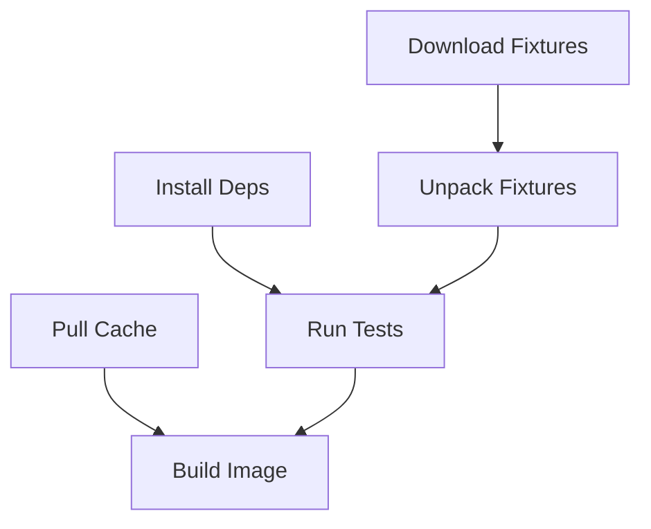

# How to Run Parallel Build Steps in Cloud Build Using waitFor and id Fields

Author: [nawazdhandala](https://www.github.com/nawazdhandala)

Tags: GCP, Cloud Build, Parallel Builds, CI/CD, Build Optimization, waitFor

Description: Master the waitFor and id fields in Cloud Build to run build steps in parallel and cut your CI/CD pipeline execution time significantly.

---

Build pipelines tend to grow over time. What starts as a simple "build and push" becomes lint, test, scan, build, push, and deploy. Running all of these steps one after another wastes time when many of them could run simultaneously. Cloud Build gives you the `waitFor` and `id` fields to control exactly which steps run in parallel and which wait for others. In this post, I will explain how these fields work, walk through practical examples, and share patterns that consistently save build time.

## Default Behavior: Sequential Execution

Without any `id` or `waitFor` fields, Cloud Build runs steps sequentially in the order they appear:

```yaml
# Default sequential execution - each step waits for the previous one
steps:
  - name: 'node:20'
    args: ['npm', 'ci']          # Takes ~60s

  - name: 'node:20'
    args: ['npm', 'run', 'lint']  # Takes ~15s

  - name: 'node:20'
    args: ['npm', 'test']         # Takes ~90s

  - name: 'gcr.io/cloud-builders/docker'
    args: ['build', '-t', 'gcr.io/$PROJECT_ID/my-app:latest', '.']  # Takes ~120s
```

Total time: approximately 285 seconds (4 minutes 45 seconds). But lint and test do not depend on each other - they both just need the installed dependencies. Let's fix that.

## The id Field

The `id` field gives a step a unique identifier that other steps can reference. It is a simple string - use something descriptive:

```yaml
steps:
  - name: 'node:20'
    id: 'install-deps'
    args: ['npm', 'ci']
```

The `id` field also shows up in the Cloud Build logs, making it easier to identify which step you are looking at when debugging.

## The waitFor Field

The `waitFor` field is an array of step IDs that the current step should wait for before starting. When all the referenced steps have completed successfully, the current step begins.

```yaml
steps:
  - name: 'node:20'
    id: 'install-deps'
    args: ['npm', 'ci']

  # This step waits only for install-deps, not for any other step
  - name: 'node:20'
    id: 'lint'
    waitFor: ['install-deps']
    args: ['npm', 'run', 'lint']
```

### Key Rules for waitFor

1. **Without waitFor** - The step waits for the immediately preceding step (default sequential behavior)
2. **With waitFor: ['step-id']** - The step waits only for the specified step(s)
3. **With waitFor: ['-']** - The step starts immediately when the build begins, without waiting for anything
4. **Multiple IDs in waitFor** - The step waits for ALL listed steps to complete

## Optimizing Our Example

Let's apply `id` and `waitFor` to our earlier example:

```yaml
# Optimized with parallel lint and test
steps:
  # Phase 1: Install dependencies
  - name: 'node:20'
    id: 'install-deps'
    args: ['npm', 'ci']

  # Phase 2: Lint and test run in parallel
  - name: 'node:20'
    id: 'lint'
    waitFor: ['install-deps']
    args: ['npm', 'run', 'lint']

  - name: 'node:20'
    id: 'test'
    waitFor: ['install-deps']
    args: ['npm', 'test']

  # Phase 3: Build after both lint and test succeed
  - name: 'gcr.io/cloud-builders/docker'
    id: 'docker-build'
    waitFor: ['lint', 'test']
    args: ['build', '-t', 'gcr.io/$PROJECT_ID/my-app:latest', '.']

images:
  - 'gcr.io/$PROJECT_ID/my-app:latest'
```

Now the execution timeline looks like:

```
Time: 0s    60s    75s    150s   270s
      |-----|      |      |------|
      install      lint   docker-build
      |-----|------------|
      install     test
```

Total time: approximately 270 seconds (4 minutes 30 seconds) instead of 285 seconds. The savings are modest here because lint is short, but the principle scales with more parallel steps.

## Pattern: Parallel Setup Tasks

A common pattern is running multiple setup tasks in parallel at the start of a build:

```yaml
# Parallel setup tasks at the start of the build
steps:
  # Pull Docker cache image (runs immediately)
  - name: 'gcr.io/cloud-builders/docker'
    id: 'pull-cache'
    waitFor: ['-']
    entrypoint: 'bash'
    args: ['-c', 'docker pull gcr.io/$PROJECT_ID/my-app:latest || true']

  # Install dependencies (runs immediately, in parallel with cache pull)
  - name: 'node:20'
    id: 'install'
    waitFor: ['-']
    args: ['npm', 'ci']

  # Download test fixtures from GCS (runs immediately)
  - name: 'gcr.io/cloud-builders/gsutil'
    id: 'download-fixtures'
    waitFor: ['-']
    args: ['cp', 'gs://my-bucket/test-fixtures.tar.gz', '/workspace/']

  # Unpack test fixtures (waits for download)
  - name: 'bash'
    id: 'unpack-fixtures'
    waitFor: ['download-fixtures']
    args: ['-c', 'tar xzf /workspace/test-fixtures.tar.gz -C /workspace/']

  # Run tests (waits for both install and fixtures)
  - name: 'node:20'
    id: 'test'
    waitFor: ['install', 'unpack-fixtures']
    args: ['npm', 'test']

  # Build Docker image (waits for cache pull and tests)
  - name: 'gcr.io/cloud-builders/docker'
    id: 'build'
    waitFor: ['pull-cache', 'test']
    args:
      - 'build'
      - '--cache-from'
      - 'gcr.io/$PROJECT_ID/my-app:latest'
      - '-t'
      - 'gcr.io/$PROJECT_ID/my-app:$SHORT_SHA'
      - '.'

images:
  - 'gcr.io/$PROJECT_ID/my-app:$SHORT_SHA'
```

The dependency graph:



Three tasks start immediately in parallel, and the build uses the minimum amount of wall-clock time.

## Pattern: Multi-Service Build

For a microservices architecture or monorepo with multiple services:

```yaml
# Build multiple services in parallel
steps:
  # Build Service A image
  - name: 'gcr.io/cloud-builders/docker'
    id: 'build-service-a'
    waitFor: ['-']
    args: ['build', '-t', 'gcr.io/$PROJECT_ID/service-a:$SHORT_SHA', './service-a']

  # Build Service B image
  - name: 'gcr.io/cloud-builders/docker'
    id: 'build-service-b'
    waitFor: ['-']
    args: ['build', '-t', 'gcr.io/$PROJECT_ID/service-b:$SHORT_SHA', './service-b']

  # Build Service C image
  - name: 'gcr.io/cloud-builders/docker'
    id: 'build-service-c'
    waitFor: ['-']
    args: ['build', '-t', 'gcr.io/$PROJECT_ID/service-c:$SHORT_SHA', './service-c']

  # Run integration tests after all services are built
  - name: 'docker/compose:1.29.2'
    id: 'integration-tests'
    waitFor: ['build-service-a', 'build-service-b', 'build-service-c']
    args: ['-f', 'docker-compose.test.yaml', 'up', '--abort-on-container-exit']

images:
  - 'gcr.io/$PROJECT_ID/service-a:$SHORT_SHA'
  - 'gcr.io/$PROJECT_ID/service-b:$SHORT_SHA'
  - 'gcr.io/$PROJECT_ID/service-c:$SHORT_SHA'
```

All three service builds run simultaneously, and integration tests only start after all images are ready.

## Pattern: Build and Deploy with Notification

```yaml
# Build, deploy, and notify in a structured pipeline
steps:
  # Build the image
  - name: 'gcr.io/cloud-builders/docker'
    id: 'build'
    args: ['build', '-t', 'gcr.io/$PROJECT_ID/my-app:$SHORT_SHA', '.']

  # Push the image
  - name: 'gcr.io/cloud-builders/docker'
    id: 'push'
    waitFor: ['build']
    args: ['push', 'gcr.io/$PROJECT_ID/my-app:$SHORT_SHA']

  # Deploy to Cloud Run (waits for push)
  - name: 'gcr.io/google.com/cloudsdktool/cloud-sdk'
    id: 'deploy'
    waitFor: ['push']
    args:
      - 'gcloud'
      - 'run'
      - 'deploy'
      - 'my-app'
      - '--image'
      - 'gcr.io/$PROJECT_ID/my-app:$SHORT_SHA'
      - '--region'
      - 'us-central1'

  # Update documentation (starts immediately, independent of build)
  - name: 'node:20'
    id: 'generate-docs'
    waitFor: ['-']
    args: ['npm', 'run', 'generate-docs']

  # Publish docs after generation and deployment
  - name: 'gcr.io/cloud-builders/gsutil'
    id: 'publish-docs'
    waitFor: ['generate-docs', 'deploy']
    args: ['cp', '-r', '/workspace/docs', 'gs://my-docs-bucket/']
```

Documentation generation happens in parallel with the entire build/push/deploy chain, and the final publish only happens after both are done.

## Debugging Parallel Builds

When parallel steps fail, it can be harder to figure out what went wrong because multiple log streams are interleaved. Here are some tips:

**Check step IDs in logs** - Each log line is prefixed with the step ID, making it easier to filter. In the Cloud Build console, you can click on individual steps to see their isolated output.

**Watch for workspace conflicts** - Parallel steps share the `/workspace` directory. If two steps write to the same file, the results are unpredictable. Make sure parallel steps either write to different files or read-only.

**Resource contention** - Running many steps in parallel on a small machine can cause all of them to slow down. If you see parallel steps individually taking longer than they would sequentially, try a larger machine type.

```yaml
# Use a larger machine when running many parallel steps
options:
  machineType: 'E2_HIGHCPU_32'
```

## Calculating Expected Build Time

To estimate the build time of a parallel pipeline, find the critical path - the longest chain of sequential dependencies. The total build time is approximately the sum of durations along the critical path.

For example, if your dependency graph has two paths:
- Path A: Install (60s) -> Lint (15s) -> Build (120s) = 195s
- Path B: Install (60s) -> Test (90s) -> Build (120s) = 270s

The critical path is Path B at 270 seconds. The total build takes about 270 seconds, not 195 + 270.

## Wrapping Up

The `waitFor` and `id` fields are simple but powerful tools for optimizing Cloud Build pipelines. The key insight is that many CI/CD steps are independent of each other and can run simultaneously. Identify the dependency relationships between your steps, express them with `waitFor`, and let Cloud Build handle the parallel execution. Start with the obvious wins (parallel lint and test), measure the time savings, and gradually optimize more of your pipeline. Even modest parallelization can shave minutes off every build, which adds up quickly across a team.
