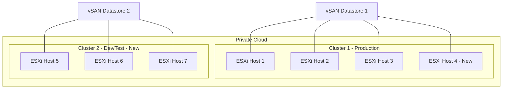

# How to Scale a Google Cloud VMware Engine Private Cloud by Adding ESXi Hosts and Clusters

Author: [nawazdhandala](https://www.github.com/nawazdhandala)

Tags: GCP, VMware Engine, ESXi, Scaling, Private Cloud

Description: Scale your Google Cloud VMware Engine private cloud by adding ESXi hosts and clusters to meet growing workload demands with zero downtime.

---

One of the key advantages of running VMware workloads on Google Cloud VMware Engine (GCVE) is the ability to scale compute resources on demand. Unlike on-premises environments where scaling means ordering hardware, waiting weeks for delivery, and racking servers, GCVE lets you add ESXi hosts to an existing cluster or create entirely new clusters within minutes.

This guide covers the practical steps and considerations for scaling your GCVE private cloud, including when to add hosts versus when to create new clusters.

## Understanding GCVE Scaling Options

GCVE gives you two ways to scale:

**Vertical scaling within a cluster**: Add more ESXi hosts to an existing cluster. Each host adds CPU, memory, and storage to the shared resource pool. A cluster can have between 3 and 16 hosts.

**Horizontal scaling with new clusters**: Add a new cluster to your private cloud. A private cloud can have multiple clusters, each serving different workloads or environments.



## Adding Hosts to an Existing Cluster

Adding a host to an existing cluster is the simplest scaling operation. The new host joins the vSphere cluster and vSAN storage pool automatically.

```bash
# Check the current state of your private cloud
gcloud vmware private-clouds describe my-gcve-cloud \
  --location=us-central1 \
  --format="yaml(managementCluster)"

# Add a single host to the management cluster
gcloud vmware private-clouds clusters update management-cluster \
  --private-cloud=my-gcve-cloud \
  --location=us-central1 \
  --node-type-config=type=standard-72,count=4  # Increase from 3 to 4

# For custom node types, specify the appropriate type
gcloud vmware private-clouds clusters update management-cluster \
  --private-cloud=my-gcve-cloud \
  --location=us-central1 \
  --node-type-config=type=standard-72,count=5  # Scale to 5 hosts
```

You can also use the REST API for automation.

```python
# scale_cluster.py - Programmatically add hosts to a cluster
from google.cloud import vmwareengine_v1

def add_hosts_to_cluster(project_id, location, private_cloud, cluster_name, target_count):
    """Add ESXi hosts to an existing GCVE cluster."""
    client = vmwareengine_v1.VmwareEngineClient()

    cluster_path = (
        f"projects/{project_id}/locations/{location}"
        f"/privateClouds/{private_cloud}/clusters/{cluster_name}"
    )

    # Get the current cluster configuration
    cluster = client.get_cluster(name=cluster_path)
    current_count = cluster.node_type_configs["standard-72"].node_count

    if target_count <= current_count:
        print(f"Cluster already has {current_count} hosts. Target: {target_count}")
        return

    print(f"Scaling cluster from {current_count} to {target_count} hosts")

    # Update the node count
    cluster.node_type_configs["standard-72"].node_count = target_count

    update_mask = {"paths": ["node_type_configs"]}

    operation = client.update_cluster(
        cluster=cluster,
        update_mask=update_mask,
    )

    # Wait for the operation to complete
    result = operation.result()
    print(f"Cluster scaled successfully: {result.name}")
    return result


# Scale the cluster to 6 hosts
add_hosts_to_cluster(
    project_id="my-project",
    location="us-central1",
    private_cloud="my-gcve-cloud",
    cluster_name="management-cluster",
    target_count=6,
)
```

## Creating a New Cluster

When you need isolated resources for different workloads or want to separate production from development, create a new cluster.

```bash
# Create a new cluster in the existing private cloud
gcloud vmware private-clouds clusters create dev-cluster \
  --private-cloud=my-gcve-cloud \
  --location=us-central1 \
  --node-type-config=type=standard-72,count=3
```

Using the API for more control over cluster configuration.

```python
# create_cluster.py - Create a new cluster in a GCVE private cloud
from google.cloud import vmwareengine_v1

def create_new_cluster(project_id, location, private_cloud, cluster_name, node_count):
    """Create a new cluster in an existing GCVE private cloud."""
    client = vmwareengine_v1.VmwareEngineClient()

    parent = (
        f"projects/{project_id}/locations/{location}"
        f"/privateClouds/{private_cloud}"
    )

    cluster = vmwareengine_v1.Cluster(
        node_type_configs={
            "standard-72": vmwareengine_v1.NodeTypeConfig(
                node_count=node_count,
            )
        },
    )

    operation = client.create_cluster(
        parent=parent,
        cluster=cluster,
        cluster_id=cluster_name,
    )

    print(f"Creating cluster {cluster_name}. This takes approximately 30 minutes.")
    result = operation.result()
    print(f"Cluster created: {result.name}")
    return result


# Create a 3-node dev/test cluster
create_new_cluster(
    project_id="my-project",
    location="us-central1",
    private_cloud="my-gcve-cloud",
    cluster_name="dev-cluster",
    node_count=3,
)
```

## Auto-Scaling with Monitoring

While GCVE does not have built-in auto-scaling, you can build your own using Cloud Monitoring and Cloud Functions.

```python
# autoscale_monitor.py - Monitor cluster utilization and scale as needed
import functions_framework
from google.cloud import monitoring_v3
from google.cloud import vmwareengine_v1
import logging
from datetime import datetime, timedelta

logger = logging.getLogger(__name__)

# Scaling thresholds
SCALE_UP_CPU_THRESHOLD = 80  # Scale up when average CPU exceeds 80%
SCALE_DOWN_CPU_THRESHOLD = 30  # Scale down when average CPU drops below 30%
MIN_HOSTS = 3
MAX_HOSTS = 12
COOLDOWN_MINUTES = 30


@functions_framework.http
def check_and_scale(request):
    """Check cluster utilization and scale if needed."""
    # Get current CPU utilization from vCenter metrics via Cloud Monitoring
    avg_cpu = get_cluster_cpu_utilization()
    current_hosts = get_current_host_count()

    logger.info(f"Current state: {current_hosts} hosts, {avg_cpu}% CPU utilization")

    if avg_cpu > SCALE_UP_CPU_THRESHOLD and current_hosts < MAX_HOSTS:
        new_count = min(current_hosts + 1, MAX_HOSTS)
        logger.info(f"Scaling up from {current_hosts} to {new_count} hosts")
        scale_cluster(new_count)
        return {"action": "scale_up", "new_count": new_count}, 200

    elif avg_cpu < SCALE_DOWN_CPU_THRESHOLD and current_hosts > MIN_HOSTS:
        new_count = max(current_hosts - 1, MIN_HOSTS)
        logger.info(f"Scaling down from {current_hosts} to {new_count} hosts")
        scale_cluster(new_count)
        return {"action": "scale_down", "new_count": new_count}, 200

    return {"action": "no_change", "hosts": current_hosts, "cpu": avg_cpu}, 200


def get_cluster_cpu_utilization():
    """Query Cloud Monitoring for average CPU utilization."""
    client = monitoring_v3.MetricServiceClient()
    project_path = f"projects/my-project"

    now = datetime.utcnow()
    interval = monitoring_v3.TimeInterval(
        start_time={"seconds": int((now - timedelta(minutes=15)).timestamp())},
        end_time={"seconds": int(now.timestamp())},
    )

    # Query for VMware cluster CPU metrics
    results = client.list_time_series(
        request={
            "name": project_path,
            "filter": 'metric.type = "vmwareengine.googleapis.com/cluster/cpu/utilization"',
            "interval": interval,
            "view": monitoring_v3.ListTimeSeriesRequest.TimeSeriesView.FULL,
        }
    )

    values = []
    for series in results:
        for point in series.points:
            values.append(point.value.double_value)

    return sum(values) / len(values) if values else 0


def get_current_host_count():
    """Get the current number of hosts in the cluster."""
    client = vmwareengine_v1.VmwareEngineClient()
    cluster_path = (
        "projects/my-project/locations/us-central1"
        "/privateClouds/my-gcve-cloud/clusters/management-cluster"
    )
    cluster = client.get_cluster(name=cluster_path)
    return cluster.node_type_configs["standard-72"].node_count


def scale_cluster(target_count):
    """Scale the cluster to the target host count."""
    client = vmwareengine_v1.VmwareEngineClient()
    cluster_path = (
        "projects/my-project/locations/us-central1"
        "/privateClouds/my-gcve-cloud/clusters/management-cluster"
    )

    cluster = client.get_cluster(name=cluster_path)
    cluster.node_type_configs["standard-72"].node_count = target_count

    operation = client.update_cluster(
        cluster=cluster,
        update_mask={"paths": ["node_type_configs"]},
    )

    logger.info(f"Scaling operation started: {operation.operation.name}")
```

Schedule the scaling monitor.

```bash
# Check cluster utilization every 15 minutes
gcloud scheduler jobs create http gcve-autoscale-check \
  --location=us-central1 \
  --schedule="*/15 * * * *" \
  --uri="https://us-central1-YOUR_PROJECT.cloudfunctions.net/gcve-autoscaler" \
  --http-method=POST \
  --oidc-service-account-email=gcve-scaler@YOUR_PROJECT.iam.gserviceaccount.com
```

## Removing Hosts

When scaling down, hosts are removed from the cluster. vSAN rebalances data across the remaining hosts.

```bash
# Scale down the cluster by reducing the host count
gcloud vmware private-clouds clusters update management-cluster \
  --private-cloud=my-gcve-cloud \
  --location=us-central1 \
  --node-type-config=type=standard-72,count=3  # Reduce from more hosts to 3

# Monitor the vSAN rebalance operation in vCenter
# This takes time as data is redistributed
```

Make sure you have enough storage capacity on the remaining hosts before removing any. Check vSAN health in vCenter before initiating a scale-down.

## Wrapping Up

Scaling a GCVE private cloud is straightforward compared to on-premises infrastructure. Adding hosts takes minutes instead of weeks, and creating new clusters gives you workload isolation when you need it. By combining GCVE scaling APIs with Cloud Monitoring and Cloud Functions, you can build an auto-scaling system that adjusts capacity based on actual demand. The key is planning your node types and cluster layout to match your workload characteristics and maintaining enough headroom for vSAN storage rebalancing during scale operations.
