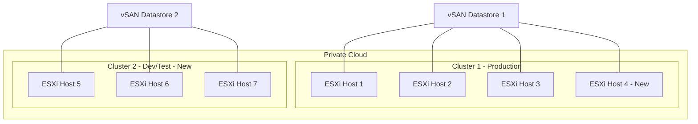

# How to Scale a Google Cloud VMware Engine Private Cloud by Adding ESXi Hosts

Author: [nawazdhandala](https://www.github.com/nawazdhandala)

Tags: GCP, VMware Engine, ESXi, Scaling, Private Cloud

Description: Scale your Google Cloud VMware Engine private cloud by adding ESXi hosts and clusters to meet growing workload demands with zero downtime.

---

One of the key advantages of running VMware workloads on Google Cloud VMware Engine (GCVE) is the ability to scale compute resources on demand. Unlike on-premises environments where scaling means ordering hardware, waiting weeks for delivery, and racking servers, GCVE lets you add ESXi hosts to an existing cluster or create entirely new clusters without procuring and installing hardware.

This guide covers the practical steps and considerations for scaling your GCVE private cloud, including when to add hosts versus when to create new clusters.

## Understanding GCVE Scaling Options

GCVE gives you two ways to scale:

**Vertical scaling within a cluster**: Add more ESXi hosts to an existing cluster. Each host adds CPU, memory, and storage to the shared resource pool. A standard cluster that meets SLA requirements can have between 3 and 32 hosts.

**Horizontal scaling with new clusters**: Add a new cluster to your private cloud. A private cloud can have multiple clusters, each serving different workloads or environments.


```mermaid
graph TD
    subgraph Private Cloud
        subgraph Cluster 1 - Production
            H1[ESXi Host 1]
            H2[ESXi Host 2]
            H3[ESXi Host 3]
            H4[ESXi Host 4 - New]
        end
        subgraph Cluster 2 - Dev/Test - New
            H5[ESXi Host 5]
            H6[ESXi Host 6]
            H7[ESXi Host 7]
        end
    end
    VSAN1[vSAN Datastore 1] --- H1
    VSAN1 --- H2
    VSAN1 --- H3
    VSAN1 --- H4
    VSAN2[vSAN Datastore 2] --- H5
    VSAN2 --- H6
    VSAN2 --- H7
```

## Adding Hosts to an Existing Cluster

Adding a host to an existing cluster is the simplest scaling operation. The new host joins the vSphere cluster and vSAN storage pool automatically.

```bash
# Check the current state of your private cloud

gcloud vmware private-clouds describe my-gcve-cloud \
  --location=us-central1 \
  --format="yaml(managementCluster)"

# Add a single host to the management cluster
gcloud vmware private-clouds clusters update management-cluster \
  --private-cloud=my-gcve-cloud \
  --location=us-central1 \
  --update-nodes-config=type=standard-72,count=4  # Increase from 3 to 4

# For custom node types, specify the appropriate type
gcloud vmware private-clouds clusters update management-cluster \
  --private-cloud=my-gcve-cloud \
  --location=us-central1 \
  --update-nodes-config=type=standard-72,count=5  # Scale to 5 hosts
```

You can also use the Python client library for automation.

```python
# scale_cluster.py - Programmatically add hosts to a cluster
from google.cloud import vmwareengine_v1

def add_hosts_to_cluster(project_id, location, private_cloud, cluster_name, target_count):
    """Add ESXi hosts to an existing GCVE cluster."""
    client = vmwareengine_v1.VmwareEngineClient()

    cluster_path = (
        f"projects/{project_id}/locations/{location}"
        f"/privateClouds/{private_cloud}/clusters/{cluster_name}"
    )

    # Get the current cluster configuration
    cluster = client.get_cluster(name=cluster_path)
    current_count = cluster.node_type_configs["standard-72"].node_count

    if target_count <= current_count:
        print(f"Cluster already has {current_count} hosts. Target: {target_count}")
        return

    print(f"Scaling cluster from {current_count} to {target_count} hosts")

    # Update the node count
    request = vmwareengine_v1.UpdateClusterRequest()
    request.cluster = vmwareengine_v1.Cluster()
    request.cluster.name = cluster_path
    request.cluster.node_type_configs = {
        "standard-72": vmwareengine_v1.NodeTypeConfig(node_count=target_count)
    }
    request.update_mask = "nodeTypeConfigs.*.nodeCount"

    operation = client.update_cluster(request)

    # Wait for the operation to complete
    result = operation.result()
    print(f"Cluster scaled successfully: {result.name}")
    return result


# Scale the cluster to 6 hosts
add_hosts_to_cluster(
    project_id="my-project",
    location="us-central1",
    private_cloud="my-gcve-cloud",
    cluster_name="management-cluster",
    target_count=6,
)
```

## Creating a New Cluster

When you need isolated resources for different workloads or want to separate production from development, create a new cluster.

```bash
# Create a new cluster in the existing private cloud
gcloud vmware private-clouds clusters create dev-cluster \
  --private-cloud=my-gcve-cloud \
  --location=us-central1 \
  --node-type-config=type=standard-72,count=3
```

Using the API for more control over cluster configuration.

```python
# create_cluster.py - Create a new cluster in a GCVE private cloud
from google.cloud import vmwareengine_v1

def create_new_cluster(project_id, location, private_cloud, cluster_name, node_count):
    """Create a new cluster in an existing GCVE private cloud."""
    client = vmwareengine_v1.VmwareEngineClient()

    parent = (
        f"projects/{project_id}/locations/{location}"
        f"/privateClouds/{private_cloud}"
    )

    cluster = vmwareengine_v1.Cluster(
        node_type_configs={
            "standard-72": vmwareengine_v1.NodeTypeConfig(
                node_count=node_count,
            )
        },
    )

    operation = client.create_cluster(
        parent=parent,
        cluster=cluster,
        cluster_id=cluster_name,
    )

    print(f"Creating cluster {cluster_name}. This long-running operation may take over an hour.")
    result = operation.result()
    print(f"Cluster created: {result.name}")
    return result


# Create a 3-node dev/test cluster
create_new_cluster(
    project_id="my-project",
    location="us-central1",
    private_cloud="my-gcve-cloud",
    cluster_name="dev-cluster",
    node_count=3,
)
```

## Auto-Scaling with Monitoring

GCVE has built-in autoscale that can expand or shrink a cluster based on CPU, memory, and storage utilization thresholds. You can configure autoscale on a cluster instead of building a separate Cloud Functions workflow.

```bash
# Enable autoscale for a cluster using CPU thresholds
gcloud vmware private-clouds clusters update management-cluster \
  --private-cloud=my-gcve-cloud \
  --location=us-central1 \
  --autoscaling-min-cluster-node-count=3 \
  --autoscaling-max-cluster-node-count=12 \
  --autoscaling-cool-down-period=1800s \
  --update-autoscaling-policy=name=cpu-policy,node-type-id=standard-72,scale-out-size=1,cpu-thresholds-scale-out=80,cpu-thresholds-scale-in=30,min-node-count=3,max-node-count=12
```

## Removing Hosts

When scaling down, hosts are removed from the cluster. vSAN rebalances data across the remaining hosts.

```bash
# Scale down the cluster by reducing the host count
gcloud vmware private-clouds clusters update management-cluster \
  --private-cloud=my-gcve-cloud \
  --location=us-central1 \
  --update-nodes-config=type=standard-72,count=3  # Reduce from more hosts to 3

# Monitor the vSAN rebalance operation in vCenter
# This takes time as data is redistributed
```

Make sure you have enough storage capacity on the remaining hosts before removing any. Check vSAN health in vCenter before initiating a scale-down.

## Wrapping Up

Scaling a GCVE private cloud is straightforward compared to on-premises infrastructure. Adding hosts avoids hardware procurement cycles, and creating new clusters gives you workload isolation when you need it. By combining GCVE scaling APIs or built-in autoscale with cluster metrics, you can adjust capacity based on actual demand. The key is planning your node types and cluster layout to match your workload characteristics and maintaining enough headroom for vSAN storage rebalancing during scale operations.
