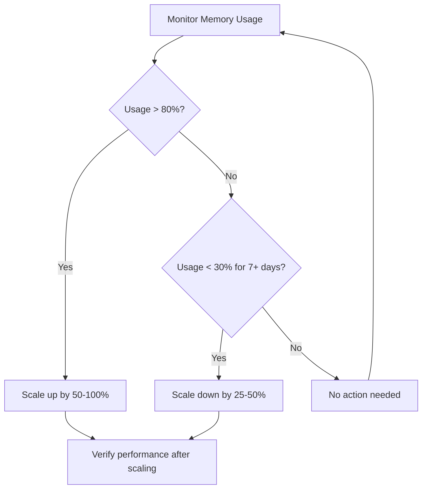

# How to Scale a Memorystore Redis Instance Up or Down

Author: [nawazdhandala](https://www.github.com/nawazdhandala)

Tags: GCP, Memorystore, Redis, Scaling, Performance Tuning

Description: Learn how to scale your Memorystore for Redis instance up or down by adjusting memory size, understanding the impact on availability, and planning your scaling strategy.

---

Your Redis memory needs change over time. Maybe you launched with 1 GB and your cache dataset has grown to fill it. Maybe you over-provisioned during initial setup and want to cut costs. Either way, Memorystore lets you resize your Redis instance without recreating it. But the scaling behavior differs between tiers, and there are a few things you should know before hitting the button.

In this post, I will cover how to scale Memorystore Redis instances up and down, what happens during the scaling process, and how to plan your scaling strategy.

## How Scaling Works

When you scale a Memorystore Redis instance, you change its memory allocation. Memorystore handles the underlying infrastructure changes:

- **Scaling up (increasing memory):** Memorystore provisions more memory and your data stays intact. The process typically takes a few minutes.
- **Scaling down (decreasing memory):** Memorystore reduces the allocated memory. You can only scale down to a size that fits your current dataset. If your data exceeds the new size, the scale operation will fail.

The impact on availability depends on your tier:

| Tier | Scaling Up | Scaling Down |
|------|-----------|-------------|
| Basic | Brief downtime | Brief downtime |
| Standard | Minimal disruption | Minimal disruption |

Standard Tier instances use replication to minimize disruption during scaling. The replica is scaled first, then a failover happens to the scaled replica, then the old primary is scaled.

## Checking Current Size and Usage

Before scaling, check your current memory allocation and usage:

```bash
# Get current instance size and memory usage
gcloud redis instances describe my-redis \
  --region=us-central1 \
  --format="table(memorySizeGb,name,tier)"
```

To see actual memory usage, connect to Redis:

```bash
# Check memory usage from Redis INFO command
redis-cli -h REDIS_IP -a AUTH_STRING INFO memory
```

Key fields to look at:
- `used_memory_human` - How much memory Redis is currently using
- `maxmemory` - The maximum memory limit
- `used_memory_peak_human` - The highest memory usage ever reached

```python
# Check Redis memory usage programmatically
import redis
import os

def check_memory_usage():
    """Check current Redis memory usage and report."""
    r = redis.Redis(
        host=os.environ.get("REDIS_HOST"),
        port=6379,
        password=os.environ.get("REDIS_AUTH"),
        decode_responses=True
    )

    info = r.info("memory")

    used_mb = info["used_memory"] / (1024 * 1024)
    max_mb = info["maxmemory"] / (1024 * 1024)
    usage_pct = (info["used_memory"] / info["maxmemory"]) * 100 if info["maxmemory"] > 0 else 0

    print(f"Used memory: {used_mb:.1f} MB")
    print(f"Max memory: {max_mb:.1f} MB")
    print(f"Usage: {usage_pct:.1f}%")
    print(f"Peak usage: {info['used_memory_peak_human']}")

    return usage_pct

usage = check_memory_usage()
if usage > 80:
    print("WARNING: Consider scaling up - memory usage above 80%")
```

## Scaling Up

Scaling up is the safer operation. You are adding capacity, so there is no risk of data loss.

```bash
# Scale up from current size to 5 GB
gcloud redis instances update my-redis \
  --region=us-central1 \
  --size=5
```

Monitor the scaling progress:

```bash
# Watch the instance state during scaling
watch -n 5 "gcloud redis instances describe my-redis \
  --region=us-central1 \
  --format='value(state,memorySizeGb)'"
```

The instance state will change to `UPDATING` during the scale operation and return to `READY` when complete.

### When to Scale Up

Scale up when you see these signals:

- Memory usage consistently above 80%
- Eviction rate increasing (keys being removed to make room)
- `maxmemory-policy` kicking in more frequently than expected
- Application experiencing cache misses due to eviction

```bash
# Check the eviction count - rising evictions mean you need more memory
redis-cli -h REDIS_IP -a AUTH_STRING INFO stats | grep evicted_keys
```

## Scaling Down

Scaling down saves money but requires caution. Your current dataset must fit in the smaller memory allocation.

```bash
# Scale down from current size to 2 GB
gcloud redis instances update my-redis \
  --region=us-central1 \
  --size=2
```

The operation will fail if your dataset exceeds the target size. Check first:

```bash
# Verify dataset will fit in the new size
# Current used memory must be less than the target size
redis-cli -h REDIS_IP -a AUTH_STRING INFO memory | grep used_memory_human
```

### When to Scale Down

Scale down when:

- Memory usage is consistently below 50% of allocated capacity
- You over-provisioned during initial setup
- The cached dataset shrinks after a product change
- Cost optimization is a priority

### Preparing to Scale Down

If your current dataset is close to the target size, free up memory first:

```python
# Cleanup script to reduce memory usage before scaling down
import redis

def prepare_for_scale_down(target_mb):
    """Remove low-value data to fit within a smaller memory allocation."""
    r = redis.Redis(host="REDIS_IP", password="AUTH_STRING", decode_responses=True)

    current_usage = r.info("memory")["used_memory"] / (1024 * 1024)
    target_bytes = target_mb * 1024 * 1024

    print(f"Current usage: {current_usage:.1f} MB, Target: {target_mb} MB")

    if current_usage <= target_mb * 0.8:
        print("Already within target - safe to scale down")
        return

    # Strategy 1: Reduce TTL on low-priority keys
    # Find keys matching a pattern and set shorter TTLs
    for key in r.scan_iter(match="cache:low-priority:*", count=1000):
        r.expire(key, 60)  # Expire in 60 seconds

    # Strategy 2: Delete known temporary data
    temp_keys = list(r.scan_iter(match="temp:*", count=10000))
    if temp_keys:
        r.delete(*temp_keys)
        print(f"Deleted {len(temp_keys)} temporary keys")

    # Check usage again
    new_usage = r.info("memory")["used_memory"] / (1024 * 1024)
    print(f"Usage after cleanup: {new_usage:.1f} MB")

prepare_for_scale_down(2048)  # Target 2 GB
```

## Planning a Scaling Strategy

Rather than reacting to memory pressure, establish a proactive scaling strategy:



### Setting Up Alerts

Create Cloud Monitoring alerts to trigger scaling decisions:

```bash
# Alert when memory usage exceeds 80%
gcloud monitoring policies create \
  --display-name="Redis High Memory Usage" \
  --condition-display-name="Memory above 80%" \
  --condition-filter='resource.type="redis_instance" AND metric.type="redis.googleapis.com/stats/memory/usage_ratio"' \
  --condition-threshold-value=0.8 \
  --condition-comparison=COMPARISON_GT \
  --notification-channels=YOUR_CHANNEL_ID

# Alert when memory usage drops below 30%
gcloud monitoring policies create \
  --display-name="Redis Low Memory Usage" \
  --condition-display-name="Memory below 30%" \
  --condition-filter='resource.type="redis_instance" AND metric.type="redis.googleapis.com/stats/memory/usage_ratio"' \
  --condition-threshold-value=0.3 \
  --condition-comparison=COMPARISON_LT \
  --notification-channels=YOUR_CHANNEL_ID
```

## Scaling Limits

Be aware of the limits:

- **Minimum size:** 1 GB
- **Maximum size:** 300 GB
- **Scaling increments:** 1 GB increments
- **Concurrent operations:** Only one scaling operation at a time
- **Scaling frequency:** No hard limit, but allow the previous operation to complete before starting another

## Impact on Connections

During scaling:

**Basic Tier:** Your Redis instance briefly goes offline. All connections are dropped. Applications need to reconnect after the scaling completes.

**Standard Tier:** The process uses the replication mechanism. One of the nodes is scaled first, then a failover happens. Impact is similar to a failover - brief connection disruption of 30-60 seconds.

Prepare your applications for the disruption:

```python
# Connection wrapper that handles scaling-related disconnections
import redis
import time

class ResilientRedisClient:
    """Redis client that handles disconnections during scaling."""

    def __init__(self, host, port, password):
        self.host = host
        self.port = port
        self.password = password
        self.client = self._connect()

    def _connect(self):
        """Create a new Redis connection."""
        return redis.Redis(
            host=self.host,
            port=self.port,
            password=self.password,
            decode_responses=True,
            socket_timeout=5,
            socket_connect_timeout=5,
            retry_on_timeout=True
        )

    def execute(self, method_name, *args, **kwargs):
        """Execute a Redis command with automatic reconnection."""
        max_retries = 5

        for attempt in range(max_retries):
            try:
                method = getattr(self.client, method_name)
                return method(*args, **kwargs)
            except (redis.ConnectionError, redis.TimeoutError) as e:
                print(f"Redis error (attempt {attempt + 1}): {e}")
                time.sleep(2 ** attempt)  # Exponential backoff
                self.client = self._connect()

        raise Exception(f"Failed to execute {method_name} after {max_retries} retries")
```

## Cost Impact

Scaling directly affects your bill:

- Memorystore is billed per GB-hour
- Scaling up doubles your cost if you double the size
- Standard Tier costs roughly 2x the per-GB rate (primary + replica)

For a Standard Tier instance:
- 2 GB = ~$140/month
- 5 GB = ~$350/month
- 10 GB = ~$700/month

These are approximate US region prices. Check the pricing calculator for exact figures.

## Wrapping Up

Scaling Memorystore Redis is a straightforward operation, but doing it well requires monitoring, planning, and application resilience. Monitor your memory usage, set up alerts at 80% and 30% thresholds, and make sure your applications handle the brief disruption during scaling. Scale up proactively before memory pressure causes evictions, and scale down when sustained low usage shows you are over-provisioned.
