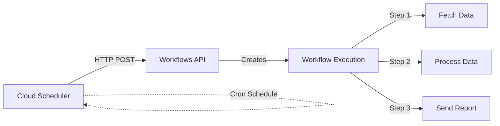

# How to Schedule a Cloud Workflow to Run on a Recurring Basis with Cloud Scheduler

Author: [nawazdhandala](https://www.github.com/nawazdhandala)

Tags: GCP, Cloud Workflows, Cloud Scheduler, Cron, Automation

Description: Step-by-step guide to scheduling Google Cloud Workflows to run automatically on a recurring basis using Cloud Scheduler and cron expressions.

---

Running a Cloud Workflow manually is fine for testing, but in production you almost always want it to execute on a schedule. Maybe it is a nightly data sync, an hourly health check, or a weekly report generator. Google Cloud Scheduler is the natural companion for this - it lets you trigger your workflow on any cron schedule you define.

In this post, I will show you how to connect Cloud Scheduler to Cloud Workflows so your orchestration runs automatically.

## Prerequisites

You will need:

- A Google Cloud project with billing enabled
- The Workflows and Cloud Scheduler APIs enabled
- A deployed Cloud Workflow
- A service account with the right permissions

Start by enabling both APIs.

```bash
# Enable both required APIs
gcloud services enable workflows.googleapis.com cloudscheduler.googleapis.com
```

## Setting Up the Service Account

The Cloud Scheduler job needs a service account that has permission to invoke your workflow. Create one specifically for this purpose.

```bash
# Create a service account for the scheduler
gcloud iam service-accounts create workflow-scheduler \
  --display-name="Workflow Scheduler SA"

# Grant it permission to invoke workflows
gcloud projects add-iam-policy-binding YOUR_PROJECT_ID \
  --member="serviceAccount:workflow-scheduler@YOUR_PROJECT_ID.iam.gserviceaccount.com" \
  --role="roles/workflows.invoker"
```

## Creating a Simple Workflow to Schedule

If you do not already have a workflow deployed, here is a simple one you can use for testing.

```yaml
# daily-report.yaml
# A simple workflow that generates and sends a daily report
main:
  steps:
    - get_timestamp:
        assign:
          - current_time: ${sys.now()}
          - project_id: ${sys.get_env("GOOGLE_CLOUD_PROJECT_ID")}

    - log_start:
        call: sys.log
        args:
          text: ${"Daily report workflow started at " + string(current_time)}
          severity: "INFO"

    - fetch_metrics:
        call: http.get
        args:
          url: ${"https://monitoring.googleapis.com/v3/projects/" + project_id + "/timeSeries"}
          auth:
            type: OAuth2
          query:
            filter: 'metric.type="compute.googleapis.com/instance/cpu/utilization"'
            interval.endTime: ${time.format(current_time)}
            interval.startTime: ${time.format(current_time - 86400)}
        result: metrics_response

    - log_complete:
        call: sys.log
        args:
          text: "Daily report workflow completed successfully"
          severity: "INFO"

    - return_result:
        return:
          status: "success"
          timestamp: ${current_time}
```

Deploy it.

```bash
# Deploy the workflow
gcloud workflows deploy daily-report \
  --source=daily-report.yaml \
  --service-account=workflow-scheduler@YOUR_PROJECT_ID.iam.gserviceaccount.com \
  --location=us-central1
```

## Creating the Cloud Scheduler Job

Now create a Cloud Scheduler job that triggers the workflow. The key is using the Workflows REST API as the target.

```bash
# Create a scheduler job that runs the workflow every day at 2 AM UTC
gcloud scheduler jobs create http daily-report-trigger \
  --location=us-central1 \
  --schedule="0 2 * * *" \
  --uri="https://workflowexecutions.googleapis.com/v1/projects/YOUR_PROJECT_ID/locations/us-central1/workflows/daily-report/executions" \
  --http-method=POST \
  --message-body='{}' \
  --oauth-service-account-email=workflow-scheduler@YOUR_PROJECT_ID.iam.gserviceaccount.com \
  --oauth-token-scope="https://www.googleapis.com/auth/cloud-platform" \
  --time-zone="UTC"
```

Let me break down the important parameters:

- `--schedule` uses standard cron syntax
- `--uri` points to the Workflows executions API endpoint
- `--http-method=POST` creates a new execution
- `--message-body` can contain runtime arguments for the workflow
- `--oauth-service-account-email` handles authentication

## Understanding Cron Syntax

The `--schedule` field uses standard Unix cron format with five fields.

```
# Cron expression format:
# MIN  HOUR  DAY  MONTH  WEEKDAY
#  0    2     *     *       *

# Common schedule examples:
# Every hour:          0 * * * *
# Every 6 hours:       0 */6 * * *
# Daily at midnight:   0 0 * * *
# Daily at 2 AM:       0 2 * * *
# Every Monday at 9AM: 0 9 * * 1
# First of month:      0 0 1 * *
# Every 15 minutes:    */15 * * * *
# Weekdays at 8 AM:    0 8 * * 1-5
```

## Passing Runtime Arguments on a Schedule

If your workflow accepts arguments, you can include them in the scheduler job's message body.

```bash
# Create a scheduler job that passes arguments to the workflow
gcloud scheduler jobs create http weekly-cleanup-trigger \
  --location=us-central1 \
  --schedule="0 3 * * 0" \
  --uri="https://workflowexecutions.googleapis.com/v1/projects/YOUR_PROJECT_ID/locations/us-central1/workflows/weekly-cleanup/executions" \
  --http-method=POST \
  --message-body='{"argument": "{\"environment\": \"production\", \"retain_days\": 30, \"dry_run\": false}"}' \
  --oauth-service-account-email=workflow-scheduler@YOUR_PROJECT_ID.iam.gserviceaccount.com \
  --oauth-token-scope="https://www.googleapis.com/auth/cloud-platform" \
  --time-zone="America/New_York"
```

Note how the `argument` field contains a JSON string within the JSON body. This is because the Workflows API expects the `argument` field to be a string containing JSON.

## Testing the Scheduler Job

You do not have to wait for the next scheduled time. Force-run the job to test it immediately.

```bash
# Manually trigger the scheduler job right now
gcloud scheduler jobs run daily-report-trigger \
  --location=us-central1
```

Then verify the workflow executed.

```bash
# Check the latest workflow executions
gcloud workflows executions list daily-report \
  --location=us-central1 \
  --limit=5
```

## Updating the Schedule

Need to change the schedule? Update the existing job.

```bash
# Change the schedule to run every 6 hours
gcloud scheduler jobs update http daily-report-trigger \
  --location=us-central1 \
  --schedule="0 */6 * * *"
```

## Pausing and Resuming the Schedule

You can pause a scheduler job without deleting it.

```bash
# Pause the scheduled job
gcloud scheduler jobs pause daily-report-trigger \
  --location=us-central1

# Resume it later
gcloud scheduler jobs resume daily-report-trigger \
  --location=us-central1
```

## Setting Up Multiple Schedules for One Workflow

Sometimes you need the same workflow to run on different schedules with different parameters. Just create multiple scheduler jobs.

```bash
# Hourly lightweight check
gcloud scheduler jobs create http report-hourly \
  --location=us-central1 \
  --schedule="0 * * * *" \
  --uri="https://workflowexecutions.googleapis.com/v1/projects/YOUR_PROJECT_ID/locations/us-central1/workflows/report-generator/executions" \
  --http-method=POST \
  --message-body='{"argument": "{\"report_type\": \"summary\"}"}' \
  --oauth-service-account-email=workflow-scheduler@YOUR_PROJECT_ID.iam.gserviceaccount.com \
  --oauth-token-scope="https://www.googleapis.com/auth/cloud-platform"

# Daily detailed report
gcloud scheduler jobs create http report-daily \
  --location=us-central1 \
  --schedule="0 6 * * *" \
  --uri="https://workflowexecutions.googleapis.com/v1/projects/YOUR_PROJECT_ID/locations/us-central1/workflows/report-generator/executions" \
  --http-method=POST \
  --message-body='{"argument": "{\"report_type\": \"detailed\"}"}' \
  --oauth-service-account-email=workflow-scheduler@YOUR_PROJECT_ID.iam.gserviceaccount.com \
  --oauth-token-scope="https://www.googleapis.com/auth/cloud-platform"
```

## Monitoring Scheduled Executions

Keep an eye on your scheduled workflows by checking both the scheduler job status and workflow execution history.

```bash
# Check scheduler job status and last run time
gcloud scheduler jobs describe daily-report-trigger \
  --location=us-central1

# View recent workflow executions with their status
gcloud workflows executions list daily-report \
  --location=us-central1 \
  --limit=10 \
  --format="table(name.basename(), state, startTime, endTime)"
```

You can also set up alerting policies in Cloud Monitoring to get notified when a scheduled workflow fails, which is something I strongly recommend for production workflows.

## Architecture Overview

Here is how the pieces fit together.



## Wrapping Up

Scheduling Cloud Workflows with Cloud Scheduler is straightforward once you know the pattern: create a scheduler job that POSTs to the Workflows executions API endpoint, use a service account with the invoker role, and define your cron schedule. You can pass different arguments, run multiple schedules against the same workflow, and pause or resume as needed. For production workloads, make sure to add monitoring so you catch failures quickly.
