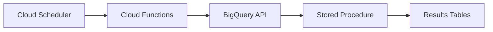

# How to Schedule BigQuery Stored Procedures Using Cloud Scheduler

Author: [nawazdhandala](https://www.github.com/nawazdhandala)

Tags: GCP, BigQuery, Cloud Scheduler, Stored Procedures, Automation

Description: Learn how to use Google Cloud Scheduler to trigger BigQuery stored procedures on a schedule, including setup with Cloud Functions and direct BigQuery API calls.

---

BigQuery scheduled queries are convenient, but they have limitations. They cannot call stored procedures directly, and they lack the flexibility of a full scheduling system. If you have complex stored procedures that need to run on a schedule, Cloud Scheduler paired with BigQuery gives you much more control.

I have used this pattern in production for data pipelines that need retry logic, conditional execution, and integration with other GCP services. Let me show you how to set it up.

## Architecture Overview

The typical setup looks like this:



Cloud Scheduler triggers a Cloud Function on a cron schedule. The Cloud Function calls the BigQuery API to execute the stored procedure. You can also skip Cloud Functions and use Cloud Scheduler to call the BigQuery API directly via HTTP, but the Cloud Functions approach gives you more flexibility for error handling and logging.

## Method 1: Cloud Scheduler with Cloud Functions

This is the most flexible approach. You write a Cloud Function that calls your stored procedure, then schedule it with Cloud Scheduler.

First, create the stored procedure in BigQuery.

```sql
-- Create a stored procedure that processes daily data
CREATE OR REPLACE PROCEDURE `my_project.my_dataset.daily_etl`(
  IN process_date DATE,
  OUT rows_processed INT64
)
BEGIN
  DELETE FROM `my_project.my_dataset.daily_metrics`
  WHERE metric_date = process_date;

  INSERT INTO `my_project.my_dataset.daily_metrics`
  SELECT
    process_date AS metric_date,
    region,
    COUNT(*) AS event_count,
    COUNT(DISTINCT user_id) AS unique_users,
    SUM(revenue) AS total_revenue
  FROM `my_project.my_dataset.events`
  WHERE event_date = process_date
  GROUP BY region;

  SET rows_processed = (
    SELECT COUNT(*)
    FROM `my_project.my_dataset.daily_metrics`
    WHERE metric_date = process_date
  );
END;
```

Now create the Cloud Function. Here is a Python-based Cloud Function that calls the stored procedure.

```python
# main.py - Cloud Function to execute BigQuery stored procedure
import functions_framework
from google.cloud import bigquery
from datetime import date, timedelta
import json

@functions_framework.http
def trigger_daily_etl(request):
    """HTTP Cloud Function that triggers the BigQuery daily ETL procedure."""
    # Initialize the BigQuery client
    client = bigquery.Client()

    # Parse the request for optional date override
    request_json = request.get_json(silent=True)
    if request_json and 'process_date' in request_json:
        process_date = request_json['process_date']
    else:
        # Default to yesterday
        process_date = (date.today() - timedelta(days=1)).isoformat()

    # Build the SQL to call the stored procedure
    query = f"""
    DECLARE rows_out INT64;
    CALL `my_project.my_dataset.daily_etl`(
        DATE('{process_date}'),
        rows_out
    );
    SELECT rows_out;
    """

    try:
        # Execute the query and wait for results
        query_job = client.query(query)
        results = query_job.result()

        # Get the output parameter value
        for row in results:
            rows_processed = row[0]

        return json.dumps({
            'status': 'success',
            'process_date': process_date,
            'rows_processed': rows_processed
        }), 200

    except Exception as e:
        return json.dumps({
            'status': 'error',
            'process_date': process_date,
            'error': str(e)
        }), 500
```

The requirements file for the Cloud Function.

```
# requirements.txt
functions-framework==3.*
google-cloud-bigquery>=3.0.0
```

Deploy the Cloud Function.

```bash
# Deploy the Cloud Function
gcloud functions deploy trigger-daily-etl \
  --runtime python311 \
  --trigger-http \
  --entry-point trigger_daily_etl \
  --region us-central1 \
  --timeout 540 \
  --memory 256MB \
  --service-account my-etl-sa@my_project.iam.gserviceaccount.com
```

Now create the Cloud Scheduler job.

```bash
# Create a Cloud Scheduler job that triggers the function daily at 6 AM UTC
gcloud scheduler jobs create http daily-etl-trigger \
  --schedule="0 6 * * *" \
  --uri="https://us-central1-my_project.cloudfunctions.net/trigger-daily-etl" \
  --http-method=POST \
  --headers="Content-Type=application/json" \
  --message-body='{}' \
  --time-zone="UTC" \
  --oidc-service-account-email=my-scheduler-sa@my_project.iam.gserviceaccount.com \
  --oidc-token-audience="https://us-central1-my_project.cloudfunctions.net/trigger-daily-etl"
```

## Method 2: Direct BigQuery API from Cloud Scheduler

For simpler cases, you can skip Cloud Functions entirely and have Cloud Scheduler call the BigQuery REST API directly.

```bash
# Create a scheduler job that calls BigQuery API directly
gcloud scheduler jobs create http daily-etl-direct \
  --schedule="0 6 * * *" \
  --uri="https://bigquery.googleapis.com/bigquery/v2/projects/my_project/jobs" \
  --http-method=POST \
  --headers="Content-Type=application/json" \
  --message-body='{
    "configuration": {
      "query": {
        "query": "DECLARE rows_out INT64; CALL `my_project.my_dataset.daily_etl`(DATE_SUB(CURRENT_DATE(), INTERVAL 1 DAY), rows_out);",
        "useLegacySql": false
      }
    }
  }' \
  --time-zone="UTC" \
  --oauth-service-account-email=my-etl-sa@my_project.iam.gserviceaccount.com
```

This is simpler but you lose the ability to handle errors, log results, or add custom logic around the procedure call.

## Method 3: Using Cloud Workflows

Cloud Workflows provides a middle ground between the direct API call and a full Cloud Function.

```yaml
# workflow.yaml - Cloud Workflow to call BigQuery stored procedure
main:
  steps:
    - init:
        assign:
          - project_id: "my_project"
          - dataset_id: "my_dataset"
          - process_date: ${text.substring(time.format(sys.now()), 0, 10)}

    - call_procedure:
        call: googleapis.bigquery.v2.jobs.insert
        args:
          projectId: ${project_id}
          body:
            configuration:
              query:
                query: ${"DECLARE rows_out INT64; CALL `" + project_id + "." + dataset_id + ".daily_etl`(DATE('" + process_date + "'), rows_out);"}
                useLegacySql: false
        result: query_result

    - check_result:
        switch:
          - condition: ${query_result.status.state == "DONE"}
            next: success
          - condition: true
            next: failure

    - success:
        return:
          status: "success"
          job_id: ${query_result.jobReference.jobId}

    - failure:
        raise:
          message: "Query failed"
          details: ${query_result.status}
```

Deploy and schedule the workflow.

```bash
# Deploy the workflow
gcloud workflows deploy daily-etl-workflow \
  --source=workflow.yaml \
  --location=us-central1

# Create a scheduler job to trigger the workflow
gcloud scheduler jobs create http daily-etl-workflow-trigger \
  --schedule="0 6 * * *" \
  --uri="https://workflowexecutions.googleapis.com/v1/projects/my_project/locations/us-central1/workflows/daily-etl-workflow/executions" \
  --http-method=POST \
  --message-body='{}' \
  --time-zone="UTC" \
  --oauth-service-account-email=my-etl-sa@my_project.iam.gserviceaccount.com
```

## Setting Up IAM Permissions

The service accounts need the right permissions to execute BigQuery jobs and invoke functions.

```bash
# Grant BigQuery Job User role to the ETL service account
gcloud projects add-iam-policy-binding my_project \
  --member="serviceAccount:my-etl-sa@my_project.iam.gserviceaccount.com" \
  --role="roles/bigquery.jobUser"

# Grant BigQuery Data Editor for reading and writing data
gcloud projects add-iam-policy-binding my_project \
  --member="serviceAccount:my-etl-sa@my_project.iam.gserviceaccount.com" \
  --role="roles/bigquery.dataEditor"

# Grant Cloud Functions Invoker to the scheduler service account
gcloud functions add-iam-policy-binding trigger-daily-etl \
  --member="serviceAccount:my-scheduler-sa@my_project.iam.gserviceaccount.com" \
  --role="roles/cloudfunctions.invoker" \
  --region=us-central1
```

## Adding Retry Logic

Cloud Scheduler supports automatic retries. Configure retry settings when creating the job.

```bash
# Create a scheduler job with retry configuration
gcloud scheduler jobs create http daily-etl-with-retries \
  --schedule="0 6 * * *" \
  --uri="https://us-central1-my_project.cloudfunctions.net/trigger-daily-etl" \
  --http-method=POST \
  --headers="Content-Type=application/json" \
  --message-body='{}' \
  --time-zone="UTC" \
  --attempt-deadline=600s \
  --max-retry-attempts=3 \
  --min-backoff=30s \
  --max-backoff=300s \
  --oidc-service-account-email=my-scheduler-sa@my_project.iam.gserviceaccount.com
```

## Monitoring and Alerting

Monitor your scheduled procedure executions using Cloud Logging and alerting.

```bash
# View recent Cloud Scheduler execution logs
gcloud logging read "resource.type=cloud_scheduler_job AND resource.labels.job_id=daily-etl-trigger" \
  --limit=10 \
  --format="table(timestamp, jsonPayload.status)"
```

You can also create a monitoring dashboard or alert policy in Cloud Monitoring to get notified when jobs fail.

## Wrapping Up

Cloud Scheduler gives you production-grade scheduling for BigQuery stored procedures. The Cloud Functions approach offers the most flexibility for error handling and custom logic, while the direct API call keeps things simple for straightforward cases. Whichever method you choose, make sure to set up proper IAM permissions, retry logic, and monitoring.

For end-to-end monitoring of your scheduled data pipelines, [OneUptime](https://oneuptime.com) can help you track execution status across all your GCP services and alert you when things go wrong.
