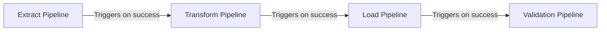

# How to Schedule Cloud Data Fusion Pipelines with Built-In Triggers and Cron

Author: [nawazdhandala](https://www.github.com/nawazdhandala)

Tags: GCP, Cloud Data Fusion, Pipeline Scheduling, Cron, ETL, Data Pipeline Automation

Description: Learn how to schedule Cloud Data Fusion pipelines using built-in time triggers and cron expressions to automate your data workflows on GCP.

---

Building a data pipeline is only half the job. The other half is making sure it runs reliably on a schedule without someone having to click a button every time. Cloud Data Fusion provides built-in scheduling capabilities that range from simple interval-based triggers to full cron expression support. In this post, I will cover how to set up both types of schedules and share some practical patterns for production pipeline orchestration.

## Understanding Cloud Data Fusion Scheduling Options

Cloud Data Fusion gives you two main approaches for scheduling pipelines:

1. **Time-based schedules** - Run pipelines at fixed intervals or specific times using cron expressions
2. **Pipeline triggers** - Run a pipeline automatically when another pipeline completes (useful for chaining pipelines)

Both options are configured through the Data Fusion UI after you deploy a pipeline. You cannot schedule a pipeline that has not been deployed yet.

## Setting Up a Time-Based Schedule

### Using the UI

After deploying your pipeline, navigate to the pipeline detail page. Click the "Schedule" button in the top toolbar. This opens the scheduling configuration dialog.

You will see a dropdown that lets you choose between:

- **Every X minutes/hours/days** - Simple interval-based scheduling
- **Custom cron** - Full cron expression for precise control

For a simple daily schedule, select "Every 1 day" and set the start time. For example, if you want your pipeline to run every day at 2:00 AM UTC, set the interval to 1 day and the start time to 02:00.

### Using Cron Expressions

For more complex schedules, switch to the custom cron option. Cloud Data Fusion uses standard 5-field cron syntax:

```
# Cron expression format
# minute  hour  day-of-month  month  day-of-week
```

Here are some common cron expressions for data pipeline scheduling:

```
# Run every day at 3 AM UTC
0 3 * * *

# Run every Monday at 6 AM UTC
0 6 * * 1

# Run every hour on weekdays
0 * * * 1-5

# Run at midnight on the first day of every month
0 0 1 * *

# Run every 15 minutes
*/15 * * * *

# Run at 8 AM and 8 PM every day
0 8,20 * * *
```

When entering a cron expression, the UI shows a human-readable preview of when the pipeline will next run. Always double-check this preview to make sure it matches your expectations.

### Configuring the Schedule via REST API

If you prefer programmatic configuration, you can use the Cloud Data Fusion REST API to set up schedules. Here is an example using curl:

```bash
# Create a schedule for a deployed pipeline using the CDAP REST API
curl -X PUT \
  "https://<CDAP_ENDPOINT>/v3/namespaces/default/apps/<PIPELINE_NAME>/schedules/dataPipelineSchedule" \
  -H "Authorization: Bearer $(gcloud auth print-access-token)" \
  -H "Content-Type: application/json" \
  -d '{
    "name": "dataPipelineSchedule",
    "description": "Daily schedule at 3 AM",
    "program": {
      "programName": "DataPipelineWorkflow",
      "programType": "Workflow"
    },
    "properties": {},
    "trigger": {
      "cronExpression": "0 3 * * *",
      "type": "TIME"
    },
    "constraints": [
      {
        "maxConcurrency": 1,
        "type": "CONCURRENCY",
        "waitUntilMet": false
      }
    ]
  }'
```

This is especially useful when you need to manage schedules across multiple pipelines or environments using infrastructure-as-code practices.

## Setting Up Pipeline Triggers

Pipeline triggers let you chain pipelines together so that one starts automatically when another finishes. This is perfect for scenarios where you have a series of dependent data processing steps.

### Configuring a Pipeline Trigger

On the pipeline detail page, click "Schedule" and then switch to the "Pipeline Triggers" tab. Click "Set a trigger" and you will see a list of all deployed pipelines in your namespace.

Select the upstream pipeline that should trigger this one. You can choose to trigger on:

- **Succeeded** - The upstream pipeline completed successfully
- **Failed** - The upstream pipeline failed
- **Killed** - The upstream pipeline was manually stopped

For most production use cases, you will trigger on "Succeeded" only. This way, if the upstream pipeline fails, the downstream pipeline does not attempt to process incomplete data.

### Building a Pipeline Chain

A common pattern is to build a multi-stage data processing workflow using triggers:



Each pipeline in the chain has a trigger configured to start when the previous one succeeds. The first pipeline in the chain is the only one that needs a time-based schedule.

## Managing Concurrency

An important setting that people often overlook is concurrency control. By default, Cloud Data Fusion allows only one concurrent run of a scheduled pipeline. This means if a pipeline run takes longer than the scheduled interval, the next run will be skipped or queued.

You can configure this in the schedule settings:

- **Max Concurrent Runs: 1** - Only one instance runs at a time. If the previous run is still going, the new trigger is skipped.
- **Max Concurrent Runs: N** - Allow up to N instances to run simultaneously. Use this carefully - you need to make sure your source and sink can handle concurrent access.

For most batch ETL pipelines, keeping concurrency at 1 is the safest choice. If a run takes longer than expected, it is better to skip the next trigger than to have two runs competing for the same resources.

## Runtime Arguments and Scheduling

You can pass runtime arguments to scheduled pipeline runs. This is useful for parameterized pipelines that need to know which date partition to process.

In the schedule configuration, expand the "Runtime Arguments" section and add key-value pairs:

```
# Common runtime arguments for scheduled pipelines
logical.start.time = ${logicalStartTime(yyyy-MM-dd)}
processing.date = ${logicalStartTime(yyyy-MM-dd,0d,UTC)}
```

The `logicalStartTime` macro is particularly useful. It returns the scheduled run time (not the actual start time), which gives you predictable partition boundaries even if the pipeline starts a few minutes late.

## Handling Time Zones

Cloud Data Fusion schedules use UTC by default. If your business operates in a specific time zone, you need to account for the offset when setting up cron expressions.

For example, if you want a pipeline to run at 8 AM US Eastern Time:
- During Eastern Standard Time (UTC-5): Set the cron to `0 13 * * *`
- During Eastern Daylight Time (UTC-4): Set the cron to `0 12 * * *`

Since daylight saving time changes the offset, a common workaround is to schedule the pipeline in UTC and accept that the local time equivalent shifts by an hour twice a year. Alternatively, you can manage the schedule externally using Cloud Scheduler, which supports time zone-aware cron expressions.

## Monitoring Scheduled Runs

Once your schedule is active, you can monitor runs from the pipeline detail page. The "Runs" tab shows a history of all scheduled and manual runs, including:

- Start time and duration
- Status (running, succeeded, failed)
- Runtime arguments that were used
- Logs for debugging

Set up alerting for failed runs using Cloud Monitoring. Create an alert policy that watches for pipeline failure events and sends notifications to your team via email, Slack, or PagerDuty.

## Pausing and Resuming Schedules

If you need to temporarily stop a pipeline from running on schedule - maybe during a maintenance window or while you deploy changes - you can suspend the schedule without deleting it. Click the "Suspend" button on the schedule configuration page.

To restart it, click "Resume." The pipeline will pick up from the next scheduled trigger time as if nothing happened. Runs that were skipped during the suspension period are not retroactively executed.

## Best Practices for Production Scheduling

Start with conservative schedules and tighten them as you gain confidence in your pipeline's performance. If your data only changes daily, a daily schedule is simpler and cheaper than an hourly one.

Always set concurrency limits. Unbounded concurrent runs can overwhelm your data sources and lead to inconsistent results.

Use pipeline triggers instead of tight cron schedules when pipelines depend on each other. Triggers guarantee the upstream data is ready, while cron schedules can only approximate timing.

Monitor pipeline durations over time. If a pipeline that usually takes 30 minutes starts taking 2 hours, that is an early warning sign of data growth or infrastructure issues.

Keep your cron expressions in documentation or version control. It is easy to forget why a pipeline runs at a specific time three months after you set it up.

## Wrapping Up

Scheduling is what turns a data pipeline from a one-off script into a production system. Cloud Data Fusion makes it relatively painless with its built-in time triggers and pipeline triggers. Start with a simple daily schedule, add triggers for dependent pipelines, and layer on concurrency controls and monitoring as your data platform matures. The investment in proper scheduling pays off quickly - nothing beats waking up to find your data already processed and ready for the day.
