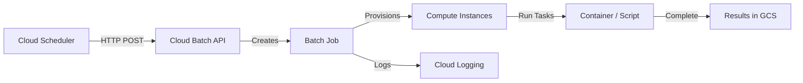

# How to Schedule Recurring Batch Jobs Using Cloud Scheduler and Google Cloud Batch

Author: [nawazdhandala](https://www.github.com/nawazdhandala)

Tags: GCP, Cloud Scheduler, Cloud Batch, Batch Processing, Job Scheduling

Description: Schedule recurring batch processing jobs on Google Cloud using Cloud Scheduler and Google Cloud Batch for automated high-performance computing workflows.

---

Google Cloud Batch is designed for running large-scale compute jobs - things like scientific simulations, data processing, rendering, and ETL workloads. But Batch itself does not have a built-in scheduler. It runs jobs when you tell it to, not on a timer. Cloud Scheduler fills that gap by triggering Batch jobs on any cron schedule you define.

This guide shows how to connect Cloud Scheduler to Cloud Batch so your batch workloads run automatically on a recurring basis.

## How the Integration Works

Cloud Scheduler calls the Cloud Batch API on your defined schedule to create a new job. Each job run is a separate Batch job with its own logs, metrics, and lifecycle.



## Setting Up the Batch Job Template

First, define the batch job that will run on each scheduled execution. This is a JSON template that Cloud Scheduler will submit to the Batch API.

```json
{
  "taskGroups": [
    {
      "taskSpec": {
        "runnables": [
          {
            "container": {
              "imageUri": "us-central1-docker.pkg.dev/YOUR_PROJECT/batch-jobs/data-processor:latest",
              "commands": [
                "--input-date",
                "${BATCH_TASK_INDEX}"
              ]
            }
          }
        ],
        "computeResource": {
          "cpuMilli": 4000,
          "memoryMib": 8192
        },
        "maxRetryCount": 2,
        "maxRunDuration": "3600s",
        "volumes": [
          {
            "gcs": {
              "remotePath": "batch-job-output/"
            },
            "mountPath": "/mnt/output"
          }
        ]
      },
      "taskCount": 10,
      "parallelism": 10
    }
  ],
  "allocationPolicy": {
    "instances": [
      {
        "policy": {
          "machineType": "e2-standard-4",
          "provisioningModel": "SPOT"
        }
      }
    ],
    "location": {
      "allowedLocations": [
        "zones/us-central1-a",
        "zones/us-central1-b",
        "zones/us-central1-c"
      ]
    }
  },
  "logsPolicy": {
    "destination": "CLOUD_LOGGING"
  }
}
```

## Creating the Cloud Scheduler Job

Cloud Scheduler needs to call the Batch API's create job endpoint with the job template as the request body.

```bash
# Create a service account for the scheduler
gcloud iam service-accounts create batch-scheduler-sa \
  --display-name="Batch Scheduler Service Account"

# Grant it permission to create Batch jobs
gcloud projects add-iam-policy-binding YOUR_PROJECT \
  --member="serviceAccount:batch-scheduler-sa@YOUR_PROJECT.iam.gserviceaccount.com" \
  --role="roles/batch.jobsEditor"

# Also grant permission to act as the Batch job service account
gcloud iam service-accounts add-iam-policy-binding \
  batch-runner-sa@YOUR_PROJECT.iam.gserviceaccount.com \
  --member="serviceAccount:batch-scheduler-sa@YOUR_PROJECT.iam.gserviceaccount.com" \
  --role="roles/iam.serviceAccountUser"
```

Now create the scheduler job that triggers batch processing nightly.

```bash
# Create the Cloud Scheduler job
# The job ID includes a timestamp to ensure unique Batch job names
gcloud scheduler jobs create http nightly-data-processing \
  --location=us-central1 \
  --schedule="0 2 * * *" \
  --time-zone="America/New_York" \
  --uri="https://batch.googleapis.com/v1/projects/YOUR_PROJECT/locations/us-central1/jobs?job_id=nightly-process-\$(date +%Y%m%d-%H%M%S)" \
  --http-method=POST \
  --headers="Content-Type=application/json" \
  --message-body-from-file=batch-job-template.json \
  --oauth-service-account-email=batch-scheduler-sa@YOUR_PROJECT.iam.gserviceaccount.com
```

Since Cloud Scheduler does not support dynamic job IDs in the URL directly, use a Cloud Function as an intermediary.

```python
# scheduler_trigger.py - Cloud Function to create Batch jobs with unique names
import functions_framework
from google.cloud import batch_v1
from datetime import datetime
import json
import logging

logger = logging.getLogger(__name__)


@functions_framework.http
def create_batch_job(request):
    """Create a new Batch job triggered by Cloud Scheduler."""
    request_json = request.get_json(silent=True) or {}

    # Generate a unique job ID based on the current timestamp
    timestamp = datetime.utcnow().strftime("%Y%m%d-%H%M%S")
    job_id = f"scheduled-processing-{timestamp}"

    project_id = "YOUR_PROJECT"
    region = "us-central1"

    client = batch_v1.BatchServiceClient()
    parent = f"projects/{project_id}/locations/{region}"

    # Define the job
    job = batch_v1.Job()

    # Task group configuration
    task_group = batch_v1.TaskGroup()
    task_spec = batch_v1.TaskSpec()

    # Container runnable
    runnable = batch_v1.Runnable()
    container = batch_v1.Runnable.Container()
    container.image_uri = "us-central1-docker.pkg.dev/YOUR_PROJECT/batch-jobs/data-processor:latest"
    container.commands = ["python", "process.py", "--date", timestamp[:8]]
    runnable.container = container
    task_spec.runnables = [runnable]

    # Compute resources per task
    resources = batch_v1.ComputeResource()
    resources.cpu_milli = 4000
    resources.memory_mib = 8192
    task_spec.compute_resource = resources
    task_spec.max_retry_count = 2
    task_spec.max_run_duration = "3600s"

    # Task group settings
    task_group.task_spec = task_spec
    task_group.task_count = request_json.get("task_count", 10)
    task_group.parallelism = request_json.get("parallelism", 10)

    job.task_groups = [task_group]

    # Allocation policy - use Spot VMs for cost savings
    allocation = batch_v1.AllocationPolicy()
    instance_policy = batch_v1.AllocationPolicy.InstancePolicyOrTemplate()
    policy = batch_v1.AllocationPolicy.InstancePolicy()
    policy.machine_type = "e2-standard-4"
    policy.provisioning_model = batch_v1.AllocationPolicy.ProvisioningModel.SPOT
    instance_policy.policy = policy
    allocation.instances = [instance_policy]

    location = batch_v1.AllocationPolicy.LocationPolicy()
    location.allowed_locations = [
        "zones/us-central1-a",
        "zones/us-central1-b",
        "zones/us-central1-c",
    ]
    allocation.location = location
    job.allocation_policy = allocation

    # Logging
    job.logs_policy = batch_v1.LogsPolicy()
    job.logs_policy.destination = batch_v1.LogsPolicy.Destination.CLOUD_LOGGING

    # Create the job
    created_job = client.create_job(
        parent=parent,
        job=job,
        job_id=job_id,
    )

    logger.info(f"Created batch job: {created_job.name}")

    return json.dumps({
        "status": "created",
        "job_name": created_job.name,
        "job_id": job_id,
    }), 200
```

Deploy the function and point the scheduler at it.

```bash
# Deploy the trigger function
gcloud functions deploy batch-job-trigger \
  --gen2 \
  --runtime=python311 \
  --region=us-central1 \
  --source=. \
  --entry-point=create_batch_job \
  --trigger-http \
  --no-allow-unauthenticated \
  --service-account=batch-scheduler-sa@YOUR_PROJECT.iam.gserviceaccount.com

# Create the scheduler pointing at the function
gcloud scheduler jobs create http nightly-batch-processing \
  --location=us-central1 \
  --schedule="0 2 * * *" \
  --time-zone="America/New_York" \
  --uri="https://us-central1-YOUR_PROJECT.cloudfunctions.net/batch-job-trigger" \
  --http-method=POST \
  --message-body='{"task_count": 10, "parallelism": 10}' \
  --headers="Content-Type=application/json" \
  --oidc-service-account-email=batch-scheduler-sa@YOUR_PROJECT.iam.gserviceaccount.com
```

## Using Spot VMs for Cost Savings

Batch jobs are often fault-tolerant and can handle VM preemption. Using Spot VMs reduces compute costs by up to 91%.

```python
# The allocation policy in the job above already uses SPOT provisioning
# To add a fallback to standard VMs if Spot is unavailable:
allocation.instances = [
    # Try Spot first
    batch_v1.AllocationPolicy.InstancePolicyOrTemplate(
        policy=batch_v1.AllocationPolicy.InstancePolicy(
            machine_type="e2-standard-4",
            provisioning_model=batch_v1.AllocationPolicy.ProvisioningModel.SPOT,
        )
    ),
    # Fall back to standard if Spot is not available
    batch_v1.AllocationPolicy.InstancePolicyOrTemplate(
        policy=batch_v1.AllocationPolicy.InstancePolicy(
            machine_type="e2-standard-4",
            provisioning_model=batch_v1.AllocationPolicy.ProvisioningModel.STANDARD,
        )
    ),
]
```

## Monitoring Scheduled Jobs

Track the status of your scheduled batch runs.

```python
# monitor_jobs.py - Check status of recent batch jobs
from google.cloud import batch_v1
from datetime import datetime, timedelta
import logging

logger = logging.getLogger(__name__)


def check_recent_jobs(project_id, region, prefix="scheduled-processing"):
    """List recent batch jobs and check for failures."""
    client = batch_v1.BatchServiceClient()
    parent = f"projects/{project_id}/locations/{region}"

    jobs = client.list_jobs(parent=parent)

    recent_failures = []
    for job in jobs:
        # Filter to scheduled jobs from the last 24 hours
        if not job.name.split("/")[-1].startswith(prefix):
            continue

        if job.status.state == batch_v1.JobStatus.State.FAILED:
            recent_failures.append({
                "job": job.name,
                "state": str(job.status.state),
                "events": [str(e) for e in job.status.status_events[-3:]],
            })
        elif job.status.state == batch_v1.JobStatus.State.SUCCEEDED:
            logger.info(f"Job completed successfully: {job.name}")

    if recent_failures:
        logger.error(f"Failed batch jobs: {recent_failures}")

    return recent_failures
```

## Wrapping Up

Combining Cloud Scheduler with Google Cloud Batch gives you a recurring batch processing system that provisions compute on demand, runs your workloads in parallel, and tears everything down when finished. The Cloud Function intermediary provides the flexibility to generate unique job IDs and customize job parameters per run. With Spot VMs and automatic retries, you get cost-effective and reliable batch processing without maintaining any persistent infrastructure.
