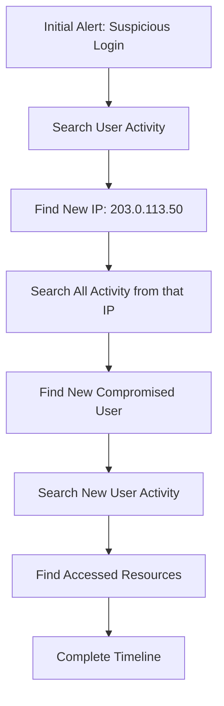

# How to Search and Investigate Threats Using Chronicle UDM Search

Author: [nawazdhandala](https://www.github.com/nawazdhandala)

Tags: GCP, Chronicle SIEM, UDM Search, Threat Investigation, Security Operations

Description: A hands-on guide to using Google Chronicle UDM Search for threat hunting and security investigations with practical query examples and investigation workflows.

---

When you are investigating a security incident, speed matters. Every minute you spend figuring out how to write a query is a minute the attacker has to cover their tracks or move laterally. Chronicle's UDM Search is the primary tool for investigating threats, and getting good at it pays dividends in every investigation you run.

In this guide, I will cover the UDM search syntax, walk through practical query patterns, and share investigation workflows that work in real-world scenarios.

## Understanding UDM Search Basics

UDM Search queries operate on Chronicle's Unified Data Model, which means you write queries against normalized field names regardless of the original log source. Whether the event came from AWS CloudTrail, a Palo Alto firewall, or Google Workspace, you use the same field names.

The basic query structure is:

```
field_name = "value"
field_name != "value"
field_name = /regex_pattern/
```

You can combine conditions with AND, OR, and NOT operators.

```
metadata.event_type = "USER_LOGIN" AND security_result.action = "BLOCK" AND principal.ip = "192.168.1.100"
```

## Essential Field Paths

Here are the UDM fields you will use most often during investigations.

**Event metadata:**
- `metadata.event_type` - The type of event (USER_LOGIN, NETWORK_CONNECTION, etc.)
- `metadata.product_name` - The source product (AWS CloudTrail, Google Workspace, etc.)
- `metadata.event_timestamp` - When the event occurred
- `metadata.product_event_type` - The original event type from the source

**Principal (who did it):**
- `principal.user.email_addresses` - User's email
- `principal.user.userid` - User ID
- `principal.ip` - Source IP address
- `principal.hostname` - Source hostname

**Target (what was affected):**
- `target.user.email_addresses` - Target user's email
- `target.resource.name` - Name of the resource accessed
- `target.ip` - Destination IP
- `target.hostname` - Destination hostname

**Network fields:**
- `network.http.method` - HTTP method
- `network.http.response_code` - HTTP response code
- `target.url` - URL accessed

**Security results:**
- `security_result.action` - ALLOW, BLOCK, etc.
- `security_result.severity` - Severity level
- `security_result.category_details` - Category information

## Investigation Scenario 1: Compromised User Account

You get an alert that a user account might be compromised. Here is how to investigate using UDM Search.

Start by looking at recent login activity for the user.

```
principal.user.email_addresses = "suspect@company.com" AND metadata.event_type = "USER_LOGIN"
```

This shows all login events. Look at the source IPs and geolocations. If you see logins from unexpected locations, that is a red flag.

Next, check what the user did after logging in. This query finds all actions taken by the user in the last 24 hours.

```
principal.user.email_addresses = "suspect@company.com" AND metadata.event_timestamp.seconds > timestamp_sub(now(), "24h")
```

Look for privilege escalation attempts.

```
principal.user.email_addresses = "suspect@company.com" AND (metadata.event_type = "USER_RESOURCE_UPDATE_PERMISSIONS" OR metadata.product_event_type = "SetIamPolicy" OR metadata.product_event_type = "CreateRole")
```

Check if they created any new service accounts or API keys, which is a common persistence technique.

```
principal.user.email_addresses = "suspect@company.com" AND (metadata.product_event_type = "CreateServiceAccount" OR metadata.product_event_type = "CreateServiceAccountKey" OR metadata.product_event_type = "CreateAccessKey")
```

## Investigation Scenario 2: Suspicious Network Activity

You notice unusual outbound traffic from an internal server. Start by looking at all network connections from that host.

```
principal.ip = "10.0.1.50" AND metadata.event_type = "NETWORK_CONNECTION"
```

Filter for external destinations to focus on outbound traffic.

```
principal.ip = "10.0.1.50" AND metadata.event_type = "NETWORK_CONNECTION" AND NOT target.ip = /^10\./ AND NOT target.ip = /^172\.(1[6-9]|2[0-9]|3[01])\./ AND NOT target.ip = /^192\.168\./
```

Look for connections to known-bad indicators. If you have threat intel feeds in Chronicle, they automatically enrich matching events.

```
principal.ip = "10.0.1.50" AND security_result.category_details = "THREAT_INTEL_MATCH"
```

Check for data exfiltration patterns - large volumes of data being sent outbound.

```
principal.ip = "10.0.1.50" AND metadata.event_type = "NETWORK_CONNECTION" AND network.sent_bytes > 10000000
```

## Investigation Scenario 3: Lateral Movement

When investigating lateral movement, you want to track how an attacker moves between systems.

Find all RDP and SSH connections from a compromised host.

```
principal.ip = "10.0.1.50" AND metadata.event_type = "NETWORK_CONNECTION" AND (target.port = 3389 OR target.port = 22)
```

Look for authentication events where the compromised host is the source.

```
principal.ip = "10.0.1.50" AND metadata.event_type = "USER_LOGIN" AND target.ip != ""
```

Track process execution on the compromised host for signs of attacker tools.

```
target.hostname = "compromised-server" AND metadata.event_type = "PROCESS_LAUNCH" AND (target.process.file.full_path = /.*powershell.*/ OR target.process.file.full_path = /.*cmd\.exe.*/ OR target.process.file.full_path = /.*psexec.*/)
```

## Advanced Query Techniques

### Using Time Windows

Narrow your search to specific time ranges for focused investigation.

```
principal.user.email_addresses = "suspect@company.com" AND metadata.event_timestamp.seconds > timestamp("2026-02-17T10:00:00Z") AND metadata.event_timestamp.seconds < timestamp("2026-02-17T12:00:00Z")
```

### Counting and Aggregating

Use the statistics view in Chronicle to aggregate results. The search UI lets you group by fields to spot patterns.

For example, searching for all login failures and then grouping by `principal.ip` in the statistics panel quickly shows you which IPs are generating the most failed logins.

```
metadata.event_type = "USER_LOGIN" AND security_result.action = "BLOCK"
```

### Using Regular Expressions

Regex is powerful for matching patterns in resource names, URLs, or other string fields.

This finds access to any resource with "admin" in the path.

```
target.resource.name = /.*admin.*/ AND metadata.event_type = "USER_RESOURCE_ACCESS"
```

### Excluding Known-Good Activity

When investigating, you often need to filter out the noise. Use NOT to exclude known-good patterns.

```
principal.user.email_addresses = "suspect@company.com" AND metadata.event_type = "USER_RESOURCE_ACCESS" AND NOT target.resource.name = /.*healthcheck.*/ AND NOT metadata.product_event_type = "list"
```

## Building an Investigation Timeline

The most valuable output of an investigation is a clean timeline. Here is a workflow for building one in Chronicle.

1. Start with the initial indicator (alert, suspicious IP, compromised user)
2. Search for all events related to that indicator with a wide time window
3. Identify pivot points - new IPs, usernames, or hostnames that appear
4. Search for events related to each pivot point
5. Repeat until you have mapped the full scope



## Saving and Sharing Searches

Chronicle lets you save searches for reuse. Create saved searches for common investigation patterns.

Some searches worth saving:

- **All failed logins in last hour** - Quick check for brute force attacks
- **New service account creations** - Watch for persistence attempts
- **External network connections from DMZ** - Baseline for outbound traffic monitoring
- **Admin API calls** - Track administrative actions across your environment

## Tips for Faster Investigations

**Start broad, then narrow down.** It is better to see too many results and filter than to miss something because your initial query was too specific.

**Use the event viewer.** Clicking on an individual event in Chronicle shows you all the UDM fields populated for that event. This helps you discover fields you can use to refine your search.

**Pivot on everything.** When you find an interesting event, pivot on the IP, user, hostname, and resource. Each pivot can reveal a new dimension of the attack.

**Keep a scratchpad.** During an investigation, keep a running list of all indicators (IPs, users, hostnames, file hashes) you have found. This prevents you from losing track of leads.

UDM Search is your primary investigative tool in Chronicle. The more comfortable you get with the query syntax and investigation patterns, the faster you will be at understanding what happened and how far the compromise extends.
