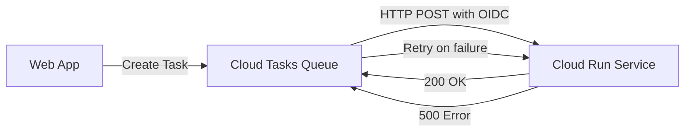

# How to Send HTTP Tasks to Cloud Run Services Using Cloud Tasks

Author: [nawazdhandala](https://www.github.com/nawazdhandala)

Tags: GCP, Cloud Tasks, Cloud Run, HTTP Tasks, Asynchronous Processing

Description: A hands-on guide to sending HTTP tasks from Cloud Tasks to Cloud Run services with authentication, task creation patterns, and handler implementation.

---

Cloud Tasks and Cloud Run work well together. Your main application creates tasks in a Cloud Tasks queue, and Cloud Tasks dispatches those tasks as HTTP requests to your Cloud Run service at a controlled rate. The Cloud Run service processes each task and returns a success or failure response. This pattern is perfect for offloading work like image processing, email sending, data synchronization, and any other operation that should not block your main request flow.

In this post, I will show you the end-to-end setup: creating the queue, deploying the Cloud Run handler, configuring authentication, and creating tasks from your application.

## Architecture Overview



## Step 1: Create the Cloud Tasks Queue

Set up a queue with appropriate rate limiting for your Cloud Run service.

```bash
# Create a queue for sending tasks to Cloud Run
gcloud tasks queues create cloud-run-tasks \
  --location=us-central1 \
  --max-dispatches-per-second=50 \
  --max-concurrent-dispatches=20 \
  --max-attempts=5 \
  --min-backoff="10s" \
  --max-backoff="300s" \
  --max-doublings=4
```

## Step 2: Build the Cloud Run Task Handler

Create a Cloud Run service that processes the tasks. Here is a Node.js Express handler.

```javascript
// server.js
// Cloud Run service that processes tasks from Cloud Tasks
const express = require("express");
const app = express();
app.use(express.json());

// Health check endpoint
app.get("/", (req, res) => {
  res.status(200).send("Task handler is running");
});

// Task processing endpoint
app.post("/process-order", async (req, res) => {
  // Cloud Tasks includes useful headers
  const taskName = req.headers["x-cloudtasks-taskname"] || "unknown";
  const retryCount = parseInt(
    req.headers["x-cloudtasks-taskretrycount"] || "0"
  );
  const queueName = req.headers["x-cloudtasks-queuename"] || "unknown";

  console.log(
    `Processing task: ${taskName}, retry: ${retryCount}, queue: ${queueName}`
  );

  try {
    const { orderId, action, customerEmail } = req.body;

    if (!orderId || !action) {
      // Return 400 for bad requests - Cloud Tasks will NOT retry 4xx errors by default
      console.error("Missing required fields");
      res.status(400).json({ error: "Missing orderId or action" });
      return;
    }

    // Process based on action type
    switch (action) {
      case "send_confirmation":
        await sendOrderConfirmation(orderId, customerEmail);
        break;
      case "update_inventory":
        await updateInventory(orderId);
        break;
      case "notify_warehouse":
        await notifyWarehouse(orderId);
        break;
      default:
        console.error(`Unknown action: ${action}`);
        res.status(400).json({ error: `Unknown action: ${action}` });
        return;
    }

    // Return 200 to acknowledge the task
    console.log(`Task ${taskName} completed successfully`);
    res.status(200).json({ status: "processed", orderId });
  } catch (error) {
    console.error(`Task ${taskName} failed:`, error);
    // Return 500 so Cloud Tasks will retry
    res.status(500).json({ error: error.message });
  }
});

async function sendOrderConfirmation(orderId, email) {
  // Simulate sending an email
  console.log(`Sending confirmation for order ${orderId} to ${email}`);
  // Your email sending logic here
}

async function updateInventory(orderId) {
  console.log(`Updating inventory for order ${orderId}`);
  // Your inventory logic here
}

async function notifyWarehouse(orderId) {
  console.log(`Notifying warehouse about order ${orderId}`);
  // Your warehouse notification logic here
}

const PORT = process.env.PORT || 8080;
app.listen(PORT, () => {
  console.log(`Task handler listening on port ${PORT}`);
});
```

The Dockerfile for the service.

```dockerfile
# Dockerfile for the Cloud Run task handler
FROM node:20-slim

WORKDIR /app
COPY package*.json ./
RUN npm ci --only=production
COPY . .

CMD ["node", "server.js"]
```

Deploy it to Cloud Run.

```bash
# Build and deploy the Cloud Run service
gcloud run deploy task-handler \
  --source=. \
  --region=us-central1 \
  --no-allow-unauthenticated \
  --memory=512Mi \
  --timeout=300s \
  --max-instances=10 \
  --service-account=task-handler-sa@YOUR_PROJECT.iam.gserviceaccount.com
```

The `--no-allow-unauthenticated` flag is critical - it ensures only authenticated callers (like Cloud Tasks) can invoke the service.

## Step 3: Set Up Authentication

Cloud Tasks needs a service account with permission to invoke the Cloud Run service.

```bash
# Create a service account for Cloud Tasks
gcloud iam service-accounts create cloud-tasks-invoker \
  --display-name="Cloud Tasks Invoker"

# Grant it permission to invoke the Cloud Run service
gcloud run services add-iam-policy-binding task-handler \
  --region=us-central1 \
  --member="serviceAccount:cloud-tasks-invoker@YOUR_PROJECT.iam.gserviceaccount.com" \
  --role="roles/run.invoker"
```

## Step 4: Create Tasks from Your Application

Here is how to create tasks that target your Cloud Run service.

### Node.js Example

```javascript
// task-creator.js
// Creates HTTP tasks targeting the Cloud Run service
const { CloudTasksClient } = require("@google-cloud/tasks");

const client = new CloudTasksClient();

const PROJECT = "your-project-id";
const LOCATION = "us-central1";
const QUEUE = "cloud-run-tasks";
const SERVICE_URL = "https://task-handler-abc123-uc.a.run.app";
const SERVICE_ACCOUNT = "cloud-tasks-invoker@your-project-id.iam.gserviceaccount.com";

async function createOrderTask(orderId, action, customerEmail) {
  const parent = client.queuePath(PROJECT, LOCATION, QUEUE);

  const payload = {
    orderId,
    action,
    customerEmail,
  };

  const task = {
    httpRequest: {
      httpMethod: "POST",
      url: `${SERVICE_URL}/process-order`,
      headers: {
        "Content-Type": "application/json",
      },
      body: Buffer.from(JSON.stringify(payload)).toString("base64"),
      // OIDC token for Cloud Run authentication
      oidcToken: {
        serviceAccountEmail: SERVICE_ACCOUNT,
        audience: SERVICE_URL,
      },
    },
  };

  const [response] = await client.createTask({ parent, task });
  console.log(`Created task: ${response.name}`);
  return response;
}

// Create multiple tasks for an order
async function processNewOrder(orderId, customerEmail) {
  // Each action becomes a separate task in the queue
  await createOrderTask(orderId, "send_confirmation", customerEmail);
  await createOrderTask(orderId, "update_inventory", customerEmail);
  await createOrderTask(orderId, "notify_warehouse", customerEmail);

  console.log(`Created 3 tasks for order ${orderId}`);
}

// Usage
processNewOrder("ORD-12345", "customer@example.com");
```

### Python Example

```python
# task_creator.py
# Creates HTTP tasks targeting the Cloud Run service
from google.cloud import tasks_v2
import json

PROJECT = "your-project-id"
LOCATION = "us-central1"
QUEUE = "cloud-run-tasks"
SERVICE_URL = "https://task-handler-abc123-uc.a.run.app"
SERVICE_ACCOUNT = "cloud-tasks-invoker@your-project-id.iam.gserviceaccount.com"

client = tasks_v2.CloudTasksClient()

def create_order_task(order_id, action, customer_email):
    """Create a task to process an order action."""
    parent = client.queue_path(PROJECT, LOCATION, QUEUE)

    payload = {
        "orderId": order_id,
        "action": action,
        "customerEmail": customer_email,
    }

    task = tasks_v2.Task(
        http_request=tasks_v2.HttpRequest(
            http_method=tasks_v2.HttpMethod.POST,
            url=f"{SERVICE_URL}/process-order",
            headers={"Content-Type": "application/json"},
            body=json.dumps(payload).encode(),
            oidc_token=tasks_v2.OidcToken(
                service_account_email=SERVICE_ACCOUNT,
                audience=SERVICE_URL,
            ),
        )
    )

    response = client.create_task(parent=parent, task=task)
    print(f"Created task: {response.name}")
    return response
```

## Step 5: Handle Task-Specific Headers

Cloud Tasks sends useful headers with each request that your handler can use.

```javascript
// Extracting Cloud Tasks headers in your handler
app.post("/process", (req, res) => {
  // Task identification
  const taskName = req.headers["x-cloudtasks-taskname"];
  const taskETA = req.headers["x-cloudtasks-tasketa"];

  // Retry information
  const retryCount = parseInt(req.headers["x-cloudtasks-taskretrycount"] || "0");
  const executionCount = parseInt(req.headers["x-cloudtasks-taskexecutioncount"] || "0");

  // Queue information
  const queueName = req.headers["x-cloudtasks-queuename"];

  console.log(`Task: ${taskName}, Retries: ${retryCount}`);

  // Use retry count for progressive behavior
  if (retryCount > 3) {
    console.warn(`Task ${taskName} has failed ${retryCount} times, using fallback logic`);
    // Maybe use a simpler processing path or send an alert
  }

  // Process the task...
  res.status(200).send("OK");
});
```

## Creating Tasks with Deduplication

To prevent duplicate tasks, use task names as deduplication keys.

```javascript
// Create a task with a specific name for deduplication
async function createDeduplicatedTask(orderId, action) {
  const parent = client.queuePath(PROJECT, LOCATION, QUEUE);

  // Use a deterministic task name based on the order and action
  const taskName = `${parent}/tasks/order-${orderId}-${action}`;

  const task = {
    name: taskName,
    httpRequest: {
      httpMethod: "POST",
      url: `${SERVICE_URL}/process-order`,
      body: Buffer.from(JSON.stringify({ orderId, action })).toString("base64"),
      headers: { "Content-Type": "application/json" },
      oidcToken: {
        serviceAccountEmail: SERVICE_ACCOUNT,
        audience: SERVICE_URL,
      },
    },
  };

  try {
    const [response] = await client.createTask({ parent, task });
    console.log(`Created task: ${response.name}`);
    return response;
  } catch (error) {
    if (error.code === 6) {
      // ALREADY_EXISTS - task with this name already exists
      console.log(`Task already exists for order ${orderId}/${action}, skipping`);
      return null;
    }
    throw error;
  }
}
```

## Monitoring Task Execution

Keep track of how your tasks are performing.

```bash
# List tasks in the queue
gcloud tasks list --queue=cloud-run-tasks --location=us-central1 --limit=10

# Check queue statistics
gcloud tasks queues describe cloud-run-tasks \
  --location=us-central1

# View Cloud Run logs for task processing
gcloud logging read \
  'resource.type="cloud_run_revision" AND resource.labels.service_name="task-handler"' \
  --limit=20 \
  --format="table(timestamp, textPayload)"
```

## Wrapping Up

Cloud Tasks with Cloud Run gives you a reliable, scalable pattern for asynchronous processing. Your main application stays fast by creating tasks instead of doing the work inline, and Cloud Tasks handles delivery, rate limiting, and retries. The key things to remember are: use OIDC authentication (not OAuth) when targeting Cloud Run, return 2xx for success and 5xx for retriable failures, and use Cloud Tasks headers to track retry behavior in your handler.
