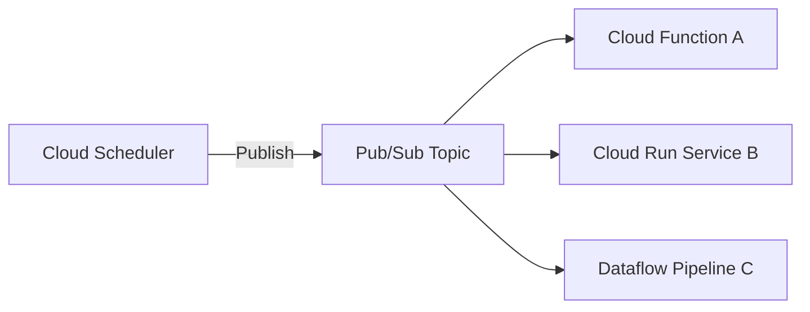

# How to Send Scheduled Messages to Pub/Sub Topics Using Cloud Scheduler

Author: [nawazdhandala](https://www.github.com/nawazdhandala)

Tags: GCP, Cloud Scheduler, Pub/Sub, Messaging, Automation

Description: Learn how to use Google Cloud Scheduler to publish messages to Pub/Sub topics on a recurring schedule for event-driven automation and data pipelines.

---

Cloud Scheduler and Pub/Sub make a natural pair. Instead of triggering an HTTP endpoint directly, you can have Cloud Scheduler publish a message to a Pub/Sub topic on a schedule. Any subscribers to that topic - Cloud Functions, Cloud Run services, Dataflow pipelines, or custom applications - will then process the message. This decouples your scheduling from your processing logic, which makes the system more flexible and resilient.

In this post, I will show you how to set this up and cover some practical patterns for using scheduled Pub/Sub messages.

## Why Use Pub/Sub Instead of Direct HTTP?

With an HTTP target, Cloud Scheduler calls one endpoint directly. If that endpoint is down, the message is lost unless you configure retries. With Pub/Sub as the intermediary:

- Messages are durably stored in the topic until subscribers acknowledge them
- Multiple subscribers can process the same message independently
- You can add or remove subscribers without changing the scheduler configuration
- Pub/Sub handles delivery retries to subscribers automatically



## Prerequisites

Enable the required APIs.

```bash
# Enable Cloud Scheduler and Pub/Sub APIs
gcloud services enable cloudscheduler.googleapis.com pubsub.googleapis.com
```

## Creating the Pub/Sub Topic

First, create the topic that Cloud Scheduler will publish to.

```bash
# Create a Pub/Sub topic for scheduled events
gcloud pubsub topics create scheduled-tasks

# Optionally, add a dead-letter topic for failed deliveries
gcloud pubsub topics create scheduled-tasks-deadletter
```

## Creating a Basic Scheduler Job with Pub/Sub Target

Here is the simplest form - a scheduler job that publishes a message to a topic every hour.

```bash
# Create a scheduler job that publishes to Pub/Sub every hour
gcloud scheduler jobs create pubsub hourly-sync-trigger \
  --location=us-central1 \
  --schedule="0 * * * *" \
  --topic=scheduled-tasks \
  --message-body='{"task": "sync", "source": "scheduler"}' \
  --time-zone="UTC" \
  --description="Hourly trigger for data synchronization"
```

That is it. Every hour, Cloud Scheduler will publish a message with the specified body to the `scheduled-tasks` topic.

## Adding Message Attributes

Pub/Sub messages support attributes - key-value pairs that subscribers can use for filtering or routing without parsing the message body.

```bash
# Create a job with message attributes
gcloud scheduler jobs create pubsub nightly-report \
  --location=us-central1 \
  --schedule="0 2 * * *" \
  --topic=report-requests \
  --message-body='{"report_type": "daily_summary", "format": "pdf"}' \
  --attributes="priority=high,environment=production,source=scheduler" \
  --time-zone="America/New_York" \
  --description="Nightly report generation trigger"
```

Subscribers can filter on these attributes. For example, a Cloud Functions subscriber can check the `priority` attribute to decide how to handle the message.

## Setting Up Subscribers

Now let me show a few subscriber configurations.

### Cloud Function Subscriber

```bash
# Deploy a Cloud Function triggered by the Pub/Sub topic
gcloud functions deploy process-scheduled-task \
  --gen2 \
  --runtime=nodejs20 \
  --region=us-central1 \
  --trigger-topic=scheduled-tasks \
  --entry-point=processTask \
  --timeout=120s \
  --memory=256MB
```

The function code to handle the message.

```javascript
// index.js
// Cloud Function triggered by Pub/Sub messages from Cloud Scheduler
const functions = require("@google-cloud/functions-framework");

functions.cloudEvent("processTask", (cloudEvent) => {
  // Decode the Pub/Sub message
  const message = cloudEvent.data.message;
  const payload = JSON.parse(
    Buffer.from(message.data, "base64").toString("utf-8")
  );

  // Access message attributes
  const attributes = message.attributes || {};

  console.log("Received scheduled task:", {
    payload,
    attributes,
    publishTime: message.publishTime,
  });

  // Route based on task type
  switch (payload.task) {
    case "sync":
      return handleSync(payload);
    case "cleanup":
      return handleCleanup(payload);
    default:
      console.warn(`Unknown task type: ${payload.task}`);
  }
});

async function handleSync(payload) {
  console.log("Running sync task...");
  // Your sync logic here
}

async function handleCleanup(payload) {
  console.log("Running cleanup task...");
  // Your cleanup logic here
}
```

### Pull Subscription for Custom Applications

If you have a long-running application that wants to process scheduled messages, use a pull subscription.

```bash
# Create a pull subscription
gcloud pubsub subscriptions create scheduled-tasks-processor \
  --topic=scheduled-tasks \
  --ack-deadline=60 \
  --message-retention-duration=1h \
  --expiration-period=never
```

Here is a Python example for pulling messages.

```python
# subscriber.py
# Pulls and processes scheduled task messages from Pub/Sub
from google.cloud import pubsub_v1
import json

project_id = "my-project"
subscription_id = "scheduled-tasks-processor"

subscriber = pubsub_v1.SubscriberClient()
subscription_path = subscriber.subscription_path(project_id, subscription_id)

def callback(message):
    """Process each scheduled task message."""
    payload = json.loads(message.data.decode("utf-8"))
    attributes = dict(message.attributes)

    print(f"Processing task: {payload.get('task')}")
    print(f"Attributes: {attributes}")

    # Do the work
    try:
        process_task(payload, attributes)
        # Acknowledge the message on success
        message.ack()
    except Exception as e:
        print(f"Failed to process: {e}")
        # Nack to retry
        message.nack()

def process_task(payload, attributes):
    """Handle the scheduled task."""
    task_type = payload.get("task")
    if task_type == "sync":
        run_sync(payload)
    elif task_type == "cleanup":
        run_cleanup(payload)

# Start listening for messages
streaming_pull = subscriber.subscribe(subscription_path, callback=callback)
print(f"Listening for messages on {subscription_path}")

try:
    streaming_pull.result()
except KeyboardInterrupt:
    streaming_pull.cancel()
    streaming_pull.result()
```

## Multiple Schedules, One Topic

A powerful pattern is having multiple scheduler jobs publish to the same topic with different payloads. The subscribers can then route based on the message content.

```bash
# Hourly sync task
gcloud scheduler jobs create pubsub hourly-sync \
  --location=us-central1 \
  --schedule="0 * * * *" \
  --topic=scheduled-tasks \
  --message-body='{"task": "sync", "scope": "incremental"}' \
  --attributes="task_type=sync" \
  --time-zone="UTC"

# Daily cleanup task
gcloud scheduler jobs create pubsub daily-cleanup \
  --location=us-central1 \
  --schedule="0 4 * * *" \
  --topic=scheduled-tasks \
  --message-body='{"task": "cleanup", "retain_days": 30}' \
  --attributes="task_type=cleanup" \
  --time-zone="UTC"

# Weekly report task
gcloud scheduler jobs create pubsub weekly-report \
  --location=us-central1 \
  --schedule="0 8 * * 1" \
  --topic=scheduled-tasks \
  --message-body='{"task": "report", "type": "weekly_summary"}' \
  --attributes="task_type=report" \
  --time-zone="UTC"
```

## Filtering Messages with Subscription Filters

Pub/Sub supports subscription-level filters so different subscribers only receive relevant messages.

```bash
# Create a subscription that only receives sync tasks
gcloud pubsub subscriptions create sync-processor \
  --topic=scheduled-tasks \
  --filter='attributes.task_type = "sync"'

# Create a subscription that only receives cleanup tasks
gcloud pubsub subscriptions create cleanup-processor \
  --topic=scheduled-tasks \
  --filter='attributes.task_type = "cleanup"'

# Create a subscription that only receives report tasks
gcloud pubsub subscriptions create report-processor \
  --topic=scheduled-tasks \
  --filter='attributes.task_type = "report"'
```

## Testing the Setup

Run the scheduler job manually and verify the message arrives.

```bash
# Trigger the scheduler job
gcloud scheduler jobs run hourly-sync \
  --location=us-central1

# Pull messages from the subscription to verify
gcloud pubsub subscriptions pull scheduled-tasks-processor \
  --auto-ack \
  --limit=5 \
  --format="json"
```

## Monitoring

Keep an eye on your scheduled Pub/Sub setup with these commands.

```bash
# Check scheduler job status
gcloud scheduler jobs describe hourly-sync \
  --location=us-central1 \
  --format="yaml(state, lastAttemptTime, status)"

# Check Pub/Sub topic metrics
gcloud pubsub topics list-subscriptions scheduled-tasks

# Check unacknowledged message count (backlog)
gcloud pubsub subscriptions describe scheduled-tasks-processor \
  --format="yaml(messageRetentionDuration, ackDeadlineSeconds)"
```

## Wrapping Up

Using Cloud Scheduler with Pub/Sub as the target gives you a flexible, decoupled scheduling architecture. The scheduler handles the timing, Pub/Sub handles message delivery and durability, and your subscribers handle the processing. This separation means you can change your processing logic, add new subscribers, or adjust schedules independently. For any scenario where you need reliable scheduled message delivery to one or more consumers, this is the pattern to use.
