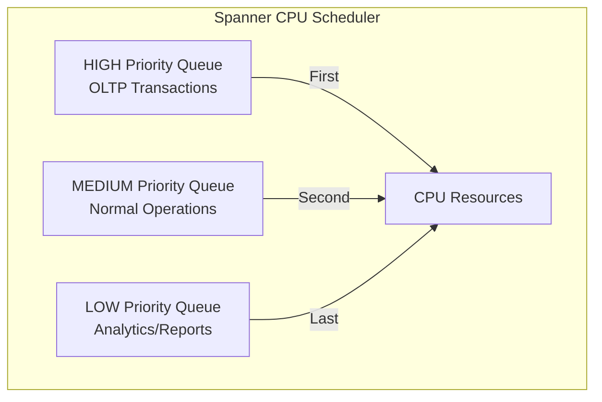

# How to Set Request Priorities in Cloud Spanner to Manage Mixed Workload Scheduling

Author: [nawazdhandala](https://www.github.com/nawazdhandala)

Tags: GCP, Cloud Spanner, Request Priority, Workload Management, Database Performance, Query Scheduling

Description: Learn how to use Cloud Spanner request priorities to manage mixed OLTP and analytics workloads by controlling how the scheduler allocates resources across queries.

---

When you run both transactional and analytical workloads on the same Spanner instance, they compete for resources. A heavy analytics query can consume CPU and I/O that your latency-sensitive OLTP transactions need. Without prioritization, a runaway report query can degrade the experience for every user of your application.

Cloud Spanner's request priority feature lets you assign priority levels to individual requests, telling the internal scheduler which work matters most. High-priority requests get CPU time before low-priority ones. This means your user-facing transactions stay fast even when heavy background jobs are running.

## How Request Priority Works

Spanner's scheduler uses a priority queue for CPU allocation. When the system is under contention, higher-priority requests get scheduled ahead of lower-priority ones. When there is no contention, priority has no effect - all requests run at full speed.

There are three priority levels:

| Priority | Intended Use | Scheduling Behavior |
|---|---|---|
| HIGH | User-facing OLTP transactions | Scheduled first under contention |
| MEDIUM | Default - normal operations | Scheduled after HIGH |
| LOW | Background jobs, analytics, exports | Scheduled after MEDIUM |



Priority only affects CPU scheduling. It does not affect data freshness, consistency guarantees, or the order of commits.

## Setting Request Priority in Python

```python
# priority_example.py - Setting request priorities in Cloud Spanner
from google.cloud import spanner
from google.cloud.spanner_v1 import RequestOptions

client = spanner.Client(project="MY_PROJECT")
instance = client.instance("my-instance")
database = instance.database("my-database")

def high_priority_transaction(user_id, amount):
    """User-facing payment transaction - runs at HIGH priority."""
    def _process_payment(transaction):
        # Read current balance
        results = transaction.execute_sql(
            "SELECT balance FROM accounts WHERE user_id = @user_id",
            params={"user_id": user_id},
            param_types={"user_id": spanner.param_types.STRING},
            request_options=RequestOptions(priority=RequestOptions.Priority.PRIORITY_HIGH),
        )
        row = list(results)[0]
        balance = row[0]

        if balance < amount:
            raise ValueError("Insufficient funds")

        # Deduct the amount
        transaction.update(
            table="accounts",
            columns=["user_id", "balance"],
            values=[[user_id, balance - amount]],
        )

    database.run_in_transaction(
        _process_payment,
        request_options=RequestOptions(
            priority=RequestOptions.Priority.PRIORITY_HIGH
        ),
    )

def low_priority_analytics(start_date, end_date):
    """Background analytics query - runs at LOW priority."""
    with database.snapshot() as snapshot:
        results = snapshot.execute_sql(
            """
            SELECT
                region,
                COUNT(*) AS transaction_count,
                SUM(amount) AS total_amount,
                AVG(amount) AS avg_amount
            FROM transactions
            WHERE transaction_date BETWEEN @start AND @end
            GROUP BY region
            ORDER BY total_amount DESC
            """,
            params={"start": start_date, "end": end_date},
            param_types={
                "start": spanner.param_types.DATE,
                "end": spanner.param_types.DATE,
            },
            request_options=RequestOptions(
                priority=RequestOptions.Priority.PRIORITY_LOW
            ),
        )

        for row in results:
            print(f"Region: {row[0]}, Count: {row[1]}, Total: {row[2]}")

def medium_priority_read(user_id):
    """Normal read operation - runs at MEDIUM (default) priority."""
    with database.snapshot() as snapshot:
        results = snapshot.execute_sql(
            "SELECT * FROM users WHERE user_id = @user_id",
            params={"user_id": user_id},
            param_types={"user_id": spanner.param_types.STRING},
            # MEDIUM is the default, but being explicit makes the intent clear
            request_options=RequestOptions(
                priority=RequestOptions.Priority.PRIORITY_MEDIUM
            ),
        )
        return list(results)
```

## Setting Request Priority in Java

```java
// PriorityExample.java
import com.google.cloud.spanner.*;
import com.google.spanner.v1.RequestOptions;

public class PriorityExample {

    // High priority for user-facing reads
    public static Struct getUserProfile(DatabaseClient client, String userId) {
        return client.singleUseReadOnlyTransaction()
            .executeQuery(
                Statement.newBuilder("SELECT * FROM users WHERE user_id = @userId")
                    .bind("userId").to(userId)
                    .build(),
                // Set HIGH priority for user-facing operations
                Options.priority(RpcPriority.HIGH)
            )
            .next() ? client.singleUseReadOnlyTransaction()
                .executeQuery(
                    Statement.newBuilder("SELECT * FROM users WHERE user_id = @userId")
                        .bind("userId").to(userId)
                        .build(),
                    Options.priority(RpcPriority.HIGH)
                ).getCurrentRowAsStruct() : null;
    }

    // Low priority for batch operations
    public static void runDailyReport(DatabaseClient client) {
        try (ReadOnlyTransaction txn = client.singleUseReadOnlyTransaction()) {
            ResultSet resultSet = txn.executeQuery(
                Statement.of(
                    "SELECT DATE(created_at) AS date, COUNT(*) AS count " +
                    "FROM orders GROUP BY date ORDER BY date DESC LIMIT 30"
                ),
                // Set LOW priority for background reports
                Options.priority(RpcPriority.LOW)
            );

            while (resultSet.next()) {
                System.out.printf("Date: %s, Orders: %d%n",
                    resultSet.getDate("date"),
                    resultSet.getLong("count"));
            }
        }
    }
}
```

## Setting Request Priority in Go

```go
// priority_example.go
package main

import (
    "context"
    "fmt"

    "cloud.google.com/go/spanner"
    sppb "cloud.google.com/go/spanner/apiv1/spannerpb"
)

// High priority transaction for user-facing operations
func processPayment(ctx context.Context, client *spanner.Client, userID string, amount float64) error {
    _, err := client.ReadWriteTransactionWithOptions(ctx,
        func(ctx context.Context, txn *spanner.ReadWriteTransaction) error {
            // Read balance with HIGH priority
            stmt := spanner.Statement{
                SQL:    "SELECT balance FROM accounts WHERE user_id = @userID",
                Params: map[string]interface{}{"userID": userID},
            }

            iter := txn.QueryWithOptions(ctx, stmt, spanner.QueryOptions{
                Priority: sppb.RequestOptions_PRIORITY_HIGH,
            })
            defer iter.Stop()

            row, err := iter.Next()
            if err != nil {
                return err
            }

            var balance float64
            if err := row.Columns(&balance); err != nil {
                return err
            }

            if balance < amount {
                return fmt.Errorf("insufficient funds")
            }

            // Update balance
            txn.BufferWrite([]*spanner.Mutation{
                spanner.Update("accounts",
                    []string{"user_id", "balance"},
                    []interface{}{userID, balance - amount},
                ),
            })

            return nil
        },
        // Set transaction-level priority
        spanner.TransactionOptions{
            CommitPriority: sppb.RequestOptions_PRIORITY_HIGH,
        },
    )

    return err
}

// Low priority analytics query
func runAnalyticsQuery(ctx context.Context, client *spanner.Client) error {
    stmt := spanner.Statement{
        SQL: `SELECT region, SUM(amount) AS total
              FROM transactions
              WHERE transaction_date >= DATE_SUB(CURRENT_DATE(), INTERVAL 30 DAY)
              GROUP BY region`,
    }

    // Use LOW priority for analytics
    iter := client.Single().QueryWithOptions(ctx, stmt, spanner.QueryOptions{
        Priority: sppb.RequestOptions_PRIORITY_LOW,
    })
    defer iter.Stop()

    for {
        row, err := iter.Next()
        if err != nil {
            break
        }
        var region string
        var total float64
        row.Columns(&region, &total)
        fmt.Printf("Region: %s, Total: %.2f\n", region, total)
    }

    return nil
}
```

## Architecture Patterns for Mixed Workloads

### Pattern 1: Service-Level Priority Assignment

Assign priorities based on which service is making the request.

```python
# Middleware that sets priority based on service identity
class SpannerPriorityMiddleware:
    PRIORITY_MAP = {
        "payment-service": RequestOptions.Priority.PRIORITY_HIGH,
        "user-api": RequestOptions.Priority.PRIORITY_HIGH,
        "reporting-service": RequestOptions.Priority.PRIORITY_LOW,
        "data-export": RequestOptions.Priority.PRIORITY_LOW,
        "internal-tools": RequestOptions.Priority.PRIORITY_MEDIUM,
    }

    @classmethod
    def get_priority(cls, service_name):
        return cls.PRIORITY_MAP.get(
            service_name,
            RequestOptions.Priority.PRIORITY_MEDIUM,
        )
```

### Pattern 2: Dynamic Priority Based on Load

Adjust priorities dynamically based on current system load.

```python
# Adjust analytics priority based on current OLTP latency
import time

class DynamicPriority:
    def __init__(self):
        self.oltp_latency_p99 = 0

    def get_analytics_priority(self):
        """Lower analytics priority when OLTP latency is high."""
        if self.oltp_latency_p99 > 100:  # ms
            # OLTP is slow - deprioritize analytics further
            return RequestOptions.Priority.PRIORITY_LOW
        else:
            # System is healthy - analytics can run at medium
            return RequestOptions.Priority.PRIORITY_MEDIUM
```

### Pattern 3: Request Tagging for Observability

Combine priority with request tags to track performance by workload type.

```python
# Use request tags alongside priority for monitoring
request_options = RequestOptions(
    priority=RequestOptions.Priority.PRIORITY_HIGH,
    request_tag="payment-processing",
    transaction_tag="user-payment",
)
```

You can then view per-tag statistics in the Spanner query stats tables:

```sql
-- Check performance by request tag
SELECT
  request_tag,
  COUNT(*) AS request_count,
  AVG(latency_seconds) AS avg_latency,
  MAX(latency_seconds) AS max_latency,
  SUM(read_rows) AS total_rows_read
FROM SPANNER_SYS.QUERY_STATS_TOP_MINUTE
WHERE interval_end >= TIMESTAMP_SUB(CURRENT_TIMESTAMP(), INTERVAL 1 HOUR)
GROUP BY request_tag
ORDER BY avg_latency DESC;
```

## Monitoring Priority Effectiveness

Track whether priority settings are having the desired effect.

```sql
-- Compare latency between priority levels
SELECT
  request_tag,
  COUNT(*) AS queries,
  AVG(latency_seconds) * 1000 AS avg_latency_ms,
  APPROX_QUANTILES(latency_seconds, 100)[OFFSET(99)] * 1000 AS p99_latency_ms
FROM SPANNER_SYS.QUERY_STATS_TOP_10MINUTE
WHERE interval_end >= TIMESTAMP_SUB(CURRENT_TIMESTAMP(), INTERVAL 1 HOUR)
GROUP BY request_tag
ORDER BY avg_latency_ms DESC;
```

If high-priority requests still show elevated latency, the instance may be under-provisioned. Priority scheduling helps with contention but cannot create resources that do not exist. Consider adding nodes.

## Wrapping Up

Request priorities in Cloud Spanner are a straightforward way to manage mixed workloads on a shared database. The implementation is simple - add a priority parameter to each request - but the impact is significant. User-facing transactions stay responsive even when heavy analytics queries are running. The key is to be consistent: set priorities at the service or middleware level so every request gets the right priority automatically. And remember that priority only helps under contention. If your instance is running at comfortable utilization, everything runs fast regardless of priority. If everything is slow, you need more nodes, not just better priority settings.
