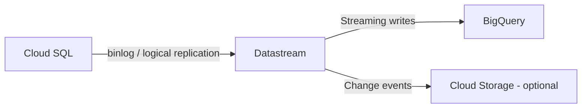

# How to Set Up a CDC Pipeline from Cloud SQL to BigQuery Using Datastream

Author: [nawazdhandala](https://www.github.com/nawazdhandala)

Tags: GCP, Datastream, Cloud SQL, BigQuery, CDC, Data Replication

Description: Learn how to set up a change data capture pipeline from Cloud SQL to BigQuery using Datastream for real-time database replication with minimal configuration.

---

Change data capture (CDC) is the process of tracking and replicating changes from a source database to a destination in near real-time. Instead of running nightly batch exports that scan entire tables, CDC captures individual inserts, updates, and deletes as they happen. Datastream is GCP's managed CDC service that replicates data from Cloud SQL (MySQL and PostgreSQL) to BigQuery with minimal setup and no coding required.

The result is a BigQuery dataset that stays synchronized with your Cloud SQL database, typically with just seconds of latency. This unlocks real-time analytics on operational data without impacting your production database performance.

## How Datastream Works

Datastream reads the binary log (binlog) from MySQL or the logical replication stream from PostgreSQL. These logs contain a record of every change made to the database. Datastream reads these changes, transforms them into BigQuery-compatible format, and writes them to your destination dataset.

The architecture looks like this:



Datastream handles schema mapping, initial backfill (copying existing data), and ongoing change capture automatically.

## Prerequisites

Before setting up Datastream, you need to configure your Cloud SQL instance for replication.

### For Cloud SQL MySQL

Enable binary logging and set the required flags:

```bash
# Enable binary logging on your Cloud SQL MySQL instance
# This is required for CDC - Datastream reads changes from the binlog
gcloud sql instances patch my-mysql-instance \
  --database-flags=log_bin=on,binlog_format=ROW,binlog_row_image=FULL

# Create a Datastream user with replication privileges
gcloud sql connect my-mysql-instance --user=root
```

Then in the MySQL shell:

```sql
-- Create a dedicated user for Datastream with replication privileges
CREATE USER 'datastream'@'%' IDENTIFIED BY 'strong-password-here';

-- Grant the required privileges
-- REPLICATION SLAVE and REPLICATION CLIENT are needed for binlog reading
GRANT REPLICATION SLAVE, REPLICATION CLIENT ON *.* TO 'datastream'@'%';

-- Grant SELECT on all databases you want to replicate
GRANT SELECT ON my_database.* TO 'datastream'@'%';

FLUSH PRIVILEGES;
```

### For Cloud SQL PostgreSQL

Enable logical replication:

```bash
# Enable logical replication on Cloud SQL PostgreSQL
gcloud sql instances patch my-postgres-instance \
  --database-flags=cloudsql.logical_decoding=on

# Create a replication user
gcloud sql connect my-postgres-instance --user=postgres
```

In the PostgreSQL shell:

```sql
-- Create a dedicated user for Datastream
CREATE USER datastream_user WITH REPLICATION LOGIN PASSWORD 'strong-password-here';

-- Grant read access to the schemas you want to replicate
GRANT USAGE ON SCHEMA public TO datastream_user;
GRANT SELECT ON ALL TABLES IN SCHEMA public TO datastream_user;

-- Ensure future tables are also accessible
ALTER DEFAULT PRIVILEGES IN SCHEMA public GRANT SELECT ON TABLES TO datastream_user;

-- Create a publication for the tables you want to replicate
-- This tells PostgreSQL which tables to include in the replication stream
CREATE PUBLICATION datastream_pub FOR ALL TABLES;

-- Or for specific tables only:
-- CREATE PUBLICATION datastream_pub FOR TABLE orders, customers, products;
```

## Setting Up the Datastream Connection Profile

A connection profile stores the credentials and network configuration for your source database:

```bash
# Create a connection profile for Cloud SQL MySQL
gcloud datastream connection-profiles create mysql-source \
  --location=us-central1 \
  --type=MYSQL \
  --display-name="Cloud SQL MySQL Source" \
  --mysql-hostname=10.0.0.5 \
  --mysql-port=3306 \
  --mysql-username=datastream \
  --mysql-password=strong-password-here \
  --private-connection=my-private-connection
```

For the BigQuery destination:

```bash
# Create a connection profile for BigQuery
# BigQuery does not need credentials since it uses the Datastream service account
gcloud datastream connection-profiles create bq-destination \
  --location=us-central1 \
  --type=BIGQUERY \
  --display-name="BigQuery Destination"
```

### Setting Up Private Connectivity

If your Cloud SQL instance uses a private IP (recommended for production), create a private connectivity configuration:

```bash
# Create a private connectivity configuration
# This creates a VPC peering between Datastream and your network
gcloud datastream private-connections create my-private-connection \
  --location=us-central1 \
  --display-name="Datastream VPC Peering" \
  --vpc=my-vpc-network \
  --subnet=10.1.0.0/29
```

## Creating the Datastream Stream

The stream is the actual replication pipeline that connects source to destination:

```bash
# Create a Datastream stream from Cloud SQL MySQL to BigQuery
gcloud datastream streams create mysql-to-bq \
  --location=us-central1 \
  --display-name="MySQL to BigQuery CDC" \
  --source=mysql-source \
  --mysql-source-config='{
    "include_objects": {
      "mysql_databases": [{
        "database": "my_database",
        "mysql_tables": [
          {"table": "orders"},
          {"table": "customers"},
          {"table": "products"},
          {"table": "order_items"}
        ]
      }]
    }
  }' \
  --destination=bq-destination \
  --bigquery-destination-config='{
    "single_target_dataset": {
      "dataset_id": "projects/my-project/datasets/replicated_data"
    }
  }' \
  --backfill-all
```

The `--backfill-all` flag tells Datastream to copy all existing data before starting CDC. Without it, Datastream only captures changes from the point when the stream starts.

## Understanding the BigQuery Output

Datastream creates tables in BigQuery that mirror your source tables, plus some metadata columns:

```sql
-- Query the replicated orders table
-- Datastream adds metadata columns for tracking changes
SELECT
    order_id,
    customer_id,
    total_amount,
    status,
    created_at,
    -- Datastream metadata columns
    datastream_metadata.uuid AS change_uuid,
    datastream_metadata.source_timestamp AS change_timestamp,
    datastream_metadata.is_deleted AS is_deleted
FROM `my-project.replicated_data.orders`
WHERE datastream_metadata.is_deleted = FALSE
ORDER BY datastream_metadata.source_timestamp DESC
LIMIT 100;
```

Key metadata fields:
- `datastream_metadata.uuid`: Unique identifier for each change event
- `datastream_metadata.source_timestamp`: When the change happened in the source database
- `datastream_metadata.is_deleted`: TRUE for deleted rows (Datastream uses soft deletes)

## Handling Deletes

Datastream does not physically delete rows from BigQuery when a row is deleted from the source. Instead, it marks them with `is_deleted = TRUE`. You need to filter these out in your queries:

```sql
-- Create a view that shows only active (non-deleted) records
CREATE OR REPLACE VIEW `my-project.replicated_data.orders_current` AS
SELECT
    order_id,
    customer_id,
    total_amount,
    status,
    created_at,
    updated_at
FROM `my-project.replicated_data.orders`
WHERE datastream_metadata.is_deleted = FALSE;
```

For the latest version of each row (handling updates):

```sql
-- Get the latest version of each row, excluding deleted records
-- Handles the case where multiple change events exist for the same row
CREATE OR REPLACE VIEW `my-project.replicated_data.orders_latest` AS
SELECT * EXCEPT(rn)
FROM (
    SELECT
        *,
        ROW_NUMBER() OVER (
            PARTITION BY order_id
            ORDER BY datastream_metadata.source_timestamp DESC
        ) AS rn
    FROM `my-project.replicated_data.orders`
)
WHERE rn = 1
  AND datastream_metadata.is_deleted = FALSE;
```

## Configuring Merge Mode

Datastream can also write to BigQuery in merge mode, which applies changes (inserts, updates, deletes) directly to the target table instead of appending change records. This gives you a clean, current-state table:

```bash
# Configure the stream with merge mode for BigQuery
gcloud datastream streams create mysql-to-bq-merge \
  --location=us-central1 \
  --display-name="MySQL to BigQuery CDC (Merge)" \
  --source=mysql-source \
  --mysql-source-config='{
    "include_objects": {
      "mysql_databases": [{
        "database": "my_database",
        "mysql_tables": [
          {"table": "orders"},
          {"table": "customers"}
        ]
      }]
    }
  }' \
  --destination=bq-destination \
  --bigquery-destination-config='{
    "single_target_dataset": {
      "dataset_id": "projects/my-project/datasets/replicated_data"
    },
    "merge": {}
  }' \
  --backfill-all
```

In merge mode, the BigQuery table always reflects the current state of the source table. Deletes are physical deletes, and updates overwrite the previous values.

## Monitoring the Stream

Check the health and status of your Datastream stream:

```bash
# Check stream status
gcloud datastream streams describe mysql-to-bq \
  --location=us-central1

# List recent stream events (errors, warnings, etc.)
gcloud datastream streams list \
  --location=us-central1 \
  --format="table(name, state, displayName)"
```

You can also set up Cloud Monitoring alerts for Datastream metrics:

```bash
# Key metrics to monitor:
# - datastream.googleapis.com/stream/total_latency (replication lag)
# - datastream.googleapis.com/stream/unsupported_event_count (events Datastream cannot process)
# - datastream.googleapis.com/stream/throughput (bytes/events per second)

# Create an alert for high replication lag
gcloud monitoring policies create \
  --display-name="Datastream High Lag Alert" \
  --condition-display-name="Replication lag > 5 minutes" \
  --condition-filter='resource.type="datastream.googleapis.com/Stream" AND metric.type="datastream.googleapis.com/stream/total_latency"' \
  --condition-threshold-value=300 \
  --condition-threshold-comparison=COMPARISON_GT
```

## Adding Tables to an Existing Stream

When you need to replicate additional tables, update the stream configuration:

```bash
# Update the stream to include additional tables
gcloud datastream streams update mysql-to-bq \
  --location=us-central1 \
  --mysql-source-config='{
    "include_objects": {
      "mysql_databases": [{
        "database": "my_database",
        "mysql_tables": [
          {"table": "orders"},
          {"table": "customers"},
          {"table": "products"},
          {"table": "order_items"},
          {"table": "reviews"},
          {"table": "inventory"}
        ]
      }]
    }
  }' \
  --backfill-all
```

The new tables will be backfilled automatically while CDC continues for the existing tables.

## Building Analytics on Top of CDC Data

Once your data is flowing into BigQuery, you can build analytics models on top of it. Here is a dbt model that reads from the replicated data:

```sql
-- dbt model: models/staging/stg_orders.sql
-- Reads from the Datastream-replicated orders table
-- Handles the CDC metadata to get current-state records

SELECT
    order_id,
    customer_id,
    CAST(total_amount AS NUMERIC) AS total_amount,
    status,
    created_at,
    updated_at
FROM {{ source('replicated', 'orders') }}
WHERE datastream_metadata.is_deleted = FALSE
QUALIFY ROW_NUMBER() OVER (
    PARTITION BY order_id
    ORDER BY datastream_metadata.source_timestamp DESC
) = 1
```

## Wrapping Up

Datastream makes CDC from Cloud SQL to BigQuery remarkably simple. The setup involves configuring your source database for replication, creating connection profiles, and starting a stream. From there, Datastream handles the initial backfill, ongoing change capture, schema mapping, and delivery to BigQuery automatically. The choice between append mode (keeping change history) and merge mode (current-state only) depends on whether you need to track historical changes. For most analytics use cases, merge mode gives you the simplest experience, while append mode provides the full change history for audit trails and point-in-time analysis.
