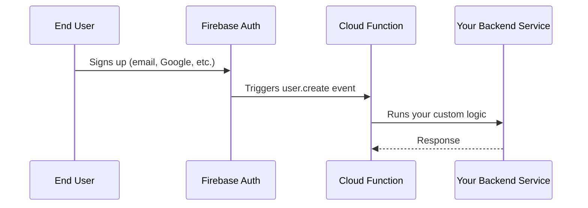

# How to Set Up a Cloud Function That Triggers on Firebase Authentication User Creation Events

Author: [nawazdhandala](https://www.github.com/nawazdhandala)

Tags: GCP, Cloud Functions, Firebase, Authentication, Serverless

Description: Learn how to create a Google Cloud Function that automatically triggers whenever a new user signs up through Firebase Authentication, enabling onboarding workflows.

---

If you have ever needed to run some backend logic the moment a user creates an account - sending a welcome email, provisioning default resources, logging the event to an analytics system - you know the pain of polling or manually hooking into the auth flow. Firebase Authentication paired with Cloud Functions makes this surprisingly straightforward. Instead of bolting middleware onto your frontend, you let Google handle the wiring, and your function fires automatically when a user signs up.

In this post, I will walk through setting up a Cloud Function that triggers on Firebase Authentication user creation events, from project configuration all the way through deployment and testing.

## Prerequisites

Before jumping in, make sure you have:

- A Google Cloud project with billing enabled
- Firebase initialized in your project (you can do this from the Firebase console)
- The Firebase CLI and Google Cloud SDK installed locally
- Node.js 18 or later

If you have not linked your GCP project to Firebase yet, head to the Firebase console, click "Add Project," and select your existing GCP project.

## Understanding the Trigger

Firebase Authentication events are part of the broader Cloud Functions event ecosystem. When a user creates an account through any Firebase Auth provider (email/password, Google sign-in, phone auth, etc.), Firebase emits a `user.create` event. Your Cloud Function subscribes to this event and receives a `UserRecord` object containing the new user's details.

The flow looks like this:



## Initializing the Project

Start by creating a new directory for your functions and initializing it with Firebase.

```bash
# Create a new directory and initialize Firebase Functions
mkdir my-auth-functions
cd my-auth-functions
firebase init functions
```

When prompted, select your GCP project, choose JavaScript or TypeScript (I will use JavaScript here for clarity), and install dependencies.

## Writing the Cloud Function

Open the `functions/index.js` file and add your trigger. The key is using `functions.auth.user().onCreate()` which specifically listens for new user creation events.

```javascript
// functions/index.js
const functions = require("firebase-functions");
const admin = require("firebase-admin");

// Initialize the Firebase Admin SDK to access other Firebase services
admin.initializeApp();

// This function triggers every time a new user is created in Firebase Auth
exports.onUserCreated = functions.auth.user().onCreate(async (user) => {
  // Extract user details from the UserRecord object
  const email = user.email;
  const displayName = user.displayName || "New User";
  const uid = user.uid;
  const creationTime = user.metadata.creationTime;

  console.log(`New user created: ${uid} (${email}) at ${creationTime}`);

  // Example: Store user profile in Firestore with default settings
  try {
    await admin.firestore().collection("users").doc(uid).set({
      email: email,
      displayName: displayName,
      createdAt: admin.firestore.FieldValue.serverTimestamp(),
      plan: "free",
      onboardingComplete: false,
      preferences: {
        notifications: true,
        theme: "light",
      },
    });

    console.log(`User profile created in Firestore for ${uid}`);
  } catch (error) {
    console.error("Error creating user profile:", error);
    throw error; // Re-throw so Cloud Functions marks this as a failure
  }
});
```

## Adding a Welcome Email Step

Most teams want to send a welcome email when a user signs up. You can integrate any email service. Here is an example using a hypothetical email utility.

```javascript
// A helper function to send welcome emails
// In production, you would use SendGrid, Mailgun, or a similar service
async function sendWelcomeEmail(email, displayName) {
  const mailOptions = {
    from: "welcome@yourapp.com",
    to: email,
    subject: "Welcome to Our App!",
    text: `Hi ${displayName}, thanks for signing up. We are glad to have you.`,
  };

  // Replace this with your actual email sending logic
  console.log("Sending welcome email to:", email);
  // await mailTransport.sendMail(mailOptions);
}

// Updated function that also sends a welcome email
exports.onUserCreated = functions.auth.user().onCreate(async (user) => {
  const email = user.email;
  const displayName = user.displayName || "New User";
  const uid = user.uid;

  // Run both operations concurrently since they are independent
  await Promise.all([
    admin.firestore().collection("users").doc(uid).set({
      email: email,
      displayName: displayName,
      createdAt: admin.firestore.FieldValue.serverTimestamp(),
      plan: "free",
    }),
    sendWelcomeEmail(email, displayName),
  ]);

  console.log(`Onboarding complete for user ${uid}`);
});
```

## Deploying the Function

Deploy with the Firebase CLI. It handles packaging, uploading, and configuring the trigger automatically.

```bash
# Deploy only the functions (not hosting or other Firebase services)
firebase deploy --only functions
```

After deployment, you will see output confirming the function name and the trigger type. The function is now live and will fire on every new user signup.

## Testing Locally with the Firebase Emulator

You do not have to deploy every time you make a change. The Firebase emulator suite lets you test auth triggers locally.

```bash
# Start the emulator suite with auth and functions emulators
firebase emulators:start --only auth,functions,firestore
```

Then, in your frontend app (or using the emulator UI at `localhost:4000`), create a test user. Your function will trigger in the local emulator, and you can see the logs right in your terminal.

## Using Cloud Functions Gen 2

If you are using Cloud Functions Gen 2 (which runs on Cloud Run under the hood), the syntax changes slightly. Gen 2 uses the `firebase-functions/v2` module.

```javascript
// Gen 2 version of the auth trigger
const { onDocumentCreated } = require("firebase-functions/v2/firestore");
const { beforeUserCreated } = require("firebase-functions/v2/identity");

// This is a blocking function that runs BEFORE user creation completes
// Useful for validation or enrichment
exports.validateNewUser = beforeUserCreated((event) => {
  const user = event.data;

  // Example: Block signups from certain email domains
  if (user.email && user.email.endsWith("@blocked-domain.com")) {
    throw new functions.https.HttpsError(
      "permission-denied",
      "Signups from this domain are not allowed."
    );
  }

  // You can also modify the user record before it is saved
  return {
    displayName: user.displayName || user.email.split("@")[0],
  };
});
```

## Error Handling and Retries

Cloud Functions triggered by auth events are background functions, which means they support automatic retries. If your function throws an error, Cloud Functions will retry it. This is great for transient failures (like a Firestore timeout) but dangerous for non-idempotent operations.

To handle this properly, make your function idempotent. One approach is to check if the user profile already exists before creating it.

```javascript
// Idempotent version that safely handles retries
exports.onUserCreated = functions.auth.user().onCreate(async (user) => {
  const uid = user.uid;

  // Check if we already processed this user (handles retry scenarios)
  const existingDoc = await admin.firestore().collection("users").doc(uid).get();

  if (existingDoc.exists) {
    console.log(`User ${uid} already processed, skipping.`);
    return;
  }

  await admin.firestore().collection("users").doc(uid).set({
    email: user.email,
    displayName: user.displayName || "New User",
    createdAt: admin.firestore.FieldValue.serverTimestamp(),
    plan: "free",
  });
});
```

## Monitoring and Debugging

Once deployed, you can monitor your function through the Google Cloud Console under Cloud Functions, or use the `gcloud` CLI.

```bash
# View recent logs for your function
gcloud functions logs read onUserCreated --limit 50

# View logs with a specific severity level
gcloud functions logs read onUserCreated --min-log-level ERROR
```

You can also set up alerts in Cloud Monitoring to notify you if the function starts failing frequently, which is something I would strongly recommend for any production auth workflow.

## Common Pitfalls

A few things I have run into that are worth calling out:

1. **Cold starts**: Auth triggers can experience cold starts, especially if signups are infrequent. If latency matters (like for blocking functions), consider using minimum instances.

2. **Missing fields**: Not every auth provider populates all fields. A Google sign-in user will have `displayName` and `photoURL`, but an email/password user might not. Always add fallbacks.

3. **Provider-specific data**: The `UserRecord` includes a `providerData` array with details from each auth provider. If you need to know which provider a user signed up with, check this array instead of guessing from the available fields.

4. **Function timeout**: The default timeout is 60 seconds. If your onboarding logic involves multiple API calls, you may need to increase this in your function configuration.

## Wrapping Up

Setting up a Cloud Function that triggers on Firebase Authentication user creation events gives you a clean, reliable way to handle user onboarding logic without coupling it to your frontend. The function runs automatically, supports retries, and scales with your user base. Whether you need to create Firestore profiles, send welcome emails, or integrate with third-party services, this pattern keeps your auth flow simple and your backend logic centralized.

For production systems, remember to enable retries, make your functions idempotent, and set up monitoring. And if you need to validate or block users before they are actually created, look into the blocking functions available in Gen 2 - they are a powerful addition to the toolkit.
