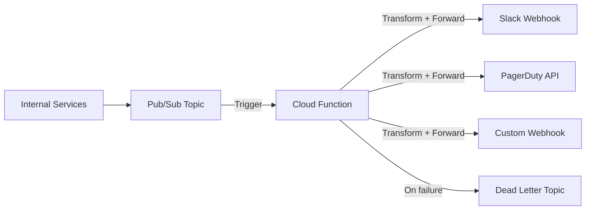

# How to Set Up a Cloud Function to Forward Pub/Sub Messages to a Third-Party Webhook

Author: [nawazdhandala](https://www.github.com/nawazdhandala)

Tags: GCP, Cloud Functions, Pub/Sub, Webhooks, Integration

Description: Build a Cloud Function that forwards Google Cloud Pub/Sub messages to third-party webhooks like Slack, PagerDuty, or custom HTTP endpoints with retry logic and error handling.

---

Pub/Sub is great for decoupling services within GCP, but at some point you need to send data to systems outside Google Cloud - a Slack channel, a PagerDuty incident, a partner API, or any HTTP webhook endpoint. A Cloud Function sitting between Pub/Sub and the external webhook is the cleanest way to do this. It gives you message transformation, retry logic, authentication handling, and error management in one place.

Let me show you how to build a production-ready Pub/Sub to webhook forwarder.

## Basic Architecture



The function subscribes to a Pub/Sub topic, transforms the message into the format the webhook expects, sends it, and handles any failures.

## The Webhook Forwarder Function

Here is a flexible forwarder that supports multiple webhook destinations with message transformation:

```javascript
// index.js - Pub/Sub to webhook forwarder
const functions = require('@google-cloud/functions-framework');
const axios = require('axios');

// Webhook configurations loaded from environment variables
const WEBHOOK_URL = process.env.WEBHOOK_URL;
const WEBHOOK_SECRET = process.env.WEBHOOK_SECRET;
const WEBHOOK_TYPE = process.env.WEBHOOK_TYPE || 'generic'; // slack, pagerduty, generic

// Retry configuration
const MAX_RETRIES = 3;
const RETRY_DELAY_MS = 1000;

functions.cloudEvent('forwardToWebhook', async (cloudEvent) => {
  const message = cloudEvent.data.message;
  const rawData = Buffer.from(message.data, 'base64').toString('utf-8');
  const attributes = message.attributes || {};

  console.log(`Received message ${message.messageId}`, {
    dataLength: rawData.length,
    attributes: attributes
  });

  // Parse the message data
  let payload;
  try {
    payload = JSON.parse(rawData);
  } catch (error) {
    console.error('Failed to parse message as JSON, forwarding as raw string');
    payload = { rawData: rawData };
  }

  // Transform the payload based on webhook type
  const webhookPayload = transformPayload(payload, attributes, WEBHOOK_TYPE);

  // Forward to the webhook with retry logic
  await sendWithRetry(WEBHOOK_URL, webhookPayload, {
    secret: WEBHOOK_SECRET,
    messageId: message.messageId
  });

  console.log(`Successfully forwarded message ${message.messageId} to ${WEBHOOK_TYPE} webhook`);
});

function transformPayload(data, attributes, webhookType) {
  switch (webhookType) {
    case 'slack':
      return transformForSlack(data, attributes);
    case 'pagerduty':
      return transformForPagerDuty(data, attributes);
    case 'teams':
      return transformForTeams(data, attributes);
    default:
      return transformForGeneric(data, attributes);
  }
}

function transformForSlack(data, attributes) {
  // Format the message for Slack's incoming webhook API
  const severity = attributes.severity || 'info';
  const colorMap = {
    critical: '#FF0000',
    error: '#FF4444',
    warning: '#FFA500',
    info: '#36A2EB'
  };

  return {
    attachments: [{
      color: colorMap[severity] || '#808080',
      title: data.title || data.summary || 'Notification',
      text: data.message || data.description || JSON.stringify(data, null, 2),
      fields: [
        {
          title: 'Severity',
          value: severity.toUpperCase(),
          short: true
        },
        {
          title: 'Source',
          value: attributes.source || 'unknown',
          short: true
        },
        {
          title: 'Timestamp',
          value: data.timestamp || new Date().toISOString(),
          short: true
        }
      ],
      footer: 'GCP Pub/Sub Forwarder',
      ts: Math.floor(Date.now() / 1000)
    }]
  };
}

function transformForPagerDuty(data, attributes) {
  // Format for PagerDuty Events API v2
  const severityMap = {
    critical: 'critical',
    error: 'error',
    warning: 'warning',
    info: 'info'
  };

  return {
    routing_key: process.env.PAGERDUTY_ROUTING_KEY,
    event_action: data.resolved ? 'resolve' : 'trigger',
    dedup_key: data.incidentId || data.alertId || `pubsub-${Date.now()}`,
    payload: {
      summary: data.title || data.message || 'Alert from GCP',
      severity: severityMap[attributes.severity] || 'warning',
      source: attributes.source || 'gcp-pubsub',
      timestamp: data.timestamp || new Date().toISOString(),
      custom_details: data
    }
  };
}

function transformForTeams(data, attributes) {
  // Format for Microsoft Teams incoming webhook
  return {
    '@type': 'MessageCard',
    '@context': 'http://schema.org/extensions',
    themeColor: attributes.severity === 'error' ? 'FF0000' : '0076D7',
    summary: data.title || 'Notification',
    sections: [{
      activityTitle: data.title || 'GCP Notification',
      activitySubtitle: data.timestamp || new Date().toISOString(),
      facts: [
        { name: 'Severity', value: (attributes.severity || 'info').toUpperCase() },
        { name: 'Source', value: attributes.source || 'GCP' }
      ],
      text: data.message || JSON.stringify(data),
      markdown: true
    }]
  };
}

function transformForGeneric(data, attributes) {
  // Generic webhook format - send everything
  return {
    event: attributes.eventType || 'notification',
    timestamp: new Date().toISOString(),
    source: 'gcp-pubsub',
    attributes: attributes,
    data: data
  };
}

async function sendWithRetry(url, payload, options) {
  let lastError;

  for (let attempt = 1; attempt <= MAX_RETRIES; attempt++) {
    try {
      const headers = {
        'Content-Type': 'application/json',
        'X-Message-ID': options.messageId
      };

      // Add authentication header if a secret is provided
      if (options.secret) {
        headers['Authorization'] = `Bearer ${options.secret}`;
      }

      const response = await axios.post(url, payload, {
        headers,
        timeout: 10000 // 10 second timeout
      });

      console.log(`Webhook responded with status ${response.status} on attempt ${attempt}`);
      return response;

    } catch (error) {
      lastError = error;
      const status = error.response?.status;

      // Do not retry on client errors (except 429 rate limit)
      if (status && status >= 400 && status < 500 && status !== 429) {
        console.error(`Webhook returned ${status}, not retrying: ${error.response?.data}`);
        throw error;
      }

      console.warn(
        `Webhook attempt ${attempt}/${MAX_RETRIES} failed: ${error.message}`
      );

      if (attempt < MAX_RETRIES) {
        // Exponential backoff between retries
        const delay = RETRY_DELAY_MS * Math.pow(2, attempt - 1);
        await new Promise(resolve => setTimeout(resolve, delay));
      }
    }
  }

  throw lastError;
}
```

## Package Configuration

```json
{
  "name": "pubsub-webhook-forwarder",
  "version": "1.0.0",
  "dependencies": {
    "@google-cloud/functions-framework": "^3.0.0",
    "axios": "^1.6.0"
  }
}
```

## Deploying the Forwarder

### Slack Webhook

```bash
# Deploy for Slack
gcloud functions deploy forward-to-slack \
  --gen2 \
  --runtime=nodejs20 \
  --region=us-central1 \
  --source=. \
  --entry-point=forwardToWebhook \
  --trigger-topic=alerts-topic \
  --memory=256Mi \
  --timeout=30s \
  --set-env-vars="WEBHOOK_TYPE=slack" \
  --set-secrets="WEBHOOK_URL=slack-webhook-url:latest"
```

### PagerDuty

```bash
# Deploy for PagerDuty
gcloud functions deploy forward-to-pagerduty \
  --gen2 \
  --runtime=nodejs20 \
  --region=us-central1 \
  --source=. \
  --entry-point=forwardToWebhook \
  --trigger-topic=critical-alerts-topic \
  --memory=256Mi \
  --timeout=30s \
  --set-env-vars="WEBHOOK_TYPE=pagerduty,WEBHOOK_URL=https://events.pagerduty.com/v2/enqueue" \
  --set-secrets="PAGERDUTY_ROUTING_KEY=pagerduty-key:latest"
```

### Generic Webhook

```bash
# Deploy for a generic webhook
gcloud functions deploy forward-to-partner-api \
  --gen2 \
  --runtime=nodejs20 \
  --region=us-central1 \
  --source=. \
  --entry-point=forwardToWebhook \
  --trigger-topic=partner-events \
  --memory=256Mi \
  --timeout=30s \
  --set-env-vars="WEBHOOK_TYPE=generic" \
  --set-secrets="WEBHOOK_URL=partner-webhook-url:latest,WEBHOOK_SECRET=partner-api-secret:latest"
```

## Publishing Messages

Send messages to the topic from anywhere in your system:

```javascript
// Publishing alert messages from your application
const { PubSub } = require('@google-cloud/pubsub');
const pubsub = new PubSub();

async function sendAlert(title, message, severity) {
  const topic = pubsub.topic('alerts-topic');

  await topic.publishMessage({
    data: Buffer.from(JSON.stringify({
      title: title,
      message: message,
      timestamp: new Date().toISOString(),
      environment: process.env.APP_ENV
    })),
    attributes: {
      severity: severity,      // critical, error, warning, info
      source: 'api-server',
      eventType: 'alert'
    }
  });

  console.log(`Published ${severity} alert: ${title}`);
}

// Usage
await sendAlert(
  'High Error Rate Detected',
  'Error rate exceeded 5% threshold on the /api/users endpoint',
  'error'
);
```

## Adding Request Signing

For webhook endpoints that verify request signatures (like GitHub, Stripe, etc.), add HMAC signing:

```javascript
const crypto = require('crypto');

function signPayload(payload, secret) {
  // Create an HMAC-SHA256 signature of the payload
  const signature = crypto
    .createHmac('sha256', secret)
    .update(JSON.stringify(payload))
    .digest('hex');

  return `sha256=${signature}`;
}

// Add the signature header to the webhook request
async function sendSignedRequest(url, payload, secret) {
  const signature = signPayload(payload, secret);

  const response = await axios.post(url, payload, {
    headers: {
      'Content-Type': 'application/json',
      'X-Signature-256': signature,
      'X-Timestamp': Date.now().toString()
    },
    timeout: 10000
  });

  return response;
}
```

## Filtering Messages

Not every message needs to go to every webhook. Add filtering logic:

```javascript
// Filter messages based on attributes before forwarding
function shouldForward(attributes) {
  const minSeverity = process.env.MIN_SEVERITY || 'info';
  const severityOrder = ['debug', 'info', 'warning', 'error', 'critical'];

  const msgSeverity = severityOrder.indexOf(attributes.severity || 'info');
  const threshold = severityOrder.indexOf(minSeverity);

  return msgSeverity >= threshold;
}

functions.cloudEvent('forwardToWebhook', async (cloudEvent) => {
  const attributes = cloudEvent.data.message.attributes || {};

  // Skip messages below the severity threshold
  if (!shouldForward(attributes)) {
    console.log(`Skipping message with severity ${attributes.severity}`);
    return;
  }

  // Continue with forwarding logic
  // ...
});
```

## Monitoring

Monitor your webhook forwarder with OneUptime to track delivery success rates, webhook response times, and retry frequency. If a third-party webhook starts returning errors or timing out, you want to know immediately so you can investigate whether the external service is down or your message format has changed. A healthy forwarder should have a delivery success rate above 99%, and anything below that warrants investigation.

This pattern is simple but covers most Pub/Sub to webhook integration needs. The key is building in proper retry logic, error handling, and message transformation so the forwarder is reliable enough to be trusted in production.
