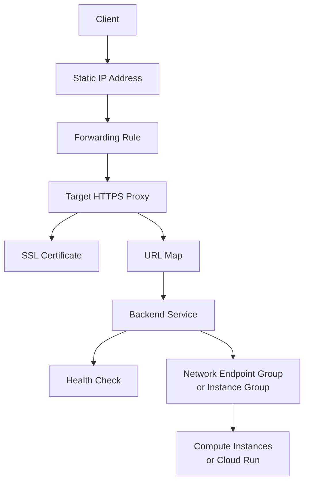

# How to Set Up a Cloud Load Balancer with Terraform on GCP

Author: [nawazdhandala](https://www.github.com/nawazdhandala)

Tags: GCP, Terraform, Load Balancer, Networking, Infrastructure as Code, HTTPS

Description: Learn how to set up a Google Cloud external HTTPS load balancer with Terraform including SSL certificates, backend services, health checks, and CDN configuration.

---

Load balancers on GCP involve a surprising number of resources. A single HTTPS load balancer requires a forwarding rule, a target proxy, a URL map, backend services, health checks, SSL certificates, and a static IP address. Setting this up through the Console is tedious and error-prone. Setting it up with Terraform means you can create it once, version control it, and replicate it across environments.

This guide walks through creating an external HTTPS load balancer with Terraform, from the simplest possible setup to a production-ready configuration with CDN and custom headers.

## Understanding the GCP Load Balancer Architecture

GCP load balancers are built from composable pieces:



Each of these is a separate Terraform resource. It looks like a lot, but it gives you fine-grained control over every aspect of traffic routing.

## Static IP Address

Start with a static external IP address:

```hcl
# ip.tf - Reserve a static external IP for the load balancer
resource "google_compute_global_address" "lb_ip" {
  name    = "lb-static-ip"
  project = var.project_id
}
```

## Health Check

The load balancer needs to know which backends are healthy:

```hcl
# health_check.tf - Health check for backend instances
resource "google_compute_health_check" "http" {
  name    = "http-health-check"
  project = var.project_id

  check_interval_sec  = 10
  timeout_sec         = 5
  healthy_threshold   = 2
  unhealthy_threshold = 3

  http_health_check {
    port         = 8080
    request_path = "/health"
  }
}
```

## Backend Service

The backend service connects the load balancer to your compute resources:

```hcl
# backend.tf - Backend service for the load balancer

# Instance group (assuming you have Compute Engine instances)
resource "google_compute_instance_group" "web" {
  name    = "web-instance-group"
  zone    = "${var.region}-a"
  project = var.project_id

  instances = [
    google_compute_instance.web_1.id,
    google_compute_instance.web_2.id,
  ]

  named_port {
    name = "http"
    port = 8080
  }
}

# Backend service
resource "google_compute_backend_service" "web" {
  name                  = "web-backend"
  project               = var.project_id
  protocol              = "HTTP"
  port_name             = "http"
  timeout_sec           = 30
  load_balancing_scheme = "EXTERNAL_MANAGED"

  health_checks = [google_compute_health_check.http.id]

  backend {
    group           = google_compute_instance_group.web.id
    balancing_mode  = "UTILIZATION"
    max_utilization = 0.8
    capacity_scaler = 1.0
  }

  # Session affinity (optional)
  session_affinity = "NONE"

  # Connection draining
  connection_draining_timeout_sec = 300

  # Logging
  log_config {
    enable      = true
    sample_rate = 1.0
  }
}
```

## URL Map

The URL map routes requests to the correct backend:

```hcl
# url_map.tf - URL routing rules
resource "google_compute_url_map" "web" {
  name            = "web-url-map"
  project         = var.project_id
  default_service = google_compute_backend_service.web.id

  # Route /api/* to the API backend
  host_rule {
    hosts        = ["example.com"]
    path_matcher = "main"
  }

  path_matcher {
    name            = "main"
    default_service = google_compute_backend_service.web.id

    path_rule {
      paths   = ["/api/*"]
      service = google_compute_backend_service.api.id
    }

    path_rule {
      paths   = ["/static/*"]
      service = google_compute_backend_bucket.static.id
    }
  }
}
```

## SSL Certificate

Use Google-managed SSL certificates for automatic renewal:

```hcl
# ssl.tf - Google-managed SSL certificate
resource "google_compute_managed_ssl_certificate" "default" {
  name    = "web-ssl-cert"
  project = var.project_id

  managed {
    domains = ["example.com", "www.example.com"]
  }
}
```

## HTTPS Proxy and Forwarding Rule

Connect everything together:

```hcl
# proxy.tf - HTTPS proxy and forwarding rule

# HTTPS target proxy
resource "google_compute_target_https_proxy" "web" {
  name    = "web-https-proxy"
  project = var.project_id

  url_map          = google_compute_url_map.web.id
  ssl_certificates = [google_compute_managed_ssl_certificate.default.id]
}

# Forwarding rule for HTTPS traffic
resource "google_compute_global_forwarding_rule" "https" {
  name                  = "web-https-forwarding"
  project               = var.project_id
  ip_address            = google_compute_global_address.lb_ip.address
  port_range            = "443"
  target                = google_compute_target_https_proxy.web.id
  load_balancing_scheme = "EXTERNAL_MANAGED"
}
```

## HTTP to HTTPS Redirect

Always redirect HTTP traffic to HTTPS:

```hcl
# redirect.tf - HTTP to HTTPS redirect

# URL map that redirects all HTTP to HTTPS
resource "google_compute_url_map" "http_redirect" {
  name    = "http-redirect"
  project = var.project_id

  default_url_redirect {
    https_redirect         = true
    redirect_response_code = "MOVED_PERMANENTLY_DEFAULT"
    strip_query            = false
  }
}

# HTTP target proxy
resource "google_compute_target_http_proxy" "redirect" {
  name    = "http-redirect-proxy"
  project = var.project_id
  url_map = google_compute_url_map.http_redirect.id
}

# HTTP forwarding rule
resource "google_compute_global_forwarding_rule" "http" {
  name                  = "web-http-forwarding"
  project               = var.project_id
  ip_address            = google_compute_global_address.lb_ip.address
  port_range            = "80"
  target                = google_compute_target_http_proxy.redirect.id
  load_balancing_scheme = "EXTERNAL_MANAGED"
}
```

## Cloud Run as a Backend

Using serverless network endpoint groups (NEGs) with Cloud Run:

```hcl
# cloudrun_backend.tf - Cloud Run as a load balancer backend

# Serverless NEG pointing to Cloud Run
resource "google_compute_region_network_endpoint_group" "cloudrun_neg" {
  name                  = "cloudrun-neg"
  network_endpoint_type = "SERVERLESS"
  region                = var.region
  project               = var.project_id

  cloud_run {
    service = google_cloud_run_v2_service.api.name
  }
}

# Backend service for Cloud Run
resource "google_compute_backend_service" "cloudrun" {
  name                  = "cloudrun-backend"
  project               = var.project_id
  load_balancing_scheme = "EXTERNAL_MANAGED"

  backend {
    group = google_compute_region_network_endpoint_group.cloudrun_neg.id
  }

  # No health check needed for serverless NEGs
}
```

## Enabling Cloud CDN

Add CDN caching for static content:

```hcl
# Backend service with CDN enabled
resource "google_compute_backend_service" "web_with_cdn" {
  name                  = "web-backend-cdn"
  project               = var.project_id
  protocol              = "HTTP"
  port_name             = "http"
  load_balancing_scheme = "EXTERNAL_MANAGED"

  health_checks = [google_compute_health_check.http.id]

  backend {
    group = google_compute_instance_group.web.id
  }

  # Enable Cloud CDN
  enable_cdn = true

  cdn_policy {
    cache_mode                   = "CACHE_ALL_STATIC"
    default_ttl                  = 3600    # 1 hour default
    max_ttl                      = 86400   # 24 hours max
    client_ttl                   = 3600
    signed_url_cache_max_age_sec = 7200

    cache_key_policy {
      include_host         = true
      include_protocol     = true
      include_query_string = false
    }
  }
}

# Backend bucket for static assets with CDN
resource "google_compute_backend_bucket" "static" {
  name        = "static-assets-backend"
  bucket_name = google_storage_bucket.static_assets.name
  project     = var.project_id
  enable_cdn  = true

  cdn_policy {
    cache_mode  = "CACHE_ALL_STATIC"
    default_ttl = 86400
  }
}
```

## Cloud Armor Security Policy

Protect your load balancer with Cloud Armor:

```hcl
# security.tf - Cloud Armor security policy
resource "google_compute_security_policy" "web" {
  name    = "web-security-policy"
  project = var.project_id

  # Default rule: allow all traffic
  rule {
    action   = "allow"
    priority = 2147483647

    match {
      versioned_expr = "SRC_IPS_V1"
      config {
        src_ip_ranges = ["*"]
      }
    }
  }

  # Block known bad IP ranges
  rule {
    action   = "deny(403)"
    priority = 1000

    match {
      versioned_expr = "SRC_IPS_V1"
      config {
        src_ip_ranges = var.blocked_ip_ranges
      }
    }
  }

  # Rate limiting
  rule {
    action   = "rate_based_ban"
    priority = 2000

    match {
      versioned_expr = "SRC_IPS_V1"
      config {
        src_ip_ranges = ["*"]
      }
    }

    rate_limit_options {
      rate_limit_threshold {
        count        = 100
        interval_sec = 60
      }
      ban_duration_sec = 600
      conform_action   = "allow"
      exceed_action    = "deny(429)"
    }
  }
}

# Attach the security policy to the backend service
resource "google_compute_backend_service" "web_secured" {
  name                  = "web-backend-secured"
  project               = var.project_id
  security_policy       = google_compute_security_policy.web.id
  # ... other configuration
}
```

## Outputs

```hcl
# outputs.tf
output "load_balancer_ip" {
  description = "The external IP address of the load balancer"
  value       = google_compute_global_address.lb_ip.address
}

output "https_url" {
  description = "The HTTPS URL for the load balancer"
  value       = "https://${google_compute_global_address.lb_ip.address}"
}
```

## DNS Configuration

Point your domain to the load balancer IP:

```hcl
# dns.tf - DNS record pointing to the load balancer
resource "google_dns_record_set" "web" {
  name         = "example.com."
  type         = "A"
  ttl          = 300
  managed_zone = google_dns_managed_zone.main.name
  project      = var.project_id

  rrdatas = [google_compute_global_address.lb_ip.address]
}

resource "google_dns_record_set" "www" {
  name         = "www.example.com."
  type         = "CNAME"
  ttl          = 300
  managed_zone = google_dns_managed_zone.main.name
  project      = var.project_id

  rrdatas = ["example.com."]
}
```

## Best Practices

1. **Always set up HTTP to HTTPS redirect.** Never serve production traffic over plain HTTP.
2. **Use Google-managed SSL certificates** for automatic renewal. Manual certificates expire and cause outages.
3. **Enable Cloud CDN** for static content to reduce latency and backend load.
4. **Add Cloud Armor** security policies for DDoS protection and rate limiting.
5. **Configure connection draining** on backend services so in-flight requests complete during deployments.
6. **Enable logging** on backend services for debugging and traffic analysis.
7. **Use health checks** with appropriate intervals. Too aggressive checks waste resources; too lenient ones miss failures.

## Wrapping Up

Setting up a GCP load balancer with Terraform is verbose because of the number of resources involved, but the result is a fully codified, reproducible setup that you can deploy identically across environments. Start with the basic HTTPS setup, add HTTP-to-HTTPS redirect, then layer on CDN and security policies as needed. Once the Terraform configuration is in place, you never have to wire up these resources through the console again.
