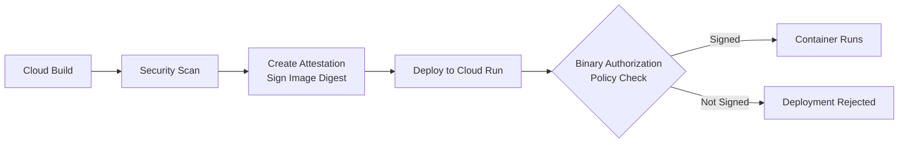

# How to Set Up a Cloud Run Service with Binary Authorization to Only Allow Signed Container Images

Author: [nawazdhandala](https://www.github.com/nawazdhandala)

Tags: GCP, Cloud Run, Binary Authorization, Container Security, Supply Chain, Google Cloud

Description: Learn how to configure Binary Authorization for Cloud Run to ensure only cryptographically signed and verified container images can be deployed.

---

Anyone with deploy permissions can push any container image to your Cloud Run service. That image could come from anywhere - an untested branch, a compromised build pipeline, or a developer's laptop. Binary Authorization stops this by requiring that container images are cryptographically signed before Cloud Run will run them.

This is a supply chain security measure. It ensures that only images that passed through your approved build and review process can be deployed. If an image is not signed by an authorized attestor, Cloud Run rejects the deployment.

## How Binary Authorization Works

The system has three components:

1. **Attestors**: Entities that vouch for an image (e.g., your CI/CD pipeline, a security scanner)
2. **Attestations**: Cryptographic signatures that an attestor creates for a specific image digest
3. **Policy**: Rules that define which attestors must sign an image before it can be deployed



## Prerequisites

Enable the required APIs:

```bash
# Enable Binary Authorization and related APIs
gcloud services enable \
  binaryauthorization.googleapis.com \
  containeranalysis.googleapis.com \
  run.googleapis.com \
  artifactregistry.googleapis.com \
  cloudbuild.googleapis.com \
  cloudkms.googleapis.com
```

## Step 1: Create a KMS Key for Signing

Attestations are signed with cryptographic keys. We will use Cloud KMS:

```bash
# Create a KMS keyring
gcloud kms keyrings create attestor-keyring \
  --location=global

# Create an asymmetric signing key
gcloud kms keys create attestor-key \
  --location=global \
  --keyring=attestor-keyring \
  --purpose=asymmetric-signing \
  --default-algorithm=ec-sign-p256-sha256
```

## Step 2: Create a Container Analysis Note

Attestations are stored as Container Analysis notes. Create a note for your attestor:

```bash
# Create the note payload
cat > /tmp/note.json << 'EOF'
{
  "attestation": {
    "hint": {
      "human_readable_name": "Build Pipeline Attestor"
    }
  }
}
EOF

# Create the Container Analysis note
PROJECT_ID=$(gcloud config get-value project)

curl -X POST \
  "https://containeranalysis.googleapis.com/v1/projects/${PROJECT_ID}/notes/?noteId=build-attestor-note" \
  -H "Authorization: Bearer $(gcloud auth print-access-token)" \
  -H "Content-Type: application/json" \
  --data-binary @/tmp/note.json
```

## Step 3: Create an Attestor

The attestor links the note to the signing key:

```bash
# Create the attestor
gcloud container binauthz attestors create build-pipeline-attestor \
  --attestation-authority-note=build-attestor-note \
  --attestation-authority-note-project=$(gcloud config get-value project)

# Add the KMS key to the attestor
gcloud container binauthz attestors public-keys add \
  --attestor=build-pipeline-attestor \
  --keyversion-project=$(gcloud config get-value project) \
  --keyversion-location=global \
  --keyversion-keyring=attestor-keyring \
  --keyversion-key=attestor-key \
  --keyversion=1
```

Verify the attestor was created:

```bash
# List attestors
gcloud container binauthz attestors list

# Describe the attestor
gcloud container binauthz attestors describe build-pipeline-attestor
```

## Step 4: Create a Binary Authorization Policy

The policy defines what attestations are required for deployment:

```bash
# Export the current policy
gcloud container binauthz policy export > /tmp/policy.yaml
```

Edit the policy to require your attestor:

```yaml
# /tmp/policy.yaml - Binary Authorization policy
admissionWhitelistPatterns:
  # Allow specific system images if needed
  - namePattern: "gcr.io/google-samples/*"

defaultAdmissionRule:
  # Require attestation for all other images
  evaluationMode: REQUIRE_ATTESTATION
  enforcementMode: ENFORCED_BLOCK_AND_AUDIT_LOG
  requireAttestationsBy:
    - projects/MY_PROJECT/attestors/build-pipeline-attestor

globalPolicyEvaluationMode: ENABLE
```

Import the policy:

```bash
# Apply the Binary Authorization policy
gcloud container binauthz policy import /tmp/policy.yaml
```

## Step 5: Enable Binary Authorization on Cloud Run

```bash
# Deploy a Cloud Run service with Binary Authorization enforced
gcloud run deploy my-secure-service \
  --image=us-central1-docker.pkg.dev/MY_PROJECT/my-repo/my-app@sha256:abc123... \
  --region=us-central1 \
  --binary-authorization=default
```

Note that you must use an image digest (sha256), not a tag. Binary Authorization verifies the exact image content, and tags are mutable.

To update an existing service:

```bash
# Enable Binary Authorization on an existing service
gcloud run services update my-secure-service \
  --region=us-central1 \
  --binary-authorization=default
```

## Step 6: Create Attestations in Your Build Pipeline

Now you need to sign images as part of your build process. Here is how to do it in Cloud Build:

```yaml
# cloudbuild.yaml - Build, scan, sign, and deploy
steps:
  # Step 1: Build the image
  - name: "gcr.io/cloud-builders/docker"
    args:
      - "build"
      - "-t"
      - "us-central1-docker.pkg.dev/$PROJECT_ID/my-repo/my-app:$COMMIT_SHA"
      - "."

  # Step 2: Push the image
  - name: "gcr.io/cloud-builders/docker"
    args:
      - "push"
      - "us-central1-docker.pkg.dev/$PROJECT_ID/my-repo/my-app:$COMMIT_SHA"

  # Step 3: Get the image digest
  - name: "gcr.io/google.com/cloudsdktool/cloud-sdk"
    id: "get-digest"
    entrypoint: bash
    args:
      - "-c"
      - |
        # Get the exact image digest for attestation
        IMAGE_DIGEST=$(gcloud artifacts docker images describe \
          us-central1-docker.pkg.dev/$PROJECT_ID/my-repo/my-app:$COMMIT_SHA \
          --format='value(image_summary.digest)')
        echo $IMAGE_DIGEST > /workspace/image_digest.txt
        echo "Image digest: $IMAGE_DIGEST"

  # Step 4: Create the attestation (sign the image)
  - name: "gcr.io/google.com/cloudsdktool/cloud-sdk"
    id: "sign-image"
    entrypoint: bash
    args:
      - "-c"
      - |
        IMAGE_DIGEST=$(cat /workspace/image_digest.txt)
        FULL_IMAGE="us-central1-docker.pkg.dev/$PROJECT_ID/my-repo/my-app@$IMAGE_DIGEST"

        # Create the attestation using the KMS key
        gcloud container binauthz attestations sign-and-create \
          --artifact-url=$FULL_IMAGE \
          --attestor=build-pipeline-attestor \
          --attestor-project=$PROJECT_ID \
          --keyversion-project=$PROJECT_ID \
          --keyversion-location=global \
          --keyversion-keyring=attestor-keyring \
          --keyversion-key=attestor-key \
          --keyversion=1

  # Step 5: Deploy to Cloud Run using the digest
  - name: "gcr.io/google.com/cloudsdktool/cloud-sdk"
    id: "deploy"
    entrypoint: bash
    args:
      - "-c"
      - |
        IMAGE_DIGEST=$(cat /workspace/image_digest.txt)
        gcloud run deploy my-secure-service \
          --image=us-central1-docker.pkg.dev/$PROJECT_ID/my-repo/my-app@$IMAGE_DIGEST \
          --region=us-central1 \
          --binary-authorization=default
```

## Step 7: Test the Policy

Try deploying an unsigned image to verify the policy blocks it:

```bash
# This should fail because the image is not attested
gcloud run deploy my-secure-service \
  --image=us-central1-docker.pkg.dev/MY_PROJECT/my-repo/unsigned-image@sha256:xyz789... \
  --region=us-central1 \
  --binary-authorization=default
```

You should see an error like: "Denied by attestation authority. Image did not meet the required attestation policy."

## Dry Run Mode

Before enforcing the policy, test it in dry-run mode. This logs violations without actually blocking deployments:

```yaml
# policy.yaml - Dry run mode for testing
defaultAdmissionRule:
  evaluationMode: REQUIRE_ATTESTATION
  # Log violations but do not block
  enforcementMode: DRYRUN_AUDIT_LOG_ONLY
  requireAttestationsBy:
    - projects/MY_PROJECT/attestors/build-pipeline-attestor
```

Check the audit logs for violations:

```bash
# Look for Binary Authorization violations in audit logs
gcloud logging read '
  resource.type="cloud_run_revision"
  AND protoPayload.serviceName="binaryauthorization.googleapis.com"
' --limit=10 --format="json"
```

## Exempting Specific Images

Sometimes you need to allow certain images without attestation (system images, base images, etc.):

```yaml
# policy.yaml with exemptions
admissionWhitelistPatterns:
  # Allow all images from your trusted registry path
  - namePattern: "us-central1-docker.pkg.dev/MY_PROJECT/trusted-images/*"
  # Allow specific system images
  - namePattern: "gcr.io/cloudrun/hello"

defaultAdmissionRule:
  evaluationMode: REQUIRE_ATTESTATION
  enforcementMode: ENFORCED_BLOCK_AND_AUDIT_LOG
  requireAttestationsBy:
    - projects/MY_PROJECT/attestors/build-pipeline-attestor
```

## Multiple Attestors

For a more rigorous process, require multiple attestations. For example, one from the build pipeline and one from a security scanner:

```yaml
# policy.yaml with multiple required attestors
defaultAdmissionRule:
  evaluationMode: REQUIRE_ATTESTATION
  enforcementMode: ENFORCED_BLOCK_AND_AUDIT_LOG
  requireAttestationsBy:
    # Both attestors must sign the image
    - projects/MY_PROJECT/attestors/build-pipeline-attestor
    - projects/MY_PROJECT/attestors/security-scanner-attestor
```

The image must have valid attestations from all listed attestors to be deployed.

## Verifying Attestations

Check what attestations exist for an image:

```bash
# List attestations for an image
gcloud container binauthz attestations list \
  --attestor=build-pipeline-attestor \
  --artifact-url="us-central1-docker.pkg.dev/MY_PROJECT/my-repo/my-app@sha256:abc123..."
```

## Summary

Binary Authorization adds a critical security layer to your Cloud Run deployments. It ensures only images that went through your approved build process - verified by cryptographic signatures - can run in your environment. The setup involves creating KMS keys, attestors, and a policy, then integrating attestation creation into your CI/CD pipeline. Start with dry-run mode to catch unattested images without blocking deployments, then switch to enforced mode once your pipeline consistently produces attestations. This prevents unauthorized or untested code from ever reaching production.
