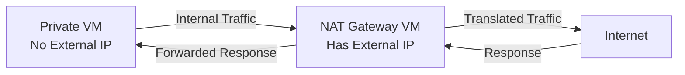

# How to Set Up a Compute Engine VM as a NAT Gateway for Instances Without External IPs

Author: [nawazdhandala](https://www.github.com/nawazdhandala)

Tags: GCP, Compute Engine, NAT Gateway, Networking, Security

Description: Learn how to configure a Compute Engine VM as a NAT gateway so that private instances without external IP addresses can access the internet for updates and API calls.

---

Running VMs without external IP addresses is a security best practice. It reduces your attack surface by removing direct internet access. But those VMs still need to reach the internet sometimes - for package updates, API calls, downloading dependencies, or pushing logs to external services.

The solution is a NAT gateway. While GCP offers Cloud NAT as a managed service (and you should probably use it for production), setting up a VM-based NAT gateway teaches you how NAT works and gives you more control over the routing. It is also useful in scenarios where you need custom traffic inspection or logging.

## Architecture Overview

The setup looks like this:



The private VMs send their internet-bound traffic to the NAT gateway VM, which translates the source IP to its own external IP and forwards the traffic. Return traffic follows the reverse path.

## Step 1: Create the VPC and Subnets

Set up the network infrastructure:

```bash
# Create a VPC network
gcloud compute networks create private-network \
  --subnet-mode=custom

# Create a subnet for the private instances
gcloud compute networks subnets create private-subnet \
  --network=private-network \
  --region=us-central1 \
  --range=10.0.1.0/24
```

## Step 2: Create the NAT Gateway VM

The NAT gateway needs an external IP and must have IP forwarding enabled:

```bash
# Create the NAT gateway VM with IP forwarding enabled
gcloud compute instances create nat-gateway \
  --zone=us-central1-a \
  --machine-type=e2-medium \
  --network-interface=subnet=private-subnet \
  --image-family=debian-12 \
  --image-project=debian-cloud \
  --can-ip-forward \
  --tags=nat-gateway \
  --metadata=startup-script='#!/bin/bash
# Enable IP forwarding in the kernel
sysctl -w net.ipv4.ip_forward=1
echo "net.ipv4.ip_forward = 1" >> /etc/sysctl.conf

# Configure iptables for NAT
iptables -t nat -A POSTROUTING -o ens4 -j MASQUERADE
iptables -A FORWARD -i ens4 -j ACCEPT
iptables -A FORWARD -o ens4 -m state --state RELATED,ESTABLISHED -j ACCEPT

# Install iptables-persistent to survive reboots
apt-get update
DEBIAN_FRONTEND=noninteractive apt-get install -y iptables-persistent
netfilter-persistent save'
```

The critical flags here are:
- `--can-ip-forward` - Allows the VM to send and receive packets with non-matching source/destination IPs
- The startup script enables kernel IP forwarding and sets up iptables masquerading

## Step 3: Create Firewall Rules

Allow traffic to flow through the NAT gateway:

```bash
# Allow internal traffic from private instances to the NAT gateway
gcloud compute firewall-rules create allow-internal-to-nat \
  --network=private-network \
  --allow=tcp,udp,icmp \
  --source-ranges=10.0.1.0/24 \
  --target-tags=nat-gateway

# Allow SSH to the NAT gateway for management
gcloud compute firewall-rules create allow-ssh-nat \
  --network=private-network \
  --allow=tcp:22 \
  --source-ranges=35.235.240.0/20 \
  --target-tags=nat-gateway

# Allow SSH to private instances via IAP
gcloud compute firewall-rules create allow-ssh-iap-private \
  --network=private-network \
  --allow=tcp:22 \
  --source-ranges=35.235.240.0/20 \
  --target-tags=private-instance
```

## Step 4: Create the Route

Create a custom route that sends internet-bound traffic from private instances through the NAT gateway:

```bash
# Route internet traffic from private instances through the NAT gateway
gcloud compute routes create nat-route \
  --network=private-network \
  --destination-range=0.0.0.0/0 \
  --next-hop-instance=nat-gateway \
  --next-hop-instance-zone=us-central1-a \
  --tags=private-instance \
  --priority=800
```

The `--tags=private-instance` ensures this route only applies to VMs with that network tag. The NAT gateway itself should not use this route (it would create a loop).

## Step 5: Create Private Instances

Now create VMs without external IPs:

```bash
# Create a private instance with no external IP
gcloud compute instances create private-vm-1 \
  --zone=us-central1-a \
  --machine-type=e2-small \
  --network-interface=subnet=private-subnet,no-address \
  --image-family=debian-12 \
  --image-project=debian-cloud \
  --tags=private-instance
```

The `no-address` flag ensures the VM gets no external IP.

## Step 6: Test the NAT Gateway

SSH into the private instance using IAP tunneling (since it has no external IP):

```bash
# SSH to the private instance via IAP tunnel
gcloud compute ssh private-vm-1 \
  --zone=us-central1-a \
  --tunnel-through-iap
```

Test internet connectivity:

```bash
# Test that the private VM can reach the internet through NAT
curl -s https://ifconfig.me
# This should return the NAT gateway's external IP

# Test package installation
sudo apt-get update
sudo apt-get install -y curl wget
```

If `curl https://ifconfig.me` returns the NAT gateway's external IP, NAT is working correctly.

## Making the NAT Gateway Resilient

A single NAT gateway is a single point of failure. Here are some ways to add resilience.

### Health Check Script

Run a health check on the NAT gateway that can trigger alerts:

```bash
#!/bin/bash
# health-check.sh - Verify NAT gateway functionality

# Check if IP forwarding is enabled
IP_FORWARD=$(cat /proc/sys/net/ipv4/ip_forward)
if [ "${IP_FORWARD}" != "1" ]; then
  echo "ERROR: IP forwarding is disabled"
  # Re-enable it
  sysctl -w net.ipv4.ip_forward=1
fi

# Check if iptables NAT rule exists
if ! iptables -t nat -C POSTROUTING -o ens4 -j MASQUERADE 2>/dev/null; then
  echo "ERROR: NAT masquerade rule is missing"
  # Re-add it
  iptables -t nat -A POSTROUTING -o ens4 -j MASQUERADE
fi

# Check external connectivity
if ! curl -s --max-time 5 https://www.google.com > /dev/null; then
  echo "ERROR: Cannot reach internet"
fi
```

### Dual NAT Gateways with Failover

For higher availability, you can run two NAT gateways and use health-check-based routing:

```bash
# Create a second NAT gateway in a different zone
gcloud compute instances create nat-gateway-2 \
  --zone=us-central1-b \
  --machine-type=e2-medium \
  --network-interface=subnet=private-subnet \
  --image-family=debian-12 \
  --image-project=debian-cloud \
  --can-ip-forward \
  --tags=nat-gateway \
  --metadata-from-file=startup-script=nat-setup.sh

# Create a route through the second gateway with lower priority (higher number = lower priority)
gcloud compute routes create nat-route-backup \
  --network=private-network \
  --destination-range=0.0.0.0/0 \
  --next-hop-instance=nat-gateway-2 \
  --next-hop-instance-zone=us-central1-b \
  --tags=private-instance \
  --priority=900
```

If the primary NAT gateway goes down, traffic automatically fails over to the backup because the route with priority 800 becomes unavailable and the route with priority 900 takes effect.

## Monitoring NAT Traffic

Add logging to track what traffic flows through the NAT:

```bash
# Log all NAT translations (run on the NAT gateway)
sudo iptables -t nat -A POSTROUTING -o ens4 -j LOG \
  --log-prefix "NAT-TRAFFIC: " --log-level 4

# View the logs
sudo journalctl -k | grep "NAT-TRAFFIC"
```

For production monitoring, install the Ops Agent and track network metrics:

```bash
# Check network throughput on the NAT gateway
gcloud monitoring time-series list \
  --filter='metric.type="compute.googleapis.com/instance/network/sent_bytes_count" AND resource.labels.instance_id="NAT_GATEWAY_INSTANCE_ID"' \
  --interval-start-time=$(date -u -d '-1 hour' +%Y-%m-%dT%H:%M:%SZ)
```

## When to Use Cloud NAT Instead

Cloud NAT is the managed alternative that handles all of this automatically. Use it when:

- You do not need to inspect or log traffic at the packet level
- You want automatic scaling and high availability without managing VMs
- You need to support more than a few hundred private instances

```bash
# For comparison, here is how easy Cloud NAT is to set up
gcloud compute routers create nat-router \
  --network=private-network \
  --region=us-central1

gcloud compute routers nats create managed-nat \
  --router=nat-router \
  --region=us-central1 \
  --auto-allocate-nat-external-ips \
  --nat-all-subnet-ip-ranges
```

That said, a VM-based NAT gateway gives you control over traffic inspection, custom logging, bandwidth management, and cost optimization for smaller deployments. It is also a great way to understand how NAT works under the hood, which helps when troubleshooting connectivity issues with any NAT setup.
