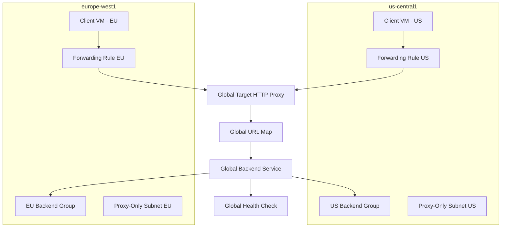

# How to Set Up a Cross-Region Internal Application Load Balancer in GCP

Author: [nawazdhandala](https://www.github.com/nawazdhandala)

Tags: GCP, Load Balancer, Cross-Region, Internal Load Balancer, Networking

Description: A hands-on guide to setting up a cross-region internal application load balancer in GCP to distribute internal HTTP traffic across backends in multiple regions.

---

When your internal services span multiple regions and you need intelligent Layer 7 routing between them, the cross-region internal application load balancer is the tool for the job. It gives you a single internal IP address that routes traffic to backends in different regions, with automatic failover if a region goes down. This is especially useful for disaster recovery setups and globally distributed internal applications.

This post walks through the entire setup, including the global resources and region-specific pieces you need to wire together.

## How Cross-Region Internal Load Balancing Differs

The standard regional internal application load balancer is scoped to a single region. Your backends and clients must be in the same region (unless you enable global access, which allows cross-region client access but still keeps backends in one region).

The cross-region internal application load balancer changes this. It uses global backend services that can reference instance groups in multiple regions. Traffic is routed to the closest healthy backend, and if all backends in one region fail, traffic automatically shifts to another region.

Under the hood, it still uses Envoy proxies, so you need proxy-only subnets in every region where you have backends.

## Prerequisites

- A GCP project with Compute Engine API enabled
- A VPC network with subnets in at least two regions
- Backend instances running in multiple regions
- The `gcloud` CLI configured with appropriate permissions

## Step 1: Create Proxy-Only Subnets in Each Region

You need a proxy-only subnet with `GLOBAL_MANAGED_PROXY` purpose in every region where you have backends or expect clients.

```bash
# Create proxy-only subnet in us-central1
gcloud compute networks subnets create proxy-subnet-us \
    --purpose=GLOBAL_MANAGED_PROXY \
    --role=ACTIVE \
    --network=my-vpc \
    --region=us-central1 \
    --range=10.129.0.0/23

# Create proxy-only subnet in europe-west1
gcloud compute networks subnets create proxy-subnet-eu \
    --purpose=GLOBAL_MANAGED_PROXY \
    --role=ACTIVE \
    --network=my-vpc \
    --region=europe-west1 \
    --range=10.131.0.0/23
```

Note the purpose is `GLOBAL_MANAGED_PROXY`, not `REGIONAL_MANAGED_PROXY`. This is what distinguishes cross-region proxy subnets from regional ones.

## Step 2: Create Health Checks

For a cross-region setup, use global health checks rather than regional ones:

```bash
# Create a global health check for cross-region backends
gcloud compute health-checks create http cross-region-health-check \
    --port=8080 \
    --request-path="/healthz" \
    --check-interval=10s \
    --timeout=5s \
    --healthy-threshold=2 \
    --unhealthy-threshold=3 \
    --global
```

## Step 3: Create a Global Backend Service

The backend service must be global with the `INTERNAL_MANAGED` load balancing scheme:

```bash
# Create a global backend service for internal cross-region traffic
gcloud compute backend-services create cross-region-backend \
    --protocol=HTTP \
    --health-checks=cross-region-health-check \
    --load-balancing-scheme=INTERNAL_MANAGED \
    --global
```

Now add instance groups from different regions:

```bash
# Add the US backend group
gcloud compute backend-services add-backend cross-region-backend \
    --instance-group=us-backend-group \
    --instance-group-zone=us-central1-a \
    --global

# Add the EU backend group
gcloud compute backend-services add-backend cross-region-backend \
    --instance-group=eu-backend-group \
    --instance-group-zone=europe-west1-b \
    --global
```

## Step 4: Create a Global URL Map

```bash
# Create a global URL map routing to the cross-region backend
gcloud compute url-maps create cross-region-url-map \
    --default-service=cross-region-backend \
    --global
```

You can add path-based or host-based routing rules just like with any other URL map:

```bash
# Example: import a URL map with path-based routing
gcloud compute url-maps import cross-region-url-map \
    --global \
    --source=/dev/stdin <<EOF
name: cross-region-url-map
defaultService: projects/MY_PROJECT/global/backendServices/cross-region-backend
hostRules:
- hosts:
  - 'api.internal'
  pathMatcher: api-routes
pathMatchers:
- name: api-routes
  defaultService: projects/MY_PROJECT/global/backendServices/cross-region-backend
  routeRules:
  - matchRules:
    - prefixMatch: /v2/
    service: projects/MY_PROJECT/global/backendServices/cross-region-backend-v2
    priority: 1
EOF
```

## Step 5: Create a Global Target HTTP Proxy

```bash
# Create a global target HTTP proxy
gcloud compute target-http-proxies create cross-region-http-proxy \
    --url-map=cross-region-url-map \
    --global
```

## Step 6: Create Forwarding Rules

For the cross-region internal load balancer, you create forwarding rules in each region where you want the load balancer to be accessible. Each forwarding rule gets a different internal IP in that region's subnet.

```bash
# Create a forwarding rule in us-central1
gcloud compute forwarding-rules create cross-region-rule-us \
    --load-balancing-scheme=INTERNAL_MANAGED \
    --network=my-vpc \
    --subnet=us-subnet \
    --region=us-central1 \
    --ports=80 \
    --target-http-proxy=cross-region-http-proxy \
    --target-http-proxy-region=us-central1

# Create a forwarding rule in europe-west1
gcloud compute forwarding-rules create cross-region-rule-eu \
    --load-balancing-scheme=INTERNAL_MANAGED \
    --network=my-vpc \
    --subnet=eu-subnet \
    --region=europe-west1 \
    --ports=80 \
    --target-http-proxy=cross-region-http-proxy \
    --target-http-proxy-region=europe-west1
```

## Step 7: Set Up Firewall Rules

Allow traffic from proxy-only subnets and health check ranges:

```bash
# Allow proxy traffic from both proxy-only subnets
gcloud compute firewall-rules create allow-cross-region-proxy \
    --network=my-vpc \
    --action=allow \
    --direction=ingress \
    --source-ranges=10.129.0.0/23,10.131.0.0/23 \
    --target-tags=cross-region-backend \
    --rules=tcp:8080

# Allow health check probes
gcloud compute firewall-rules create allow-cross-region-health \
    --network=my-vpc \
    --action=allow \
    --direction=ingress \
    --source-ranges=130.211.0.0/22,35.191.0.0/16 \
    --target-tags=cross-region-backend \
    --rules=tcp:8080
```

## Architecture Overview



## Traffic Routing Behavior

The cross-region internal load balancer uses proximity-based routing by default. A client in us-central1 will have its traffic routed to backends in us-central1 first. If those backends are unhealthy or overloaded, traffic spills over to europe-west1.

You can also configure traffic splitting if you want to explicitly control the distribution:

```bash
# Configure 70/30 traffic split between regions
gcloud compute backend-services update-backend cross-region-backend \
    --instance-group=us-backend-group \
    --instance-group-zone=us-central1-a \
    --max-rate-per-instance=100 \
    --global

gcloud compute backend-services update-backend cross-region-backend \
    --instance-group=eu-backend-group \
    --instance-group-zone=europe-west1-b \
    --max-rate-per-instance=50 \
    --global
```

## Testing Failover

To test that failover works correctly, you can simulate a regional outage by stopping all instances in one region:

```bash
# Stop all instances in the US group to simulate a failure
gcloud compute instance-groups managed resize us-backend-group \
    --size=0 \
    --zone=us-central1-a

# From a US client, verify traffic now goes to EU backends
curl http://INTERNAL_LB_IP/

# Restore the US group
gcloud compute instance-groups managed resize us-backend-group \
    --size=3 \
    --zone=us-central1-a
```

## Considerations and Limits

**Latency**: Cross-region traffic adds latency. A request from a US client hitting an EU backend will have higher round-trip time than hitting a local backend. The load balancer is proximity-aware and tries to minimize this.

**Cost**: Cross-region data transfer between backends incurs egress charges. This is the same cost as any other cross-region traffic within GCP.

**DNS**: Since each region has its own forwarding rule with a different IP, you may want to use Cloud DNS with a private zone to give the load balancer a hostname. Clients can then use DNS rather than hardcoding IPs.

**Session Affinity**: Session affinity works within a region but does not guarantee cross-region stickiness. If a region fails and traffic moves to another region, sessions will be re-established.

## Wrapping Up

The cross-region internal application load balancer fills an important gap in GCP networking. It gives you a single logical load balancer that spans regions, with automatic failover and proximity-based routing. The setup involves more pieces than a regional load balancer - global backend services, proxy-only subnets in each region, and forwarding rules per region - but the result is a resilient internal networking layer that can survive regional outages.
