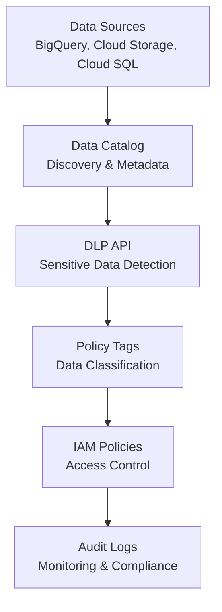

# How to Set Up a Data Governance Framework on GCP Using Data Catalog DLP API and IAM Policies

Author: [nawazdhandala](https://www.github.com/nawazdhandala)

Tags: GCP, Data Governance, Data Catalog, DLP API, IAM, Data Classification, Compliance

Description: A hands-on guide to building a data governance framework on GCP using Data Catalog for discovery, DLP API for sensitive data detection, and IAM policies for access control.

---

Data governance sounds like something only enterprises care about, but the truth is that any team storing customer data needs it. Knowing where your sensitive data lives, who can access it, and how it is classified is not just good practice - in many jurisdictions it is the law. On GCP, you can build a governance framework using Data Catalog for discovery and classification, DLP API for automated sensitive data detection, and IAM for access control. This guide walks through a practical implementation.

## The Governance Framework

A data governance framework needs three capabilities:

1. Discovery - what data do you have and where does it live?
2. Classification - which data is sensitive, and what kind of sensitive?
3. Access control - who can see what, and is that appropriate?



## Step 1: Set Up Data Catalog for Discovery

Data Catalog automatically discovers BigQuery tables. For other sources, you need to register them:

```bash
# Enable required APIs
gcloud services enable datacatalog.googleapis.com
gcloud services enable dlp.googleapis.com

# Create a Dataplex lake to organize your data assets
gcloud dataplex lakes create governance-lake \
  --location=us-central1 \
  --display-name="Data Governance Lake"

# Add BigQuery datasets as assets
gcloud dataplex zones create analytics-zone \
  --lake=governance-lake \
  --location=us-central1 \
  --resource-location-type=SINGLE_REGION \
  --type=CURATED \
  --display-name="Analytics Zone"

# Attach a BigQuery dataset to the zone
gcloud dataplex assets create orders-data \
  --zone=analytics-zone \
  --lake=governance-lake \
  --location=us-central1 \
  --resource-type=BIGQUERY_DATASET \
  --resource-name="projects/my-project/datasets/analytics" \
  --display-name="Analytics Dataset"
```

## Step 2: Create a Data Classification Taxonomy

Define a taxonomy that represents your data classification levels:

```python
# create_taxonomy.py - Set up data classification taxonomy in Data Catalog
from google.cloud import datacatalog_v1

client = datacatalog_v1.PolicyTagManagerClient()

# Create the parent taxonomy
taxonomy = datacatalog_v1.Taxonomy()
taxonomy.display_name = "Data Sensitivity Classification"
taxonomy.description = "Classification levels for data governance"
taxonomy.activated_policy_types = [
    datacatalog_v1.Taxonomy.PolicyType.FINE_GRAINED_ACCESS_CONTROL
]

created_taxonomy = client.create_taxonomy(
    parent="projects/my-project/locations/us-central1",
    taxonomy=taxonomy
)
print(f"Created taxonomy: {created_taxonomy.name}")

# Create policy tags (classification levels)
classifications = {
    "Public": "Data that can be freely shared externally",
    "Internal": "Data for internal use only, not customer-facing",
    "Confidential": "Business-sensitive data requiring restricted access",
    "Restricted-PII": "Personally identifiable information subject to privacy regulations",
    "Restricted-Financial": "Financial data subject to SOX or PCI compliance",
    "Restricted-Health": "Health data subject to HIPAA regulations",
}

for name, description in classifications.items():
    policy_tag = datacatalog_v1.PolicyTag()
    policy_tag.display_name = name
    policy_tag.description = description

    created_tag = client.create_policy_tag(
        parent=created_taxonomy.name,
        policy_tag=policy_tag
    )
    print(f"Created policy tag: {name} -> {created_tag.name}")
```

## Step 3: Use DLP API for Automated Data Discovery

Run DLP inspections to automatically find sensitive data in your BigQuery tables:

```python
# dlp_scan.py - Scan BigQuery tables for sensitive data using DLP API
from google.cloud import dlp_v2

def scan_bigquery_table(project_id, dataset_id, table_id):
    """Scan a BigQuery table for sensitive data using DLP API."""
    dlp_client = dlp_v2.DlpServiceClient()

    # Define what types of sensitive data to look for
    inspect_config = {
        "info_types": [
            {"name": "EMAIL_ADDRESS"},
            {"name": "PHONE_NUMBER"},
            {"name": "CREDIT_CARD_NUMBER"},
            {"name": "US_SOCIAL_SECURITY_NUMBER"},
            {"name": "STREET_ADDRESS"},
            {"name": "PERSON_NAME"},
            {"name": "DATE_OF_BIRTH"},
            {"name": "IP_ADDRESS"},
        ],
        "min_likelihood": dlp_v2.Likelihood.LIKELY,
        "include_quote": False,
        "limits": {
            "max_findings_per_request": 1000,
        },
    }

    # Configure the BigQuery source
    storage_config = {
        "big_query_options": {
            "table_reference": {
                "project_id": project_id,
                "dataset_id": dataset_id,
                "table_id": table_id,
            },
            "rows_limit": 10000,  # Sample rows for efficiency
            "sample_method": dlp_v2.BigQueryOptions.SampleMethod.RANDOM_START,
        }
    }

    # Write results to BigQuery for analysis
    actions = [
        {
            "save_findings": {
                "output_config": {
                    "table": {
                        "project_id": project_id,
                        "dataset_id": "data_governance",
                        "table_id": "dlp_findings",
                    }
                }
            }
        },
        {
            "publish_summary_to_cscc": {}  # Also send to Security Command Center
        }
    ]

    # Create and run the DLP job
    job = dlp_client.create_dlp_job(
        parent=f"projects/{project_id}/locations/us-central1",
        inspect_job={
            "inspect_config": inspect_config,
            "storage_config": storage_config,
            "actions": actions,
        },
    )

    print(f"Started DLP scan job: {job.name}")
    return job.name


# Scan your main tables
tables_to_scan = [
    ("my-project", "analytics", "customers"),
    ("my-project", "analytics", "orders"),
    ("my-project", "analytics", "user_events"),
]

for project, dataset, table in tables_to_scan:
    scan_bigquery_table(project, dataset, table)
```

## Step 4: Apply Classification Tags Based on DLP Findings

After the DLP scan completes, apply policy tags to columns that contain sensitive data:

```python
# apply_classifications.py - Tag BigQuery columns based on DLP findings
from google.cloud import bigquery
from google.cloud import datacatalog_v1

bq_client = bigquery.Client()
dc_client = datacatalog_v1.PolicyTagManagerClient()

# Mapping from DLP info types to policy tag IDs
INFO_TYPE_TO_POLICY_TAG = {
    "EMAIL_ADDRESS": "projects/my-project/locations/us-central1/taxonomies/TAX_ID/policyTags/PII_TAG_ID",
    "PHONE_NUMBER": "projects/my-project/locations/us-central1/taxonomies/TAX_ID/policyTags/PII_TAG_ID",
    "CREDIT_CARD_NUMBER": "projects/my-project/locations/us-central1/taxonomies/TAX_ID/policyTags/FINANCIAL_TAG_ID",
    "US_SOCIAL_SECURITY_NUMBER": "projects/my-project/locations/us-central1/taxonomies/TAX_ID/policyTags/PII_TAG_ID",
    "PERSON_NAME": "projects/my-project/locations/us-central1/taxonomies/TAX_ID/policyTags/PII_TAG_ID",
}

def apply_policy_tags_from_dlp(project_id, dataset_id, table_id):
    """Apply policy tags to columns based on DLP scan findings."""

    # Query DLP findings for this table
    query = f"""
    SELECT
      location.content_locations[0].record_location.field_id.name AS column_name,
      info_type.name AS info_type,
      COUNT(*) AS finding_count
    FROM `{project_id}.data_governance.dlp_findings`
    WHERE resource_name LIKE '%{dataset_id}.{table_id}%'
    GROUP BY 1, 2
    HAVING finding_count >= 5  -- Minimum confidence threshold
    """

    results = bq_client.query(query).result()

    # Get the current table schema
    table = bq_client.get_table(f"{project_id}.{dataset_id}.{table_id}")
    schema = list(table.schema)
    schema_changed = False

    for row in results:
        column_name = row.column_name
        info_type = row.info_type
        policy_tag = INFO_TYPE_TO_POLICY_TAG.get(info_type)

        if policy_tag:
            # Find the column in the schema and add the policy tag
            for i, field in enumerate(schema):
                if field.name == column_name:
                    # Create a new field with the policy tag
                    schema[i] = bigquery.SchemaField(
                        name=field.name,
                        field_type=field.field_type,
                        mode=field.mode,
                        description=field.description,
                        policy_tags=bigquery.PolicyTagList(
                            names=[policy_tag]
                        )
                    )
                    schema_changed = True
                    print(f"Tagged {column_name} as {info_type}")

    if schema_changed:
        table.schema = schema
        bq_client.update_table(table, ["schema"])
        print(f"Updated schema for {dataset_id}.{table_id}")


# Apply tags to scanned tables
apply_policy_tags_from_dlp("my-project", "analytics", "customers")
apply_policy_tags_from_dlp("my-project", "analytics", "orders")
```

## Step 5: Configure Access Control

Grant fine-grained access based on data classification:

```bash
# Data analysts can see internal and public data
gcloud data-catalog taxonomies policy-tags add-iam-policy-binding \
  "projects/my-project/locations/us-central1/taxonomies/TAX_ID/policyTags/INTERNAL_TAG_ID" \
  --member="group:data-analysts@company.com" \
  --role="roles/datacatalog.categoryFineGrainedReader"

# Only the compliance team can see PII
gcloud data-catalog taxonomies policy-tags add-iam-policy-binding \
  "projects/my-project/locations/us-central1/taxonomies/TAX_ID/policyTags/PII_TAG_ID" \
  --member="group:compliance-team@company.com" \
  --role="roles/datacatalog.categoryFineGrainedReader"

# Only finance can see financial data
gcloud data-catalog taxonomies policy-tags add-iam-policy-binding \
  "projects/my-project/locations/us-central1/taxonomies/TAX_ID/policyTags/FINANCIAL_TAG_ID" \
  --member="group:finance-team@company.com" \
  --role="roles/datacatalog.categoryFineGrainedReader"
```

## Step 6: Create a Data Stewardship Tag Template

Define a tag template for data stewardship information:

```bash
# Create a tag template for data stewardship metadata
gcloud data-catalog tag-templates create data_stewardship \
  --location=us-central1 \
  --display-name="Data Stewardship" \
  --field=id=data_owner,display-name="Data Owner",type=string,required=true \
  --field=id=data_steward,display-name="Data Steward",type=string,required=true \
  --field=id=retention_period,display-name="Retention Period",type=string \
  --field=id=classification_level,display-name="Classification Level",type='enum(Public|Internal|Confidential|Restricted)' \
  --field=id=last_review_date,display-name="Last Review Date",type=string \
  --field=id=compliance_frameworks,display-name="Compliance Frameworks",type=string
```

Tag your datasets with stewardship information:

```python
# tag_stewardship.py - Apply stewardship tags to datasets
from google.cloud import datacatalog_v1

client = datacatalog_v1.DataCatalogClient()

def tag_dataset(project_id, dataset_id, stewardship_info):
    """Tag a BigQuery dataset with stewardship metadata."""
    resource = (
        f"//bigquery.googleapis.com/projects/{project_id}"
        f"/datasets/{dataset_id}"
    )
    entry = client.lookup_entry(request={"linked_resource": resource})

    tag = datacatalog_v1.Tag()
    tag.template = (
        f"projects/{project_id}/locations/us-central1"
        f"/tagTemplates/data_stewardship"
    )

    tag.fields["data_owner"] = datacatalog_v1.TagField(
        string_value=stewardship_info["owner"]
    )
    tag.fields["data_steward"] = datacatalog_v1.TagField(
        string_value=stewardship_info["steward"]
    )
    tag.fields["retention_period"] = datacatalog_v1.TagField(
        string_value=stewardship_info["retention"]
    )
    tag.fields["classification_level"] = datacatalog_v1.TagField(
        enum_value=datacatalog_v1.TagField.EnumValue(
            display_name=stewardship_info["classification"]
        )
    )
    tag.fields["compliance_frameworks"] = datacatalog_v1.TagField(
        string_value=stewardship_info["compliance"]
    )

    client.create_tag(parent=entry.name, tag=tag)
    print(f"Tagged {dataset_id} with stewardship info")


tag_dataset("my-project", "analytics", {
    "owner": "data-engineering@company.com",
    "steward": "jane.smith@company.com",
    "retention": "7 years",
    "classification": "Confidential",
    "compliance": "SOC2, GDPR"
})
```

## Step 7: Set Up Audit Logging and Monitoring

Enable audit logging to track who accesses what data:

```bash
# Enable data access audit logs for BigQuery
gcloud projects get-iam-policy my-project --format=json > policy.json
```

Add the audit logging configuration:

```json
{
  "auditConfigs": [
    {
      "service": "bigquery.googleapis.com",
      "auditLogConfigs": [
        {"logType": "DATA_READ"},
        {"logType": "DATA_WRITE"}
      ]
    }
  ]
}
```

Create a monitoring query to track access to sensitive data:

```sql
-- Query audit logs for access to PII-tagged columns
SELECT
  protopayload_auditlog.authenticationInfo.principalEmail AS user,
  protopayload_auditlog.resourceName AS resource,
  timestamp,
  protopayload_auditlog.methodName AS access_type
FROM `my-project.audit_logs.cloudaudit_googleapis_com_data_access`
WHERE protopayload_auditlog.resourceName LIKE '%analytics%'
  AND timestamp >= TIMESTAMP_SUB(CURRENT_TIMESTAMP(), INTERVAL 24 HOUR)
ORDER BY timestamp DESC;
```

## Governance Dashboard

Create a summary view for your governance dashboard:

```sql
-- Governance overview: tables by classification and access stats
CREATE OR REPLACE VIEW `my-project.data_governance.overview` AS
SELECT
  t.table_catalog AS project,
  t.table_schema AS dataset,
  t.table_name,
  t.row_count,
  ROUND(t.size_bytes / POW(1024, 3), 2) AS size_gb,
  COUNTIF(c.policy_tags IS NOT NULL) AS classified_columns,
  COUNT(*) AS total_columns
FROM `my-project.region-us-central1.INFORMATION_SCHEMA.TABLES` t
JOIN `my-project.region-us-central1.INFORMATION_SCHEMA.COLUMNS` c
  ON t.table_name = c.table_name AND t.table_schema = c.table_schema
GROUP BY 1, 2, 3, 4, 5
ORDER BY size_gb DESC;
```

## Key Takeaways

Data governance on GCP is not a single product - it is a combination of tools working together. Data Catalog handles discovery and metadata, DLP API automates sensitive data detection, policy tags enforce column-level access, and audit logs provide the compliance trail. Start with your most sensitive datasets, automate the classification process, and expand coverage over time.

The most common mistake is trying to classify everything manually. Use DLP API to scan your tables automatically and apply initial classifications, then have data stewards review and refine. Automation handles 80% of the work; human judgment handles the remaining 20%.
