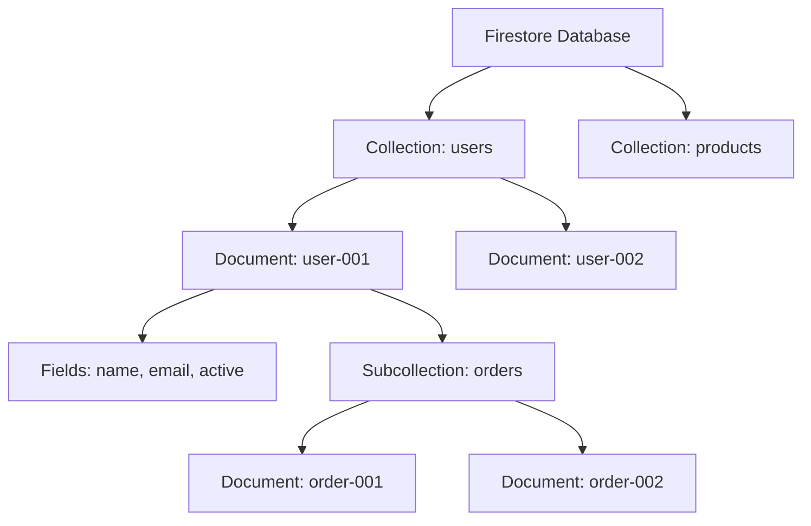

# How to Set Up a Firestore Database in Native Mode Using the Google Cloud Console

Author: [nawazdhandala](https://www.github.com/nawazdhandala)

Tags: GCP, Firestore, NoSQL, Google Cloud, Database Setup

Description: Step-by-step instructions for creating and configuring a Firestore database in Native mode through the Google Cloud Console.

---

Firestore is Google Cloud's serverless NoSQL document database. It stores data as collections of documents, scales automatically, and provides real-time synchronization out of the box. If you are building a web or mobile application that needs a flexible, schemaless database with offline support, Firestore in Native mode is a strong choice. In this post, I will walk through setting up Firestore from scratch using the Google Cloud Console.

## Native Mode vs Datastore Mode

Before creating your Firestore database, you need to choose between two modes:

**Native Mode** is the full Firestore experience. It includes real-time listeners, offline support for mobile/web clients, and the document/collection data model. This is what most new applications should use.

**Datastore Mode** is backward-compatible with the older Cloud Datastore product. It uses Firestore's storage engine but exposes the Datastore API. Choose this only if you are migrating from an existing Datastore application.

This choice cannot be changed after creation, so pick carefully. For this post, we will use Native mode.

## Step 1: Navigate to Firestore

Open the Google Cloud Console at console.cloud.google.com. Make sure you have selected the correct project from the project selector at the top of the page.

In the left navigation menu, scroll down to "Databases" under the "Serverless" section, or search for "Firestore" in the top search bar. Click on "Firestore" to open the Firestore console.

If this is your first time using Firestore in this project, you will see a welcome screen asking you to choose a mode and location.

## Step 2: Select Native Mode

On the setup screen, you will see two options: "Native mode" and "Datastore mode." Select "Native mode."

The screen will show you a brief description of each mode's capabilities. Native mode includes:

- Real-time updates with snapshot listeners
- Offline data persistence for mobile and web clients
- Flexible hierarchical data model with collections and subcollections
- Strong consistency for all queries
- Integration with Firebase SDKs

## Step 3: Choose a Location

Select where your Firestore data will be stored. This is a permanent choice - you cannot change the location after creation.

Available locations include:

**Multi-region locations** for maximum availability:
- nam5 (United States)
- eur3 (Europe)

**Regional locations** for lower latency when your users are concentrated in one area:
- us-central1 (Iowa)
- us-east1 (South Carolina)
- europe-west1 (Belgium)
- asia-east1 (Taiwan)
- And many more

For most applications serving users in a single country, a regional location close to your users gives the best latency. For globally distributed applications, a multi-region location provides higher availability.

Some things to consider when choosing:

- Pick a location close to your Cloud Functions or Cloud Run services to minimize network latency
- If you are using Firebase Authentication, your auth data is in the US regardless of where Firestore is located
- Multi-region locations cost more than single-region locations

## Step 4: Create the Database

Click the "Create Database" button. Firestore will provision your database, which usually takes less than a minute.

Once provisioned, you will see the Firestore console with an empty database ready for data.

## Step 5: Create Your First Collection and Document

From the Firestore console, click "Start collection." Enter a collection ID - this is the name of your collection. Let's create a "users" collection.

Next, add a document. You can either let Firestore generate a random document ID or specify your own. Add some fields:

- `name` (string): "Alice Johnson"
- `email` (string): "alice@example.com"
- `createdAt` (timestamp): select the current time
- `active` (boolean): true

Click "Save" and your first document is created.

## Step 6: Enable the Firestore API Programmatically

If you prefer to set things up from the command line:

```bash
# Enable the Firestore API
gcloud services enable firestore.googleapis.com

# Create the Firestore database in Native mode
gcloud firestore databases create \
    --location=us-central1 \
    --type=firestore-native
```

## Step 7: Connect from Your Application

Now let's connect to Firestore from code. Here is how to do it in several languages.

### Node.js (Firebase Admin SDK)

```javascript
// Initialize Firebase Admin SDK
const admin = require('firebase-admin');

// Initialize with default credentials (uses GOOGLE_APPLICATION_CREDENTIALS)
admin.initializeApp({
    projectId: 'my-project-id'
});

const db = admin.firestore();

// Add a document to the users collection
async function addUser() {
    const userRef = db.collection('users').doc('user-001');
    await userRef.set({
        name: 'Alice Johnson',
        email: 'alice@example.com',
        createdAt: admin.firestore.FieldValue.serverTimestamp(),
        active: true
    });
    console.log('User document created');
}

// Read a document
async function getUser(userId) {
    const doc = await db.collection('users').doc(userId).get();
    if (!doc.exists) {
        console.log('No such user');
        return null;
    }
    return doc.data();
}

addUser();
```

### Python

```python
from google.cloud import firestore

# Initialize the Firestore client
db = firestore.Client(project='my-project-id')

# Add a document
def add_user(user_id, name, email):
    """Create a new user document in the users collection."""
    doc_ref = db.collection('users').document(user_id)
    doc_ref.set({
        'name': name,
        'email': email,
        'createdAt': firestore.SERVER_TIMESTAMP,
        'active': True
    })
    print(f'User {user_id} created')

# Read a document
def get_user(user_id):
    """Read a user document by ID."""
    doc = db.collection('users').document(user_id).get()
    if doc.exists:
        return doc.to_dict()
    return None

add_user('user-001', 'Alice Johnson', 'alice@example.com')
user = get_user('user-001')
print(user)
```

### Go

```go
package main

import (
    "context"
    "fmt"
    "log"

    "cloud.google.com/go/firestore"
)

func main() {
    ctx := context.Background()

    // Create a Firestore client
    client, err := firestore.NewClient(ctx, "my-project-id")
    if err != nil {
        log.Fatalf("Failed to create Firestore client: %v", err)
    }
    defer client.Close()

    // Add a document
    _, err = client.Collection("users").Doc("user-001").Set(ctx, map[string]interface{}{
        "name":      "Alice Johnson",
        "email":     "alice@example.com",
        "createdAt": firestore.ServerTimestamp,
        "active":    true,
    })
    if err != nil {
        log.Fatalf("Failed to create user: %v", err)
    }

    // Read a document
    doc, err := client.Collection("users").Doc("user-001").Get(ctx)
    if err != nil {
        log.Fatalf("Failed to get user: %v", err)
    }

    fmt.Printf("User: %v\n", doc.Data())
}
```

## Step 8: Set Up Security Rules

Firestore security rules control who can read and write data. From the Firestore console, click the "Rules" tab:

```
// Allow authenticated users to read and write their own data
rules_version = '2';
service cloud.firestore {
  match /databases/{database}/documents {
    // Users can only access their own document
    match /users/{userId} {
      allow read, write: if request.auth != null && request.auth.uid == userId;
    }
  }
}
```

Click "Publish" to deploy the rules. Security rules are critical for any client-facing application, but they do not apply to server-side access using the Admin SDK.

## Firestore Data Model Overview

Here is how data is organized in Firestore:



Collections contain documents. Documents contain fields and can have subcollections. This hierarchical model lets you organize related data naturally.

## Step 9: Set Up Indexes

Firestore automatically creates indexes for single-field queries. For queries that filter or sort on multiple fields, you need composite indexes. The easiest way to create them is to run your query - Firestore will return an error with a link that creates the required index automatically.

You can also manage indexes from the console or the command line:

```bash
# Deploy indexes from an index configuration file
gcloud firestore indexes composite create \
    --collection-group=users \
    --field-config=field-path=active,order=ASCENDING \
    --field-config=field-path=createdAt,order=DESCENDING
```

## Wrapping Up

Setting up Firestore in Native mode takes just a few minutes, and you get a fully managed, serverless database that scales from zero to millions of users without any capacity planning. The key decisions to make upfront are the mode (Native for most new projects) and the location (pick one close to your users and application servers). From there, connecting from your application is straightforward with the client libraries available for every major language. Start with a simple data model, add security rules before exposing any client-side access, and let Firestore handle the scaling.
