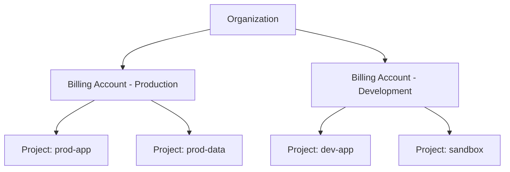

# How to Set Up a GCP Billing Account and Link It to Your Project

Author: [nawazdhandala](https://www.github.com/nawazdhandala)

Tags: GCP, Billing, Project Setup, Cloud Console, Cost Management

Description: A complete guide to setting up a Google Cloud Platform billing account, linking it to your project, configuring budgets and alerts, and managing billing permissions for your team.

---

Before you can use most GCP services, you need a billing account linked to your project. Without it, you cannot enable APIs, create VMs, or deploy anything that incurs costs. This guide walks through the entire billing setup process, from creating the account to linking it to your projects and setting up cost controls.

## Creating a Billing Account

If you do not have a billing account yet, you can create one through the Cloud Console or gcloud CLI. You will need a valid payment method (credit card, debit card, or bank account depending on your region).

### Through the Console

1. Go to [console.cloud.google.com/billing](https://console.cloud.google.com/billing)
2. Click "Create Account"
3. Enter a name for the billing account
4. Select your country and currency
5. Enter payment method details
6. Click "Submit and Enable Billing"

### Through the CLI

Creating billing accounts via the CLI is limited, but you can manage existing ones:

```bash
# List your existing billing accounts
gcloud billing accounts list

# View details of a specific billing account
gcloud billing accounts describe 0X0X0X-0X0X0X-0X0X0X
```

## Linking a Billing Account to a Project

Every GCP project needs a billing account to use paid services. Here is how to link them:

```bash
# Link a billing account to a project
gcloud billing projects link my-project \
    --billing-account=0X0X0X-0X0X0X-0X0X0X

# Verify the link was successful
gcloud billing projects describe my-project
```

The output should show:

```
billingAccountName: billingAccounts/0X0X0X-0X0X0X-0X0X0X
billingEnabled: true
name: projects/my-project/billingInfo
projectId: my-project
```

## Linking Billing When Creating a Project

You can link billing at project creation time:

```bash
# Create a project and link billing in one step
gcloud projects create my-new-project \
    --name="My New Project" \
    --organization=ORG_ID

gcloud billing projects link my-new-project \
    --billing-account=0X0X0X-0X0X0X-0X0X0X
```

With Terraform, you can do both at once:

```hcl
# Create a project with billing linked from the start
resource "google_project" "my_project" {
  name            = "My Project"
  project_id      = "my-new-project-id"
  org_id          = var.org_id
  billing_account = var.billing_account_id

  # Auto-create default service account
  auto_create_network = true
}

# Enable required APIs after project creation
resource "google_project_service" "compute" {
  project = google_project.my_project.project_id
  service = "compute.googleapis.com"

  depends_on = [google_project.my_project]
}
```

## Setting Up Budget Alerts

Budget alerts are essential. Without them, you might not realize your spending is out of control until the bill arrives.

```bash
# Create a budget with alert thresholds
gcloud billing budgets create \
    --billing-account=0X0X0X-0X0X0X-0X0X0X \
    --display-name="Monthly Budget" \
    --budget-amount=500 \
    --threshold-rules=percent=0.25 \
    --threshold-rules=percent=0.50 \
    --threshold-rules=percent=0.75 \
    --threshold-rules=percent=0.90 \
    --threshold-rules=percent=1.0 \
    --filter-projects="projects/my-project"
```

This creates alerts at 25%, 50%, 75%, 90%, and 100% of a $500 monthly budget. Notifications go to billing admins by default.

To send notifications to a Pub/Sub topic for automation:

```bash
# Create a Pub/Sub topic for budget alerts
gcloud pubsub topics create budget-alerts --project=my-project

# Create a budget with Pub/Sub notification
gcloud billing budgets create \
    --billing-account=0X0X0X-0X0X0X-0X0X0X \
    --display-name="Automated Budget Alert" \
    --budget-amount=1000 \
    --threshold-rules=percent=0.80 \
    --threshold-rules=percent=1.0 \
    --notifications-pubsub-topic=projects/my-project/topics/budget-alerts \
    --filter-projects="projects/my-project"
```

You can then create a Cloud Function that triggers on the Pub/Sub topic to take automated action (like shutting down non-essential resources).

## Managing Billing Permissions

Different team members need different levels of billing access. Here are the key roles:

| Role | What It Does |
|---|---|
| `roles/billing.admin` | Full control over the billing account |
| `roles/billing.user` | Can link projects to the billing account |
| `roles/billing.viewer` | Can view billing information and costs |
| `roles/billing.creator` | Can create new billing accounts |

Grant billing roles:

```bash
# Allow a developer to link projects to a billing account
gcloud billing accounts add-iam-policy-binding 0X0X0X-0X0X0X-0X0X0X \
    --member="user:developer@example.com" \
    --role="roles/billing.user"

# Allow a finance team member to view billing data
gcloud billing accounts add-iam-policy-binding 0X0X0X-0X0X0X-0X0X0X \
    --member="user:finance@example.com" \
    --role="roles/billing.viewer"

# Allow a manager to administer the billing account
gcloud billing accounts add-iam-policy-binding 0X0X0X-0X0X0X-0X0X0X \
    --member="user:manager@example.com" \
    --role="roles/billing.admin"
```

## Exporting Billing Data to BigQuery

For detailed cost analysis, export billing data to BigQuery:

```bash
# Enable the BigQuery Data Transfer Service API
gcloud services enable bigquerydatatransfer.googleapis.com --project=my-project

# Create a BigQuery dataset for billing data
bq mk --dataset my-project:billing_export
```

Then configure the export in the Console:
1. Go to Billing then Billing Export
2. Select "BigQuery Export"
3. Choose your project and dataset
4. Enable "Standard usage cost" and optionally "Detailed usage cost"

After data starts flowing (usually within a few hours), you can query it:

```sql
-- Query monthly costs by service
SELECT
  invoice.month AS billing_month,
  service.description AS service,
  ROUND(SUM(cost), 2) AS total_cost
FROM `my-project.billing_export.gcp_billing_export_v1_0X0X0X_0X0X0X_0X0X0X`
WHERE invoice.month = '202602'
GROUP BY billing_month, service
ORDER BY total_cost DESC
```

## Setting Up Billing for an Organization

In an organizational setting, you typically want a hierarchy of billing accounts:



Create separate billing accounts for production and development:

```bash
# Link production projects to the production billing account
gcloud billing projects link prod-app --billing-account=PROD_BILLING_ID
gcloud billing projects link prod-data --billing-account=PROD_BILLING_ID

# Link development projects to the development billing account
gcloud billing projects link dev-app --billing-account=DEV_BILLING_ID
gcloud billing projects link sandbox --billing-account=DEV_BILLING_ID
```

## Using Committed Use Discounts

Once your billing is set up and you understand your usage patterns, consider committed use discounts (CUDs) to reduce costs:

```bash
# View available commitment types
gcloud compute commitments list --region=us-central1

# Create a 1-year commitment for compute resources
gcloud compute commitments create my-commitment \
    --region=us-central1 \
    --resources=vcpu=32,memory=128GB \
    --plan=twelve-month
```

CUDs provide 37% discount for 1-year commitments and 55% for 3-year commitments on compute resources.

## Free Tier and Trial

If you are just getting started:

- **Free Trial**: GCP offers $300 in credits for 90 days for new accounts
- **Always Free Tier**: Certain resources are always free within limits (1 f1-micro VM, 5GB Cloud Storage, 1TB BigQuery queries per month)

```bash
# Check your remaining free trial credits
gcloud billing accounts describe 0X0X0X-0X0X0X-0X0X0X \
    --format="value(open)"
```

## Unlink Billing to Stop All Charges

If you need to stop all charges immediately (emergency cost control):

```bash
# Unlink billing from a project
# This immediately stops all paid resources in the project
gcloud billing projects unlink my-project

# WARNING: This will disable paid APIs and may delete resources
# Only use this for emergency cost control
```

## Troubleshooting Common Billing Issues

```bash
# Check if billing is active
gcloud billing projects describe my-project --format="value(billingEnabled)"

# List all projects linked to a billing account
gcloud billing projects list --billing-account=0X0X0X-0X0X0X-0X0X0X

# Check for any billing-related org policies
gcloud resource-manager org-policies describe \
    constraints/billing.restrictBillingAccountUsage \
    --project=my-project 2>/dev/null
```

Getting billing right from the start saves you from errors down the road. Every "billing must be enabled" error, every "access not configured" message - they all trace back to billing setup. Link your billing account, set up budget alerts, and export to BigQuery so you always know what you are spending. It is one of those boring-but-essential tasks that pays off every day.
