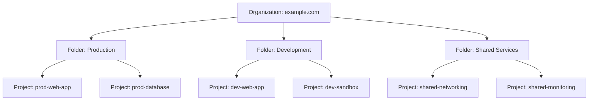

# How to Set Up a Google Cloud Organization Resource from Scratch

Author: [nawazdhandala](https://www.github.com/nawazdhandala)

Tags: GCP, Organization, Cloud Identity, Resource Hierarchy, Google Cloud

Description: A complete guide to creating a Google Cloud Organization resource from scratch, including setting up Cloud Identity, verifying your domain, and configuring the resource hierarchy.

---

Every serious Google Cloud deployment starts with an Organization resource. Without one, your projects float around independently with no central governance, no organization-wide policies, and no way to manage access at scale. If you are still running projects under personal Gmail accounts, you are accumulating technical debt that gets harder to fix the longer you wait.

This guide walks through setting up a Google Cloud Organization from the very beginning, including the prerequisites that most tutorials skip over.

## What Is a Google Cloud Organization?

The Organization is the root node of your GCP resource hierarchy. It looks like this:



The Organization gives you:

- **Centralized IAM**: Grant permissions at the organization level that cascade to all projects
- **Organization policies**: Enforce constraints across all resources (e.g., restrict regions, disable external IP addresses)
- **Centralized billing**: View and manage billing across all projects
- **Audit logging**: Organization-wide audit logs for compliance
- **Resource hierarchy**: Organize projects into folders by team, environment, or business unit

## Prerequisites

To create an Organization, you need one of:

1. **Google Workspace** (formerly G Suite) - If your company already uses Google Workspace for email and productivity apps, you already have what you need.
2. **Cloud Identity Free** - If you do not use Google Workspace, Cloud Identity Free gives you the organizational structure without the Workspace apps.

You also need a domain name that you own and can verify.

## Step 1: Set Up Cloud Identity (If You Do Not Have Google Workspace)

If your company does not use Google Workspace, sign up for Cloud Identity Free:

1. Go to [cloud.google.com/identity](https://cloud.google.com/identity)
2. Click "Start free trial" or "Sign up"
3. Enter your business information
4. Enter your domain name (e.g., example.com)
5. Create the first admin account (e.g., admin@example.com)

This first admin account becomes your Super Admin, which is the most privileged account in the organization.

## Step 2: Verify Your Domain

Google needs to verify that you own the domain. The process depends on your domain registrar, but typically involves adding a DNS TXT record.

1. Log into the Google Admin console at admin.google.com
2. Navigate to Account then Domains
3. Follow the verification wizard
4. Add the TXT record provided by Google to your domain's DNS

```
# Example TXT record to add to your DNS
# Record type: TXT
# Host: @
# Value: google-site-verification=XXXXXXXXXXXXXXXXXX
# TTL: 3600
```

Verification usually completes within a few minutes to a few hours, depending on DNS propagation.

## Step 3: Access the Organization in GCP

Once your domain is verified, GCP automatically creates an Organization resource. To see it:

1. Log into the Cloud Console at console.cloud.google.com with your new admin account
2. Click the project selector at the top of the page
3. You should see your organization name at the top of the hierarchy

From the gcloud CLI:

```bash
# List organizations you have access to
gcloud organizations list

# Get details about your organization
gcloud organizations describe ORGANIZATION_ID
```

## Step 4: Set Up the Super Admin Account Properly

The Super Admin account is extremely powerful. Treat it with care:

```bash
# The super admin can grant Organization Administrator role to other users
gcloud organizations add-iam-policy-binding ORGANIZATION_ID \
  --member="user:cloud-admin@example.com" \
  --role="roles/resourcemanager.organizationAdmin"
```

Best practices for the Super Admin:

- **Enable 2-factor authentication** immediately
- **Do not use the Super Admin for daily work** - Create separate admin accounts
- **Store the Super Admin credentials securely** - This is your break-glass account
- **Create at least two Super Admin accounts** - In case one gets locked out

## Step 5: Create Initial Folders

Organize your projects with a folder structure. Here is a common pattern:

```bash
# Create top-level folders
gcloud resource-manager folders create \
  --display-name="Production" \
  --organization=ORGANIZATION_ID

gcloud resource-manager folders create \
  --display-name="Non-Production" \
  --organization=ORGANIZATION_ID

gcloud resource-manager folders create \
  --display-name="Shared Services" \
  --organization=ORGANIZATION_ID

gcloud resource-manager folders create \
  --display-name="Sandbox" \
  --organization=ORGANIZATION_ID
```

Then create sub-folders:

```bash
# Get the folder ID for Non-Production
NON_PROD_FOLDER=$(gcloud resource-manager folders list \
  --organization=ORGANIZATION_ID \
  --filter="displayName:Non-Production" \
  --format="value(name)")

# Create sub-folders
gcloud resource-manager folders create \
  --display-name="Development" \
  --folder=$NON_PROD_FOLDER

gcloud resource-manager folders create \
  --display-name="Staging" \
  --folder=$NON_PROD_FOLDER

gcloud resource-manager folders create \
  --display-name="QA" \
  --folder=$NON_PROD_FOLDER
```

## Step 6: Create Projects Under the Organization

New projects should be created under the appropriate folder:

```bash
# Create a project under a specific folder
gcloud projects create prod-web-app \
  --folder=FOLDER_ID \
  --name="Production Web Application"

# Verify the project is in the right place
gcloud projects describe prod-web-app \
  --format="table(projectId, name, parent)"
```

## Step 7: Link a Billing Account

Projects need a billing account to use paid services:

```bash
# List available billing accounts
gcloud billing accounts list

# Link a project to a billing account
gcloud billing projects link prod-web-app \
  --billing-account=BILLING_ACCOUNT_ID
```

## Step 8: Set Organization-Level IAM

Grant roles at the organization level for users who need access across all projects:

```bash
# Grant Organization Viewer to the security team
gcloud organizations add-iam-policy-binding ORGANIZATION_ID \
  --member="group:security-team@example.com" \
  --role="roles/resourcemanager.organizationViewer"

# Grant Folder Admin to team leads for their specific folders
gcloud resource-manager folders add-iam-policy-binding FOLDER_ID \
  --member="group:backend-team@example.com" \
  --role="roles/resourcemanager.folderAdmin"

# Grant Billing Viewer to finance
gcloud organizations add-iam-policy-binding ORGANIZATION_ID \
  --member="group:finance@example.com" \
  --role="roles/billing.viewer"
```

## Step 9: Enable Organization-Wide Audit Logging

Set up audit logging at the organization level so all projects inherit the configuration:

```bash
# Enable data access audit logs for all services at the org level
# This is done through the IAM policy with audit configs

# First, get the current policy
gcloud organizations get-iam-policy ORGANIZATION_ID \
  --format=json > org-policy.json
```

Edit the policy file to add audit configs, then apply it:

```bash
# Apply the updated policy
gcloud organizations set-iam-policy ORGANIZATION_ID org-policy.json
```

## Step 10: Migrate Existing Projects

If you have existing projects that were created without an organization, migrate them:

```bash
# Move a project into the organization
gcloud projects move PROJECT_ID \
  --folder=FOLDER_ID

# Verify the move
gcloud projects describe PROJECT_ID \
  --format="table(projectId, parent)"
```

Before migrating, be aware that:
- Organization policies will apply to the migrated project
- IAM inheritance will change
- Some users may lose access if they are not part of the organization

## Common Mistakes to Avoid

1. **Using a personal Gmail for the organization** - Always use a domain you own. Gmail-based accounts cannot create organizations.

2. **Making everyone a Super Admin** - Use the principle of least privilege. Most people need Project Editor or Viewer, not organization-level admin.

3. **Skipping the folder structure** - Start with folders from day one. Restructuring later is painful because you need to update IAM policies, billing, and resource references.

4. **Not setting up groups** - Use Google Groups for IAM instead of individual user accounts. Groups make it easy to add and remove team members without changing IAM policies.

5. **Forgetting to restrict project creation** - By default, anyone in the organization can create projects. Use organization policies to restrict this.

```bash
# Restrict project creation to specific groups
gcloud resource-manager org-policies set-policy \
  --organization=ORGANIZATION_ID \
  policy-restrict-project-creation.yaml
```

## Wrapping Up

Setting up a Google Cloud Organization is a one-time investment that pays dividends for the life of your cloud infrastructure. It gives you centralized governance, consistent policies, and a clean resource hierarchy that scales with your team. The process takes about an hour from start to finish, and the hardest part is usually waiting for DNS verification. Do it early, do it right, and save yourself from the pain of retroactively reorganizing a sprawling set of unmanaged projects.
