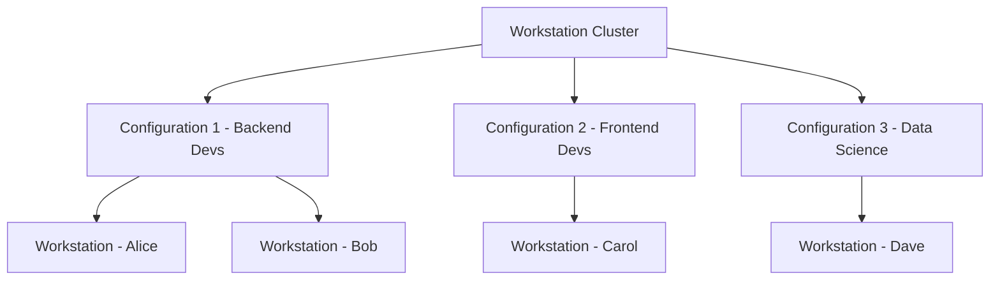

# How to Set Up a Google Cloud Workstation Cluster and Configuration for Your Development Team

Author: [nawazdhandala](https://www.github.com/nawazdhandala)

Tags: GCP, Google Cloud, Cloud Workstations, Development, Remote Development, IDE

Description: A step-by-step guide to setting up Google Cloud Workstation clusters and configurations for your development team with secure remote development environments.

---

Setting up development environments for a team is one of those things that sounds easy until you actually try to do it at scale. Every developer has slightly different tool versions, different OS preferences, and inevitably someone's local setup breaks in a way that costs half a day to debug. Google Cloud Workstations solves this by giving each developer a consistent, cloud-based development environment that is managed centrally but feels like a local machine.

Cloud Workstations runs on GKE under the hood, but you do not need to think about Kubernetes at all. You set up a cluster (the infrastructure layer), create a configuration (the environment template), and then developers launch individual workstations from that configuration. Let me walk through each step.

## Understanding the Architecture

The hierarchy in Cloud Workstations is straightforward:



A cluster is a regional resource that provides the underlying compute infrastructure. Configurations define what each workstation looks like - the machine type, disk size, container image, IDE, and idle timeout. Workstations are the individual instances that developers actually use.

## Step 1: Create a Workstation Cluster

The cluster is the foundation. It defines the network, region, and some security settings that apply to all workstations running on it.

```bash
# Create a workstation cluster in your preferred region
# The cluster needs to be in the same VPC as your other resources
gcloud workstations clusters create dev-cluster \
    --project=my-project \
    --region=us-central1 \
    --network=projects/my-project/global/networks/default \
    --subnetwork=projects/my-project/regions/us-central1/subnetworks/default \
    --domain=workstations.example.com
```

A few notes on this command. The network and subnetwork determine what your developers can access from their workstations. If your databases, APIs, and other services are on a specific VPC, point the cluster there. The domain is optional but useful if you want custom DNS for the workstation URLs.

Cluster creation takes 10-15 minutes because it is provisioning GKE infrastructure behind the scenes.

```bash
# Check cluster creation status
gcloud workstations clusters describe dev-cluster \
    --project=my-project \
    --region=us-central1
```

Wait until the state shows RUNNING before proceeding.

## Step 2: Create a Workstation Configuration

Configurations are where you define what the development environment actually looks like. You can create multiple configurations for different team roles.

```bash
# Create a configuration for backend developers
# Using an e2-standard-8 machine with 200GB persistent disk
gcloud workstations configs create backend-config \
    --project=my-project \
    --region=us-central1 \
    --cluster=dev-cluster \
    --machine-type=e2-standard-8 \
    --boot-disk-size=200 \
    --pd-disk-type=pd-ssd \
    --pd-disk-size=200 \
    --idle-timeout=7200s \
    --running-timeout=43200s \
    --container-predefined-image=codeoss
```

Let me break down the important settings:

**Machine type**: e2-standard-8 gives each developer 8 vCPUs and 32 GB of RAM, which is comfortable for most backend work. For heavier workloads like compiling large projects, consider n2-standard-16.

**Disk settings**: The persistent disk survives workstation restarts, so your code, dependencies, and configuration persist. 200 GB on SSD is a good starting point.

**Idle timeout**: Set to 2 hours (7200 seconds) here. After this period of inactivity, the workstation stops automatically to save costs. The persistent disk remains, so starting it back up is fast.

**Running timeout**: The maximum time a workstation can run continuously. 12 hours is reasonable for a workday.

**Container image**: `codeoss` gives you VS Code (Code OSS) as the default IDE.

## Step 3: Create a Configuration for Frontend Developers

Different teams often need different tools and resources. Here is a lighter configuration for frontend work:

```bash
# Create a configuration for frontend developers
# Lighter machine since frontend work is less compute-intensive
gcloud workstations configs create frontend-config \
    --project=my-project \
    --region=us-central1 \
    --cluster=dev-cluster \
    --machine-type=e2-standard-4 \
    --boot-disk-size=100 \
    --pd-disk-type=pd-balanced \
    --pd-disk-size=100 \
    --idle-timeout=3600s \
    --running-timeout=36000s \
    --container-predefined-image=codeoss \
    --container-env=NODE_OPTIONS="--max-old-space-size=4096"
```

Notice the `--container-env` flag. You can set environment variables that will be available in every workstation launched from this configuration. Setting Node.js memory limits is a common one for frontend developers.

## Step 4: Create Individual Workstations

Now developers can create their own workstations from the configurations you set up. You can do this through the console or CLI.

```bash
# Create a workstation for a specific developer
gcloud workstations create alice-ws \
    --project=my-project \
    --region=us-central1 \
    --cluster=dev-cluster \
    --config=backend-config

# Create another workstation for a different developer
gcloud workstations create bob-ws \
    --project=my-project \
    --region=us-central1 \
    --cluster=dev-cluster \
    --config=backend-config
```

Each developer gets their own isolated workstation with their own persistent disk. They do not share compute or storage.

## Step 5: Start and Access a Workstation

Workstations start in a stopped state to avoid unnecessary costs. Developers start them when they need to work:

```bash
# Start a workstation
gcloud workstations start alice-ws \
    --project=my-project \
    --region=us-central1 \
    --cluster=dev-cluster \
    --config=backend-config

# Get the URL to access the workstation's IDE
gcloud workstations describe alice-ws \
    --project=my-project \
    --region=us-central1 \
    --cluster=dev-cluster \
    --config=backend-config \
    --format="value(host)"
```

Developers access their workstation through a browser at the provided URL. They authenticate with their Google Cloud identity, so there are no extra credentials to manage.

## Step 6: Set Up IAM for Your Team

Control who can access what with IAM roles:

```bash
# Grant a developer the ability to use workstations (but not create configs)
gcloud projects add-iam-policy-binding my-project \
    --member="user:alice@example.com" \
    --role="roles/workstations.user"

# Grant a team lead the ability to manage configurations
gcloud projects add-iam-policy-binding my-project \
    --member="user:lead@example.com" \
    --role="roles/workstations.admin"

# Grant a developer access to a specific workstation
gcloud workstations add-iam-policy-binding alice-ws \
    --project=my-project \
    --region=us-central1 \
    --cluster=dev-cluster \
    --config=backend-config \
    --member="user:alice@example.com" \
    --role="roles/workstations.user"
```

The `workstations.user` role lets someone start, stop, and use workstations. The `workstations.admin` role adds the ability to create and modify clusters, configurations, and workstations.

## Managing Costs

Cloud Workstations can get expensive if not managed carefully. Here are the key cost controls:

- **Idle timeout**: Automatically stops workstations after a period of inactivity. This is the single most important cost control.
- **Running timeout**: Prevents workstations from running indefinitely if someone forgets to stop them.
- **Machine type selection**: Not every developer needs a 32-core machine. Size configurations according to actual workload needs.
- **Disk types**: Use pd-balanced instead of pd-ssd for roles that do not need maximum disk I/O.

```bash
# List all running workstations to audit costs
gcloud workstations list \
    --project=my-project \
    --region=us-central1 \
    --cluster=dev-cluster \
    --config=backend-config \
    --filter="state=STATE_RUNNING"
```

## Summary

Setting up Cloud Workstations for your team involves three layers: a cluster for infrastructure, configurations for environment templates, and individual workstations for each developer. The configuration is where most of the decisions happen - machine types, disk sizes, IDE choices, and timeout policies. Once everything is in place, developers get consistent, reproducible environments that start in seconds and stay in sync with your team's toolchain. No more "it works on my machine" debugging sessions.
