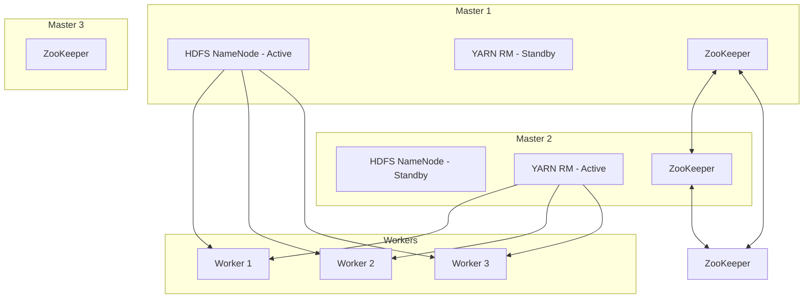

# How to Set Up a High-Availability Dataproc Cluster with Multiple Masters

Author: [nawazdhandala](https://www.github.com/nawazdhandala)

Tags: GCP, Google Cloud Dataproc, High Availability, Hadoop, Cluster Management

Description: Configure a high-availability Google Cloud Dataproc cluster with three master nodes to ensure continuous operation even when a master node fails.

---

A standard Dataproc cluster has a single master node. If that master goes down - hardware failure, kernel panic, network partition - your entire cluster is unavailable. Running jobs fail, new jobs cannot be submitted, and you are stuck waiting for the node to recover or creating a new cluster.

For production workloads that need continuous availability, Dataproc supports high-availability (HA) mode with three master nodes. When one master fails, the remaining two continue operating. YARN, HDFS, and Hive Metastore all have built-in mechanisms for master failover, and Dataproc's HA mode activates them.

## How HA Mode Works

In a Dataproc HA cluster, three master nodes run simultaneously. Each Hadoop service uses its own leader election or quorum mechanism.

**HDFS NameNode** runs in an active-standby configuration. One master is the active NameNode, another is the standby. ZooKeeper coordinates failover. If the active NameNode fails, the standby automatically takes over.

**YARN ResourceManager** also runs active-standby with ZooKeeper-based failover. Job submissions and resource allocation continue seamlessly when the active RM fails.

**ZooKeeper** runs on all three masters, forming a quorum. As long as 2 out of 3 ZooKeeper instances are running, the quorum holds. This is why you need an odd number (3) of masters.



## Creating an HA Cluster

Enabling HA mode is a single flag during cluster creation.

```bash
# Create a high-availability Dataproc cluster
gcloud dataproc clusters create ha-cluster \
  --region=us-central1 \
  --zone=us-central1-a \
  --num-masters=3 \
  --num-workers=6 \
  --master-machine-type=n1-standard-4 \
  --worker-machine-type=n1-standard-8 \
  --master-boot-disk-size=200GB \
  --worker-boot-disk-size=500GB \
  --image-version=2.1-debian11 \
  --properties="hdfs:dfs.replication=3"
```

The `--num-masters=3` flag is what activates HA mode. You must specify exactly 3 - no other number is supported.

## Master Node Sizing

HA master nodes need adequate resources because they run more services than standard masters. Each master runs ZooKeeper, and two of them run NameNode and ResourceManager processes.

For small to medium clusters (up to 20 workers), `n1-standard-4` works well. For larger clusters (20-100 workers), use `n1-standard-8` or `n1-highmem-4`. The master needs enough memory for the NameNode metadata, which grows with the number of HDFS files and blocks.

```bash
# HA cluster sized for larger workloads
gcloud dataproc clusters create large-ha-cluster \
  --region=us-central1 \
  --num-masters=3 \
  --num-workers=20 \
  --master-machine-type=n1-highmem-8 \
  --worker-machine-type=n1-standard-16 \
  --master-boot-disk-size=500GB \
  --worker-boot-disk-size=1000GB \
  --image-version=2.1-debian11
```

## Verifying HA Configuration

After the cluster is created, verify that HA services are running correctly.

```bash
# SSH into the master and check HDFS NameNode status
gcloud compute ssh ha-cluster-m-0 --zone=us-central1-a -- \
  "hdfs haadmin -getServiceState nn0"
# Expected output: active

gcloud compute ssh ha-cluster-m-0 --zone=us-central1-a -- \
  "hdfs haadmin -getServiceState nn1"
# Expected output: standby

# Check YARN ResourceManager status
gcloud compute ssh ha-cluster-m-0 --zone=us-central1-a -- \
  "yarn rmadmin -getServiceState rm0"
# Expected output: active

gcloud compute ssh ha-cluster-m-0 --zone=us-central1-a -- \
  "yarn rmadmin -getServiceState rm1"
# Expected output: standby
```

## HDFS Replication Settings

In an HA cluster, HDFS replication becomes more important. The default replication factor is 2 for Dataproc, but for HA clusters you should increase it to 3 to survive both a master and a worker failure simultaneously.

```bash
# Set HDFS replication to 3 at cluster creation
gcloud dataproc clusters create ha-cluster \
  --region=us-central1 \
  --num-masters=3 \
  --num-workers=6 \
  --properties="hdfs:dfs.replication=3"
```

With a replication factor of 3, HDFS can tolerate the loss of any 2 data nodes without losing data.

## Configuring Spark for HA

Spark jobs need to know about the HA configuration to connect to the right master nodes. Dataproc configures this automatically, but if you are connecting external applications to the cluster, you need the correct settings.

```bash
# Spark properties for connecting to an HA cluster
--properties="\
spark.hadoop.fs.defaultFS=hdfs://ha-cluster,\
spark.yarn.resourcemanager.ha.enabled=true,\
spark.yarn.resourcemanager.ha.rm-ids=rm0,rm1"
```

For submitting jobs through the Dataproc API, HA is transparent. The API routes your job submission to the active master.

```bash
# Submit a job to an HA cluster - works the same as a standard cluster
gcloud dataproc jobs submit spark \
  --cluster=ha-cluster \
  --region=us-central1 \
  --class=com.example.MySparkJob \
  --jars=gs://my-bucket/jars/my-job.jar
```

## Testing Failover

You should test failover before relying on it in production. Simulate a master failure and verify that the cluster continues operating.

```bash
# Start a long-running job for testing
gcloud dataproc jobs submit pyspark \
  --cluster=ha-cluster \
  --region=us-central1 \
  --async \
  failover-test.py

# While the job is running, stop the active master
gcloud compute instances stop ha-cluster-m-0 \
  --zone=us-central1-a

# Check that YARN is still accepting jobs
gcloud compute ssh ha-cluster-m-1 --zone=us-central1-a -- \
  "yarn application -list"

# Check that the standby NameNode became active
gcloud compute ssh ha-cluster-m-1 --zone=us-central1-a -- \
  "hdfs haadmin -getServiceState nn1"
# Should now show: active

# Restart the failed master
gcloud compute instances start ha-cluster-m-0 \
  --zone=us-central1-a
```

The long-running job should continue executing even after the master is stopped. Some in-flight tasks on the failed master might need to be retried, but the overall job should complete successfully.

## Hive Metastore HA

If you use Hive or Spark SQL with Hive tables, the Hive Metastore also benefits from HA. In a Dataproc HA cluster, the Hive Metastore typically runs on the master nodes with a shared database backend.

For robust Hive Metastore HA, consider using Cloud SQL as the Metastore database instead of a local database.

```bash
# HA cluster with Cloud SQL-backed Hive Metastore
gcloud dataproc clusters create ha-with-cloudsql \
  --region=us-central1 \
  --num-masters=3 \
  --num-workers=6 \
  --properties="\
hive:javax.jdo.option.ConnectionURL=jdbc:mysql://10.0.1.5/metastore,\
hive:javax.jdo.option.ConnectionDriverName=com.mysql.cj.jdbc.Driver,\
hive:javax.jdo.option.ConnectionUserName=hive,\
hive:javax.jdo.option.ConnectionPassword=HIVE_PASSWORD" \
  --scopes=sql-admin
```

## Cost Considerations

An HA cluster costs roughly 1.5 times more than a standard cluster for master nodes (3 masters instead of 1). Worker costs are the same. For clusters where workers dominate the cost (which is most clusters), the overhead is modest.

```
Standard cluster:  1 master + 10 workers = 11 nodes
HA cluster:        3 masters + 10 workers = 13 nodes
Additional cost:   ~18% more (2 extra master nodes)
```

For long-running production clusters, this additional cost is well justified by the reliability improvement. For short-lived clusters that are recreated frequently, HA may not be necessary since you can just create a new cluster if the master fails.

## When to Use HA Mode

Use HA mode when:
- The cluster runs continuously for days or weeks
- Job failures due to master node issues would cause significant business impact
- You cannot afford to wait for manual intervention to recover from master failure
- Multiple teams depend on the cluster for their workloads

You probably do not need HA when:
- The cluster is ephemeral (created per job or per batch)
- You can tolerate brief downtime and manual recovery
- The cluster runs only a single short-lived job

## Monitoring HA Clusters

Set up monitoring for the health of all three master nodes.

```bash
# Check master node health
for i in 0 1 2; do
  echo "Master $i status:"
  gcloud compute instances describe ha-cluster-m-$i \
    --zone=us-central1-a \
    --format="value(status)"
done
```

Alert on master node failures so you can investigate even though the cluster continues operating. An HA cluster can survive one master failure, but if a second master fails before the first is restored, the cluster goes down.

High-availability Dataproc clusters provide production-grade reliability for your Hadoop and Spark workloads. The setup is straightforward - just add `--num-masters=3` - but make sure you test failover, size your masters appropriately, and monitor all three nodes in production.
